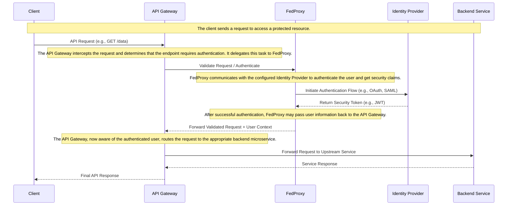
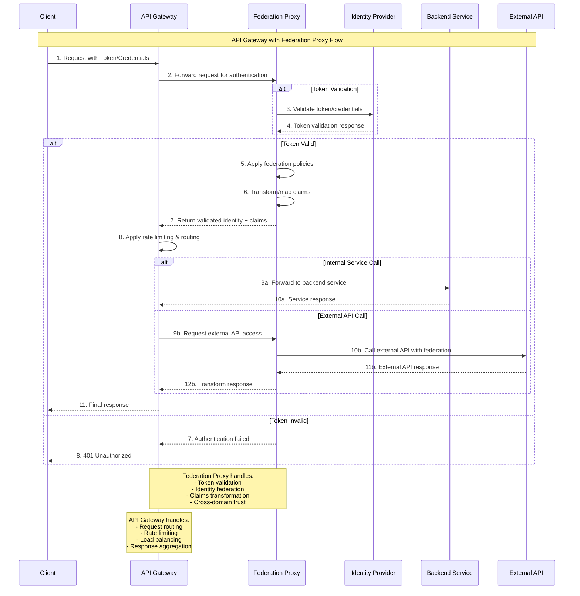

```mermaid
sequenceDiagram
    participant Client
    participant API Gateway
    participant FedProxy
    participant IdentityProvider as Identity Provider
    participant BackendService as Backend Service

    Note over Client, BackendService: The client sends a request to access a protected resource.

    Client->>API Gateway: API Request (e.g., GET /data)

    Note over API Gateway: The API Gateway intercepts the request and determines that the endpoint requires authentication. It delegates this task to FedProxy.

    API Gateway->>FedProxy: Validate Request / Authenticate

    Note over FedProxy: FedProxy communicates with the configured Identity Provider to authenticate the user and get security claims.

    FedProxy->>IdentityProvider: Initiate Authentication Flow (e.g., OAuth, SAML)
    IdentityProvider-->>FedProxy: Return Security Token (e.g., JWT)

    Note over FedProxy: After successful authentication, FedProxy may pass user information back to the API Gateway.

    FedProxy-->>API Gateway: Forward Validated Request + User Context

    Note over API Gateway: The API Gateway, now aware of the authenticated user, routes the request to the appropriate backend microservice.

    API Gateway->>BackendService: Forward Request to Upstream Service
    BackendService-->>API Gateway: Service Response
    API Gateway-->>Client: Final API Response
```
---

```mermaid
sequenceDiagram
    participant Client
    participant APIGateway as API Gateway
    participant FedProxy as Federation Proxy
    participant IDP as Identity Provider
    participant Backend as Backend Service
    participant ExternalAPI as External API

    Note over Client, ExternalAPI: API Gateway with Federation Proxy Flow

    Client->>APIGateway: 1. Request with Token/Credentials
    
    APIGateway->>FedProxy: 2. Forward request for authentication
    
    alt Token Validation
        FedProxy->>IDP: 3. Validate token/credentials
        IDP-->>FedProxy: 4. Token validation response
    end
    
    alt Token Valid
        FedProxy->>FedProxy: 5. Apply federation policies
        FedProxy->>FedProxy: 6. Transform/map claims
        FedProxy-->>APIGateway: 7. Return validated identity + claims
        
        APIGateway->>APIGateway: 8. Apply rate limiting & routing
        
        alt Internal Service Call
            APIGateway->>Backend: 9a. Forward to backend service
            Backend-->>APIGateway: 10a. Service response
        else External API Call
            APIGateway->>FedProxy: 9b. Request external API access
            FedProxy->>ExternalAPI: 10b. Call external API with federation
            ExternalAPI-->>FedProxy: 11b. External API response
            FedProxy-->>APIGateway: 12b. Transform response
        end
        
        APIGateway-->>Client: 11. Final response
        
    else Token Invalid
        FedProxy-->>APIGateway: 7. Authentication failed
        APIGateway-->>Client: 8. 401 Unauthorized
    end

    Note over APIGateway, FedProxy: Federation Proxy handles:<br/>- Token validation<br/>- Identity federation<br/>- Claims transformation<br/>- Cross-domain trust

    Note over APIGateway: API Gateway handles:<br/>- Request routing<br/>- Rate limiting<br/>- Load balancing<br/>- Response aggregation
```