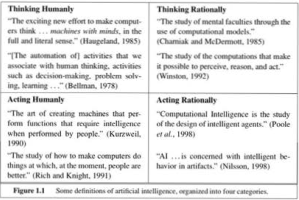
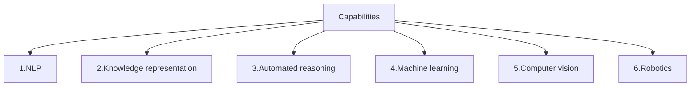
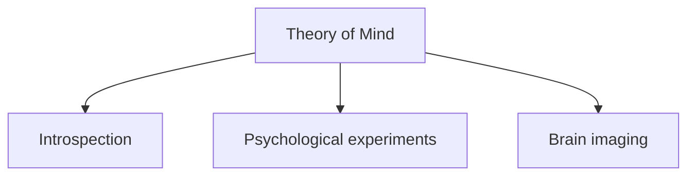
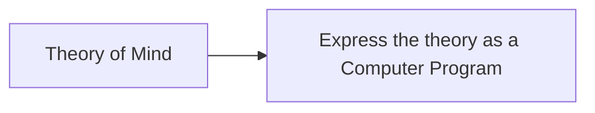

# 1. Introduction

## 1.1 What is Artificial intelligence?

[#AI](Artifical-Intelligence) - The concept of programming a computer to react to data in a similar way to a thinking being. AI currently encompasses a huge variety of subfields, ranging from - 

   1. general - learning and perception - strong AI
   2. specific - playing chess, proving mathematical theroems, writing poetry, driving a car on a crowded street, and diagnosing diseases.

    1. left - fidelity to human thinking.
    2. right - measure against ideal performance measures.
    3. top - the discipline of thought and mental faculties
    4. bottom - behavior and performance.

### 1.1.1 Acting humanely : The Turing test approach

This was more focussed on the empirical approach to define AI, proposed in 1950. A computer passes the [#Turing-Test]() when a human interrogator, after posing some written questions, cannot tell whether the written responses come from a person or a computer. This is more of a behavioral approach to AI. To pass the Turing test following capabilities are required in the computer -

    1. Natural language processing - to be able to communicate successfully in a human language.
    2. Knowledge representation - to store what it knows or hears
    3. Automated reasoning - to use the stored information to answer questions and to draw new conclusions.
    4. Machine learning - adapt to new circumstances and to detect and extrapolate patterns.
    5. Computer vision - to perceive objects.
    6. robotics - to manipulate objects and move around.

AI researches as spent little efforts in passing the Turing test. Rather the approach had been to **understand the underlying principles** of intelligence than to **duplicate an exemplar**.

### 1.1.2 Thinking rationally : The cognitive modelling approach

There are three ways to understand how humans think  [#Theory-of-Mind](Theoryofmind) -

    1. Through introspection - catch our own thoughts as they go by.
    2. Through psychological experiments - observing a person in action.
    3. Through brain imaging - observing the brain in action.

As per the thinking approach, it is not merely about the actions (input-output) of the program and human behavior are identical or comparable. Rather it is more about tracing the steps of human thought and comparing the same of the computer program. This field is an interdisciplinary field of [#cognitive-science](cognitive-science) brings together computer models from AI and experimental techniques from psychology to construct precise and testable theories of the human mind.

