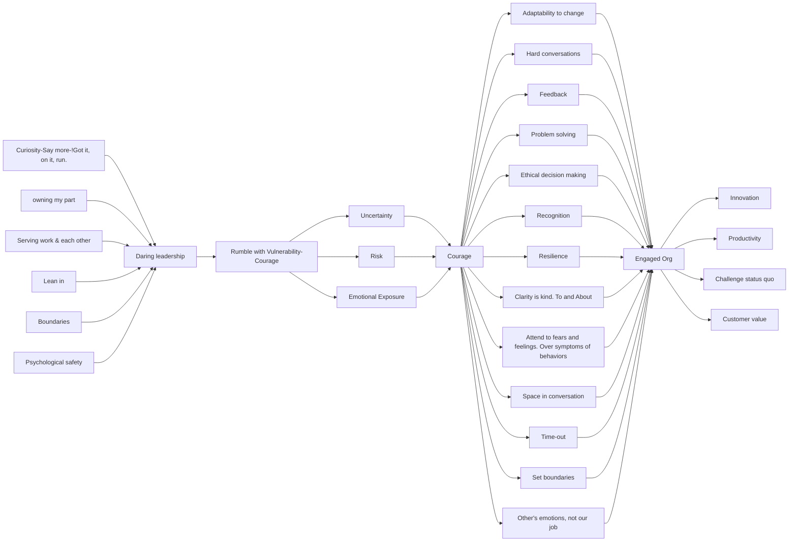

## Introduction - heart of daring leadership

### Mind-map

1. **Courage** : Embrace the suck - you cannot get courage without rumbling with vulnerability.
   1. Rumbling - A rumble is a discussion, conversation, or meeting defined by 
      1. a commitment to lean into vulnerability.
      2. stay curious and generous, to stay with the messy middle of problem identification and sloving.
      3. take a break and circle back when necessary.
      4. to be fearless in owning our parts
      5. listen with the same passion with which we want to be heard.
      6. serve the work, each other, not our egos.
   2. Courage is a collection of 4 skill sets that can be taught, observed and measured. in sequence
      1. rumbling with vulnerability
         1. foundational
      2. living into our values
      3. braving trust
      4. learning to rise
2. **Self awareness** : Who we are is how we lead. **Self love** and **self awareness** matters.
   1. Fear always exists. it is all about how we respond to fear.
   2. **Barriers** to courage : **Armour**  - The thoughts, emotions and behaviors we use to protect ourselves when we aren't *willing* and able to *rumble* with vulnerability.
3. **Culture of Courage** : Courage is contagious.
   1. We need people to fully show up, to bring their whole selves, including their unarmored whole hearts so that they can innovate, solve problems and serve people. This can happen when we create a culture in which people feel **safe, seen, heard and respected.**
      1. people should be able to walk in and take off the **crushing weight of their armour**, hang it on the rack, and open their heart to truly being seen.
   2. Daring leaders needs to be **connected** with and **care** for the people they lead. These are **irreducible requirements** for wholehearted and productive relationships between leader and team members. Fire the leader who cannot connect!
   3. as leaders we must create and hold spaces that rise to a **higher standard** than what we see around.
   4. **Armoring behaviors** that makes innovating work an impossibility. It is a very heavy to carry our armour and is a very big energy and time leak.
      1. blaming
      2. shaming
      3. emotional stoicism
      4. cynicism
      5. perfectionism

## 1. Rumbling with vulnerability - Courage is contagious

Rumbling with vulnerability is about leaning into rather than walking away from the situations that make us feel uncertain, at risk, or emotionally exposed.

### 1.1. The moment and the myths

#### Key lessons

   1. Physics of vulnerability - if we brave enough, **often enough**, we will fall. Daring is not saying - "i'm willing to risk failure". But it is about saying, "i know i will eventually fail and **i'm still all in**." It is an awareness that disappointment, failure and heartbreaks are inevitable.

   2. Vulnerability is not winning or losing. It is having the courage to show up when you can't control the outcome. The definition of vulnerability as the emotion that we experience during times of **uncertainty, risk, and emotional exposure**.
   3. **cheap-seat feedback** - If you are not in the arena getting your ass kicked on occasion, I’m not interested in or open to your feedback. Avoid cheap feedbacks and remain armor free.
      1. what is unproductive, hurtful, drop at the feet of your unarmored self.
      2. No matter how much your self doubt wants to scoop up the criticism and snuggle with the negativity so it can confirm its worst fears, or
      3. how eager your shame gremlins are to use the hurt to fortify your armor,
      4. Take a deep breath and find the strength to leave what is mean spirited on the ground. you don't even need to stomp it and kick it away.
      5. Cruelty is cheap, easy, and chickenshit. It does not deserve your energy or engagement. Just step over the comments and keep daring, always remembering that armor is too heavy a price to pay to engage with cheap-seat feedback.
   4. **the balancing act** - Sealing heart not just from hurt, **but from love** - if we engage with all feedbacks including the ill spirited ones, it would hurt us more. if we armor ourselves pretending it does not hurt, we disconnect from vulnerability and emotion so fully that we stop feeling hurt. That is the place where the armor is so thick that we don't feel anything. there was experience death. **Cowards die many times before death!** so spake Shakespeare. We have paid for self protection by sealing off our heart from everyone and from everything - not just hurt, but love.
   5. **certainty of heart wringing** - *by CS Lewis* - To love at all is to be vulnerable. Love anything and your heart will **certainly** be **wrung** and possibly be **broken**. If you want to make sure of keeping it intact, you must give your heart to no one, not even to an animal. Wrap it carefully round with hobbies and little luxuries; avoid all entanglements; Lock it up safe in the casket or coffin of your selfishness. But in that casket - safe, dark, motionless, airless - it will change. It will not be broken; it will become ubreakable, impenetrable, irredeemable. **To love is to be vulnerable.**
   6. **Square quad** : Choose people who love you not **despite** your imperfections and vulnerabilities. But **because** of them.

#### 6 myths of vulnerability

1. *Vulnerability is weakness* : It is rather that vulnerability triggers courage.
2. *I don't do vulnerability* : Pretending that we don't do vulnerability means letting fear drive our thinking and behavior.
3. *I can go it alone* :

> we don’t derive strength from our rugged individualism, but rather from our collective ability to plan, communicate, and work together. Our neural, hormonal, and genetic makeup support interdependence over independence. He explained, “To grow to adulthood as a social species, including humans, is not to become autonomous and solitary, it’s to become the one on whom others can depend.3 Whether we know it or not, our brain and biology have been shaped to favor this outcome.” - *John Cacioppo*

4. *You can engineer the uncertainty and discomfort out of vulnerability* - There are two types of vulnerabilities. One is is systemic and the other is relational. Systemic vulnerabilities are the ones that can be engineered out. Relational vulnerabilities are comprised of - 
   1. uncertainties
   2. risks
   3. emotional exposure
When we try to strip these out, we bankrupt courage by definition.

5. *Trust comes before vulnerability* - Trust is the stacking and layering of small moments of vulnerability over time. Trust and vulnerability go together, and to betray one is to destroy both.
6. *Vulnerability is disclosure - The art*
   1. Oversharing and indiscriminate disclosure as a leadership tool, or vulnerability for vulnerability's sake is not authentic vulnerability. It is **fake vulnerability**
   2. There is no **daring leadership** without vulnerability.

→ **An Example : to build safe container** - A typical rumble with vulnerability : a leader's address to his team.

> These changes are coming in **hard and fast**, and I know there’s a lot of anxiety—I’m feeling it too, and it’s **hard to work through**. It’s **hard not to take it home**, it’s **hard not to worry**, and **it’s easy to want to look for someone to blame**. 

> I will share everything I can about the changes with you, as soon as I can.

> I want to spend the next forty-five minutes rumbling on how we’re all managing the changes. Specifically, **What does support from me look like?** `(holding team accountable for asking what they need)` **What questions can I try to answer?** Are there any **stories you want to check out with me?** And any other **questions** you have? I’m asking everyone to **stay connected and lean into each other during** this churn so we can really rumble with what’s going on. In the midst of all of this we still need to **produce work that makes us proud**.

> Let’s each write down **one thing we need from this group in order to feel okay sharing and asking questions**, and **one thing that will get in the way**.

#### Psychological safety Amy Edmondson

##### What it is

1. Psychological safety makes it possible to give tough feedback and have difficult conversations without the need to tiptoe around the truth.
2. In this space, people believe that if they make a mistake, others will penalize or think less of them for it.
3. If they ask for help they will not be humiliated.
4. It produces a confidence that the group won't embarrass, reject, or punish someone for speaking up. not resent, humiliate, reject

##### What it is not

1. It is not creating a cozy situation where people are necessarily close friends.
2. Nor does it suggest an absence of pressure or problems.

##### What comes in the way to build the space?

1. judgments
2. unsolicited advice giving
3. interrupting
4. sharing outside the team meetings

##### Behaviors that affirm the space

1. active listening with the same passion as one wants to be heard.
2. staying curious
3. being honest
4. keeping confidence
5. taking accountability of what we need and articulating it. we are too often more accustomed to not asking for exactly what we need and then being resentful or disappointed when we don't get it.

#### Fake vulnerability

1. hot-wiring connection or trust with other people by oversharing or disclosing inappropriately.
2. asking question but not creating that `safe container` taking time to create that psychological safety before. or not pausing for the other to speak up.
3. shirking off the responsibility to attend the team's fears and feelings by oversharing and sympathy seeking. Basically saying, "feel sorry for me and don't hold me accountable for leading through this hard time, because I am scared too". this is manipulating others using vulnerability.
4. Giving into **Stealth Intentions** and **Stealth Expectations** 
   1. **Stealth Intentions** - It is a self protection need that lurks beneath the surface and often drives behaviors outside our values. This is generally about protecting oneself of shame, rejection, judgement, and people turning away and thinking we are a bad person.
   2. **Stealth expectations** - dangerous combination of fear and magical thinking. This leads to resentment, disappointment and more fear. This is typically an expectation that people will not turn away from us, and they will think we are trying our best, and that we are a good person.

#### True vulnerability

1. To be fearless in owning our own parts.
2. To serve each other, to serve the work with better ideas and actions, and not serve our own egos.
3. Rumbling with vulnerability is about leaning into rather than walking away from the situations that make us feel uncertain, at risk, or emotionally exposed.
4. It is not the critic who counts; not the man who points out how the strong man stumbles, or where the doer of deeds could have done them better. The credit belongs to the man who is actually in the arena, whose face is marred by dust and sweat and blood; who strives valiantly; who errs, who comes short again and again … who at the best knows in the end the triumph of high achievement, and who at the worst, if he fails, at least fails while daring greatly. - *Theodore Roosevelt*
5. Be clear about our intention.
6. Set **Boundaries** to vulnerability and understand its limitations in the context of roles and relationships. Vulnerability without boundary is not vulnerability. It is **confession, manipulation, desperation, or shock and awe.** But it is not vulnerability.
7. Vulnerability is not a **sympathy seeking tool**!
8. It is a means to drive productive action, inspire openness and innovation in action. It is about solving problems. It is not about vulnerability's sake.

#### Emotions are not weakness

1. To feel is to be vulnerable. Feeling is not weakness. We are all emotional beings. We crave for love, belonging and joy. And vulnerability is their birthplace!
2. It’s very hard to have ideas. It’s very hard to put yourself out there, it’s very hard to be vulnerable, but those people who do that are the dreamers, the thinkers, and the creators. They are the magic people of the world.
3. We are not necessarily thinking machines. We are feeling machines that think.

### 1.2. Call to courage - clear is kind. unclear is unkind.

1. Feeding people half truth or `bullshit to make them feel better` (which is almost always about making ourselves more comfortable) is unkind. Not getting clear with a colleague about your expectations because it feels too hard, yet holding them accountable or blaming them for not delivering is unkind. `Talking *about* people rather than *to* them is unkind.`
2. Leaders must either invest a reasonable amount of time attending to `fears and feelings`, or squander an unreasonable amount of time trying to manage ineffective and `unproductive behavior`.
3. We haven’t peeled away enough layers of the onion. And once we start peeling, we have to leave `long pauses and empty space`. I know the conversation is hard enough, but people need white space. Stop talking. Even if it’s awkward—which it will be the first fifteen times. And when they start talking (which they normally will), listen. Really listen. Don’t formulate your response while they’re talking. If you have a great insight—hold it. Don’t do that thing where the listener starts `nodding faster` and faster, not because they’re actively listening but because they’re trying to unconsciously signal the talker to wrap up so they can talk. Keep a lot of space in the conversation.
4. When we’re in tough rumbles with people, we can’t take responsibility for their emotions. They’re allowed to be pissed or sad or surprised or elated. But if their behaviors are not okay, `we set the boundaries`
5. Also, don’t forget one of our favorite rumble tools: the time-out. When rumbles become unproductive, call a `time-out`. Give everyone ten minutes to walk around outside or catch their breath. In our organization, everyone is empowered to call a time-out. And we all do it when we need it.
6. Just remember, we can’t do our jobs when we own other people’s emotions or take responsibility for them as a way to control the related behaviors, for one simple reason: `Other people’s emotions are not our jobs`. We can’t both serve people and try to control their feelings. Daring leadership is ultimately about serving other people, not ourselves. That’s why we choose courage.

### 1.3. The armory

1. **Blaming** - Blaming is a way to discharge pain and discomfort. We blame when we’re in pain. It’s a way to discharge pain and discomfort. We blame when we’re feeling powerless, frustrated, or overwhelmed. We blame people for not doing things we think they should be doing. We blame people for not being who we think they should be. We blame people for not living up to our expectations. We blame people for not saying what we want them to say. We blame people for not being who we want them to be. We blame people for not doing what we want them to do
2. 

### 1.4. Shame and empathy

### 1.5. Curiosity and grounded confidence

## 2. Living into our values

## 3. Braving trust

## 4. Learning to rise