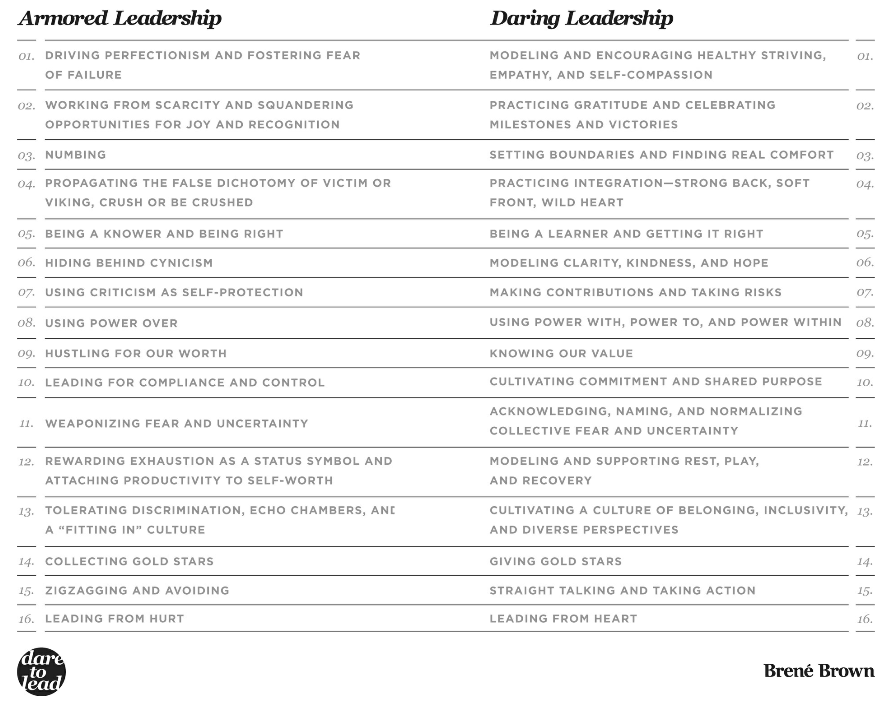

# Book review : Dare to Lead By Berné Brown

## Overview

In the entire book Berne with her usual passion and clarity, puts forth vividly her conviction to learn, grow, be better by daring to break the armory of ego. She so blatantly puts forth things that we unconsciously hide underneath the blanket of our daily motions and call for duty. 

While Yoda trains Luke in the swamp, he says, 
>… the cave is dangerous and strong with the **dark side** of the Force. Luke looks confused and afraid, but Yoda’s response is simply, “**in you must go**”
Luke asked, "What’s in the cave?" Yoda replied, “**Only what you take with you**.”
As Luke straps on his weapons, Yoda hauntingly advises, **“Your weapons, you will not need them”**
Luke gets into the cave, but gives-in to the lure of **anger, fear and aggression**. He slays a masked enemy, only to find that his enemy was himself, when the mask falls off, and he sees his **own head slayed.**

Through this Star Wars parable, Berne brings home the point that all the anger, fear, and aggression with which we fight the world, and give in to **blame and hurt**, we end up slaying our own selves, due to lack of awareness, in the effort to protect our small ego, and feel comfortable. She calls for a transition from the **armory** to the **arena**.

She builds up her argument on the foundation of the famous speech by Roosevelt, "The Man in the Arena" - 
> It is not the critic who counts; not the man who points out how the strong man stumbles, or where the doer of deeds could have done them better. The credit belongs to the man who is actually **in the arena**, whose face is **marred by dust and sweat and blood;** who **strives valiantly**; **who errs, who comes short again and again** … who at the best knows in the end the **triumph of high achievement**, and who at the worst, if he fails, at least **fails while daring greatly**. - *Theodore Roosevelt* 

Step by step she builds the language, expressions, tools, and ideas to delve deep into what it takes to be the **man in the arena**.

She starts with what she calls, **Rumbling with Vulnerability**. This is a difficult conversation where there is a commitment to **lean into vulnerability**. Stay **curious** and **generous**, to stay with the messy middle of problem identification and solving. Take a break and circle back when necessary. To be fearless in owning our parts. Listen with the same passion with which we want to be heard. And above all **serve the work, each other, not our egos**.

She articulates with immense clarity what it means serving our own egos, blaming others, and feeling comfortable with an erie one-sided righteousness, and terms it as **"armored leadership"**. And compares it with what it means to be vulnerable and serve the work and each other, and terms it as **"daring leadership"**.

She goes on to explain the **6 myths of vulnerability** and how they come in the way of daring leadership. She explains the difference between **fake vulnerability** and **true vulnerability**. She explains the importance of **psychological safety** and how it is built and maintained. She explains the importance of **boundaries** to vulnerability and how it is not a sympathy seeking tool. She explains the importance of **emotions** and how they are not weakness. She explains the importance of **curiosity** and **grounded confidence**.

Berne emphasises the importance of **emotions**, and authentically and deeply feeling through them. She very articulately brings forth the distinction that when we are actually open and vulnerable, we are for the first time aware of those emotions, and see the linkages of them to our thoughts and actions.

She proclaims - 
>Leaders must either invest a reasonable amount of time attending to **fears and feelings**, or squander an unreasonable amount of time trying to manage ineffective and **unproductive behavior**.

She introduces living with an **un-armored heart - living wholeheartedly**. She says - 
> I define wholeheartedness as “engaging in our lives from a place of **worthiness**. It means cultivating the **courage, compassion, and connection** to wake up in the morning and think, No matter what gets done and how much is left undone, I am enough. It’s going to bed at night thinking, Yes, I am imperfect and vulnerable and sometimes afraid, but that doesn’t change the truth that **I am brave, and worthy of love and belonging**.” - Brown, Brené.

### Wholeheartedness

   graph LR
   A(" fa:fa-chart-line courage ") --> B(" fa:fa-face-smile worthiness")
   C("fa:fa-heart compassion") --> B
   D("fa:fa-circle-nodes connection") --> B
   B --> E("fa:fa-heart-pulse wholeheartedness")
   E --> F("fa:fa-bell-concierge serve")

### The shift from armoured to daring leadership

>Jim Hollis describes the ego as “**that thin wafer of consciousness floating on an iridescent ocean called the soul**.”

>As children we found ways to **protect ourselves** from vulnerability, from being hurt, diminished, and disappointed.
We put on **armor**; we used our thoughts, emotions, and behaviors as **weapons**; 
and we learned how to make ourselves **scarce**, even to **disappear**. 
Now as adults we realize that to live with **courage**, **purpose**, and **connection** — **to be the person who we long to be** — we must again be vulnerable. We must take off the armor, put down the weapons, show up, and let ourselves be seen. — Brene Brown (Daring Greatly)

When we **imprison the heart**, we **kill courage**. And when we become **disembodied from our emotions** to the point that we literally don’t recognize which **physical feelings are connected to which emotional feelings**, we don’t gain control, we lose it.** Without our understanding or consent, emotions start driving** our decision making and behavior while thinking is tied up in the trunk. On the other hand, when the heart is open and free and we’re connected to our **emotions and understand what they’re telling us, new worlds open up for us** including **better decision** making and critical thinking, and the powerful experiences of** empathy, self-compassion, and resilience**.

### 1. The shift from Perfectionism to Healthy Striving

   graph LR
   A("fa:fa-bullseye 1. Perfectionism") --> B("fa:fa-shield Defensive move")
   A --> C("fa:fa-blind Prevent us from being seen")
   A --> D("fa:fa-check Trying to earn approval")
   A --> E("fa:fa-award Praise")
   A --> F("fa:fa-person Other Focused")
   A --> G("fa:fa-face-sad-tear Avoid painful feelings of blame & shame")
   A --> H("fa:fa-cloud Perception")
   A --> I("fa:fa-wine-bottle Addictive")
   A --> J("fa:fa-face-sad-tear Self blame. Not good enough")
   B --> K("fa:fa-heart-pulse 1. Healthy Striving, Empathy, Self Compassion")
   C --> K
   D --> K
   E --> K
   F --> K
   G --> K
   H --> K
   I --> K
   J --> K

### 2. The sift from scarcity to gratitude and joy

Joy is the most vulnerable emotion we feel. When we feel joy - it's beauty and fragility and deep gratitude and impermanence all wrapped in one experience. Joy becomes **foreboding**, and we immediately move to self protection. We start planning of being hurt, the moment a joy arrives. Unfortunately no amount of catastrophizing or planning for disaster prepares us well for them. The collateral damage of this instinct is that we squander the joy we need to build up an **emotional reserve**, the joy that allows us to build up **resilience for when tragic things do happen.**

Gratitude is about allowing yourself to recognize the shiver of vulnerability—that “Oh, shit, I have something worth losing now” feeling—and to just sit with it, and be grateful that you have something you want, in your hand, that it feels good to hold and recognize. Something as simple as starting or ending meetings with a gratitude check, when everyone shares one thing they’re grateful for, can build trust and connection, serve as container-building, and give your group permission to lean into joy.

   graph LR
   A("fa:fa-less 2. Scarcity. Joy foreboding") --> B("fa:fa-heart-pulse Preparation of forthcoming disaster")
   A --> C("fa:fa-heart-pulse Fear of complacency")
   A --> D("fa:fa-heart-pulse Fear of loss")
   A --> E("fa:fa-heart-pulse Fear of not being loved")
   A --> F("fa:fa-heart-pulse Fear of not being safe")
   B --> K("fa:fa-scissors 2. Squandering away joy & emotional reserve")
   C --> K
   D --> K
   E --> K
   F --> K
   K --> G("fa:fa-smile 2. Practice of Gratitude & Joy")

### 3. The shift from Numbing to finding real comfort and renew one's spirit

Numbing or taking the edge off doesn’t have the same consequences as addiction, but they are nonetheless severe and life-altering for one reason: We cannot selectively numb emotion. If we **numb the dark, we numb the light**. If we take the edge off **pain and discomfort**, we are, by default, taking the edge off **joy, love, belonging,** and the other emotions that give meaning to our lives.

For many of us, the **first response** to the vulnerability and discomfort of these sharp points is not to **lean into the discomfort and feel our way through**, but to make it **go away**. We do that by numbing and taking the edge off the pain with whatever provides the **quickest relief**. Again, we can **anesthetize** with a whole bunch of stuff including alcohol, drugs, food, sex, relationships, money, work, caretaking, gambling, staying busy, affairs, chaos, shopping, planning, perfectionism, constant change, and the Internet.

Brene recommends instead of immediately wanting to get rid of our vulnerability, resentment and anxiety, one can **lean into the discomfort** and find out the following - 

1. what are these feelings and from where did they come from?
2. What brings real comfort and renews the spirit? (not numbing. Numbing is **shadow comfort**. We deserve real comfort!)

>**Shadow Comforts** can take any form. It is not what you do; it's why you do it that makes the difference. You can eat a piece of chocolate as a holy wafer of sweetness - **a real comfort** or you can cram an entire chocolate bar into your mouth without even tasting it in a frantic attempt to soothe yourself - **a shadow comfort**. You can chat on a message board for half an hour and be energized by community and ready to go back to work, or you can chat for hours and hours, because you are avoiding talking to your partner about how angry he or she made you last night. - *Jennifer Louden* 

   graph LR
   A1("fa:fa-bolt 3. Vulnerability") --> B("fa:fa-face-sad-tear Numbing & taking edge off. Anaesthetizing")
   A2("fa:fa-bolt Resentment") --> B
   A3("fa:fa-bolt Anxiety") --> B
   A4("fa:fa-ban Lack of Boundaries") --> A1
   A4 --> A2
   A4 --> A3
   C("fa:fa-wine-bottle addiction") --> B
   D("fa:fa-wine-bottle alcohol, drugs, food, shopping") --> C
   E("fa:fa-users sex, relationships, affairs, caretaking") --> C
   I("fa:fa-money-bills work, planning, perfectionism, constant change, money, gambling, staying busy, chaos") --> C
   B --> T("fa:fa-heart-pulse Leaning into discomfort")
   B --> U("fa:fa-heart-pulse Renew the spirit")
   T --> V("fa:fa-question What are these feelings")
   T --> W("fa:fa-question Where did they come from")
   V --> Z1("fa:fa-triangle-exclamation Discern real comfort from Shadow comfort")
   W --> Z1
   Z1 --> C1("fa:fa-question What brings in real comfort")
   Z1 --> C2("fa:fa-question What renews the spirit")
   C2 --> C4("fa:fa-ban Respect Boundaries")
   C1 --> C4
   C4 --> C5("fa:fa-heart Real Comfort & Self Care")

### 4. The shift from Combativeness to Integration

This is about being self aware and stop Propagating the **False Dichotomy of Victim or Viking, Crush or Be Crushed**, and be better integrated.

Survival and winning may mean success in some contexts. But after you have stripped away the real threat, survival is not living. **We all need to belong**, **we all need love, and neither is possible without vulnerability and integration**.

   graph LR
   A("fa:fa-fist-raised 4. Victim Or Viking Mindset (False Binaries)") --> B("fa:fa-fist-raised Defense")
   A --> C("fa:fa-fist-raised Anger")
   A --> D("fa:fa-fist-raised Passive Fear")
   A --> E("fa:fa-fist-raised Aggression")
   A --> F("fa:fa-fist-raised Avoidance")
   B --> G("fa:fa-heart-pulse Integration")
   C --> G
   D --> G
   E --> G
   F --> G
   G --> H("fa:fa-people-arrows Belonging")
   G --> I("fa:fa-heart Love")
   H --> J("fa:fa-person **Strong Back, Soft Front, Wild Heart**")
   I --> J
   J --> J1("fa:fa-person Strong Back")
   J1 --> J4("fa:fa-person Grounded Confidence")
   J1 --> J5("fa:fa-person Set Boundaries")
   J --> J2("fa:fa-person Soft Front")
   J2 --> J3("fa:fa-person Vulnerable")
   J2 --> J6("fa:fa-person Curious")
   J --> J7("fa:fa-person Wild Heart")
   J7 --> J8("fa:fa-person Living into these paradoxes. No either/or BS")
   J7 --> J9("fa:fa-person Being both fierce and kind. Showing up in our vulnerability and courage")

>All too often our so-called **strength comes from fear, not love**; instead of having a strong back, many of us have a defended front shielding a weak spine. In other words, we walk around **brittle and defensive, trying to conceal our lack of confidence**. If we **strengthen our backs**, metaphorically speaking, and develop a **spine that’s flexible but sturdy**, then we can **risk having a front that’s soft and open**. How can we **give and accept care** with strong-back, soft-front compassion, moving past fear into a place of genuine tenderness? I believe it comes about when we can be **truly transparent, seeing the world clearly—and letting the world see into us**. - *Roshi Joan Halifax*

### 5. The shift from Being Right to Getting it right

   graph LR
   A1("fa:fa-ear-deaf 5. Being Right") --> A("fa:fa-ear-listen Getting it right") --> B("fa:fa-circle-down Name the issue. Catching being knowing")
   A --> C("fa:fa-list Make learning curiosity skills a priority")
   A --> D("fa:fa-medal Acknowledge & Reward curiosity")

### 6. The shift from cynicism to modelling clarity, kindness and hope.

   graph LR
   A("fa:fa-face-rolling-eyes 6. Cynicism - false belief that tomorrow will be same as today") --> B("fa:fa-scissors Greek word sarkazein, meaning to tear flesh")
   B --> C("fa:fa-shoe-prints Trail of hurt, anger, confusion, resentment")
   C --> D("fa:fa-droplet Staying clear and kind")
   C --> E("fa:fa-volume-high Say what you mean. Mean what you say")
   C --> F("fa:fa-spa Cultivate Hope")
   F --> G("fa:fa-bullseye Goal")
   F --> H("fa:fa-road Pathway")
   F --> I("fa:fa-user Agency")

### 7. The shift from using criticism as self protection to contributing and taking risks.

   graph LR
   A1("fa:fa-ghost Fear")
   A2("fa:fa-face-frown Feeling of unworthiness")
   A1 --> A
   A2 --> A
   A("fa:fa-face-angry Criticism") --> B("fa:fa-landmark Nostalgia - Use history to criticize different thinking")
   A --> C("fa:fa-people-group Invisible army - *who makes your we?* ")
   B --> D("fa:fa-hand-point-right spotlight to someone else")
   C --> D
   D --> E("fa:fa-smile Feel safer, better in cheap seat")
   E --> F("fa:fa-bullseye Contribute, risk ")

### 8. The shift from Power-Over to Power-With, Power-To and Power-within

   graph LR
   A("fa:fa-hand-fist Power Over") --> B("fa:fa-user-slash benefit minority. Oppress majority")
   B --> C("fa:fa-user-friends Power With")
   B --> D("fa:fa-road Power To")
   B --> E("fa:fa-spa Power Within")

1. Power is the ability to achieve purpose, and effect change.
2. **Power over** is benefiting a minority and oppressing the majority.
3. **Power with** has to do with finding **common ground** among different interests in order to build **collective strength**. Based on **mutual support**, **solidarity**, **collaboration**, and recognition and **respect for differences**, power with **multiplies individual talents**, knowledge, and resources to make a larger impact.”
4. **Power to** translates to giving everyone on your team **agency** and acknowledging their unique potential. It is “based on the belief that each individual has the power to **make a difference**, which can be **multiplied** by **new skills, knowledge, awareness, and confidence**.” 
5. **Power within** is defined by an ability to recognize differences and respect others, grounded in a strong **foundation of self-worth and self-knowledge**. When we operate from a place of power within, we feel **comfortable challenging assumptions and long-held beliefs, pushing against the status quo, and asking if there aren’t other ways to achieve the highest common good.**

### 9. The shift from Hustling for our worth to knowing our own value

   graph LR
   C("fa:fa-people-arrows Unhealthy hustle") --> D("fa:fa-person-rays Jumping in everywhere, where we are not strong and not needed")
   C --> E("fa:fa-award Exaggerate our importance") 
   C--> F("fa:fa-eye Seek attention and validation") 
   C--> G("fa:fa-person-shelter more value on being right than getting it right")
   A1("fa:fa-spa Self awareness")-->A
   A("fa:fa-hand-fist Individual value")
   A1--> B("fa:fa-users-gear Org value")
   E --> A1
   F --> A1
   G --> A1
   D --> A1
   A --> H("fa:fa-users Calm Cooperation")
   B --> H

When people don’t understand where **they’re strong** and **where they deliver value for the organization** or even for a single effort, they hustle. 
And not the good kind of hustle.
The kind that’s hard to be around because we are **jumping in everywhere**, including where we’re not strong or not needed, to prove we deserve a seat at the table. When we do not understand our value, we often **exaggerate our importance** in ways that are not helpful, and we consciously or unconsciously **seek attention** and **validation of importance**. We put more value on being right than on getting it right. It creates franticness instead of calm cooperation.

### Mind-map - transition from armory to arena

    graph LR
    O1(Curiosity-Say more-!Got it, on it, run.)-->M(Daring leadership)
    O2(owning my part)-->M
    O3(Serving work & each other)-->M
    O4(Lean in)-->M
    O5(Boundaries)-->M
    O6(Psychological safety)-->M

    M --> A(Rumble with Vulnerability-Courage)
    A(Rumble with Vulnerability-Courage) --> B(Uncertainty)
    A --> C(Risk)
    A --> D(Emotional Exposure)
    B --> E(Courage)
    E --> N(Clarity is kind. To and About)
    E --> S(Attend to fears and feelings. Over symptoms of behaviors)
    C --> E
    D --> E
    E --> F(Adaptability to change)
    E --> G(Hard conversations)
    E --> H(Feedback)
    E --> I(Problem solving)
    E --> J(Ethical decision making)
    E --> K(Recognition)
    E --> L(Resilience)
    E --> T(Space in conversation)
    E --> U(Time-out)
    E --> V(Set boundaries)
    E --> W(Other's emotions, not our job)
    F --> Z(Engaged Org)
    G --> Z
    H --> Z
    I --> Z
    J --> Z
    K --> Z
    L --> Z
    N --> Z
    S --> Z
    T --> Z
    U --> Z
    V --> Z
    W --> Z
    Z --> O(Innovation)
    Z --> P(Productivity)
    Z --> Q(Challenge status quo)
    Z --> R(Customer value)

## 1. Rumbling with vulnerability - Courage is contagious

Rumbling with vulnerability is about leaning into rather than walking away from the situations that make us feel uncertain, at risk, or emotionally exposed.

### The moment and the myths

#### Key lessons

   1. Physics of vulnerability - if we brave enough, **often enough**, we will fall. Daring is not saying - "i'm willing to risk failure". But it is about saying, "i know i will eventually fail and **i'm still all in**." It is an awareness that disappointment, failure and heartbreaks are inevitable.

   2. Vulnerability is not winning or losing. It is having the courage to show up when you can't control the outcome. The definition of vulnerability as the emotion that we experience during times of **uncertainty, risk, and emotional exposure**.
   3. **cheap-seat feedback** - If you are not in the arena getting your ass kicked on occasion, I’m not interested in or open to your feedback. Avoid cheap feedbacks and remain armor free.
      1. what is unproductive, hurtful, drop at the feet of your unarmored self.
      2. No matter how much your self doubt wants to scoop up the criticism and snuggle with the negativity so it can confirm its worst fears, or
      3. how eager your shame gremlins are to use the hurt to fortify your armor,
      4. Take a deep breath and find the strength to leave what is mean spirited on the ground. you don't even need to stomp it and kick it away.
      5. Cruelty is cheap, easy, and chickenshit. It does not deserve your energy or engagement. Just step over the comments and keep daring, always remembering that armor is too heavy a price to pay to engage with cheap-seat feedback.
   4. **the balancing act** - Sealing heart not just from hurt, **but from love** - if we engage with all feedbacks including the ill spirited ones, it would hurt us more. if we armor ourselves pretending it does not hurt, we disconnect from vulnerability and emotion so fully that we stop feeling hurt. That is the place where the armor is so thick that we don't feel anything. there was experience death. **Cowards die many times before death!** so spake Shakespeare. We have paid for self protection by sealing off our heart from everyone and from everything - not just hurt, but love.
   5. **certainty of heart wringing** - *by CS Lewis* - To love at all is to be vulnerable. Love anything and your heart will **certainly** be **wrung** and possibly be **broken**. If you want to make sure of keeping it intact, you must give your heart to no one, not even to an animal. Wrap it carefully round with hobbies and little luxuries; avoid all entanglements; Lock it up safe in the casket or coffin of your selfishness. But in that casket - safe, dark, motionless, airless - it will change. It will not be broken; it will become ubreakable, impenetrable, irredeemable. **To love is to be vulnerable.**
   6. **Square quad** : Choose people who love you not **despite** your imperfections and vulnerabilities. But **because** of them.

#### 6 myths of vulnerability

1. *Vulnerability is weakness* : It is rather that vulnerability triggers courage.
2. *I don't do vulnerability* : Pretending that we don't do vulnerability means letting fear drive our thinking and behavior.
3. *I can go it alone* :

> we don’t derive strength from our rugged individualism, but rather from our collective ability to plan, communicate, and work together. Our neural, hormonal, and genetic makeup support interdependence over independence. He explained, “To grow to adulthood as a social species, including humans, is not to become autonomous and solitary, it’s to become the one on whom others can depend.3 Whether we know it or not, our brain and biology have been shaped to favor this outcome.” - *John Cacioppo*

4. *You can engineer the uncertainty and discomfort out of vulnerability* - There are two types of vulnerabilities. One is is systemic and the other is relational. Systemic vulnerabilities are the ones that can be engineered out. Relational vulnerabilities are comprised of - 
   1. uncertainties
   2. risks
   3. emotional exposure
When we try to strip these out, we bankrupt courage by definition.

5. *Trust comes before vulnerability* - Trust is the stacking and layering of small moments of vulnerability over time. Trust and vulnerability go together, and to betray one is to destroy both.
6. *Vulnerability is disclosure*
   1. Oversharing and indiscriminate disclosure as a leadership tool, or vulnerability for vulnerability's sake is not authentic vulnerability. It is **fake vulnerability**
   2. There is no **daring leadership** without vulnerability.

→ **An Example : to build safe container** - A typical rumble with vulnerability : a leader's address to his team.

> These changes are coming in **hard and fast**, and I know there’s a lot of anxiety—I’m feeling it too, and it’s **hard to work through**. It’s **hard not to take it home**, it’s **hard not to worry**, and **it’s easy to want to look for someone to blame**. 

> I will share everything I can about the changes with you, as soon as I can.

> I want to spend the next forty-five minutes rumbling on how we’re all managing the changes. Specifically, **What does support from me look like?** `(holding team accountable for asking what they need)` **What questions can I try to answer?** Are there any **stories you want to check out with me?** And any other **questions** you have? I’m asking everyone to **stay connected and lean into each other during** this churn so we can really rumble with what’s going on. In the midst of all of this we still need to **produce work that makes us proud**.

> Let’s each write down **one thing we need from this group in order to feel okay sharing and asking questions**, and **one thing that will get in the way**.

### Psychological safety Amy Edmondson

#### What it is

1. Psychological safety makes it possible to give tough feedback and have difficult conversations without the need to tiptoe around the truth.
2. In this space, people believe that if they make a mistake, others will penalize or think less of them for it.
3. If they ask for help they will not be humiliated.
4. It produces a confidence that the group won't embarrass, reject, or punish someone for speaking up. not resent, humiliate, reject

#### What it is not

1. It is not creating a cozy situation where people are necessarily close friends.
2. Nor does it suggest an absence of pressure or problems.

#### What comes in the way to build the space?

1. judgments
2. unsolicited advice giving
3. interrupting
4. sharing outside the team meetings

#### Behaviors that affirm the space

1. active listening with the same passion as one wants to be heard.
2. staying curious
3. being honest
4. keeping confidence
5. taking accountability of what we need and articulating it. we are too often more accustomed to not asking for exactly what we need and then being resentful or disappointed when we don't get it.

### Fake vulnerability

1. hot-wiring connection or trust with other people by oversharing or disclosing inappropriately.
2. asking question but not creating that `safe container` taking time to create that psychological safety before. or not pausing for the other to speak up.
3. shirking off the responsibility to attend the team's fears and feelings by oversharing and sympathy seeking. Basically saying, "feel sorry for me and don't hold me accountable for leading through this hard time, because I am scared too". this is manipulating others using vulnerability.
4. Giving into **Stealth Intentions** and **Stealth Expectations** 
   1. **Stealth Intentions** - It is a self protection need that lurks beneath the surface and often drives behaviors outside our values. This is generally about protecting oneself of shame, rejection, judgement, and people turning away and thinking we are a bad person.
   2. **Stealth expectations** - dangerous combination of fear and magical thinking. This leads to resentment, disappointment and more fear. This is typically an expectation that people will not turn away from us, and they will think we are trying our best, and that we are a good person.

### True vulnerability

1. To be fearless in owning our own parts.
2. To serve each other, to serve the work with better ideas and actions, and not serve our own egos.
3. Rumbling with vulnerability is about leaning into rather than walking away from the situations that make us feel uncertain, at risk, or emotionally exposed.
4. It is not the critic who counts; not the man who points out how the strong man stumbles, or where the doer of deeds could have done them better. The credit belongs to the man who is actually in the arena, whose face is marred by dust and sweat and blood; who strives valiantly; who errs, who comes short again and again … who at the best knows in the end the triumph of high achievement, and who at the worst, if he fails, at least fails while daring greatly. - *Theodore Roosevelt*
5. Be clear about our intention.
6. Set **Boundaries** to vulnerability and understand its limitations in the context of roles and relationships. Vulnerability without boundary is not vulnerability. It is **confession, manipulation, desperation, or shock and awe.** But it is not vulnerability.
7. Vulnerability is not a **sympathy seeking tool**!
8. It is a means to drive productive action, inspire openness and innovation in action. It is about solving problems. It is not about vulnerability's sake.

### Emotions are not weakness

1. To feel is to be vulnerable. Feeling is not weakness. We are all emotional beings. We crave for love, belonging and joy. And vulnerability is their birthplace!
2. It’s very hard to have ideas. It’s very hard to put yourself out there, it’s very hard to be vulnerable, but those people who do that are the dreamers, the thinkers, and the creators. They are the magic people of the world.
3. We are not necessarily thinking machines. We are feeling machines that think.

### Call to courage - clear is kind. unclear is unkind.

1. Feeding people half truth or `bullshit to make them feel better` (which is almost always about making ourselves more comfortable) is unkind. Not getting clear with a colleague about your expectations because it feels too hard, yet holding them accountable or blaming them for not delivering is unkind. `Talking *about* people rather than *to* them is unkind.`
2. Leaders must either invest a reasonable amount of time attending to `fears and feelings`, or squander an unreasonable amount of time trying to manage ineffective and `unproductive behavior`.
3. We haven’t peeled away enough layers of the onion. And once we start peeling, we have to leave `long pauses and empty space`. I know the conversation is hard enough, but people need white space. Stop talking. Even if it’s awkward—which it will be the first fifteen times. And when they start talking (which they normally will), listen. Really listen. Don’t formulate your response while they’re talking. If you have a great insight—hold it. Don’t do that thing where the listener starts `nodding faster` and faster, not because they’re actively listening but because they’re trying to unconsciously signal the talker to wrap up so they can talk. Keep a lot of space in the conversation.
4. When we’re in tough rumbles with people, we can’t take responsibility for their emotions. They’re allowed to be pissed or sad or surprised or elated. But if their behaviors are not okay, `we set the boundaries`
5. Also, don’t forget one of our favorite rumble tools: the time-out. When rumbles become unproductive, call a `time-out`. Give everyone ten minutes to walk around outside or catch their breath. In our organization, everyone is empowered to call a time-out. And we all do it when we need it.
6. Just remember, we can’t do our jobs when we own other people’s emotions or take responsibility for them as a way to control the related behaviors, for one simple reason: `Other people’s emotions are not our jobs`. We can’t both serve people and try to control their feelings. Daring leadership is ultimately about serving other people, not ourselves. That’s why we choose courage.

### The armory

1. **Blaming** - Blaming is a way to discharge pain and discomfort. We blame when we’re in pain. It’s a way to discharge pain and discomfort. We blame when we’re feeling powerless, frustrated, or overwhelmed. We blame people for not doing things we think they should be doing. We blame people for not being who we think they should be. We blame people for not living up to our expectations. We blame people for not saying what we want them to say. We blame people for not being who we want them to be. We blame people for not doing what we want them to do
2. 

### 1.4. Shame and empathy

### 1.5. Curiosity and grounded confidence

## 2. Living into our values

## 3. Braving trust

## 4. Learning to rise