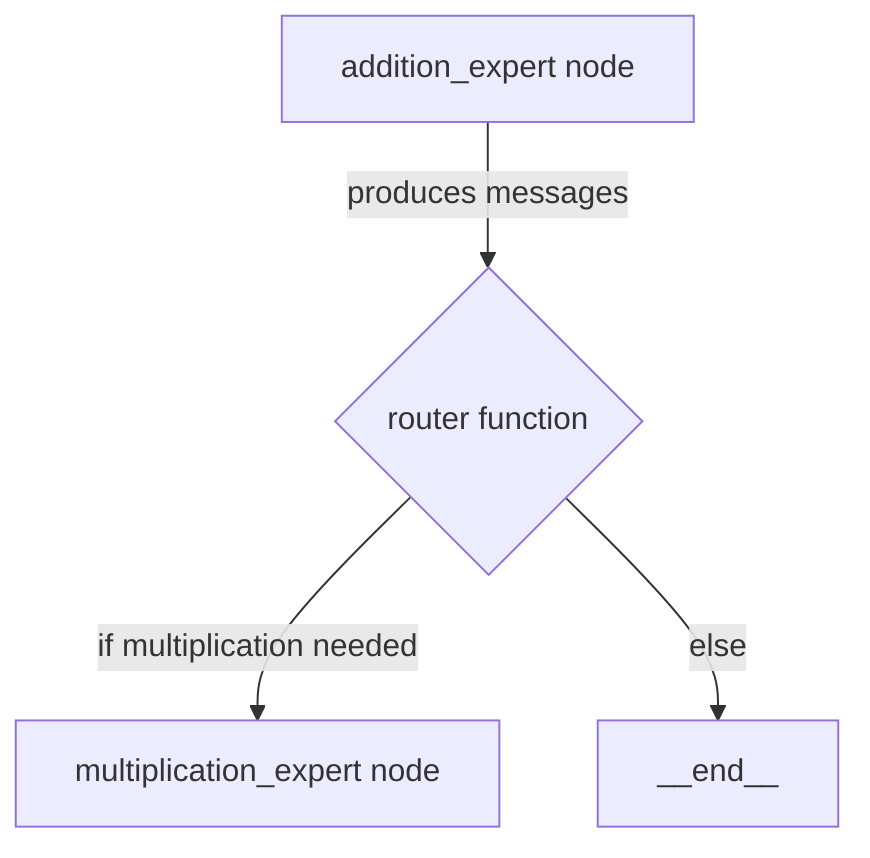
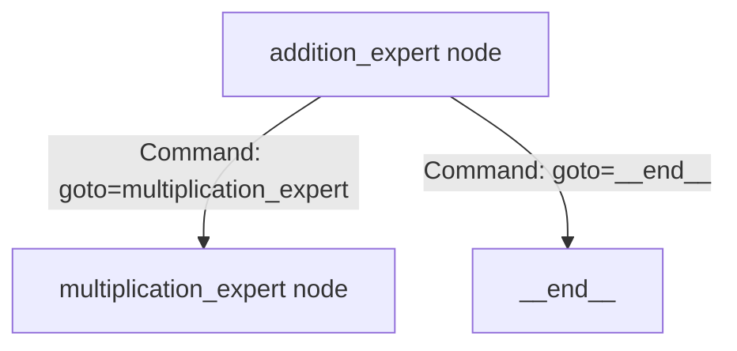

### Conditional Edge 



### Command 



### output for the llm invoke 

```python
app.invoke({"messages":[("user","what's (3 + 5) * 12. Provide me the output")]})
```

1. 1st level - These is a dict of message type and the actual message. 
`{'messages': [Message, Message, ...]}`

2. 2nd level the message types are different 
`{'messages': [HumanMessage, AIMessage, ToolMessage, ...]}`

3. 3rd level - The actual message object.
`{'messages': [HumanMessage(content="...", additional_kwargs={}, response_metadata={}, id='...'), AIMessage(content="...", additional_kwargs={}, response_metadata={}, id='...'), ToolMessage(content="...", id='...', tool_call_id='...'), ...]}`


The message type might be one of the following - 
1. HumanMessage
2. AIMessage
3. ToolMessage


```
{'messages': [HumanMessage(content="what's (3 + 5) * 12. Provide me the output", additional_kwargs={}, response_metadata={}, id='3fb1bbc5-6aa8-4ae2-89dd-12f962daed8e'),
  AIMessage(content='', additional_kwargs={'tool_calls': [{'id': 'call_14fdvJSEyv31BGXipHI9JW1I', 'function': {'arguments': '{"a":8,"b":12}', 'name': 'mul_tool'}, 'type': 'function'}], 'refusal': None}, response_metadata={'token_usage': {'completion_tokens': 18, 'prompt_tokens': 118, 'total_tokens': 136, 'completion_tokens_details': {'accepted_prediction_tokens': 0, 'audio_tokens': 0, 'reasoning_tokens': 0, 'rejected_prediction_tokens': 0}, 'prompt_tokens_details': {'audio_tokens': 0, 'cached_tokens': 0}}, 'model_name': 'gpt-4o-2024-08-06', 'system_fingerprint': 'fp_1827dd0c55', 'id': 'chatcmpl-CBsWamkgQMSoRunFpMfb2dmBFaLPG', 'service_tier': 'default', 'finish_reason': 'tool_calls', 'logprobs': None}, id='run--fb3629b0-ad48-423f-9c7c-ad5aa1a7d87c-0', tool_calls=[{'name': 'mul_tool', 'args': {'a': 8, 'b': 12}, 'id': 'call_14fdvJSEyv31BGXipHI9JW1I', 'type': 'tool_call'}], usage_metadata={'input_tokens': 118, 'output_tokens': 18, 'total_tokens': 136, 'input_token_details': {'audio': 0, 'cache_read': 0}, 'output_token_details': {'audio': 0, 'reasoning': 0}}),
  ToolMessage(content='Successfully transferred', id='1747cb97-b259-44b1-8410-4c57ad445970', tool_call_id='call_14fdvJSEyv31BGXipHI9JW1I'),
  AIMessage(content='', additional_kwargs={'tool_calls': [{'id': 'call_DqFGnsIFWa2HEU0zo5PGqIRg', 'function': {'arguments': '{"a":3,"b":5}', 'name': 'add_tool'}, 'type': 'function'}], 'refusal': None}, response_metadata={'token_usage': {'completion_tokens': 18, 'prompt_tokens': 146, 'total_tokens': 164, 'completion_tokens_details': {'accepted_prediction_tokens': 0, 'audio_tokens': 0, 'reasoning_tokens': 0, 'rejected_prediction_tokens': 0}, 'prompt_tokens_details': {'audio_tokens': 0, 'cached_tokens': 0}}, 'model_name': 'gpt-4o-2024-08-06', 'system_fingerprint': 'fp_cbf1785567', 'id': 'chatcmpl-CBsWalYFYcS60SU7JOWGTigpRcVEW', 'service_tier': 'default', 'finish_reason': 'tool_calls', 'logprobs': None}, id='run--cdbe0de2-6135-48e2-9071-61e6ce530d31-0', tool_calls=[{'name': 'add_tool', 'args': {'a': 3, 'b': 5}, 'id': 'call_DqFGnsIFWa2HEU0zo5PGqIRg', 'type': 'tool_call'}], usage_metadata={'input_tokens': 146, 'output_tokens': 18, 'total_tokens': 164, 'input_token_details': {'audio': 0, 'cache_read': 0}, 'output_token_details': {'audio': 0, 'reasoning': 0}}),
  ToolMessage(content='Successfully transferred', id='8aabf639-5acc-416d-97fa-6389acf1df99', tool_call_id='call_DqFGnsIFWa2HEU0zo5PGqIRg'),
  AIMessage(content='The result of \\((3 + 5) \\times 12\\) is 96.', additional_kwargs={'refusal': None}, response_metadata={'token_usage': {'completion_tokens': 21, 'prompt_tokens': 174, 'total_tokens': 195, 'completion_tokens_details': {'accepted_prediction_tokens': 0, 'audio_tokens': 0, 'reasoning_tokens': 0, 'rejected_prediction_tokens': 0}, 'prompt_tokens_details': {'audio_tokens': 0, 'cached_tokens': 0}}, 'model_name': 'gpt-4o-2024-08-06', 'system_fingerprint': 'fp_1827dd0c55', 'id': 'chatcmpl-CBsWcFZEWtPqS8I2zOChO5oSRNfGO', 'service_tier': 'default', 'finish_reason': 'stop', 'logprobs': None}, id='run--9590b01b-2ca3-42e7-a006-ee76029be973-0', usage_metadata={'input_tokens': 174, 'output_tokens': 21, 'total_tokens': 195, 'input_token_details': {'audio': 0, 'cache_read': 0}, 'output_token_details': {'audio': 0, 'reasoning': 0}})]}

```


### file organization 

1. created a file tools.py to define all the tools. This can be seamlessly imported by any workflow. 
