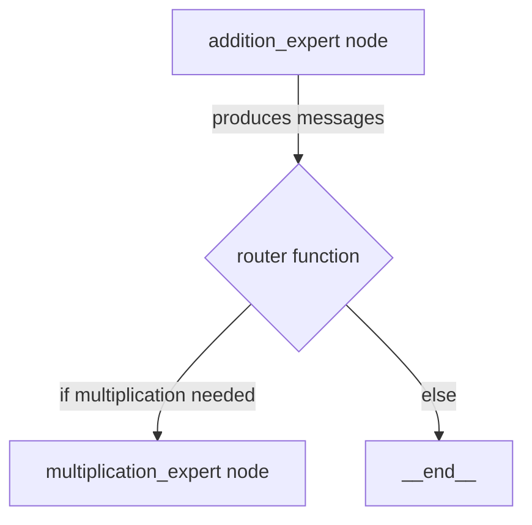
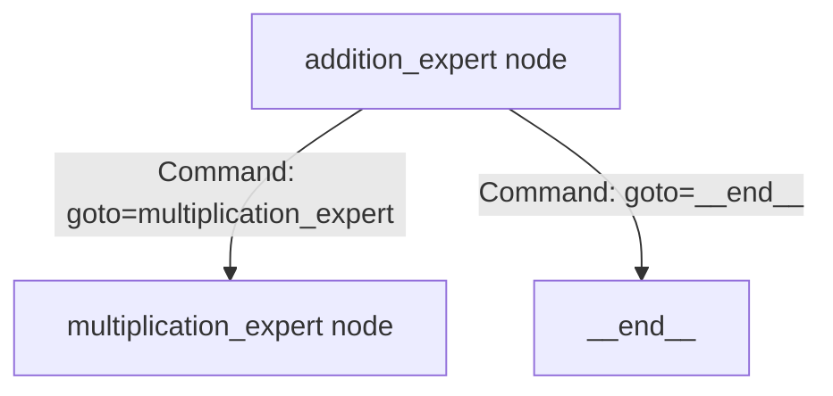

### Conditional Edge 

```mermaid
flowchart TD
    A[addition_expert node] -->|produces messages| R{router function}
    R -->|if multiplication needed| B[multiplication_expert node]
    R -->|else| E[__end__]
```

### Command 

```mermaid
flowchart TD
    A[addition_expert node]
    A -->|Command: goto=multiplication_expert| B[multiplication_expert node]
    A -->|Command: goto=__end__| E[__end__]
```

