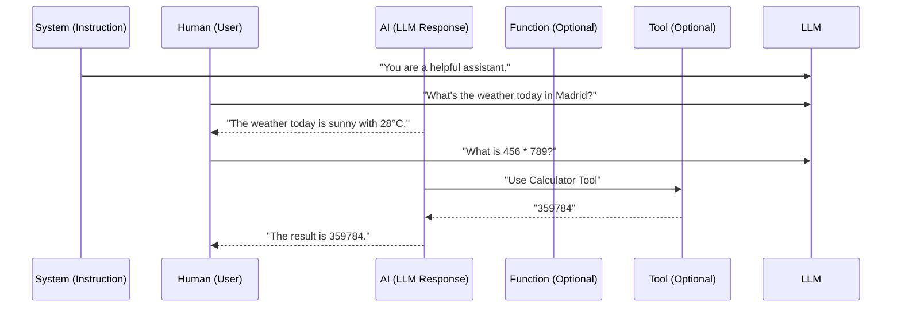

### Prompt Template 

A prompt template in LangChain is a structured way to create and manage prompts for language models. It allows you to define reusable prompt formats with placeholders that can be dynamically filled with different values.

```python
from langchain.prompts import PromptTemplate

template = "Tell me a {adjective} joke about {topic}"
prompt = PromptTemplate(
    input_variables=["adjective", "topic"],
    template=template
)

# Usage
formatted_prompt = prompt.format(adjective="funny", topic="cats")
# Result: "Tell me a funny joke about cats"
```

Prompt Templates take as input a dictionary, where each key represents a variable in the prompt template to fill in.

Prompt Templates output a PromptValue. This PromptValue can be passed to an LLM or a ChatModel, and can also be cast to a string or a list of messages. The reason this PromptValue exists is to make it easy to switch between strings and messages.


### String prompt template 

```python
from langchain_core.prompts import PromptTemplate
prompt_template = PromptTemplate.from_template("Tell me a joke about {topic}")
### Note that the invoke() does not invoke the LLM. This is just a way to construct the output promptValue and inspect it prior sending it to the LLM! This is optional. It is generally done to debug and inspect the prompt, for a static code analyzer.
prompt_template.invoke({"topic": "cats"})
```

### Chat Prompt Template
```python
from langchain_core.prompts import ChatPromptTemplate
chat_prompt_template = ChatPromptTemplate.from_messages([
    ("system", "You are a helpful assistant."),
    ("user", "Tell me a joke about {topic}")
])
chat_prompt_template.invoke({"topic": "cats"})
``` 



### parser

When the data is output by the LLM, we can automatically format it in a way we want. 
That is done by explicitly prompting the LLM to do so. 
To do that we can ues a pydantic model to define the output format we want.

```python
from pydantic import BaseModel, Field
# pydantic class 
class TopicSelectionParser(BaseModel):
    topic: str = Field(description ="The topic to be selected for the workflow")
    reasoning: str = Field(description="The reasoning behind the topic selection")
parser = PydanticOutputParser(pydantic_object=TopicSelectionParser)

template = """
Your task is to classify the given user query into  one of the following categories : [USA, Weather, Not Related].
Only respond with the category name.

User query: {question}
{format_instructions}
"""
## schema of the output is added in the prompt itself.
prompt = PromptTemplate(
    template=template,
    input_variables=["question"],
    partial_variables={"format_instructions": parser.get_format_instructions()}
)

chain = prompt | model | parser 
```

### agent states 

```python

## dict of sequences of BaseMessage. this gives type safety 
## Note that this is a dict, and one key-value pair is "messages" which is a sequence of BaseMessage.
state: AgentState = {"messages": [message1, message2]}.
## or it can be of the form below - 
messages: Sequence[BaseMessage] = [
    HumanMessage("Hello"),
    AIMessage("Hi there"),
    HumanMessage("How are you?"),
    # ... can add thousands more
]

""" Visual representation of the AgentState 
AgentState (dict)
├── "messages" (key) → [                    (list/sequence)
│                        HumanMessage(      (object)
│                          content="Hello", 
│                          type="human"
│                        ),
│                        AIMessage(         (object)
│                          content="Hi!",
│                          type="ai"
│                        ),
│                        ...
│                      ]
"""

## typically there will be other key-value pairs, which will not be messages. 

# Current
class AgentState(TypedDict):
    messages: Annotated[Sequence[BaseMessage], operator.add]

# Future expansion (very common)
class AgentState(TypedDict):
    messages: Annotated[Sequence[BaseMessage], operator.add]
    user_profile: Dict[str, Any]
    conversation_context: Dict[str, Any]
    current_tools: List[str]
    memory: Dict[str, Any]
    session_id: str

## operator.add 
## operator.add in the Annotated metadata is not used by regular Python dictionary operations. 
## It's only used by state management frameworks (like LangGraph) when they handle state updates internally.
# In LangGraph, this would use operator.add:
def my_node(state: AgentState) -> AgentState:
    return {
        "messages": [HumanMessage("Hi How are you")]  # Framework appends this
    }

def another_node(state: AgentState) -> AgentState:
    return {
        "messages": [AIMessage("I am fine, thank you!")]  # Framework appends this too
    }

# The framework sees the operator.add annotation and does:
# new_messages = current_state["messages"] + returned_state["messages"]

```