```mermaid
sequenceDiagram
    participant System as System (Instruction)
    participant User as Human (User)
    participant Assistant as AI (LLM Response)
    participant Function as Function (Optional)
    participant Tool as Tool (Optional)

    System->>LLM: "You are a helpful assistant."
    User->>LLM: "What's the weather today in Madrid?"
    Assistant-->>User: "The weather today is sunny with 28°C."
    User->>LLM: "What is 456 * 789?"
    Assistant->>Tool: "Use Calculator Tool"
    Tool-->>Assistant: "359784"
    Assistant-->>User: "The result is 359784."

```

### Prompt Template 

A prompt template in LangChain is a structured way to create and manage prompts for language models. It allows you to define reusable prompt formats with placeholders that can be dynamically filled with different values.

```python
from langchain.prompts import PromptTemplate

template = "Tell me a {adjective} joke about {topic}"
prompt = PromptTemplate(
    input_variables=["adjective", "topic"],
    template=template
)

# Usage
formatted_prompt = prompt.format(adjective="funny", topic="cats")
# Result: "Tell me a funny joke about cats"
```

Prompt Templates take as input a dictionary, where each key represents a variable in the prompt template to fill in.

Prompt Templates output a PromptValue. This PromptValue can be passed to an LLM or a ChatModel, and can also be cast to a string or a list of messages. The reason this PromptValue exists is to make it easy to switch between strings and messages.


### String prompt template 

```python
from langchain_core.prompts import PromptTemplate
prompt_template = PromptTemplate.from_template("Tell me a joke about {topic}")
### Note that the invoke() does not invoke the LLM. This is just a way to construct the output promptValue and inspect it prior sending it to the LLM! This is optional. It is generally done to debug and inspect the prompt, for a static code analyzer.
prompt_template.invoke({"topic": "cats"})
```

### Chat Prompt Template
```python
from langchain_core.prompts import ChatPromptTemplate
chat_prompt_template = ChatPromptTemplate.from_messages([
    ("system", "You are a helpful assistant."),
    ("user", "Tell me a joke about {topic}")
])
chat_prompt_template.invoke({"topic": "cats"})
``` 

