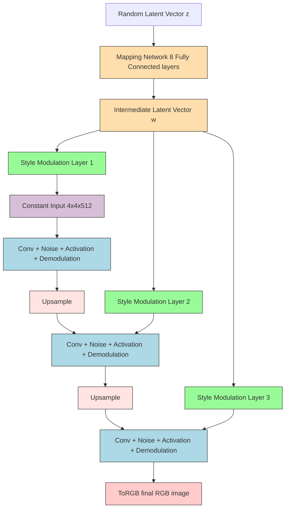
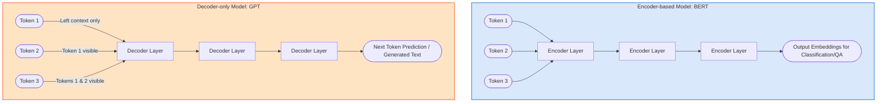
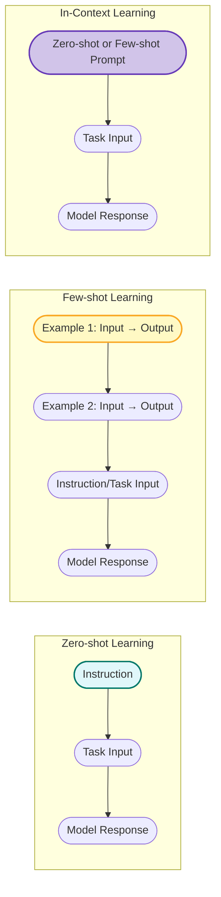
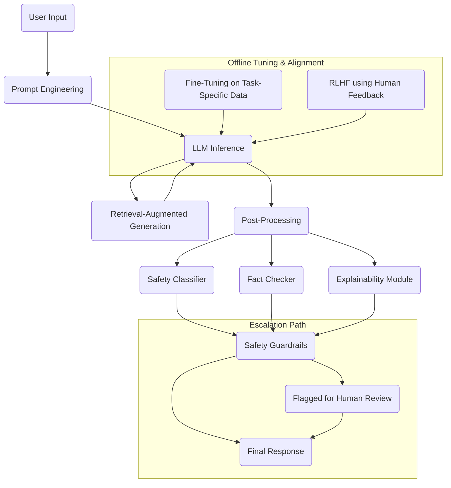
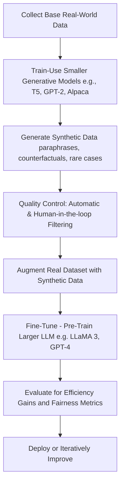

## Introduction
Generative Adversarial Networks (GANs) are a class of machine learning frameworks designed for unsupervised learning. They consist of two neural networks, the **generator** and the **discriminator**, which are trained simultaneously through **adversarial processes**. The generator creates fake data, while the discriminator evaluates the authenticity of the data, leading to improved performance in generating realistic samples.
[GAN generated images](https://thispersondoesnotexist.com/)

The real innovation is in the **generator** which is a neural network that takes random noise as inputs and generates data that resembles the training data. The generator is trained to produce data that is indistinguishable from real data, while the discriminator is trained to differentiate between real and fake data.

This idea was proposed by Ian Goodfellow and his colleagues in 2014. The GAN framework has since gained popularity due to its ability to generate high-quality images, videos, and other types of data.

## Architecture
<div class="mermaid">
graph TD
    A(2.Generator NN) -->|2.Fake Image| B(1.Discriminator / Adversary NN)
    B -->|Real or Fake| C(Loss Function)
    C -->|Feedback| A
    C -->|Feedback| B
    D(Real Image) -->|Trains| B
</div>


## Types of GANs 
1. **Vanilla GAN**: The original GAN architecture, consisting of a generator and a discriminator. Both discriminator and generator are simple multi-layer perceptrons (MLPs) with no convolutional layers.
2. **Deep Convolutional GAN (DCGAN)**: An extension of the vanilla GAN that uses convolutional neural networks (CNNs) in both the generator and discriminator. This architecture is more effective for generating high-quality images.
3. **Conditional GAN (cGAN)**: A GAN that allows for conditional generation of data by conditioning both the generator and discriminator on additional information, such as class labels or attributes. This enables the generation of specific types of data based on the provided conditions.
4. **SRGAN (Super-Resolution GAN)**: A GAN designed for image super-resolution tasks, where the generator learns to produce high-resolution images from low-resolution inputs. The discriminator evaluates the quality of the generated high-resolution images. This uses deep residual networks (ResNets) in the generator and discriminator.

## Applications of GANs 
1. Generating cartoon characters, anime, and other artistic styles. (**DCGAN**)


2. Generating realistic human faces, animals, and objects. (**DCGAN**)


3. Text to image translation using GANs to generate images from textual descriptions. (**cGAN**)


4. 3 D objects generation using GANs to create 3D models from 2D images or sketches. (**cGAN**)


## Design and workflow 

### Generator training 


### Discriminator training


### Connecting the Generator to the Discriminator


**$$
V(D,G) = \mathbb{E}_{x \sim p_{data}(x)}[\log D(x)] + \mathbb{E}_{z \sim p_{z}(z)}[\log(1 - D(G(z)))]
$$**

Where:
 - $D(x)$ is the discriminator's output (probability that x is real) when given a real data sample x from the data distribution $p_{data}(x)$. 
- $G(z)$ is the output of the generator when given a random noise vector z sampled from a prior noise distribution $p_{z}(z)$.
- D(G(z)) is the discriminator's output (probability that $G(z)$ is real) when given a generated (fake) data sample $G(z)$. 
- $\mathbb{E}_{x \sim p_{data}(x)}$ - expected value over all real data samples x. Reward for correctly classifying real data.
- $\mathbb{E}_{z \sim p_{z}(z)}$ - expected value over all random noise inputs to the generator. Reward for correctly classifying generated (fake) data.
- Higher values of $V(D,G)$ indicate better performance of the discriminator D. So the discriminator D is trained to maximize this value.

This single value function $V(D,G)$ is the objective function for the GAN, which is minimized by the generator G and maximized by the discriminator D during training. This can be broken down into two parts:
- The first term $\mathbb{E}_{x \sim p_{data}(x)}[\log D(x)]$ represents the discriminator's ability to correctly classify real data samples as real.
- The second term $\mathbb{E}_{z \sim p_{z}(z)}[\log(1 - D(G(z)))]$ represents the discriminator's ability to correctly classify generated (fake) data samples as fake. 

#### Discriminator Loss function ($L_D$)
$\mathbb{E}_{x \sim p_{data}(x)}[\log D(x)]$ : Reward for correctly identifying real data
E_z~p_z(z)[log(1 - D(G(z)))]: Reward for correctly identifying fake data
Higher V(D,G) = Better discriminator performance
So the discriminator wants to maximize V(D,G)

Maximize the objective function $V(D,G)$ with respect to the discriminator D, which is equivalent to minimizing the negative of the objective function. The loss function for the discriminator can be defined as:
**$$
L_D = -V(D,G) = -\mathbb{E}_{x \sim p_{data}(x)}[\log D(x)] - \mathbb{E}_{z \sim p_{z}(z)}[\log(1 - D(G(z)))]
$$**

#### Generator Loss function ($L_G$)
- The same V(D,G) measures how well the discriminator is performing
- If V(D,G) is high, it means the discriminator is successfully distinguishing real from fake
- This is bad for the generator, which wants to fool the discriminator
- **Higher V(D,G) = Worse generator performance**. 
- So the generator wants to minimize V(D,G)
- Since the generator cannot affect the first term, minimizing V(D,G) with respect to G is equivalent to minimizing only the second term:
- So the Generator loss function $L_G$ can be defined as:
**$$L_G = \mathbb{E}_{z \sim p_{z}(z)}[\log(1 - D(G(z)))]$$**

**The Problem with This Formulation**
This original generator loss has a significant issue: vanishing gradients. When the discriminator becomes very good at distinguishing real from fake:
- D(G(z)) becomes very small (close to 0)
- (1 - D(G(z))) becomes close to 1
- log(1 - D(G(z))) becomes close to 0
- The gradient ∂L_G/∂G becomes very small, leading to slow learning

The Modified Generator Loss
To address the vanishing gradient problem, the generator loss is often modified to:

**$$L_G = \mathbb{E}_{z \sim p_{z}(z)}[\log D(G(z))]$$**

### Overall GAN design

### Discriminator 


### Generator


### Training the Discriminator 
Randomly initialize the weights of both the generator and discriminator networks.

#### Step 1 : Load sample real image from the training set.
Loading the CIFAR-10 dataset, which contains 60,000 32x32 color images in 10 classes, with 6,000 images per class. The dataset is divided into 50,000 training images and 10,000 test images. The CIFAR-10 dataset is commonly used for training machine learning models and is a standard benchmark in the field of computer vision.

```python
# example of loading and plotting the cifar10 dataset
from keras.datasets.cifar10 import load_data
from matplotlib import pyplot
# load the images into memory
(trainX, trainy), (testX, testy) = load_data()
# plot images from the training dataset
for i in range(49):
    # define subplot
    pyplot.subplot(7, 7, 1 + i)
    # turn off axis
    pyplot.axis('off')
    # plot raw pixel data
    pyplot.imshow(trainX[i])
pyplot.show()

```


```python
print (trainX.shape)
Output >>
(50000, 32, 32, 3)
```
#### Step 2 : Wiring a new CNN for Discriminator
```python
from tensorflow.keras.models import Sequential
from tensorflow.keras.optimizers import Adam
from tensorflow.keras.layers import Dense, Conv2D, Flatten, Dropout, LeakyReLU
from tensorflow.keras.utils import plot_model
import numpy as np

# Define the discriminator model
def define_discriminator(in_shape=(32,32,3)):
    model = Sequential()

    # First convolutional block
    model.add(Conv2D(64, (3,3), padding='same', input_shape=in_shape))
    model.add(LeakyReLU(alpha=0.2))

    # Second convolutional block (downsample)
    model.add(Conv2D(128, (3,3), strides=(2,2), padding='same'))
    model.add(LeakyReLU(alpha=0.2))

    # Third convolutional block (downsample)
    model.add(Conv2D(128, (3,3), strides=(2,2), padding='same'))
    model.add(LeakyReLU(alpha=0.2))

    # Fourth convolutional block (downsample)
    model.add(Conv2D(256, (3,3), strides=(2,2), padding='same'))
    model.add(LeakyReLU(alpha=0.2))

    # Classifier block
    model.add(Flatten())
    model.add(Dropout(0.4))
    model.add(Dense(1, activation='sigmoid'))

    # Compile the model using the correct parameter: learning_rate
    opt = Adam(learning_rate=0.0002, beta_1=0.5)
    model.compile(loss='binary_crossentropy', optimizer=opt, metrics=['accuracy'])

    return model
```
#### Step 3 : instantiate a discriminator model
```python
# Create the discriminator
model = define_discriminator()

# Display model summary
model.summary()
```


#### Step 4 : Load and prepare cifar training set for real images
##### Step 4.1 : normalize the data from [0,255] to [-1,1]
```python
# load and prepare cifar10 training images
def load_real_samples():
    # load cifar10 dataset
    (trainX, _), (_, _) = load_data()
    # convert from unsigned ints to floats
    X = trainX.astype('float32')
    # scale from [0,255] to [-1,1]
    X = (X - 127.5) / 127.5
    return X
```
```python
Xcheck = load_real_samples()
print(Xcheck.shape)

Output >>
(50000,32,32,3)
```
##### Step 4.2 : load the training data set for real images, for both x and y, for 64 images.
```python
from numpy.random import randint
from numpy import ones

# select real samples (we select 64 real images from the dataset)
def generate_real_samples(dataset, n_samples):
    # choose random instances
    ix = randint(0, dataset.shape[0], n_samples)
    # retrieve selected images
    X = dataset[ix]
    # generate 'real' class labels (1)
    y = ones((n_samples, 1))
    return X, y

Xcheck,ycheck = generate_real_samples(Xcheck, 64)
print(Xcheck.shape)
print(ycheck.shape)

Output >>
(64, 32, 32, 3)
(64, 1)
```
#### Step 5 : Generate the fake training data (without generator)

```python
from numpy.random import rand
from numpy import zeros

# generate n fake samples with class labels
def generate_fake_samples(n_samples):
    # generate uniform random numbers in [0,1]
    X = rand(32 * 32 * 3 * n_samples)
    # update to have the range [-1, 1]
    X = -1 + X * 2
    # reshape into a batch of color images
    X = X.reshape((n_samples, 32, 32, 3))
    # generate 'fake' class labels (0)
    y = zeros((n_samples, 1))
    return X, y

Xcheck,ycheck = generate_fake_samples(64)
print(Xcheck.shape)
print(ycheck.shape)

Output >>
(64, 32, 32, 3)
(64, 1)
```

```python
pyplot.imshow(Xcheck[10])
```


#### Step 6 : Train the Discriminator with real images and random noise generated above.
```python
# train the discriminator model
def train_discriminator(model, dataset, n_iter=100, n_batch=128):
    half_batch = int(n_batch / 2)
 #128/2 = 64
    # manually enumerate epochs
    for i in range(n_iter):
        # get randomly selected 'real' samples
        X_real, y_real = generate_real_samples(dataset, half_batch)
        # update discriminator on real samples
        _, real_acc = model.train_on_batch(X_real, y_real)
        # generate 'fake' examples
        X_fake, y_fake = generate_fake_samples(half_batch)
        # update discriminator on fake samples
        _, fake_acc = model.train_on_batch(X_fake, y_fake)
        # summarize performance
        print('>%d real=%.0f%% fake=%.0f%%' % (i+1, real_acc*100, fake_acc*100))
#Example Training

# define the discriminator model
model = define_discriminator()
# load image data
dataset = load_real_samples()
# fit the model
train_discriminator(model, dataset)
```

### Configuring the Generator
#### Step 1 : Define the hyper parameters
1. The dimension of random noise vector from Gaussian distribution. Defined that as 100 in this case.
2. The number of images to be generated in each batch. Defined that as 64 in this case.
3. Each image is 32x32 pixels and has 3 channels (RGB).

#### Step 2 : Define the generator model
##### Build the Generator model.
1. Build a Convolutional 2D Transpose model with the following layers, to define the generator model:
```python
def define_generator(latent_dim):
    model = Sequential()
    # foundation for 4x4 image

  ## We first convert the 100 input nodes to 256 images of size 4*4.
  ## Why 256: Because each image can capture different features of input data.
  ## Why specifically 4*4 and 256: it's an experimental choice.

    n_nodes = 256 * 4 * 4
    model.add(Dense(n_nodes, input_dim=latent_dim))
    model.add(LeakyReLU(alpha=0.2))
    model.add(Reshape((4, 4, 256)))

    # upsample to 8x8. Conv2D is used for upsampling.
    model.add(Conv2DTranspose(128, (4,4), strides=(2,2), padding='same'))
    model.add(LeakyReLU(alpha=0.2))
    # upsample to 16x16
    model.add(Conv2DTranspose(128, (4,4), strides=(2,2), padding='same'))
    model.add(LeakyReLU(alpha=0.2))
    # upsample to 32x32
    model.add(Conv2DTranspose(128, (4,4), strides=(2,2), padding='same'))
    model.add(LeakyReLU(alpha=0.2))
    # output layer
    model.add(Conv2D(3, (3,3), activation='tanh', padding='same'))
    return model
```
2. In the model the convolutional 2D transpose is used to upsample the image. The generator model takes a random noise vector as input and generates a 32x32 RGB image as output.
3. In the intermediate step, following upsampling is done
    - 4x4 -> 8x8
    - 8x8 -> 16x16
    - 16x16 -> 32x32

#### Step 3 : Generate the random noise based on the latent dimension defined
One 100 dimensional vector for 1 image. 
For 64 images, 64 such 100 dimensional vectors are generated.

```python
from numpy.random import randn

# generate points in latent space as input for the generator
# function 1
def generate_latent_points(latent_dim, n_samples):
    # generate points in the latent space
    # 64*100 = 6400 values
    x_input = randn(latent_dim * n_samples)
    # reshape into a batch of inputs for the network
    x_input = x_input.reshape(n_samples, latent_dim)
    return x_input
x_input = generate_latent_points(100, 64)
print(x_input.shape)

Output >>
(64, 100)
```
#### Step 4 : Generate the fake images using the generator model
```python
# use the generator to generate n fake examples, with class labels
# function 2
def generate_fake_samples(g_model, latent_dim, n_samples):
    # generate points in latent space
    x_input = generate_latent_points(latent_dim, n_samples)
    # predict outputs
    X = g_model.predict(x_input)
    # create 'fake' class labels (0)
    y = zeros((n_samples, 1))
    return X, y
# size of the latent space
latent_dim = 100
# define the discriminator model
model = define_generator(latent_dim)
# generate samples
n_samples = 64
X, _ = generate_fake_samples(model, latent_dim, n_samples)
# scale pixel values from [-1,1] to [0,1]
X = (X + 1) / 2.0
# plot the generated samples
for i in range(n_samples):
    # define subplot
    pyplot.subplot(8, 8, 1 + i)
    # turn off axis labels
    pyplot.axis('off')
    # plot single image
    pyplot.imshow(X[i])
# show the figure
pyplot.show()
```
**Output >>**


### Connect the Generator and Discriminator

```python
from tensorflow.keras.models import Sequential
from tensorflow.keras.optimizers import Adam

# define the combined generator and discriminator model (GAN)
def define_gan(g_model, d_model):
    # make discriminator weights not trainable during GAN training
    d_model.trainable = False

    # create sequential GAN model
    model = Sequential()

    # add generator model
    model.add(g_model)

    # add discriminator model
    model.add(d_model)

    # compile GAN model with corrected learning_rate argument
    opt = Adam(learning_rate=0.0002, beta_1=0.5)
    model.compile(loss='binary_crossentropy', optimizer=opt)

    return model

# size of the latent space
latent_dim = 100
# create the discriminator
d_model = define_discriminator()
# create the generator
g_model = define_generator(latent_dim)
# create the gan
gan_model = define_gan(g_model, d_model)
# summarize gan model
gan_model.summary()
# plot gan model
plot_model(gan_model, to_file='gan_plot.png', show_shapes=True, show_layer_names=True)
```
### Train the full GAN


#### Train the Generator and Discriminator
##### Loss functions
1. Loss 1 - Discriminator loss on real images - d_loss1 - real images prediction correctness
2. Loss 2 - Discriminator loss on fake images - d_loss2 - fake images prediction correctness
3. Loss 3 - Generator loss on fake images - g_loss - generator loss, by freezing discriminator to return 1, on a combined gan model containing frozen discriminator at 1, and trainable generator.

```python
# train the generator and discriminator
def train(g_model, d_model, gan_model, dataset, latent_dim, n_epochs=200, n_batch=128):
    bat_per_epo = int(dataset.shape[0] / n_batch)
    half_batch = int(n_batch / 2)
    # manually enumerate epochs
    for i in range(n_epochs):
        # enumerate batches over the training set
        for j in range(bat_per_epo):
            # get randomly selected 'real' samples
            X_real, y_real = generate_real_samples(dataset, half_batch)
            # update discriminator model weights
            d_loss1, _ = d_model.train_on_batch(X_real, y_real)
            # generate 'fake' examples
            X_fake, y_fake = generate_fake_samples(g_model, latent_dim, half_batch)
            # update discriminator model weights
            d_loss2, _ = d_model.train_on_batch(X_fake, y_fake)
            # prepare points in latent space as input for the generator
            X_gan = generate_latent_points(latent_dim, n_batch)
            # create inverted labels for the fake samples
            ### Labels or the actual result which we want
            y_gan = ones((n_batch, 1))
            # update the generator via the discriminator's error
            g_loss = gan_model.train_on_batch(X_gan, y_gan)
            # summarize loss on this batch
            print('>%d, %d/%d, d1=%.3f, d2=%.3f g=%.3f' %
                (i+1, j+1, bat_per_epo, d_loss1, d_loss2, g_loss))
        # evaluate the model performance, sometimes
        if (i+1) % 1 == 0:
            summarize_performance(i, g_model, d_model, dataset, latent_dim)

# size of the latent space
latent_dim = 100
# create the discriminator
d_model = define_discriminator()
# create the generator
g_model = define_generator(latent_dim)
# create the gan
gan_model = define_gan(g_model, d_model)
# load image data
dataset = load_real_samples()
# train model

train(g_model, d_model, gan_model, dataset, latent_dim)
```

---

## The Training Procedure of a Generative Adversarial Network (GAN)

The training of a GAN is an iterative and adversarial process involving two neural networks: a **Generator (G)** and a **Discriminator (D)**. They are trained in a mini-max game framework, where the Generator tries to produce data indistinguishable from real data, and the Discriminator tries to distinguish between real and generated data.

Here's a breakdown of the typical training procedure:

1.  **Initialization:**
    * Both the Generator (G) and Discriminator (D) networks are initialized with random weights.
    * An optimizer (e.g., Adam, RMSprop) is chosen for both networks, along with learning rates.

2.  **Iterative Training Loop:** The training proceeds in alternating steps, usually one step for the Discriminator and one step for the Generator, repeated over many epochs.

    * **Discriminator Training Phase:**
        * **Sample Real Data:** A mini-batch of real data samples ($x$) is drawn from the true data distribution ($p_{data}$).
        * **Generate Fake Data:** A mini-batch of random noise vectors ($z$) is sampled from a prior distribution (e.g., uniform or normal distribution). These noise vectors are fed into the Generator to produce fake data samples ($G(z)$).
        * **Forward Pass:**
            * The real data samples ($x$) are fed into the Discriminator, yielding $D(x)$ (the discriminator's belief that $x$ is real).
            * The fake data samples ($G(z)$) are fed into the Discriminator, yielding $D(G(z))$ (the discriminator's belief that $G(z)$ is real).
        * **Calculate Discriminator Loss ($L_D$):** The loss is calculated to maximize the discriminator's ability to distinguish real from fake. For the original GAN, this is:
            $L_D = -\mathbb{E}_{x \sim p_{data}(x)}[\log D(x)] - \mathbb{E}_{z \sim p_z(z)}[\log(1 - D(G(z)))]$
            The discriminator aims to make $D(x)$ close to 1 and $D(G(z))$ close to 0.
        * **Update Discriminator Weights:** The gradients of $L_D$ with respect to the Discriminator's weights are computed, and the weights are updated using the chosen optimizer to minimize $L_D$. (Crucially, during this step, the Generator's weights are frozen.)

    * **Generator Training Phase:**
        * **Generate Fake Data:** Another mini-batch of random noise vectors ($z$) is sampled and fed into the Generator to produce new fake data samples ($G(z)$). (Note: This is often a new set of samples to prevent the generator from overfitting to the discriminator's current state.)
        * **Forward Pass:** The new fake data samples ($G(z)$) are fed into the Discriminator, yielding $D(G(z))$.
        * **Calculate Generator Loss ($L_G$):** The loss is calculated to make the generator's output more convincing to the discriminator. For the original GAN (non-saturating version), this is:
            $L_G = -\mathbb{E}_{z \sim p_z(z)}[\log D(G(z))]$
            The generator aims to make $D(G(z))$ close to 1.
        * **Update Generator Weights:** The gradients of $L_G$ with respect to the Generator's weights are computed, and the weights are updated using the chosen optimizer to minimize $L_G$. (During this step, the Discriminator's weights are frozen.)

3.  **Repeat:** Steps 2a and 2b are repeated for a predefined number of epochs or until a desired level of data quality is achieved. Often, the Discriminator is trained for $k$ steps for every 1 step of the Generator (e.g., $k=1$ or $k=5$).

## Why GAN Training is Considered Unstable

GAN training is notoriously challenging and often described as "unstable" due to several inherent issues stemming from its adversarial nature:

1.  **Non-Convergence (Oscillation):** Instead of converging to a single Nash Equilibrium, GAN training often oscillates. The Generator gets better, then the Discriminator catches up, then the Generator tries harder to fool the new Discriminator, leading to a never-ending "cat and mouse" game that might not settle down.

2.  **Vanishing Gradients:**
    * **Discriminator Too Strong:** If the Discriminator becomes too powerful too quickly, it can easily distinguish between real and fake data. In this scenario, $D(G(z))$ will be very close to 0 for generated samples. For the original GAN's generator loss $L_G = \mathbb{E}_{z \sim p_z(z)}[\log(1 - D(G(z)))]$, if $D(G(z))$ is near 0, then $\log(1 - D(G(z)))$ will be near $\log(1) = 0$, leading to vanishing gradients for the generator. This means the generator gets very little feedback on how to improve.
    * **Discriminator Too Weak:** Conversely, if the discriminator is too weak, it might always classify samples as real, providing no useful signal to the generator.

3.  **Mode Collapse:** This is a severe problem where the Generator learns to produce a very limited variety of outputs, even if the real data distribution is diverse. For example, if training on a dataset of handwritten digits, the generator might only learn to produce "1"s and "7"s, ignoring all other digits. This happens because the Generator finds a few specific outputs that are highly effective at fooling the current Discriminator, and it sticks to them, neglecting other modes of the data distribution.

4.  **Hyperparameter Sensitivity:** GANs are highly sensitive to hyperparameters such as learning rates, network architectures, and optimizer choices. Small changes can lead to drastically different training outcomes, from non-convergence to mode collapse.

5.  **Lack of a Clear Convergence Metric:** Unlike traditional supervised learning where loss functions directly correlate with performance (e.g., lower loss means better accuracy), a low GAN loss doesn't necessarily mean high-quality generated images. It's hard to tell when to stop training or how well the GAN is performing just by looking at the loss values.

## Techniques Used to Stabilize GAN Training

Numerous techniques have been proposed to mitigate the instability of GAN training:

1.  **Loss Function Modifications:**
    * **Wasserstein GAN (WGAN) and WGAN-GP (Gradient Penalty):** These models use the Earth Mover's Distance (Wasserstein-1 distance) as a loss function, which provides a smoother gradient landscape, even when distributions are disjoint. WGAN-GP further improves stability by penalizing the gradient norm of the critic's output with respect to its input, enforcing the Lipschitz constraint without weight clipping, which can be restrictive.
        * **WGAN Discriminator Loss:** $L_D = \mathbb{E}_{x \sim p_{data}(x)}[D(x)] - \mathbb{E}_{z \sim p_z(z)}[D(G(z))]$ (maximize)
        * **WGAN Generator Loss:** $L_G = -\mathbb{E}_{z \sim p_z(z)}[D(G(z))]$ (minimize)
    * **Least Squares GAN (LSGAN):** Replaces the log-loss with a least-squares loss, which helps with vanishing gradients by providing stronger gradients when samples are classified incorrectly.
        * **Discriminator Loss:** $\mathbb{E}_{x \sim p_{data}(x)}[(D(x)-1)^2] + \mathbb{E}_{z \sim p_z(z)}[D(G(z))^2]$
        * **Generator Loss:** $\mathbb{E}_{z \sim p_z(z)}[(D(G(z))-1)^2]$

2.  **Architectural Design Principles:**
    * **Deep Convolutional GANs (DCGAN):** Introduced architectural guidelines for stable training of convolutional GANs, including:
        * Using batch normalization in both G and D (except for D's output layer and G's input layer).
        * Using fractional-strided convolutions (transposed convolutions) for upsampling in G.
        * Using strided convolutions for downsampling in D.
        * Using ReLU activation in G for all layers except the output (which uses Tanh).
        * Using LeakyReLU activation in D for all layers.
    * **Spectrally Normalized GANs (SN-GAN):** Applies spectral normalization to the weights of both the generator and discriminator, which helps to stabilize training by controlling the Lipschitz constant of the discriminator, similar to WGAN-GP but often easier to implement.

3.  **Training Regimes and Techniques:**
    * **One-Sided Label Smoothing:** Instead of using hard labels (0 and 1) for the discriminator, use smoothed labels (e.g., 0.9 for real, 0.1 for fake). This prevents the discriminator from becoming overconfident and makes it less likely to produce vanishing gradients for the generator.
    * **Mini-Batch Discrimination:** Allows the discriminator to look at how similar samples are within a mini-batch. This helps prevent mode collapse by encouraging the generator to produce more diverse samples to avoid being grouped together by the discriminator.
    * **Historical Averaging:** Maintain a running average of past generator or discriminator parameters and include it in the loss function, which can help smooth the training trajectory.
    * **Progressive Growing of GANs (PGGAN):** Start training with very low-resolution images and progressively add new layers to the generator and discriminator to learn higher-resolution details. This allows the networks to first learn coarse features and then finer details, leading to more stable training and higher-quality results.
    * **Self-Attention GANs (SAGAN):** Incorporates self-attention mechanisms into the GAN architecture, allowing the generator and discriminator to model dependencies across different parts of the image, leading to better detail generation and more stable training.
    * **Conditional GANs (CGANs):** Introduce conditional information (e.g., class labels, text descriptions) to both the generator and discriminator, guiding the data generation process and often leading to more stable training and controllable output.
    * **Virtual Batch Normalization (VBN):** Computes normalization statistics based on a reference batch that is fixed once at the beginning of training, rather than the current mini-batch. This helps to prevent the generator from exploiting batch statistics.
    * **Learning Rate Schedules and Optimizers:** Careful tuning of learning rates, often with decay schedules, and using robust optimizers like Adam or RMSprop with appropriate beta parameters are crucial.

By combining several of these techniques, researchers and practitioners can achieve much more stable and successful GAN training, leading to impressive results in image synthesis and other generative tasks.


---

## Evaluating the Performance of Generative Adversarial Networks (GANs) 
Evaluating the performance of Generative Adversarial Networks (GANs) is challenging because there isn't a single, universally agreed-upon metric that perfectly captures both the **fidelity (quality)** and **diversity** of generated samples, which are the two key aspects of a good generative model.

Here are the most commonly used metrics, followed by a detailed comparison of Inception Score (IS), Frechet Inception Distance (FID), and Precision/Recall:

## Most Commonly Used Metrics for Evaluating GANs

1.  **Inception Score (IS):** Measures both the quality (clarity) and diversity of generated images.
2.  **Frechet Inception Distance (FID):** Measures the similarity between the distribution of real and generated images. It is generally considered more robust than IS.
3.  **Kernel Inception Distance (KID):** Another metric that uses Inception network features, often considered a more robust alternative to FID, especially for smaller sample sizes.
4.  **Precision and Recall (for generative models):** These metrics, adapted from classification tasks, aim to quantify how well the generated distribution covers the real distribution (recall) and how many generated samples are "realistic" (precision).
5.  **Perceptual Path Length (PPL):** Measures the disentanglement of the latent space, indicating how smoothly and meaningfully the generated images change when traversing the latent space.
6.  **Human Evaluation:** While subjective, human judgment remains a critical qualitative metric, especially for tasks like artistic image generation or style transfer where "realism" can be nuanced.

## Comparison: Inception Score (IS), Frechet Inception Distance (FID), and Precision/Recall

These three metrics offer different perspectives on GAN performance, each with its strengths and weaknesses.

### 1. Inception Score (IS)

**Concept:** The Inception Score aims to capture two desirable properties of generated images:
* **Quality (Clarity):** Generated images should contain recognizable objects, meaning an image classifier should be confident in classifying them.
* **Diversity:** The generator should produce a wide variety of images, covering all different "classes" or modes of the data.

**How it's Calculated:**
1.  A large set of generated images ($G(z)$) are fed through a pre-trained image classification model, typically the Inception v3 network (trained on ImageNet).
2.  For each generated image $x$, the conditional class probability distribution $p(y|x)$ is obtained (i.e., the probability that the Inception model assigns to each of its 1000 ImageNet classes for that specific generated image). A high-quality image should result in a sharp $p(y|x)$ (low entropy), meaning the classifier is confident about one class.
3.  The marginal class probability distribution $p(y)$ is calculated by averaging $p(y|x)$ over all generated images. A diverse set of generated images should result in a flat $p(y)$ (high entropy), meaning the generator covers many classes.
4.  The Inception Score is then calculated as the exponential of the Kullback-Leibler (KL) divergence between the conditional class distribution and the marginal class distribution, averaged over all generated samples:

    $$IS = \exp\left( \mathbb{E}_{x \sim p_g} [KL(p(y|x) || p(y))] \right)$$

    Where:
    * $p_g$ is the distribution of generated images.
    * $p(y|x)$ is the conditional class probability of a generated image $x$.
    * $p(y)$ is the marginal class probability distribution across all generated images.

    A higher IS indicates better performance (both higher quality and higher diversity).

**Pros:**
* **Intuitive:** Directly relates to the human perception of image quality and diversity.
* **Easy to Compute:** Relatively straightforward to implement once you have access to the Inception v3 model.
* **Fast:** Quick to compute compared to some other metrics.

**Cons:**
* **No Comparison to Real Data:** IS only evaluates the generated images in isolation; it does not compare them to the real data distribution. A GAN could get a high IS by generating only a few very sharp and diverse images, even if those images are not similar to the target real dataset.
* **Susceptible to Cheating:** A generator can sometimes achieve a high IS by generating a few distinct, high-quality images per class, even if it ignores many modes of the true data distribution (mode collapse).
* **Relies on Pre-trained Classifier:** The score is dependent on the Inception v3 model trained on ImageNet. If your target dataset is very different from ImageNet (e.g., medical images, highly abstract images), the Inception features might not be representative, making the score less meaningful.
* **Not Robust to Noise:** Small amounts of noise can sometimes inflate the IS.

### 2. Frechet Inception Distance (FID)

**Concept:** FID measures the similarity between the feature representations of real and generated images. It assumes that good generative models should produce samples whose distribution in a feature space is similar to that of real images. Unlike IS, FID directly compares generated images to real images.

**How it's Calculated:**
1.  Both a large set of real images ($x_{real}$) and a large set of generated images ($G(z)$) are fed through a specific intermediate layer of a pre-trained Inception v3 model (typically the last pooling layer, which outputs 2048-dimensional feature vectors).
2.  These feature vectors are then used to model the real and generated image distributions as multivariate Gaussian distributions.
    * For real images, calculate the mean ($\mu_{real}$) and covariance matrix ($\Sigma_{real}$) of their Inception features.
    * For generated images, calculate the mean ($\mu_{gen}$) and covariance matrix ($\Sigma_{gen}$) of their Inception features.
3.  The Frechet distance (also known as Wasserstein-2 distance) between these two multivariate Gaussian distributions is computed using the following formula:

    $$FID = ||\mu_{real} - \mu_{gen}||^2_2 + Tr(\Sigma_{real} + \Sigma_{gen} - 2(\Sigma_{real}\Sigma_{gen})^{1/2})$$

    Where:
    * $||\cdot||_2^2$ is the squared L2 norm.
    * $Tr$ is the trace of a matrix.
    * $(\cdot)^{1/2}$ is the matrix square root.

    A lower FID score indicates better performance, as it means the generated distribution is closer to the real distribution.

**Pros:**
* **Direct Comparison to Real Data:** FID explicitly compares the generated samples to the real dataset, making it a more reliable indicator of how well the GAN captures the true data distribution.
* **Captures Fidelity and Diversity:** A low FID score implies both high-quality (realistic) images (as features are similar) and good diversity (as the overall distributions match). It penalizes both lack of quality and mode collapse.
* **Correlates with Human Judgment:** FID is widely recognized to correlate well with human perception of image quality.
* **Robust:** Generally considered more robust to noise and less prone to "cheating" than IS.

**Cons:**
* **Requires Real Data:** Unlike IS, FID requires access to a set of real images to compare against.
* **Computational Cost:** Calculating FID can be computationally more expensive, especially for large datasets, due to matrix operations.
* **Sample Size Sensitivity:** Requires a sufficiently large number of generated and real samples (e.g., 10,000 to 50,000 images) for a reliable estimate. Smaller sample sizes can lead to biased FID scores.
* **Relies on Inception v3:** Still dependent on the quality and relevance of the features extracted by the pre-trained Inception v3 model.


### 3. Precision and Recall (for Generative Models)

**Concept:** Traditional Precision and Recall are classification metrics. For generative models, they've been adapted to measure:
* **Precision (Fidelity):** How many of the generated samples are *realistic* (i.e., fall within the "manifold" of real data)? It answers: "Out of all generated images, how many are plausible?"
* **Recall (Diversity/Coverage):** How much of the *real data distribution* is covered by the generated samples? It answers: "How many of the real image variations can the generator produce?"

**How it's Calculated (Conceptual):**
Unlike IS and FID which rely on a fixed classifier, Precision and Recall for GANs often involve learning a *classifier that can distinguish between real and fake data* (similar to the GAN's discriminator, but used differently for evaluation), or by estimating manifolds in a feature space (e.g., Inception features, or features from a pre-trained autoencoder).

A common approach involves:
1.  Mapping both real and generated images into a high-dimensional feature space (e.g., using Inception V3).
2.  For each generated sample, finding its *k*-nearest neighbors in the real feature space. If the majority of these neighbors are "real," the generated sample is considered "precise."
3.  For each real sample, finding its *k*-nearest neighbors in the generated feature space. If the majority of these neighbors are "fake" but close to the real sample, it indicates good "recall."

More formally, recent definitions often involve constructing "precision sets" and "recall sets" by identifying samples that are sufficiently close to the opposite distribution's manifold. For instance, a generated sample is in the "precision set" if it's close to a real sample, and a real sample is in the "recall set" if it's close to a generated sample.

**Mathematical Formulation (Conceptual - as actual implementations vary):**

Let $P_{real}$ be the set of real features and $P_{gen}$ be the set of generated features.
Define a threshold $\delta$.
* **Precision:** Proportion of generated samples $x_g \in P_{gen}$ such that there exists a real sample $x_r \in P_{real}$ with $distance(x_g, x_r) < \delta$.
* **Recall:** Proportion of real samples $x_r \in P_{real}$ such that there exists a generated sample $x_g \in P_{gen}$ with $distance(x_r, x_g) < \delta$.

**Pros:**
* **Separates Fidelity and Diversity:** Provides distinct metrics for quality (precision) and coverage (recall), allowing for a more nuanced understanding of GAN failures (e.g., high precision, low recall indicates mode collapse; low precision, high recall indicates poor quality but wide coverage).
* **Interpretable:** The concepts of precision and recall are familiar from classification and directly address the two main goals of GANs.
* **Insightful for Debugging:** Can help diagnose specific issues like mode collapse or generating unrealistic artifacts.

**Cons:**
* **Challenging to Implement:** Accurately defining and computing "proximity" or "manifold membership" in high-dimensional feature spaces is non-trivial and can be computationally intensive (e.g., k-NN searches).
* **Hyperparameter Sensitivity:** The choice of distance metric, threshold $\delta$, and number of nearest neighbors ($k$) can significantly impact the results.
* **No Single Value:** Unlike IS and FID which provide a single scalar, Precision and Recall provide two numbers, which can make direct comparison between models slightly less straightforward for overall ranking.
* **Dependence on Feature Extractor:** Similar to IS and FID, the performance of these metrics depends on the chosen feature extractor.

### Summary Table

| Metric               | What it Measures                                                                     | Ideal Value   | Requires Real Data? | Strengths                                                                                             | Weaknesses                                                                                                                                                             |
| :------------------- | :----------------------------------------------------------------------------------- | :------------ | :------------------ | :---------------------------------------------------------------------------------------------------- | :------------------------------------------------------------------------------------------------------- |
| **Inception Score (IS)** | **Quality** (clarity) & **Diversity** (variety) of *generated* images.             | Higher is better | No                  | Intuitive, easy & fast to compute.                                                                    | No direct comparison to real data, susceptible to mode collapse "cheating," relies on ImageNet classifier. |
| **Frechet Inception Distance (FID)** | **Similarity** between *real* and *generated* image feature distributions. | Lower is better | Yes                 | Robust, correlates well with human judgment, captures both quality and diversity, direct comparison. | Computationally intensive, sensitive to sample size, relies on ImageNet classifier.                      |
| **Precision** | **Fidelity/Quality** (how many generated images are realistic).                      | Higher is better | Yes                 | Clearly separates quality, interpretable, helps diagnose artifact generation.                        | Complex to implement, sensitive to hyperparameters (e.g., threshold), no single score.                   |
| **Recall** | **Diversity/Coverage** (how much of the real distribution is covered).               | Higher is better | Yes                 | Clearly separates diversity, interpretable, helps diagnose mode collapse.                            | Complex to implement, sensitive to hyperparameters (e.g., threshold), no single score.                   |

In practice, **FID is currently the most widely adopted and preferred single metric** for evaluating GANs, especially for image synthesis tasks, because it balances the assessment of both fidelity and diversity by comparing the statistical properties of real and generated features. However, for a comprehensive understanding of a GAN's performance and to diagnose specific issues like mode collapse, using **Precision and Recall in conjunction with FID** provides a more complete picture. IS is still sometimes used for quick checks or in domains where Inception features are particularly relevant, but its limitations are well-acknowledged.

### FID is considered more reliable that Inception Score (IS) because:

Frechet Inception Distance (FID) is generally considered more reliable than Inception Score (IS) for measuring GAN output quality due to a fundamental difference in what they compare and how they handle the two critical aspects of generative models: **fidelity (quality)** and **diversity**.

## Why FID is Generally More Reliable Than IS

The core reason for FID's higher reliability is its **direct comparison between the real and generated data distributions**.

1.  **Comparison to Real Data Distribution:**
    * **FID:** Explicitly measures the distance between the statistical properties (mean and covariance) of features extracted from *real images* and *generated images* using a pre-trained Inception v3 network. This means FID directly quantifies how well the generated distribution matches the real distribution.
    * **IS:** Only evaluates the generated images themselves, without any reference to the real training data. It measures how "confident" a pre-trained classifier is on generated images and how diverse these confident classifications are. It doesn't tell you if the generated images are similar to *your target dataset*.

2.  **Robustness to Mode Collapse:**
    * **FID:** Is sensitive to mode collapse. If a generator suffers from mode collapse, it will only produce a limited variety of images. This will lead to a very narrow, possibly shifted, distribution of features for the generated samples. The FID score will increase significantly because the covariance matrix of the generated features will be smaller (less diversity) and/or the mean will be different from the real data's mean, indicating a poor match between the two distributions.
    * **IS:** Can be "fooled" by mode collapse. A GAN could generate a few distinct, high-quality images for a limited number of classes (e.g., only generate perfect "1"s and "7"s on MNIST). The Inception Score for these few high-quality, diverse-among-themselves classes could be high, even if the generator completely ignores other classes (e.g., "0", "2", "3", etc.) present in the real dataset. The IS would not penalize this severe lack of overall diversity.

3.  **Captures Both Fidelity and Diversity More Holistically:**
    * **FID:** A low FID implies both high fidelity (individual generated samples are realistic enough to have similar features to real ones) and high diversity (the overall spread of generated features matches the real spread). It's a single score that reflects the overall distributional similarity.
    * **IS:** Tries to capture both, but it's less direct. While a high IS suggests confident classification (quality) and varied classifications (diversity), it relies on an indirect measure of diversity (entropy of $p(y)$) that can be misleading if major modes are missing.

4.  **Better Correlation with Human Judgment:** Empirical studies and common practice have shown that FID often aligns better with human perception of the quality and diversity of generated images compared to IS. A lower FID score usually corresponds to images that humans find more realistic and varied. 

## Limitations of Both IS and FID

Despite their widespread use, both IS and FID have important limitations:

### Limitations of Inception Score (IS):

1.  **No Direct Comparison to Real Data:** As discussed, this is the biggest flaw. It cannot tell you if the generated images belong to the same *domain* as the real data. A model generating beautiful, diverse images of dogs would get a high IS, even if the target dataset was cats.
2.  **Susceptible to Mode Collapse (Can Be "Fooled"):** As explained above, it might not fully detect severe mode collapse if the collapsed modes are highly distinct and confidently classifiable by Inception v3.
3.  **Dependency on Inception v3 and ImageNet:**
    * **Domain Specificity:** The score is derived from features of an Inception v3 model pre-trained on ImageNet. If your dataset is significantly different from ImageNet classes (e.g., medical images, satellite imagery, abstract art, very specific object categories), the Inception features might not be relevant or discriminative for your domain, making the IS less meaningful.
    * **Classifier Bias:** The quality of the score is tied to the classifier's performance and its biases.
4.  **Single Scalar Metric:** While convenient, reducing complex image quality and diversity into a single number can obscure specific problems (e.g., it doesn't tell you if the images are blurry or if certain types of artifacts are consistently present).
5.  **Not Robust to Noise:** Small amounts of adversarial noise can sometimes inflate the IS.

### Limitations of Frechet Inception Distance (FID):

1.  **Assumption of Gaussian Distribution:** FID assumes that the Inception features of both real and generated images can be well-approximated by multivariate Gaussian distributions. This assumption might not hold true for complex, multi-modal image datasets, potentially leading to an inaccurate representation of the true distance between distributions.
2.  **Dependency on Inception v3 and ImageNet:** Similar to IS, FID relies on features from a pre-trained Inception v3 model. This carries the same risks:
    * **Domain Specificity:** If the target dataset is far from ImageNet's domain, the Inception features might not be optimal for capturing relevant similarities or differences.
    * **Classifier Bias:** The score is only as good as the feature extractor.
3.  **Requires Sufficient Sample Size:** Calculating reliable mean and covariance matrices for high-dimensional data (2048-D Inception features) requires a large number of samples (typically 10,000 to 50,000 images is recommended). Using too few samples can lead to biased or unreliable FID scores.
4.  **Computational Cost:** Extracting features for thousands of images and then performing matrix operations (including matrix square roots) can be computationally expensive.
5.  **Sensitivity to Minor Perturbations:** While generally robust, FID can be sensitive to subtle differences like slight blurring or small artifacts, which might lead to higher FID scores even if the images appear visually very similar. This can be a strength (detecting subtle flaws) or a weakness (over-penalizing minor imperfections).
6.  **No Direct Interpretation of "How Bad":** A high FID score tells you the distributions are far apart, but it doesn't directly explain *why* (e.g., is it primarily due to low quality, mode collapse, or simply a mismatch in lighting conditions?).
7.  **Does Not Account for Disentanglement:** FID doesn't evaluate how well the latent space of the GAN is disentangled (i.e., if changing one latent dimension corresponds to a single, meaningful change in the image).

In conclusion, FID's strength lies in its **direct comparison of feature distributions between real and generated data**, making it a more comprehensive and reliable indicator of overall GAN performance (both quality and diversity) than IS. However, both metrics are ultimately constrained by the choice of the feature extractor (Inception v3) and have their own methodological limitations that researchers continue to explore and address with newer metrics like KID, PPL, and adapted Precision/Recall.

---
## Similar FID Scores, Different Visual Results
It's indeed possible for two GANs to yield similar FID scores while producing visually distinct results. This discrepancy highlights the limitations of quantitative metrics like FID, which aim to capture complex visual phenomena using statistical approximations.

Let's describe such a scenario:

## Scenario: Two GANs with Similar FID Scores but Different Visual Results

Imagine we are training two GANs, **GAN A** and **GAN B**, to generate realistic human faces. Both GANs achieve a very respectable FID score of, say, **5.0**. However, upon visual inspection of their generated outputs:

**GAN A's Output:**

* **Visually:** The generated faces from GAN A are individually of very **high quality and realism**. They look incredibly convincing; you might genuinely mistake them for real photographs.
* **Diversity:** However, upon closer inspection, you notice a **lack of diversity**. All generated faces tend to be young adults, primarily Caucasian, with similar poses, expressions (often smiling), and lighting conditions. There's a "mode collapse" on a subset of the real data distribution, but within that subset, the quality is exceptional.

**GAN B's Output:**

* **Visually:** The generated faces from GAN B show **excellent diversity**. You see faces of different ages, ethnicities, expressions, hairstyles, and lighting conditions. It seems to cover a much broader range of the human face distribution.
* **Quality:** While diverse, the individual faces from GAN B might have **subtler quality issues**. Perhaps some textures are slightly blurry, there are minor artifacts around the eyes or mouth, or they fall slightly into the "uncanny valley" – they look almost real, but something is just "off" that prevents them from being truly convincing.

In this scenario, both GANs have an FID of 5.0, yet GAN A produces highly realistic but less diverse images, while GAN B produces diverse images with minor, consistent realism flaws.

## What Might Cause This Discrepancy?

This discrepancy arises primarily from how FID approximates distribution similarity and the interplay between image quality and diversity in a high-dimensional feature space.

1.  **FID's Reliance on Gaussian Approximation:**
    * FID models the real and generated feature distributions as **multivariate Gaussians** defined by their mean and covariance.
    * A single Gaussian can be a simplified representation for complex, multi-modal, and non-Gaussian real-world data distributions (like human faces, which have distinct clusters for age groups, ethnicities, expressions, etc.).
    * **GAN A (High Quality, Low Diversity):** If GAN A perfectly captures a *small, dense sub-region* of the real data manifold (e.g., young, smiling, Caucasian faces), its generated feature distribution ($\mu_{genA}, \Sigma_{genA}$) might be a very good, tight match to that specific real sub-distribution. While it misses other modes, its approximation of *its captured mode* is excellent. The FID formula might penalize the missing modes, but the near-perfect quality within the generated mode helps keep the overall distance down.
    * **GAN B (Good Diversity, Subtle Quality Issues):** If GAN B attempts to cover *many modes* of the real data distribution, its generated feature distribution ($\mu_{genB}, \Sigma_{genB}$) might encompass a much broader area. However, if the generated samples within these modes are not perfectly realistic (i.e., they are slightly "off" or blurry), they might still be close enough in the Inception feature space to be considered "similar" to real samples from those modes. The individual "errors" in quality might be spread across many features, leading to a covariance matrix that loosely matches the broader real data covariance.

2.  **Trade-off Between Fidelity and Diversity in Feature Space:**
    * FID penalizes both lack of fidelity (generated samples aren't realistic) and lack of diversity (generated samples don't cover the real distribution). The "distance" in the FID formula is a complex interplay of the distance between means and the difference between covariance matrices.
    * **GAN A:** Achieves very high fidelity (small distance between $D(G(z))$ and real $D(x)$ for the features it *does* generate). The $\Sigma_{genA}$ might be smaller than $\Sigma_{real}$, reflecting the lack of diversity. However, the $\mu_{genA}$ might be very close to the $\mu_{real}$ for the *captured modes*, and the overall quality of these captured modes is very high, which mitigates the FID penalty for diversity.
    * **GAN B:** Might have a $\Sigma_{genB}$ that is closer in size to $\Sigma_{real}$, indicating better diversity. However, the quality issues mean that individual $G(z)$ samples are slightly "off" from their true counterparts in feature space. While $\Sigma_{genB}$ is better, the overall precision of generated points within the distribution might be lower, leading to a similar combined FID score. The FID score sums errors across both the mean (fidelity/average location) and covariance (diversity/spread) and sometimes these can "cancel out" in terms of score.

3.  **Inception Feature Space Resolution:**
    * The Inception feature space (2048 dimensions) captures high-level semantic information.
    * It might not be sensitive enough to detect *subtle, consistent artifacts* that humans easily perceive as "unreal" (e.g., blurry textures, weird eyes in GAN B) if those artifacts don't drastically change the overall semantic features.
    * Conversely, it might be more forgiving to a generator that nails a few modes perfectly, even if it ignores others.

4.  **Nature of the Loss Landscape and Training:**
    * Different training strategies, architectures, or hyperparameter choices can lead to different solutions in the GAN's minimax game.
    * GAN A might have optimized heavily for "getting something right" even if it's a small subset, leading to a very sharp, precise output for those modes.
    * GAN B might have prioritized covering the full distribution, potentially at the cost of slight individual sample precision due to the increased complexity of the task.

In essence, FID provides a statistical summary of the distance between two distributions. While it's a good proxy, it doesn't perfectly reflect all nuances of human visual perception. A GAN that is extremely good at generating a subset of the data (high quality, low diversity) can sometimes achieve a similar FID to a GAN that is moderately good across the entire data distribution (good diversity, slightly lower average quality), depending on how the errors in mean and covariance balance out in the FID formula. This scenario underscores the importance of **human visual inspection** alongside quantitative metrics when evaluating GAN performance.

---

## An approach to evaluate the diversity and realism of GAN generated images


It's a fascinating and challenging problem to evaluate both diversity and realism in an unlabelled dataset, especially given the limitations of existing metrics. The core challenge is that without labels, we can't directly assess if the GAN has captured specific categories (like "cat" or "dog").

Here's a proposed metric/method, which I'll call **"Nearest Neighbor Feature Similarity (NNFS) with Perceptual Anomaly Score"**:

## Proposed Metric: Nearest Neighbor Feature Similarity (NNFS) with Perceptual Anomaly Score

This method aims to decouple the assessment of diversity and realism, then combine them for an overall evaluation, all without relying on explicit labels.

### Core Idea:

1.  **Feature Space Projection:** Map all real and generated images into a high-dimensional, perceptually meaningful feature space (similar to FID/IS, using a pre-trained deep neural network).
2.  **Diversity (Coverage) Assessment (NNFS - Inter-Generative Distance):** Evaluate how well the generated samples cover the real data manifold using nearest neighbor distances within the feature space. This will primarily focus on *recall*.
3.  **Realism (Fidelity) Assessment (Perceptual Anomaly Score):** Identify if generated samples are "outliers" or "anomalies" compared to the real data distribution in the feature space. This will primarily focus on *precision*.

---

### Phase 1: Feature Extraction

* **Tool:** A pre-trained deep convolutional neural network (CNN) acts as a feature extractor.
    * **Choice:** **Inception v3** (as in FID) is a good starting point due to its proven effectiveness in capturing semantic features for natural images.
    * **Alternative/Enhancement:** For datasets significantly different from ImageNet, consider a self-supervised pre-trained model (e.g., from CLIP, DINO, or a model trained with contrastive learning on a large, diverse dataset) if available for your domain. These models often learn more generic and robust visual representations.
* **Process:**
    1.  Take $N_{real}$ real images from the unlabelled dataset.
    2.  Take $N_{gen}$ generated images from the GAN.
    3.  Pass all $N_{real} + N_{gen}$ images through the chosen feature extractor.
    4.  Extract the feature vectors (e.g., 2048-D for Inception v3) from a penultimate layer. Let these be $F_{real} = \{f_{r1}, f_{r2}, ..., f_{rN_{real}}\}$ and $F_{gen} = \{f_{g1}, f_{g2}, ..., f_{gN_{gen}}\}$.

---

### Phase 2: Diversity (Coverage) Assessment - NNFS (Inter-Generative Distance)

This part focuses on "Recall" – how much of the real distribution the generator has covered.

* **Mechanism:** For each real feature vector, find its nearest neighbor among the *generated* feature vectors.
* **Calculation:**
    1.  For each $f_{ri} \in F_{real}$:
        * Find $f_{gn}^* = \text{argmin}_{f_{gj} \in F_{gen}} ||f_{ri} - f_{gj}||_2$ (Euclidean distance in feature space).
        * Store this minimum distance as $d_{ri \to gen}$.
    2.  Calculate the **Average Nearest Neighbor Distance from Real to Generated (ANND-RG)**:
        $$ANND-RG = \frac{1}{N_{real}} \sum_{i=1}^{N_{real}} d_{ri \to gen}$$

* **Interpretation:**
    * A **lower ANND-RG** indicates better diversity (higher recall). It means that for every real image, there's a relatively close generated image in the feature space, implying the generator has covered a significant portion of the real data manifold.
    * If the ANND-RG is high, it suggests mode collapse or poor diversity, as many real images are far from any generated image.

---

### Phase 3: Realism (Fidelity) Assessment - Perceptual Anomaly Score

This part focuses on "Precision" – how realistic the generated samples are.

* **Mechanism:** For each generated feature vector, find its nearest neighbor among the *real* feature vectors. If this distance is large, the generated image is likely an "outlier" or unrealistic.
* **Calculation:**
    1.  For each $f_{gj} \in F_{gen}$:
        * Find $f_{rn}^* = \text{argmin}_{f_{ri} \in F_{real}} ||f_{gj} - f_{ri}||_2$ (Euclidean distance in feature space).
        * Store this minimum distance as $d_{gj \to real}$.
    2.  Define a **Perceptual Anomaly Threshold ($\tau$)**: This is a crucial hyperparameter. It could be determined:
        * Empirically, by observing distances between randomly selected pairs of *real* images in your dataset.
        * Using a percentile of $d_{ri \to rk}$ (distances between real samples). For instance, $\tau$ could be the 90th percentile of distances between real images and their 5th nearest neighbors among other real images. This helps define what constitutes a "normal" distance within the real manifold.
    3.  Calculate the **Perceptual Anomaly Score (PAS)**:
        $$PAS = \frac{\text{Count of } f_{gj} \text{ where } d_{gj \to real} > \tau}{N_{gen}}$$

* **Interpretation:**
    * A **lower PAS** indicates higher realism (higher precision). It means a smaller fraction of generated images are far from any real image, implying they are mostly realistic and lie within the real data manifold.
    * A high PAS suggests many generated images are unrealistic artifacts or fall into the "uncanny valley," existing in regions of the feature space where no real images reside.

---

### Overall Evaluation:

The **"NNFS with Perceptual Anomaly Score"** method provides two distinct numbers:
1.  **ANND-RG (Diversity/Recall):** Lower is better.
2.  **PAS (Realism/Precision):** Lower is better.

A good GAN would have **low ANND-RG** and **low PAS**.

### Justification of the Approach:

1.  **Decoupling Diversity and Realism:** Unlike FID which mixes these aspects into a single number, this approach provides separate scores. This allows for clearer diagnosis:
    * Low ANND-RG, High PAS: Diverse but many low-quality/unrealistic images.
    * High ANND-RG, Low PAS: High quality but mode collapsed/low diversity.
    * Low ANND-RG, Low PAS: Ideal GAN.
    * High ANND-RG, High PAS: Poor GAN.

2.  **No Labels Required:** The entire process relies solely on feature distances, making it suitable for unlabelled datasets. The feature extractor learns a general representation of "image-ness" or object features, not specific class labels.

3.  **Addresses Mode Collapse (Diversity):** By averaging the distances from *every real image* to its closest generated image (ANND-RG), it strongly penalizes mode collapse. If a mode of real data is not covered by any generated samples, the distances for real images in that mode will be large, significantly increasing ANND-RG.

4.  **Addresses Unrealistic Samples (Realism):** The PAS directly quantifies the proportion of generated images that are "too far" from any real image. This helps identify artifacts or "uncanny valley" effects that might still have an "acceptable" FID if balanced by other factors.

5.  **Perceptual Feature Space:** Using a pre-trained deep CNN's features ensures that the distances are perceptually meaningful, aligning better with human judgment than raw pixel distances.

6.  **Interpretability:** The metrics are relatively intuitive: "how far are real samples from being covered by generated samples?" and "how many generated samples are far from any real sample?".

### Potential Challenges and Considerations:

* **Choice of Feature Extractor:** Still a crucial dependency. If the chosen pre-trained model's features are not suitable for the specific dataset (e.g., highly stylized art, abstract patterns), the metric might be less reliable. Domain-specific self-supervised pre-training could be an expensive but effective solution.
* **Threshold $\tau$ for PAS:** Setting this threshold is critical and might require some empirical tuning or a sophisticated statistical method to define "outlier" within the real manifold. A robust way might be to fit a density estimator to $F_{real}$ and use contours for the threshold.
* **Computational Cost:** Nearest neighbor searches in high-dimensional spaces can be computationally intensive, especially for very large datasets. Approximate nearest neighbor (ANN) algorithms (e.g., FAISS) would be necessary for scalability.
* **Sample Size:** Similar to FID, large sample sizes ($N_{real}, N_{gen}$) are crucial for reliable estimation of distances and distributions in high-dimensional space.
* **"Twin" Mode Collapse:** It's theoretically possible for a GAN to perfectly cover a subset of the real modes with high fidelity, while another GAN covers different modes, both leading to similar ANND-RG if the "uncovered" distances are averaged out. However, the PAS would still catch individual unrealistic samples. This is why having two separate metrics is key.

This proposed method provides a strong foundation for evaluating unlabelled GAN outputs by focusing on interpretable measures of coverage and fidelity in a perceptually relevant feature space.

## Deep Convolutional GANs (DCGANs)
Deep Convolutional GANs (DCGANs) are a specific type of Generative Adversarial Network (GAN) that utilizes deep convolutional neural networks (CNNs) in both the generator and discriminator components. They were introduced to improve the stability and quality of GAN training, particularly for image generation tasks.

### Key Features of DCGANs:
1. **Convolutional Architecture:**
   - The generator uses transposed convolutional layers (also known as deconvolutional layers) to upsample random noise into high-dimensional images.
   - The discriminator uses standard convolutional layers to downsample images into a single scalar output (real or fake).  
   - Both networks leverage the spatial hierarchies learned by CNNs, which are effective for image data.
   - The use of convolutional layers helps capture local patterns and structures in images, leading to more realistic generated outputs.
2. **Batch Normalization:**
   - Both the generator and discriminator often use batch normalization to stabilize training and improve convergence. This helps mitigate issues like vanishing gradients and mode collapse.
   - Batch normalization normalizes the activations of each layer, which can help maintain a stable distribution of inputs throughout the network.
   - It allows for higher learning rates and faster convergence.
3. **Leaky ReLU Activation:**
   - Instead of using traditional ReLU activation functions, DCGANs often use Leaky ReLU in the discriminator to allow a small, non-zero gradient when the input is negative. This helps prevent dead neurons and allows for better gradient flow.
   - Leaky ReLU allows the model to learn more complex representations by not completely zeroing out negative inputs.
4. **No Pooling Layers:** 
   - DCGANs typically do not use pooling layers (like max pooling) in the discriminator. Instead, they rely on strided convolutions to downsample the feature maps.
   - This helps maintain spatial information and allows for more flexible architectures.
5. **Random Noise Input:**
   - The generator takes a random noise vector (often sampled from a Gaussian or uniform distribution) as input and transforms it into a high-dimensional image through a series of transposed convolutions.
   - The noise vector serves as a source of randomness, allowing the generator to produce diverse outputs.
   - The noise vector is typically of lower dimensionality (e.g., 100 dimensions) and is transformed into a higher-dimensional image (e.g., 64x64 or 128x128 pixels).
6. **Training Process:**
    - The training process involves alternating between updating the discriminator and the generator.
    - The discriminator is trained to distinguish between real images from the dataset and fake images generated by the generator.
    - The generator is trained to produce images that can fool the discriminator into classifying them as real.
    - The loss functions used are typically binary cross-entropy for both networks, where the discriminator aims to maximize its ability to classify real vs. fake, while the generator aims to minimize the discriminator's ability to distinguish its outputs.
    - The training is done in a minimax game framework, where the generator and discriminator are in competition with each other.
    - The generator tries to minimize the discriminator's ability to classify its outputs as fake, while the discriminator tries to maximize its accuracy in distinguishing real from fake images.
7. **Applications:**
   - DCGANs are primarily used for image generation tasks, such as generating realistic images of objects, faces, or scenes.
   - They can also be adapted for other types of data, such as video frames or 3D shapes, by modifying the architecture accordingly.    
   - DCGANs have been successfully applied in various domains, including art generation, data augmentation, and unsupervised representation learning.   
8. **Stability Improvements:**
   - DCGANs introduced several architectural and training improvements that made GANs more stable and easier to train compared to earlier GAN architectures.
   - The use of convolutional layers, batch normalization, and careful initialization helped mitigate issues like mode collapse and vanishing gradients.
   - These improvements have made DCGANs a popular choice for image generation tasks and have influenced the design of subsequent GAN architectures.
   - DCGANs have become a foundational architecture in the GAN literature, serving as a baseline for many subsequent advancements in generative models.
   - They have inspired the development of more complex GAN variants, such as Progressive Growing GANs, StyleGAN, and CycleGAN, which build upon the principles established by DCGANs.
   - DCGANs have also been used as a building block in more complex architectures, such as Conditional GANs (cGANs) and Super-Resolution GANs (SRGANs), where additional conditioning information or super-resolution capabilities are introduced.

### Summary
DCGANs represent a significant advancement in the field of generative models, particularly for image synthesis. By leveraging deep convolutional networks, they achieve high-quality image generation while addressing many of the stability issues that plagued earlier GAN architectures. Their design principles have influenced a wide range of subsequent GAN variants and applications, making them a foundational model in the generative AI landscape.

## Comparison of GANs with DCGANs

Excellent question — and a core concept in generative deep learning. Let’s carefully break this down:

---

## 📊 Vanilla GAN vs. DCGAN: Architecture Comparison

| Aspect                                         | **Vanilla GAN**                                                                  | **DCGAN (Deep Convolutional GAN)**                                                                            |
| :--------------------------------------------- | :------------------------------------------------------------------------------- | :------------------------------------------------------------------------------------------------------------ |
| **Generator Architecture**                     | Typically uses fully connected (dense) layers with possible reshaping at the end | Uses **transposed convolution (a.k.a. deconvolution)** layers for upsampling, avoiding fully connected layers |
| **Discriminator Architecture**                 | Typically uses fully connected (dense) layers with a sigmoid output              | Uses **convolutional layers** for downsampling and feature extraction, followed by a sigmoid output           |
| **Type of Layers**                             | Dense (fully connected) + activation (ReLU/Tanh)                                 | **Conv/ConvTranspose + BatchNorm + LeakyReLU/Tanh**                                                           |
| **Input Data Shape**                           | Usually flattened (vectorized image input)                                       | Maintains spatial structure via image tensors (e.g. (3, 64, 64)) throughout the network                       |
| **Normalization**                              | Not always applied                                                               | Applies **Batch Normalization** extensively to stabilize training                                             |
| **Activation Functions**                       | Generator: ReLU/Tanh; Discriminator: Sigmoid                                     | Generator: ReLU (hidden), Tanh (output); Discriminator: LeakyReLU (hidden), Sigmoid (output)                  |
| **Parameter Sharing / Local Receptive Fields** | No inherent weight sharing; connections are dense across layers                  | **Local receptive fields via convolution kernels** allow capturing spatial hierarchies and reduce parameters  |

---

## 📈 What Improvements Does DCGAN Offer?

1. **Preservation of Spatial Structure**

   * Convolutions exploit the 2D spatial locality in images, preserving neighboring pixel relations — something fully connected layers in vanilla GANs lose when flattening images.

2. **Parameter Efficiency**

   * Convolutions use shared weights (kernels), dramatically reducing the number of parameters compared to fully connected layers, making training more memory and compute efficient.

3. **Better Hierarchical Feature Learning**

   * Convolutions naturally learn hierarchical patterns (edges → textures → objects) essential for generating realistic images.

4. **More Stable Training**

   * DCGAN introduces **Batch Normalization** after most convolutional layers, which helps stabilize GAN training — a historically difficult problem.
   * Uses **LeakyReLU** in discriminator (instead of vanilla ReLU) to avoid dead neurons and better gradient flow.

5. **Improved Image Quality**

   * The use of **transposed convolutions** in the generator allows for smooth upsampling and richer texture generation, producing images with less noise and artifacts.

---

## 📌 Why Are Convolutional Layers Preferred in Image-based GAN Tasks?

* **Spatial Locality Awareness**
  Convolutions capture **local correlations** by focusing on small patches of the image at a time — ideal for images where nearby pixels are often related.

* **Translation Invariance**
  Convolutional layers detect features irrespective of their position in the image, enabling better generalization.

* **Efficient Parameterization**
  Shared convolutional filters greatly reduce the number of parameters needed, making training faster and less prone to overfitting.

* **Hierarchical Feature Extraction**
  Stacking multiple convolutional layers allows the network to learn progressively higher-level abstractions essential for realistic image generation.

---

## 📖 Summary

| Feature                 | **Vanilla GAN**                 | **DCGAN**                                              |
| :---------------------- | :------------------------------ | :----------------------------------------------------- |
| Structure               | Dense fully connected layers    | Convolutions + Transposed Convolutions                 |
| Training Stability      | Poor                            | Improved via BatchNorm + LeakyReLU                     |
| Image Generation        | Lower quality, flattened inputs | Higher quality, maintains spatial structure            |
| Efficiency              | Many parameters, slower         | Parameter-efficient via weight sharing in convolutions |
| Application Suitability | Limited for images              | Excellent for image-based generation tasks             |

---

Great follow-up — because while **DCGANs** offer big improvements over vanilla GANs, they’re still notoriously tricky to train. Let’s unpack the most common challenges you’d face when training a DCGAN:

---

## 📉 Common Challenges in DCGAN Training

### 1️⃣ **Mode Collapse**

* **What it is:**
  The generator starts producing a limited variety of outputs (or even the same image) regardless of the input noise vector.

  * For example: generating the same digit ‘7’ in MNIST, no matter what random input you give.

* **Why it happens:**
  The generator finds a "safe" output that consistently fools the discriminator and keeps repeating it, leading to a lack of diversity.

* **Mitigation Techniques:**

  * Use improved loss functions (e.g. WGAN, WGAN-GP)
  * Add noise to discriminator inputs
  * Feature matching
  * Mini-batch discrimination

---

### 2️⃣ **Vanishing Gradients**

* **What it is:**
  The generator’s gradients diminish over time, especially when the discriminator becomes too good at its job and confidently rejects fake images.
  This leaves the generator without useful feedback for improvement.

* **Why it happens:**
  The original GAN loss functions (cross-entropy-based) can saturate when the discriminator performs well, causing near-zero gradients for the generator.

* **Mitigation Techniques:**

  * Use **LeakyReLU** instead of ReLU to prevent dead activations
  * Apply **Batch Normalization**
  * Use alternative loss functions (e.g., Wasserstein loss)

---

### 3️⃣ **Training Instability**

* **What it is:**
  GAN training is a minimax game between two networks, often leading to oscillating losses, divergence, or failure to converge.

* **Why it happens:**
  The discriminator and generator are adversaries — if one overpowers the other, training destabilizes.

* **Mitigation Techniques:**

  * Careful balancing of learning rates
  * Use of **Adam optimizer** with tuned hyperparameters (typically β1=0.5, β2=0.999)
  * Apply **spectral normalization** or **gradient penalty**

---

### 4️⃣ **Sensitivity to Hyperparameters**

* **What it is:**
  DCGANs are notoriously sensitive to learning rates, batch sizes, optimizer parameters, and architecture details.

* **Why it happens:**
  Small changes in these can significantly affect the delicate balance of the adversarial training process.

* **Mitigation Techniques:**

  * Extensive hyperparameter tuning
  * Use of recommended values from the original DCGAN paper as starting points
  * Monitor generator and discriminator losses closely during training

---

### 5️⃣ **Overfitting of the Discriminator**

* **What it is:**
  The discriminator memorizes the training data and easily detects fake images without learning generalizable features.

* **Why it happens:**
  The discriminator can quickly become too strong compared to the generator, stalling adversarial learning.

* **Mitigation Techniques:**

  * Add dropout to the discriminator
  * Label smoothing (e.g. real labels as 0.9 instead of 1.0)
  * Reduce discriminator capacity or increase generator capacity

---

## 📌 Summary Table

| Challenge                  | Cause                                           | Mitigation                                |
| :------------------------- | :---------------------------------------------- | :---------------------------------------- |
| Mode Collapse              | Generator finds one/few outputs that fool D     | Loss tricks, mini-batch discrimination    |
| Vanishing Gradients        | Discriminator gets too good, no gradients for G | Loss redesign (WGAN), LeakyReLU           |
| Training Instability       | Adversarial imbalance                           | Balanced learning rates, Adam tuning      |
| Hyperparameter Sensitivity | Small tweaks drastically affect outcomes        | Careful tuning, recommended defaults      |
| Discriminator Overfitting  | D memorizes training data                       | Dropout, label smoothing, noise injection |

---

## 🎯 Why This Happens More in GANs

Unlike supervised learning where loss directly measures correctness, in GANs both networks’ learning depends on each other. This makes them dynamically unstable systems, prone to tipping into oscillation or collapse.

---


Excellent — let’s carefully unpack this, because these are **cornerstone design choices** that made DCGANs a major advance over earlier GANs.

I’ll explain both parts clearly:

---

## 📊 How **Batch Normalization** and **LeakyReLU** Improve DCGAN Stability

### ✅ **Batch Normalization (BatchNorm)**

**What it does:**
Normalizes the inputs to each layer so they have a consistent mean and variance across a mini-batch.

**Why it's helpful in GANs:**

* **Stabilizes learning** by preventing internal covariate shift (where the distribution of layer inputs changes during training).
* Allows for **higher learning rates**.
* Provides a **regularizing effect** by adding a small amount of noise through mini-batch statistics.
* Reduces vanishing or exploding gradients, particularly in deeper networks like DCGAN.

**In DCGAN:**

* Applied after most convolutional (or transposed convolutional) layers in both generator and discriminator, except:

  * **First layer of discriminator**
  * **Output layer of generator**

This was an empirical finding in the original DCGAN paper that these exceptions improved convergence.

---

### ✅ **LeakyReLU Activation Function**

**What it does:**
Unlike standard ReLU, which outputs zero for all negative values, LeakyReLU allows a small, non-zero gradient for negative inputs:

$$
f(x) = \begin{cases}
x, & \text{if } x > 0 \\
\alpha x, & \text{if } x \leq 0
\end{cases}
$$

where typically $\alpha = 0.01$.

**Why it’s helpful in GANs:**

* Prevents the **dying ReLU problem**, where neurons output zero for all inputs and stop learning.
* Ensures **gradient flow even for negative activations**, improving gradient-based optimization.
* Helps the discriminator learn better feature representations without getting stuck.

**In DCGAN:**

* Used in **discriminator hidden layers**
* Generator uses **ReLU in hidden layers** and **Tanh in the output**

---

## 📊 Why Remove Pooling Layers and Use **Strided Convolutions** Instead?

In earlier CNN-based architectures (including early GANs), downsampling (in the discriminator) or upsampling (in the generator) was typically done using **max-pooling**, **average-pooling**, or **unpooling**.

**DCGAN removed pooling entirely and replaced it with:**

* **Strided convolutions** in the discriminator (to downsample)
* **Fractionally-strided (transposed) convolutions** in the generator (to upsample)

---

### ✅ Advantages of Using Strided Convolutions:

| Benefit                                | Why It Matters                                                                                                                                          |
| :------------------------------------- | :------------------------------------------------------------------------------------------------------------------------------------------------------ |
| **Learnable downsampling/upsampling**  | Strided convolutions have learnable parameters, unlike pooling, allowing the network to learn *how* to resample the image in ways optimal for the task. |
| **Preserves spatial structure better** | Pooling can discard important spatial information; strided convolutions let the network learn which details to keep and which to ignore.                |
| **Avoids aliasing and artifacts**      | Carefully designed transposed convolutions can produce smoother, less artifact-prone images compared to upsampling + convolution combos.                |
| **More control over feature maps**     | By controlling the stride and kernel size, you can precisely manage the scaling of feature maps through the network.                                    |

**In short:**
DCGAN made the generator and discriminator **fully convolutional** with no hand-engineered pooling steps — letting the network itself learn both feature extraction and image rescaling operations through end-to-end training.

---

## 📖 Summary

| Technique                | Purpose                                    | How It Improves Stability                                                                      |
| :----------------------- | :----------------------------------------- | :--------------------------------------------------------------------------------------------- |
| **Batch Normalization**  | Normalizes activations across mini-batches | Stabilizes training, reduces internal covariate shift, prevents vanishing/exploding gradients  |
| **LeakyReLU**            | Allows small gradient for negative inputs  | Prevents dead neurons, improves gradient flow, accelerates convergence                         |
| **Strided Convolutions** | Learnable downsampling/upsampling          | Better control, preserves spatial information, reduces artifacts, eliminates heuristic pooling |

---

## 📌 Conclusion

These carefully chosen architectural changes in DCGAN — **BatchNorm, LeakyReLU, and replacing pooling with strided convolutions** — collectively made training much more stable, expressive, and capable of producing realistic, high-quality images compared to earlier GANs.

Would you like a quick sketch diagram or code snippet of a typical DCGAN architecture using these components? I’d be happy to add that too. 🚀

Great — this is a deep and rich comparison of **four powerful GAN variants**:

* **Conditional GAN (cGAN)**
* **CycleGAN**
* **Pix2Pix**
* **StyleGAN**

Let’s compare them across the key axes you mentioned:

---

## 🔧 1. **Architecture Comparison**

| Feature           | **Conditional GAN (cGAN)**                     | **Pix2Pix**                                   | **CycleGAN**                                    | **StyleGAN**                                                 |
| ----------------- | ---------------------------------------------- | --------------------------------------------- | ----------------------------------------------- | ------------------------------------------------------------ |
| **Generator**     | Input is noise + condition (e.g., class label) | U-Net (encoder-decoder with skip connections) | ResNet-based; uses two generators: A→B and B→A  | Uses **progressive synthesis** with **style injection**      |
| **Discriminator** | Input is real/fake + condition                 | PatchGAN (looks at N×N patches of the image)  | Two discriminators: one for domain A, one for B | Maps image features to latent “style space”; **multi-scale** |
| **Condition**     | Class label (e.g., digit, gender, etc.)        | Paired images (A→B)                           | No paired data; just unaligned sets A and B     | No explicit condition; styles sampled from latent vectors    |
| **Data Type**     | Labeled images                                 | Paired datasets (e.g., sketch to photo)       | Unpaired datasets (e.g., horse ↔ zebra)         | Face images (or other high-res image domains)                |

---

## 🧠 2. **Training Methods**

| Feature                | **cGAN**                              | **Pix2Pix**                                | **CycleGAN**                             | **StyleGAN**                                             |
| ---------------------- | ------------------------------------- | ------------------------------------------ | ---------------------------------------- | -------------------------------------------------------- |
| **Supervision**        | Requires labels                       | Fully supervised (requires paired data)    | Unsupervised domain translation          | Unsupervised, trained with noise input                   |
| **Generators**         | One                                   | One                                        | Two (G: A→B and F: B→A)                  | One generator with multi-layer style control             |
| **Discriminators**     | One                                   | One PatchGAN discriminator                 | Two discriminators (DA and DB)           | One or more; multi-resolution in StyleGAN2               |
| **Training Objective** | Adversarial loss + label conditioning | Adversarial + **L1 loss** (reconstruction) | Adversarial + **cycle consistency loss** | Adversarial + **path length regularization**, perceptual |

---

## ⚙️ 3. **Loss Functions and Formulas**

### 🔹 Conditional GAN (cGAN)

* **Generator Loss**

  $$
  \mathcal{L}_{G} = \mathbb{E}_{z \sim p(z), y \sim p(y)} [\log (1 - D(G(z|y), y))]
  $$

* **Discriminator Loss**

  $$
  \mathcal{L}_{D} = \mathbb{E}_{x,y \sim p_{data}} [\log D(x, y)] + \mathbb{E}_{z,y} [\log (1 - D(G(z|y), y))]
  $$

---

### 🔹 Pix2Pix

* **Adversarial Loss (like cGAN):**

  $$
  \mathcal{L}_{GAN}(G, D) = \mathbb{E}_{x,y} [\log D(x, y)] + \mathbb{E}_{x,z} [\log(1 - D(x, G(x)))]
  $$

* **L1 Reconstruction Loss:**

  $$
  \mathcal{L}_{L1}(G) = \mathbb{E}_{x,y} [\|y - G(x)\|_1]
  $$

* **Total Loss:**

  $$
  \mathcal{L}_{Pix2Pix} = \mathcal{L}_{GAN} + \lambda \mathcal{L}_{L1}
  $$

---

### 🔹 CycleGAN

* **Adversarial Loss (for both domains):**

  $$
  \mathcal{L}_{GAN}(G, D_B) = \mathbb{E}_{y} [\log D_B(y)] + \mathbb{E}_{x} [\log (1 - D_B(G(x)))]
  $$

* **Cycle Consistency Loss:**

  $$
  \mathcal{L}_{cyc}(G, F) = \mathbb{E}_{x} [\|F(G(x)) - x\|_1] + \mathbb{E}_{y} [\|G(F(y)) - y\|_1]
  $$

* **Full Objective:**

  $$
  \mathcal{L}_{CycleGAN} = \mathcal{L}_{GAN}(G, D_B) + \mathcal{L}_{GAN}(F, D_A) + \lambda \mathcal{L}_{cyc}
  $$

---

### 🔹 StyleGAN (StyleGAN2+)

* **Non-standard GAN loss (e.g., **Wasserstein**, R1 regularization)**

* Introduces **style modulation**:

  * Latent vector $\mathbf{z} \rightarrow \mathbf{w}$ via mapping network
  * Injected into generator layers to control style at different levels

* **Loss Components:**

  * Adversarial loss
  * Path length regularization (encourages smooth transitions)
  * Perceptual loss (for FID improvement)

---

## 🚀 4. **Performance and Use Cases**

| Model        | Use Case / Application                              | Strengths                                                  | Weaknesses                                |
| ------------ | --------------------------------------------------- | ---------------------------------------------------------- | ----------------------------------------- |
| **cGAN**     | Class-conditional generation (e.g. digits by label) | Simple to implement; controllable output                   | Requires labeled data                     |
| **Pix2Pix**  | Paired image translation (e.g. sketch → photo)      | High quality with supervision, interpretable               | Needs paired data; limited generalization |
| **CycleGAN** | Unpaired domain transfer (e.g. horses ↔ zebras)     | Works with **unpaired datasets**, widely used in art/style | Can hallucinate artifacts, less control   |
| **StyleGAN** | High-res face generation, artistic styles           | Photorealistic, **state-of-the-art quality**, controllable | Complex; training is compute intensive    |

---

## 🎯 TL;DR: Which GAN for What?

| Scenario                                    | Best Model | Why?                                                  |
| ------------------------------------------- | ---------- | ----------------------------------------------------- |
| Want to generate samples of specific class  | cGAN       | Simple and efficient with label input                 |
| Have paired input-output image data         | Pix2Pix    | Supervised training = high-fidelity image translation |
| Only have unpaired domain data              | CycleGAN   | Works without paired data (e.g., Monet ↔ photo)       |
| Need photorealistic, high-resolution images | StyleGAN   | Industry-leading image generation and style mixing    |

---

Would you like a comparative chart with visual examples or diagrams next? I can create one to visually show the architectural differences.

Excellent — let’s address this properly and practically.
I’ll go through **Conditional GAN, Pix2Pix, CycleGAN, and StyleGAN** one by one in a structured way:

* **When you'd use it**
* **How its architecture differs from a vanilla GAN**
* **Key novel components**
* **Example use case**

---

## 📌 1️⃣ Conditional GAN (cGAN)

### 📌 When to prefer cGAN:

When you want **controllable generation** — meaning, you can guide the generator to produce outputs from a specific category or attribute.

> **Example:**
> Generating handwritten digits (MNIST) for a specific digit (0–9) by providing the digit label as a condition.

### 📐 Architecture differences from vanilla GAN:

* **Both the generator and discriminator are conditioned on extra information (e.g. class labels)**.
* Instead of sampling only from a latent vector $z$, generator input is $[z, y]$, where $y$ is the class label.
* Discriminator receives both the generated/real image and the condition $y$.

### ✨ Novel components:

* **Condition embedding** into both generator and discriminator.
* **Class-conditional training** for better control over output.

---

## 📌 2️⃣ Pix2Pix

### 📌 When to prefer Pix2Pix:

When you have **paired image translation tasks** — tasks where you have a source image and its desired target output.

> **Example:**
> Converting satellite images to map layouts or converting sketches to photos.

### 📐 Architecture differences from vanilla GAN:

* **Generator**: U-Net architecture — an encoder-decoder with skip connections.
* **Discriminator**: PatchGAN — rather than outputting a single probability for real/fake, it outputs a matrix of probabilities, one per image patch.

### ✨ Novel components:

* **L1 reconstruction loss** between generated and real images (alongside adversarial loss).
* **PatchGAN discriminator** focuses on local realism.

---

## 📌 3️⃣ CycleGAN

### 📌 When to prefer CycleGAN:

When you have **unpaired image translation tasks** — domains A and B without one-to-one correspondences.

> **Example:**
> Translating images between horses and zebras or Monet paintings and real photos, where no direct pairs exist.

### 📐 Architecture differences from vanilla GAN:

* **Two generators**: G: A → B and F: B → A.
* **Two discriminators**: One for each domain.
* Adds **cycle consistency loss** to ensure that translating A → B → A reconstructs the original image.

### ✨ Novel components:

* **Cycle consistency loss** to enforce mapping invertibility.
* **Two generators and discriminators** to handle bidirectional translation without paired data.

---

## 📌 4️⃣ StyleGAN (StyleGAN2+)

### 📌 When to prefer StyleGAN:

When you need **photorealistic, high-resolution, high-diversity image generation** with fine-grained control over visual attributes.

> **Example:**
> High-quality face synthesis for avatars or synthetic celebrities, or artistic domain transfer.

### 📐 Architecture differences from vanilla GAN:

* **No fixed latent input directly to the generator**. Instead:

  * Uses a **mapping network** to transform latent $z$ into intermediate latent space $w$.
  * $w$ is injected into each layer of the generator through **adaptive instance normalization (AdaIN)** or style modulation.

* Generator progressively grows from low to high resolution (progressive growing in StyleGAN1, always fixed in StyleGAN2+).

### ✨ Novel components:

* **Mapping network to intermediate latent space**.
* **Style modulation** for multi-level control.
* **Per-layer noise injection** to improve stochastic detail.
* **Path length regularization** and perceptual loss refinements in StyleGAN2+.

---

## 📊 Summary Table

| Use Case                         | Preferred GAN | Why                                        | Key Novel Components                               |
| :------------------------------- | :------------ | :----------------------------------------- | :------------------------------------------------- |
| Label-conditioned generation     | cGAN          | Adds control over generated category       | Condition embedding                                |
| Paired image translation         | Pix2Pix       | High-fidelity translation with paired data | U-Net generator, PatchGAN, L1 loss                 |
| Unpaired image translation       | CycleGAN      | Works without paired data                  | Cycle-consistency loss, dual generators            |
| High-res, controllable synthesis | StyleGAN      | State-of-the-art realism and style control | Mapping network, style modulation, per-layer noise |

---

## 🎯 TL;DR

* **Use cGAN when you need conditional control over outputs.**
* **Use Pix2Pix for supervised image translation with paired datasets.**
* **Use CycleGAN for unsupervised domain translation without paired data.**
* **Use StyleGAN for ultra-realistic, controllable high-res image generation.**

---

## Various Style GAN techniques

Excellent — let’s carefully unpack the **StyleGAN family of techniques**.
These models, from NVIDIA, represent some of the most significant leaps in generative adversarial networks (GANs) for generating highly realistic images.
I’ll break this down progressively:

---

## 📌 What is StyleGAN?

**StyleGAN (Style-based GAN)** is a type of GAN architecture introduced by NVIDIA (Karras et al., 2019) that enables unprecedented control over image generation, especially facial images.

The innovation was in how it disentangles latent factors of variation like pose, hairstyle, lighting, etc., making image synthesis controllable.

---

## 📖 StyleGAN Evolution

### 1️⃣ **StyleGAN (2019)**

**Key Innovations:**

* Introduced a **style-based generator** architecture.
* **Mapping network**: A latent vector `z` is mapped into an intermediate latent space `w`.
* **AdaIN (Adaptive Instance Normalization)**: Style is applied at each convolution layer via AdaIN, modulating the feature maps.
* **Progressive Growing**: Networks start generating small images and progressively increase resolution.

**Result:** High-quality, high-resolution (1024×1024) facial images with good disentanglement.

---

### 2️⃣ **StyleGAN2 (2020)**

**Problems fixed:**

* StyleGAN suffered from **"blob artifacts"** — characteristic image distortions.
* The **AdaIN layers** were suspected to cause characteristic droplet artifacts.

**Key Improvements:**

* Replaced AdaIN with **weight demodulation** (modulating the convolutional weights instead of activations).
* Removed progressive growing.
* Improved training dynamics.
* Introduced **path length regularization**: Encourages smooth latent space interpolation.

**Result:** Sharper, artifact-free, more consistent images with better control.

---

### 3️⃣ **StyleGAN2-ADA (Adaptive Discriminator Augmentation) (2020)**

**Problem tackled:**

* GANs overfit quickly when trained on small datasets (<10k images).

**Key Improvements:**

* Introduced **adaptive data augmentation** for the discriminator.
* The discriminator sees augmented images, helping prevent overfitting.
* Augmentation probability is adjusted dynamically during training based on discriminator performance.

**Result:** Good performance even on small datasets.

---

### 4️⃣ **StyleGAN3 (2021)**

**Problem addressed:**

* StyleGAN2 introduced **"texture sticking"** artifacts when images were moved or rotated — violating equivariance properties (like translation or rotation invariance).

**Key Improvements:**

* Redesigned generator with **alias-free (anti-aliasing)** operations.
* Ensured consistent image generation under image transformations.
* Avoided positional artifacts via controlled sampling and filtering.

**Result:** Better motion consistency and video generation, and more controllable image manipulations.

---

## 📖 StyleGAN Technical Summary

| Version           | Key Feature                         | Problem Solved                            |
| :---------------- | :---------------------------------- | :---------------------------------------- |
| **StyleGAN**      | AdaIN + Progressive Growing         | High-quality images, style control        |
| **StyleGAN2**     | Weight Demodulation + Path Regular. | Removed artifacts, improved interpolation |
| **StyleGAN2-ADA** | Adaptive Data Augmentation          | Overfitting on small datasets             |
| **StyleGAN3**     | Alias-free generator                | Motion consistency, no texture sticking   |

---

## 📌 StyleGAN Techniques and Concepts

### ✅ **Mapping Network**

* Latent vector `z` → intermediate latent space `w`.
* Helps in disentangling the latent space and improving control over image features.

### ✅ **Style Modulation (via AdaIN / Demodulation)**

* Controls mean and variance of activations per layer.
* Directly affects **coarse, middle, fine features** at different layers.

### ✅ **Noise Injection**

* Adds random noise to each convolutional layer.
* Controls stochastic variation (like wrinkles, hair strands, small lighting differences).

### ✅ **Progressive Growing** (StyleGAN only)

* Gradually increases resolution during training.

### ✅ **Weight Demodulation**

* Multiplies weights instead of activations.
* Prevents characteristic artifacts caused by AdaIN.

### ✅ **Path Length Regularization**

* Encourages smooth changes in images with small changes in the latent space.

### ✅ **Adaptive Data Augmentation**

* Dynamically adds augmentations to training images fed to the discriminator based on overfitting signals.

### ✅ **Alias-Free Sampling**

* Ensures consistent image quality under transformations (StyleGAN3).

---

## 📊 Where StyleGAN Shines

| Application                  | Reason                        |
| :--------------------------- | :---------------------------- |
| **Face Generation**          | High realism + fine control   |
| **Artistic Portraits**       | Style mixing + latent control |
| **Video synthesis**          | StyleGAN3's consistency       |
| **Fashion, Car, Animal Gen** | High-quality outputs          |
| **Medical Imaging**          | Controllable generation       |

---

## 📌 Related Ideas

* **Style Mixing:** Interpolating styles from different images at different layers (coarse, middle, fine).
* **Latent Space Manipulation:** Changing image attributes via vector arithmetic in the latent space.
* **GAN Inversion:** Mapping real images back to latent vectors to enable editing.

---

## Architectural diagram Style GAN




## 📚 Summary

StyleGAN introduced a style-based approach to GANs, revolutionizing how control and realism are balanced in image generation. Through a series of thoughtful enhancements — from weight demodulation to adaptive augmentations and alias-free generators — the StyleGAN series remains a state-of-the-art choice for generative image tasks.

---

## What is a Large Language Model (LLM)? 
**Describe how transformer architecture enables LLMs to handle long-range dependencies in text.**

Large Language Models (LLMs) are advanced AI systems designed to understand and generate human-like text. They leverage the transformer architecture, which uses attention mechanisms to process and relate different parts of the input text, enabling them to handle long-range dependencies effectively. This allows LLMs to maintain context over longer passages, making them capable of generating coherent and contextually relevant responses.


---

## 📖 What is a Large Language Model (LLM)?

A **Large Language Model (LLM)** is an artificial intelligence system trained on vast amounts of text data to understand, generate, and interact with human language. It’s based on deep learning architectures — most notably the **transformer architecture** — and is capable of tasks like:

* Text generation
* Translation
* Summarization
* Question answering
* Code generation, etc.

LLMs are “large” because they contain billions (or even trillions) of parameters — these parameters are tuned during training to capture patterns, meanings, grammar, facts, and reasoning within human language.

**Examples**: GPT-4, LLaMA 3, PaLM 2, Claude 3.

---

## ⚙️ How Transformer Architecture Enables LLMs to Handle Long-Range Dependencies

A key challenge in natural language processing (NLP) is capturing **long-range dependencies** — relationships between words or phrases that are far apart in the text. Traditional architectures like RNNs and LSTMs struggled with this due to sequential processing and vanishing gradients.

The **Transformer architecture**, introduced in *Vaswani et al., 2017 ("Attention is All You Need")*, overcomes this using a mechanism called **self-attention**.

---

### 📌 Key Components of the Transformer:

1. **Self-Attention Mechanism**

   * Every word (token) in a sentence can attend to every other word at once.
   * Computes a **weighted representation of all other tokens** for each token.
   * This enables the model to directly capture relationships between distant words without passing information step-by-step.

2. **Positional Encoding**

   * Since transformers process tokens in parallel (unlike sequential RNNs), positional encodings inject information about token positions, so the model knows the order of words.

3. **Multi-Head Attention**

   * Allows the model to capture different types of relationships in parallel — for example, syntactic vs. semantic dependencies — by using multiple attention "heads."

4. **Feedforward Layers**

   * Apply nonlinear transformations to enrich token representations after attention.

5. **Layer Normalization and Residual Connections**

   * Help stabilize training and preserve information flow across layers.

---

### 📊 How This Handles Long-Range Dependencies:

* **Direct Access**: In self-attention, each token computes relationships with every other token directly through dot-product attention — no information bottleneck as in RNNs.

* **Parallelism**: Unlike RNNs that process tokens sequentially, transformers process entire sequences in parallel, enabling efficient learning of global context.

* **Attention Weights**: The attention matrix explicitly shows which tokens focus on which others, making it easy to model dependencies no matter how far apart.

---

### 📐 Attention Formula (Scaled Dot-Product Attention):

$$
\text{Attention}(Q, K, V) = \text{softmax}\left(\frac{QK^T}{\sqrt{d_k}}\right) V
$$

Where:

* $Q$ = Query matrix
* $K$ = Key matrix
* $V$ = Value matrix
* $d_k$ = dimension of keys

This computes a weighted sum of the values based on the similarity between the queries and keys.

---

## 📌 Summary

| Traditional Models               | Transformer (LLMs)                                     |
| :------------------------------- | :----------------------------------------------------- |
| Sequential processing (RNN/LSTM) | Parallel processing (transformers)                     |
| Limited long-range dependencies  | Direct, global attention to all tokens                 |
| Vanishing gradients              | Stable training via attention and residual connections |
| Difficult to scale to long texts | Scalable via self-attention and positional encoding    |

---

## ✅ Conclusion:

**LLMs powered by transformer architectures revolutionized NLP** by enabling models to efficiently capture both local and long-range dependencies in text through the self-attention mechanism. This parallel, non-sequential approach made it possible to scale models to billions of parameters and deliver state-of-the-art performance in diverse language tasks.

---

## Compare the encoder-based models (like BERT) with decoder-only models (like GPT). 
**What are their respective strengths and weaknesses?**

---

## 📊 Encoder-based Models (e.g., **BERT**)

### 🔧 Architecture:

* Uses the **Transformer encoder stack** only.
* Takes in the **entire input sequence at once** and builds contextualized embeddings for each token based on both **left and right context** (bidirectional).
* Typically trained with **masked language modeling (MLM)**: randomly masks some tokens and predicts them.

### ✅ Strengths:

| Aspect                                 | Benefit                                                                                                  |
| :------------------------------------- | :------------------------------------------------------------------------------------------------------- |
| **Bidirectional context**              | Considers both left and right context, better for understanding sentence meaning, syntax, and semantics. |
| **Excellent for classification tasks** | Highly effective at tasks like sentiment analysis, NER, sentence similarity, etc.                        |
| **Fine-tuning friendly**               | Pretrained on general corpora, then fine-tuned on specific tasks with relatively little data.            |

### ❌ Weaknesses:

| Aspect                        | Limitation                                                                   |
| :---------------------------- | :--------------------------------------------------------------------------- |
| **Not generative**            | Can't naturally generate text or complete sequences.                         |
| **Inefficient for long text** | High memory and compute cost due to full self-attention over long sequences. |

### 🎯 Typical Use Cases:

* Text classification
* Named entity recognition
* Question answering (extractive)
* Text entailment
* Embedding generation for similarity/search

---

## 📊 Decoder-only Models (e.g., **GPT**)

### 🔧 Architecture:

* Uses the **Transformer decoder stack** only.
* **Autoregressive**: Predicts the next token based on left context (causal masking ensures it doesn’t look ahead).
* Trained with **causal language modeling (CLM)**: predicts the next token in a sequence.

### ✅ Strengths:

| Aspect                                   | Benefit                                                                       |
| :--------------------------------------- | :---------------------------------------------------------------------------- |
| **Natural text generation**              | Excellent at generating coherent, creative, and contextually rich text.       |
| **Flexible zero-shot/few-shot learning** | Can perform a variety of tasks by framing them as text generation problems.   |
| **Handles open-ended tasks**             | Better suited for summarization, translation, story generation, and dialogue. |

### ❌ Weaknesses:

| Aspect                                   | Limitation                                                                                                         |
| :--------------------------------------- | :----------------------------------------------------------------------------------------------------------------- |
| **Unidirectional context**               | Only considers left context, limiting deep understanding of entire input sequences.                                |
| **Weaker at classification-style tasks** | Requires task reformulation as generation (e.g., “The sentiment is \[positive/negative]”).                         |
| **Scaling inefficiencies**               | Like BERT, can be memory-heavy on long sequences, though solutions like GPT-NeoX and GPT-4 optimize this somewhat. |

### 🎯 Typical Use Cases:

* Text generation
* Summarization
* Code generation
* Conversational agents
* Zero/few-shot task execution

---

## 📌 Summary Table:

| Feature                  | Encoder-based (BERT)              | Decoder-only (GPT)                        |
| :----------------------- | :-------------------------------- | :---------------------------------------- |
| **Architecture**         | Transformer encoder               | Transformer decoder                       |
| **Context modeling**     | Bidirectional                     | Unidirectional (left-to-right)            |
| **Pretraining task**     | Masked Language Modeling (MLM)    | Causal Language Modeling (CLM)            |
| **Strength**             | Understanding, classification     | Natural language generation               |
| **Weakness**             | Not generative, poor at long text | Limited context for input comprehension   |
| **Typical applications** | NER, sentiment analysis, QA       | Chatbots, story generation, summarization |

---

## 📌 Visual Aid: Transformer Architecture Positioning

```
         ┌──────────────┐
         │  Input Text  │
         └────┬─────┬───┘
              │     │
        ┌─────▼──┐ ┌▼─────┐
        │Encoder │ │Decoder│
        └────────┘ └───────┘
```

* **BERT**: only uses the left side (Encoder stack)
* **GPT**: only uses the right side (Decoder stack)

---

## 📖 Summary on usage:

* Use **BERT-like models** for tasks where understanding of the entire input context is crucial (classification, QA, embeddings).
* Use **GPT-like models** for tasks requiring fluent, contextually-aware text generation or where framing the problem as text prediction makes sense.

---
## BERT Vs GPT Architecture Overview



## Explain the concepts of:
•	Zero-shot learning
•	Few-shot learning
•	In-context learning
How are they enabled by LLMs like GPT-3/4?

---

## 📖 Concepts Explained:

### 📌 **Zero-shot Learning**

> 🔍 The model performs a task **without having seen any labeled examples of that task during training or inference**.

**How it works:**

* You provide the model with a **clear, natural-language instruction** describing what you want it to do.
* The model relies solely on its pretrained knowledge from vast corpora.

**Example (GPT-4):**

```
Q: Translate the sentence 'Bonjour' to English.
A: Hello.
```

👉 No examples of translations are provided — just a prompt and a response.

---

### 📌 **Few-shot Learning**

> 🔍 The model is shown **a few labeled examples** of the task in the prompt itself before making a prediction.

**How it works:**

* A few input-output pairs are provided in the prompt.
* The model uses those examples to infer the pattern and generate the next output.

**Example (GPT-4):**

```
Translate French to English:
French: Bonjour | English: Hello
French: Merci | English: Thank you
French: Au revoir | English: 
```

👉 Model predicts **"Goodbye"** based on those few examples.

---

### 📌 **In-Context Learning**

> 🔍 A broader term covering both zero-shot and few-shot setups, where the model learns **from the prompt context alone** during inference, **without updating model weights**.

**How it works:**

* LLMs like GPT-3/4 treat the prompt as a temporary context or memory.
* It conditions its response based on patterns within the prompt rather than relying on parameter updates (as in fine-tuning).

**Key idea:**

> The model "learns" in the moment by inferring patterns from the prompt.

---

## 📊 How LLMs like GPT-3/4 Enable This:

| Technique               | Enabled by                                          | Why it Works in LLMs                                                                                   |
| :---------------------- | :-------------------------------------------------- | :----------------------------------------------------------------------------------------------------- |
| **Zero-shot**           | Large-scale pretrained knowledge                    | Massive exposure to varied tasks, making it possible to generalize from instructions.                  |
| **Few-shot**            | Inference-time prompt conditioning                  | Autoregressive models like GPT can track patterns within a single prompt window.                       |
| **In-context learning** | Transformer architecture with large context windows | Self-attention mechanism allows relating new prompt content to pretrained representations dynamically. |

---

## 📌 Visualizing It:

### **Prompt Window in GPT**

```
[Instruction/Examples] → [Task Input] → [Model Response]
```

* All happens within one forward pass.
* No model weights are updated.
* The "learning" happens by **contextualizing information within the prompt**.

---

## 📖 Why It Matters:

Before GPT-style LLMs, NLP models typically required:

* **Task-specific fine-tuning** on labeled data.
* **Parameter updates** for each new task.

Now, with in-context learning:

* Models like GPT-3/4 can handle **unseen tasks at inference time**.
* Zero/few-shot setups dramatically reduce the need for labeled data.
* Rapid prototyping and dynamic task execution without retraining.

---

## ✅ Conclusion:

This capability — in-context learning — is arguably the **most disruptive innovation introduced by large autoregressive LLMs**. It transformed them from static, narrow models into highly flexible generalists.

---



## You are given a chatbot powered by an LLM. What techniques can improve the relevance, safety, and factual accuracy of its responses?

---

## ✅ Techniques to Improve Relevance, Safety, and Factual Accuracy

### 📌 1️⃣ Prompt Engineering

Crafting better prompts or using prompt templates can guide the model toward more relevant and safer answers.

* **Few-shot / zero-shot / chain-of-thought prompting**
* Including **instructions for safety** or constraints (e.g. "answer factually and avoid speculation")

---

### 📌 2️⃣ Retrieval-Augmented Generation (RAG)

Combine the LLM’s generative abilities with **external knowledge retrieval systems** (e.g., databases, APIs, or search engines).

* Fetch **up-to-date factual information** at runtime
* Prevent reliance on potentially outdated LLM training data

---

### 📌 3️⃣ Fine-Tuning / Instruction Tuning

Retraining or further adjusting the model on **task-specific data** and safety-verified instructions to:

* Improve **domain relevance**
* Reduce unsafe outputs through exposure to **filtered, aligned data**

---

### 📌 4️⃣ Reinforcement Learning from Human Feedback (RLHF)

Train the model’s output preferences using **human-annotated response rankings**:

* Encourage helpful, harmless, and honest completions
* Disincentivize unsafe or irrelevant outputs

---

### 📌 5️⃣ Output Filtering & Post-Processing

Apply **post-generation filters** using:

* **Safety classifiers** (e.g., NSFW, toxicity, misinformation detection models)
* **Factual consistency checkers**
  Before displaying the final output

---

### 📌 6️⃣ External Fact-Checking APIs & Grounding

Use **fact-checking tools/APIs** (like Google Fact Check API, or custom domain databases) to cross-validate the chatbot’s claims

* Flag potentially inaccurate responses
* Ground critical facts in authoritative sources

---

### 📌 7️⃣ Guardrails and Safety Layers

Implement **policy enforcement modules** to prevent:

* Personally identifiable information (PII) leakage
* Dangerous instructions (e.g. self-harm, illegal activities)
  Examples: **Microsoft Azure AI Content Safety**, **Anthropic’s Constitutional AI techniques**

---

### 📌 8️⃣ Explainability & Uncertainty Calibration

Allow the model to:

* Express uncertainty where appropriate (e.g., “I’m not sure” or “This might not be accurate.”)
* Offer **source references or reasoning traces**

---

### 📌 9️⃣ Human-in-the-Loop (HITL) Oversight

For high-risk or sensitive applications:

* Have humans review and approve responses
* Continuously collect user feedback to retrain or adjust guardrails

---

## ✅ Summary Table

| Technique                            | Improves Relevance | Enhances Safety | Boosts Factual Accuracy |
| :----------------------------------- | :----------------- | :-------------- | :---------------------- |
| Prompt Engineering                   | ✅                  | ✅               | ✅                       |
| Retrieval-Augmented Generation (RAG) | ✅                  | ✅               | ✅                       |
| Fine-Tuning / Instruction Tuning     | ✅                  | ✅               | ✅                       |
| RLHF                                 | ✅                  | ✅               | ✅                       |
| Output Filtering & Post-Processing   | ✅                  | ✅               | ✅                       |
| External Fact-Checking & Grounding   | ✅                  | ✅               | ✅                       |
| Guardrails / Safety Layers           | ✅                  | ✅               | 🔶 (Indirectly)         |
| Explainability & Uncertainty         | ✅                  | ✅               | ✅                       |
| Human-in-the-Loop Oversight          | ✅                  | ✅               | ✅                       |

---

Would you like a **diagram**, a **real-world implementation workflow**, or example code snippets for any of these? I’d be happy to help.


| Step   | Component               | Purpose                                                     |
| :----- | :---------------------- | :---------------------------------------------------------- |
| **A**  | User Input              | User sends a message                                        |
| **B**  | Prompt Engineering      | Enhance prompt clarity, constraints, and structure          |
| **C**  | LLM Inference           | Generate initial response based on prompt and model weights |
| **D1** | RAG                     | Fetch external, real-time info for grounding                |
| **E**  | Post-Processing         | Process LLM output before finalizing                        |
| **F1** | Safety Classifier       | Detect unsafe content                                       |
| **F2** | Fact Checker            | Validate factual accuracy against external data             |
| **F3** | Explainability Module   | Add reasoning, citations, or uncertainty expressions        |
| **G**  | Safety Guardrails       | Enforce safety policies and remove unsafe replies           |
| **H**  | Final Response          | Deliver response to the user                                |
| **I1** | Fine-Tuning             | Offline training on specialized or safety-focused data      |
| **I2** | RLHF                    | Model tuning using ranked human preference feedback         |
| **J**  | Human Review (Optional) | Escalation if flagged                                       |


## How reliable are hallucination detection and prevention techniques in LLMs during open-domain generation?

**hallucination detection and prevention techniques are improving, but they remain an open research challenge in open-domain generation**.


* 📌 Why hallucinations happen
* 📌 What current techniques exist
* 📌 How reliable they are
* 📌 What the limitations and future directions are

---

## 📌 Why Do LLMs Hallucinate?

LLMs are **probabilistic next-token predictors**, trained to maximize likelihood over vast, sometimes noisy, text corpora.
In open-domain, unconstrained generation:

* There’s no explicit grounding to factual or verified information
* The model may "fill in" plausible-sounding but incorrect content, especially for rare, unseen, or ambiguous queries
* The training data might contain conflicting, outdated, or fabricated information

---

## 📌 Current Hallucination Detection & Prevention Techniques

| Technique                                       | How It Works                                                                                  | Reliability (1–5) | Notes                                                           |
| :---------------------------------------------- | :-------------------------------------------------------------------------------------------- | :---------------- | :-------------------------------------------------------------- |
| **Retrieval-Augmented Generation (RAG)**        | Augment generation with live, authoritative retrieved knowledge                               | ⭐⭐⭐⭐              | High factuality, but dependent on retriever quality             |
| **Fact Consistency Classifiers**                | Use a trained classifier to flag inconsistencies between claim and retrieved/documented facts | ⭐⭐⭐               | Promising but can misclassify subtle errors                     |
| **Self-Consistency Sampling**                   | Compare multiple generations to detect outliers or unstable outputs                           | ⭐⭐⭐               | Reliable for confidence estimation, less so for deep factuality |
| **Chain-of-Thought & Self-Reflection Prompts**  | Ask the model to explain or validate its answer step-by-step                                  | ⭐⭐⭐               | Reduces hallucination but not foolproof                         |
| **Human-in-the-loop Oversight**                 | Human reviews outputs in high-stakes cases                                                    | ⭐⭐⭐⭐⭐             | Gold standard but not scalable for all use cases                |
| **Constitutional AI / Rule-based Filtering**    | Impose ethical and factual constraints via post-generation rules                              | ⭐⭐⭐               | Good for safety/ethics, limited for fine-grained factuality     |
| **Uncertainty Calibration / Confidence Scores** | Encourage the model to flag uncertain answers                                                 | ⭐⭐                | Current models are poorly calibrated for open-domain facts      |
| **External Fact-Checking APIs**                 | Validate generated claims against third-party APIs/databases                                  | ⭐⭐⭐⭐              | Highly reliable for verifiable claims                           |

---

## 📌 How Reliable Are They?

* **For narrow or closed-domain tasks (e.g. legal documents, medical advice)** — hallucination rates can be reduced dramatically using **RAG, fine-tuning, and fact-checking**
* **For open-domain creative or knowledge generation** (e.g. summarizing history, answering rare trivia) — hallucination rates remain significant, often between **10–30% even with detection layers**

👉 Example:
**GPT-4**’s own hallucination rate in open-domain factual QA was around **20%** in recent benchmarks like **TruthfulQA** and **OpenFact** — though retrieval-augmented models like **ChatGPT browsing or Bing Chat** improved accuracy by 20–40%

---

## 📌 Limitations

* **High compute cost** for multi-sample self-consistency
* **Fact-checking coverage gaps** for non-structured or emerging facts
* **Classifier brittleness** when phrasing is nuanced
* **Over-reliance on retrieval quality** in RAG setups
* **Poor uncertainty calibration** in current large models

---

## 📌 Future Directions

* **Multi-agent self-consistency and debate models** (e.g. Anthropic’s Claude debate experiments)
* **Better fact-grounded pretraining datasets**
* **Dynamic fact-checking modules embedded within LLM pipelines**
* **Improved uncertainty estimation techniques**
* **Semantic verifiers and factuality-focused reward models in RLHF**

---

## ✅ Summary:

**Current hallucination detection/prevention techniques significantly reduce risk but are not yet universally reliable for open-domain generation.**
**For critical applications (medical, legal, financial, etc.) — RAG, fact-checkers, and human oversight remain essential.**

---

## Can synthetic data augmentation (e.g., bootstrapping with smaller models) enhance LLM training efficiency or fairness?

Excellent question — and yes, **synthetic data augmentation**, including techniques like **bootstrapping with smaller models**, can meaningfully enhance **LLM training efficiency, generalization, and fairness** when carefully designed and applied. Let’s unpack this in detail:

---

## 📌 How Synthetic Data Augmentation Helps in LLM Training

### 1️⃣ **Efficiency**

* **Bootstrapping smaller models** (or using smaller LLMs or task-specific models) to generate synthetic training data allows you to:

  * **Pre-train or fine-tune larger models on richer, more diverse corpora** without the expensive cost of collecting and cleaning real-world data.
  * **Amplify low-resource domains or languages**, or rare task-specific examples.
  * Reduce the need for costly human annotation by generating pseudo-labeled datasets.

**Example**:
Use a smaller GPT-2 or instruction-tuned T5 model to generate paraphrases or augment underrepresented classes in a classification task before training a larger model like GPT-4.

---

### 2️⃣ **Fairness**

* **Biases in training data are a core problem for LLMs**. If certain groups, dialects, or perspectives are underrepresented in the training corpus, the model inherits those disparities.
* Synthetic data can:

  * **Balance representation** for marginalized dialects, demographic groups, or viewpoints by explicitly generating diverse synthetic content.
  * **Create counterfactual data**: e.g., generate the same sentence with swapped gender, ethnicity, or socio-cultural attributes to measure and mitigate bias.

**Example**:
Generate balanced QA pairs or dialogue turns where both male and female pronouns are used equally in professional contexts to mitigate occupational gender bias.

---

## 📌 Challenges and Trade-offs

| Benefit                                                                               | Challenge                                                                                            |
| :------------------------------------------------------------------------------------ | :--------------------------------------------------------------------------------------------------- |
| Data augmentation improves data diversity and mitigates sparsity.                     | **Synthetic data might inherit or amplify biases from the generating model**.                        |
| Bootstrapping allows fast generation of training samples for niche or emerging tasks. | Synthetic data quality control is non-trivial — poor-quality samples can mislead model learning.     |
| Efficient for low-resource domains without large annotated corpora.                   | Potential for overfitting on model-generated artifacts instead of real-world language distributions. |

**Fairness improvement** via synthetic augmentation requires careful auditing of the synthetic dataset for unintended biases.

---

## 📌 Recent Research Trends Supporting This

1. **Self-Training with LLM-generated Labels**

   * Recent papers like *Self-Instruct* (Wang et al. 2022) use LLMs to generate instruction-following data for themselves, achieving efficiency improvements.

2. **Counterfactual Data Augmentation**

   * Studies in NLP fairness (e.g., Zhao et al. 2018’s work on gender bias) show how counterfactual data improves equitable treatment by models.

3. **Knowledge Distillation & Model Bootstrapping**

   * Smaller models trained on both human and LLM-generated synthetic data have been shown to approximate LLM behavior efficiently, useful for edge or specialized applications.

---

## 📌 Good Practices

✔️ Use **human-in-the-loop validation** for synthetic data to catch biases or incoherencies.
✔️ Mix **real and synthetic data carefully** to avoid model overfitting on synthetic artifacts.
✔️ Regularly audit both **model outputs and synthetic datasets** for fairness metrics.

---

## ✅ Conclusion

**Yes — when thoughtfully designed, synthetic data augmentation via bootstrapping with smaller models can enhance both the training efficiency and fairness of LLMs.** It offers a practical way to expand and diversify data corpora, especially in low-resource or bias-sensitive applications.

Perfect — let’s outline both a **conceptual pipeline** and a couple of **recent case studies** where synthetic data augmentation via smaller models improved LLM training efficiency and fairness.

---

## 📊 Conceptual Pipeline: Synthetic Data Bootstrapping for LLM Training



---

## 📚 Notable Case Studies

### 📌 **1️⃣ Self-Instruct: Bootstrapping Instruction-Tuning Data**

* **Authors**: Wang et al., 2022
* **What they did**:

  * Used GPT-3 to generate thousands of synthetic instruction-following examples.
  * Curated the outputs, filtered for quality and diversity.
  * Fine-tuned smaller LMs on this synthetic dataset.
* **Results**:

  * Models achieved competitive performance on downstream instruction-tuning tasks at a fraction of the data collection cost.

**Key takeaway**: Self-generated synthetic data can bootstrap instruction-following abilities efficiently.

---

### 📌 **2️⃣ Counterfactual Data Augmentation for Bias Mitigation**

* **Authors**: Zhao et al., 2018 (Gender Bias in Coreference Resolution)
* **What they did**:

  * Created **counterfactual examples** by swapping gender terms (e.g., “doctor” with “he” vs. “she”).
  * Trained and evaluated models on both original and counterfactual data.
* **Results**:

  * Significant reduction in gender bias in NLP models.

**Key takeaway**: Counterfactual augmentation improves fairness by balancing demographic representations.

---

### 📌 **3️⃣ Alpaca: Instruction-Tuning on LLaMA with Synthetic Data**

* **Authors**: Stanford CRFM, 2023
* **What they did**:

  * Used OpenAI’s GPT-3 to generate synthetic instruction-following data.
  * Fine-tuned a smaller LLaMA-7B model (called Alpaca) on this synthetic dataset.
* **Results**:

  * Alpaca achieved comparable instruction-following performance to larger proprietary models.
  * Open-sourced for the community to replicate.

**Key takeaway**: Smaller, bootstrapped synthetic datasets can produce lightweight, performant instruction-tuned LLMs.

---

## 📌 Fairness and Efficiency Metrics to Track

| Efficiency Metric                   | Fairness Metric                            |
| :---------------------------------- | :----------------------------------------- |
| Reduction in annotation time        | Demographic parity in generated outputs    |
| Reduction in compute cost           | Equalized odds for different groups        |
| Improvement in few-shot performance | Counterfactual consistency                 |
| Data size vs. performance trade-off | Bias score delta before/after augmentation |

---

## ✅ Summary

Synthetic data bootstrapping — when paired with rigorous filtering and fairness auditing — offers a scalable, efficient, and ethically sound way to enhance LLM training pipelines.

Would you like me to prototype a sample synthetic data augmentation script (say using GPT-2 or T5) or a fairness bias test framework as well? I’d be happy to.
