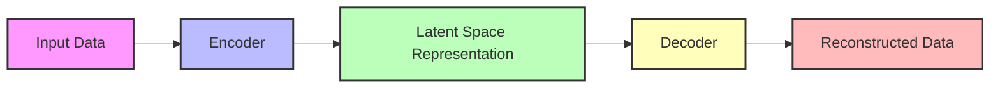

### Variational Autoencoders (VAEs)

**Question** : Describe the encoder and decoder networks in a VAE. What are their roles, and what do they output? What is the reparameterization trick, and why is it essential for training VAEs with gradient-based optimization? Illustrate with equations. Compare the training objective of VAEs with GANs. What does each optimize, and what are the implications for sample quality?

#### Video - Introduction to VAE - Martin Keen IBM
[Martin Keen LinkedIn](https://www.linkedin.com/in/martingkeen/)

<iframe width="560" height="315" src="https://www.youtube.com/embed/qiUEgSCyY5o?si=eBnuQZRL6nQRM2m3" title="YouTube video player" frameborder="0" allow="accelerometer; autoplay; clipboard-write; encrypted-media; gyroscope; picture-in-picture; web-share" referrerpolicy="strict-origin-when-cross-origin" allowfullscreen></iframe>

#### Video - Stanford CS229: Variational Autoencoders (VAEs) Anand Avati

**Introduction to Auto Encoders** 
1. Autoencoders 
2. Expectation Maximization (EM)
3. MCMC (Markov Chain Monte Carlo) Expectation Maximization
4. Variational Inference 
5. Variatoinal Expectation Maximization (VEM)
6. Variational Auto Encoders (VAE) 

<iframe width="560" height="315" src="https://www.youtube.com/embed/-TPFg-RG-KY?si=fb2t2si5nPlLRXpu" title="YouTube video player" frameborder="0" allow="accelerometer; autoplay; clipboard-write; encrypted-media; gyroscope; picture-in-picture; web-share" referrerpolicy="strict-origin-when-cross-origin" allowfullscreen></iframe>

#### Video - CMU CS 15-418/618: Variational Autoencoders (VAEs) 1 

<iframe width="560" height="315" src="https://www.youtube.com/embed/LzEywGCT7-A?si=_UqVNfdg0_Gdz8r9" title="YouTube video player" frameborder="0" allow="accelerometer; autoplay; clipboard-write; encrypted-media; gyroscope; picture-in-picture; web-share" referrerpolicy="strict-origin-when-cross-origin" allowfullscreen></iframe>

#### Video - CMU CS 15-418/618: Variational Autoencoders (VAEs) 2

<iframe width="560" height="315" src="https://www.youtube.com/embed/CREGwW63VMw?si=-CCrKeAS6YIICzF7" title="YouTube video player" frameborder="0" allow="accelerometer; autoplay; clipboard-write; encrypted-media; gyroscope; picture-in-picture; web-share" referrerpolicy="strict-origin-when-cross-origin" allowfullscreen></iframe>

#### Introduction : 

Autoencorders are unsupervised neural networks that learn to compress data into a lower-dimensional representation and then reconstruct the original data from this representation. They consist of two main components: an **encoder and a decoder**.

#### Tushar Kumar's Explanation of VAE

https://www.linkedin.com/in/tushar-kumar-40299b19/

<iframe width="560" height="315" src="https://www.youtube.com/embed/1RPdu_5FCfk?si=UzBTEyfJcRTDvqE2" title="YouTube video player" frameborder="0" allow="accelerometer; autoplay; clipboard-write; encrypted-media; gyroscope; picture-in-picture; web-share" referrerpolicy="strict-origin-when-cross-origin" allowfullscreen></iframe>
