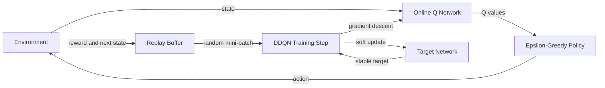
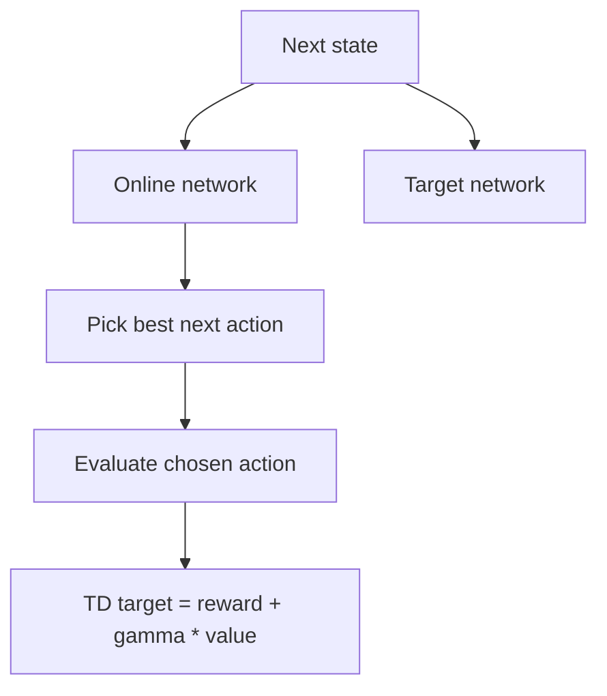
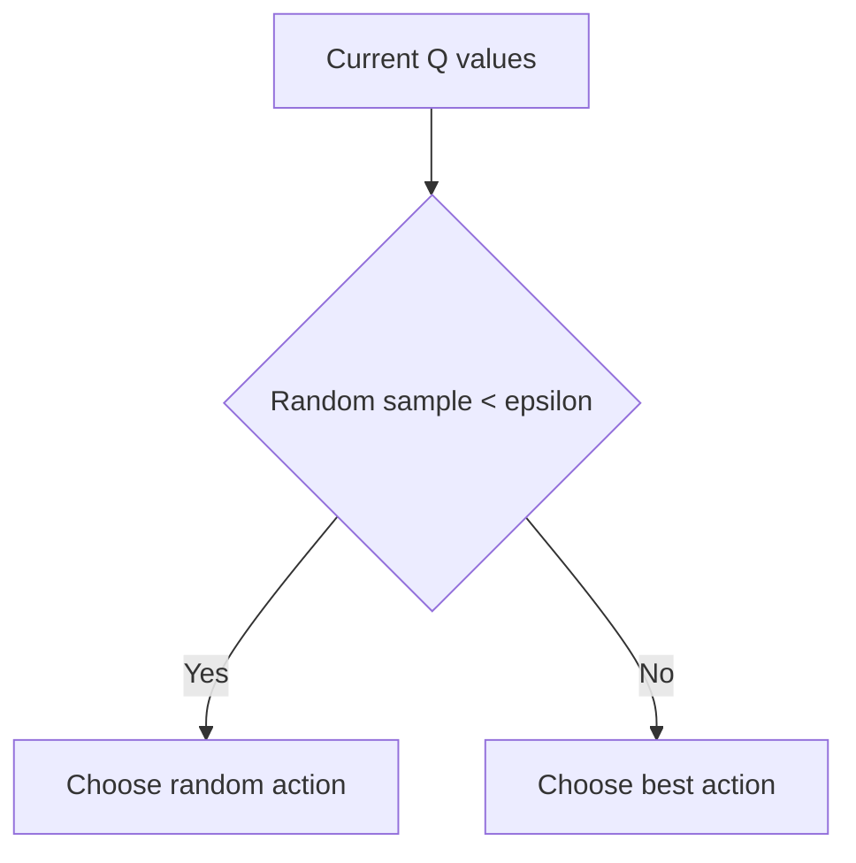

# Lunar Lander DDQN Walkthrough

This document explains [`lunar_lander5_ddqn_prioritized_replay.py`](./lunar_lander5_ddqn_prioritized_replay.py) as a webinar script: first the full story, then the code-level details.

## Executive Summary

This script trains an agent to land a Lunar Lander in the `Gymnasium` environment using the DQN family of methods.

At a high level, the agent does four things repeatedly:

1. Observes the current environment state.
2. Chooses an action using epsilon-greedy exploration.
3. Stores the experience in a replay buffer.
4. Trains a neural network from sampled mini-batches while slowly updating a target network.

The important idea is not just "use a neural network." The important idea is the training loop design:

1. Replay buffer breaks the correlation between consecutive experiences.
2. Epsilon-greedy ensures exploration early and exploitation later.
3. A target network makes learning less unstable.
4. The target is computed in a Double DQN style, where action selection and action evaluation are separated.

One important correction: despite the filename, this script does **not** implement prioritized replay. It uses a plain random replay buffer. Also, there is a subtle bug in the optimizer wiring that I explain later.

## End-to-End Story

If you want to narrate this as a webinar, this is the clearest story arc:

The environment gives the agent an 8-dimensional state vector describing the lander. The online Q-network converts that state into 4 Q-values, one for each action. The agent does not always take the best action, because early in training it needs to explore. So it uses epsilon-greedy action selection: mostly random at first, increasingly greedy over time.

Every transition `(state, action, reward, next_state, done)` is stored in a replay buffer. Once the buffer has enough data, the code samples a random batch and learns from it. The learning target is built using the online network to choose the next action and the target network to evaluate that action. That is the Double DQN pattern.

Training happens step by step, but the output is judged episode by episode. After each episode, the code prints a status such as `Crashed`, `Improving`, `Landed`, or `Solved`, logs the result to CSV, and finally plots the reward trend and reward histogram.

## Concept Map



## What the Script Actually Implements

The filename says "prioritized replay", but the code implements the following instead:

1. A standard experience replay buffer with uniform random sampling.
2. A Double DQN target calculation.
3. A soft-updated target network.
4. Epsilon-greedy exploration with exponential decay.

So the best description of this file is:

`DQN + replay buffer + epsilon-greedy + target network + Double DQN target`

That is the correct mental model for the code as written.

## What Each Piece Is For

### 1. The Q-network

The model in [`q_network.py`](./q_network.py) maps an 8-dimensional state to 4 Q-values, one per action.

For Lunar Lander, the action space is:

1. Do nothing
2. Fire left engine
3. Fire main engine
4. Fire right engine

The state vector contains:

1. `x`
2. `y`
3. `x_dot`
4. `y_dot`
5. `angle`
6. `angular_velocity`
7. `left_leg_contact`
8. `right_leg_contact`

### 2. The replay buffer

The replay buffer stores past transitions and samples them randomly.

This matters because sequential game frames are highly correlated. If we trained only on the latest experience, the network would chase local patterns instead of learning robust Q-values.

### 3. The target network

The target network is a delayed copy of the online network. It changes slowly, which stabilizes the bootstrapped target.

Without it, the network would be trying to learn from a target that moves too quickly because the target is computed from the same model being updated.

### 4. Double DQN target logic

The script separates:

1. Action selection with the online network.
2. Value evaluation with the target network.

That reduces overestimation bias compared with vanilla DQN.

## Double DQN Target

The key target equation in the script is:

```text
next_actions = online_network(next_states).argmax(1)
next_q_values = target_network(next_states).gather(1, next_actions)
target_q_values = rewards + GAMMA * next_q_values * (1 - dones)
```

That means:

1. Use the online network to pick the next action.
2. Use the target network to score that chosen action.
3. Add the immediate reward and discount the future value.



This is different from vanilla DQN.

In vanilla DQN, the target would use `max` directly from the target network:

`y = r + gamma * max_a Q_target(s', a)`

In Double DQN, selection and evaluation are split:

`a* = argmax_a Q_online(s', a)`

`y = r + gamma * Q_target(s', a*)`

That separation is the core idea.

## File Walkthrough

### Imports and setup

The script begins by importing `gymnasium`, `torch`, plotting utilities, and a few standard library modules.

The important imports are:

1. `gymnasium` for the environment.
2. `torch` and `torch.nn` for the neural network and optimization.
3. `random` and `math` for epsilon-greedy action selection.
4. `matplotlib` and `numpy` for reward plots.
5. `csv`, `os`, `sys`, and `atexit` for logging and output files.

### Hyperparameters

The core training constants are:

1. `GAMMA = 0.99`
2. `LR = 1e-4`
3. `NUM_EPISODES = 100`
4. `batch_size = 64`
5. `replay_buffer = ReplayBuffer(capacity=10000)`
6. `tau = 0.001`

Interpretation:

1. `GAMMA` controls how much future reward matters.
2. `LR` sets the optimizer step size.
3. `batch_size` controls how many samples are used per gradient step.
4. Replay capacity limits memory usage.
5. `tau` is meant to control how fast the target network tracks the online network.

## Important Implementation Note

The script creates this object:

```python
q_network = QNetwork(8, 4)
optimizer = torch.optim.Adam(q_network.parameters(), lr=LR)
```

But the training loop actually uses `online_network`, not `q_network`.

That means the optimizer is attached to a network that is never used in the forward pass, while the network that produces the Q-values is not the one being optimized.

In practical terms, this is a bug. The intended version should probably optimize `online_network.parameters()`.

This is worth mentioning in the webinar because it is a good example of how a model can look correct structurally while still being wired incorrectly.

## Logging and Artifact Generation

### `Tee`

The `Tee` class duplicates output to multiple streams.

It lets the script print to the console and write the same text to a log file at the same time.

### `setup_console_file_logging()`

This function:

1. Creates a timestamped log file.
2. Redirects `sys.stdout` and `sys.stderr` to a `Tee`.
3. Restores the original streams at exit.

This is not part of the RL algorithm, but it is useful for experiment tracking.

### CSV logging

The script also writes episode summaries into a CSV file containing:

1. Episode number
2. Duration in steps
3. Total reward
4. Episode status label
5. Total steps seen so far

That makes it easy to compare runs later.

## Action Selection

The `select_action()` function implements exponentially decayed epsilon-greedy exploration.

```python
epsilon = end + (start - end) * math.exp(-step / decay)
```

Then the action is selected as follows:

1. With probability `epsilon`, choose a random action.
2. Otherwise, choose the action with the maximum Q-value.



Why this matters:

1. High epsilon early in training encourages exploration.
2. Low epsilon later in training encourages exploiting learned knowledge.
3. The decay schedule makes the transition smooth.

## Episode Flow

The environment loop is the heart of the script.

```mermaid
sequenceDiagram
    participant Env as LunarLander-v3
    participant Online as Online Q-Network
    participant Buffer as Replay Buffer
    participant Target as Target Network
    participant Opt as Optimizer

    Env->>Online: current state s
    Online->>Env: Q(s,a)
    Env->>Buffer: store (s,a,r,s',done)
    Buffer->>Opt: sample mini-batch
    Opt->>Online: compute predicted Q-values
    Online->>Target: choose next action a*
    Target->>Opt: evaluate Q(s', a*)
    Opt->>Online: backpropagate loss
    Opt->>Target: soft update with tau
```

## Code-Level Walkthrough

### `update_target_network()`

This function performs a soft update:

```python
target = tau * online + (1 - tau) * target
```

That means the target network does not jump all at once. It drifts toward the online network in small increments.

This is usually more stable than copying weights only occasionally.

### `describe_episode()`

This helper converts the episode reward into a human-friendly label:

1. `Timeout`
2. `Solved`
3. `Landed`
4. `Improving`
5. `Stabilizing`
6. `Crashed`

This function is presentation logic. It does not affect learning.

### `plot_rewards()`

At the end of training the code makes two plots:

1. A reward-over-episodes line plot with a fitted linear trend.
2. A histogram showing the distribution of episode rewards.

These plots are useful because one number per episode is hard to interpret by itself. Trends and spread are much easier to explain on a slide.

## Training Loop

The actual training loop starts at the environment creation and runs for `NUM_EPISODES`.

For each episode:

1. Reset the environment.
2. Initialize episode counters.
3. Repeatedly choose an action, step the environment, and store the transition.
4. If the replay buffer has enough data, sample a batch and train.
5. Accumulate reward until the episode ends.
6. Log the episode summary.

The core per-step logic is:

```python
q_values = online_network(state)
action = select_action(q_values, total_steps, start=0.9, end=0.05, decay=1000)
next_state, reward, terminated, truncated, _ = env.step(action)
replay_buffer.push(state, action, reward, next_state, done)
```

Then, once the buffer has enough samples:

```python
states, actions, rewards, next_states, dones = replay_buffer.sample(batch_size)
q_values = online_network(states).gather(1, actions).squeeze(1)
```

This line is important:

1. `online_network(states)` returns all action values for each state.
2. `.gather(1, actions)` selects the value of the action that was actually taken.
3. `.squeeze(1)` turns the result into a 1D batch of predicted Q-values.

The target is then built without gradients:

```python
with torch.no_grad():
    next_actions = online_network(next_states).argmax(1).unsqueeze(1)
    next_q_values = target_network(next_states).gather(1, next_actions).squeeze(1)
    target_q_values = rewards + GAMMA * next_q_values * (1 - dones)
```

That is the Double DQN update.

Then the script computes the loss:

```python
loss = nn.MSELoss()(target_q_values, q_values)
```

and performs a standard optimizer step.

## Shape Intuition

For a batch of size 64:

1. `states` has shape `[64, 8]`
2. `online_network(states)` has shape `[64, 4]`
3. `actions` has shape `[64, 1]`
4. `gather(1, actions)` returns `[64, 1]`
5. `squeeze(1)` turns it into `[64]`

That shape story is important because Q-learning code often fails silently if the tensor dimensions are wrong.

## What This Script Gets Right

1. It uses experience replay.
2. It uses a target network.
3. It uses epsilon-greedy exploration.
4. It uses a Double DQN-style target.
5. It logs progress and plots results.

## What Needs Attention

There are two important issues in the current file:

1. The filename says prioritized replay, but the code uses ordinary random sampling.
2. The optimizer is attached to `q_network`, while the training loop uses `online_network`.

If the goal is to train correctly, the optimizer wiring should be fixed.

## Suggested Webinar Narrative

If you want a clean spoken flow, use this order:

1. Start with the agent-environment loop.
2. Explain why replay is needed.
3. Explain why epsilon-greedy is needed.
4. Introduce the target network for stability.
5. Explain the Double DQN target as "select with one network, evaluate with another."
6. Show the logging and plotting as the experiment’s evidence trail.
7. End by pointing out the two implementation mismatches in the script.

That ending is valuable because it teaches not only the algorithm, but also how to read training code critically.

## Final Takeaway

This script is a compact RL training pipeline for Lunar Lander. Its core idea is simple but powerful:

1. Observe.
2. Act.
3. Store experience.
4. Sample randomly from memory.
5. Train on stable targets.
6. Repeat until performance improves.

The code is close to a full DDQN training setup, but it is not actually prioritized replay, and it contains one wiring bug that should be corrected before using it as a reference implementation.
