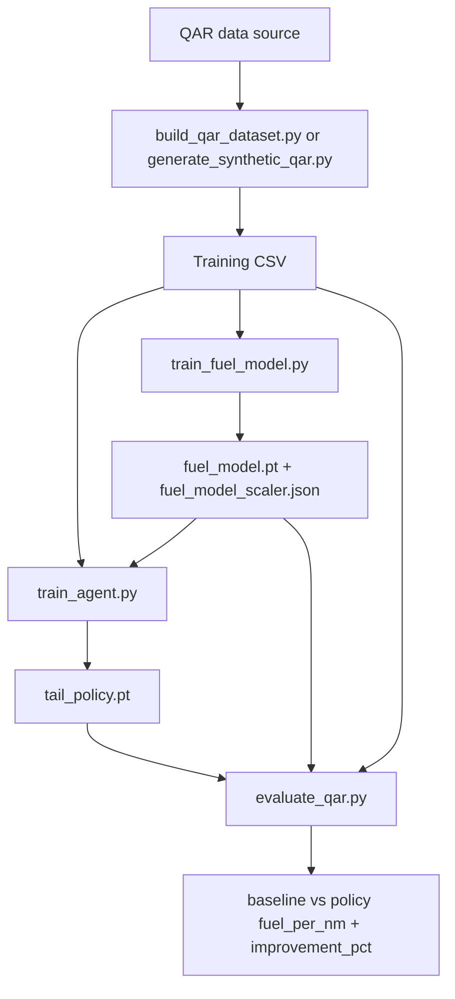
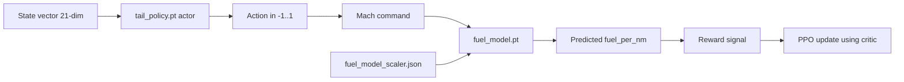
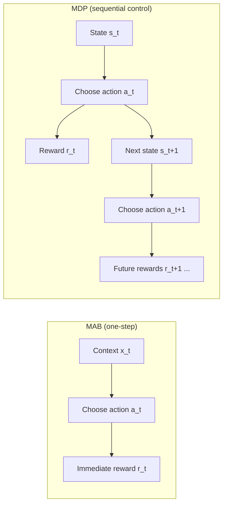
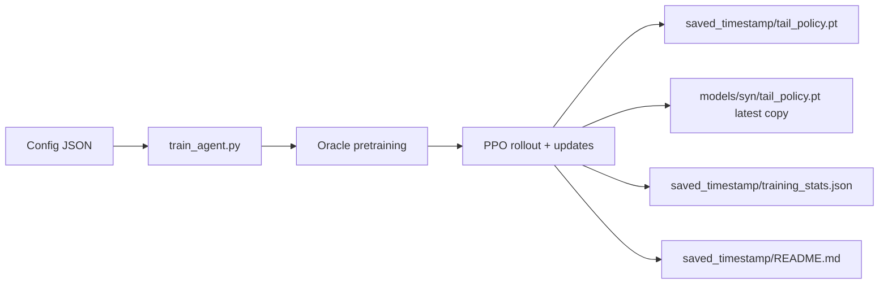

id: mach-predictor-codelab
summary: Mach optimization with DRL + learned fuel model
categories: ml, reinforcement-learning
tags: drl, ppo, aviation, qar
status: draft
authors: Samrat Kar

# Aircraft Mach Optimization using DRL

This project trains a PPO policy to recommend cruise Mach for a B737-800 with the objective of reducing fuel per nautical mile (kg/NM).

The reward model in `AircraftEnv` can use:
- a learned supervised fuel model (`train_fuel_model.py` output), or
- a physics fallback model when fuel model files are missing.

## Big Picture

`train_fuel_model.py` is the bridge between QAR records and PPO reward quality:
- It learns fuel-per-NM from QAR state features.
- It exports model + scaler artifacts.
- `train_agent.py` loads those artifacts to compute fuel burn during RL rollouts.

If these artifacts are not found at config paths, `train_agent.py` falls back to physics-based fuel flow.



## How `train_fuel_model.py` Is Used by the Agent

### 1) Fuel model training
`train_fuel_model.py` uses QAR columns:
- Inputs (17 features): altitude, weight, temperature, speed, mach, controls, geospatial/time fields.
- Target: `fpn = (selectedFuelFlow1 + selectedFuelFlow2) / groundAirSpeed`.

Outputs:
- `fuel_model.pt` (MLP: `17 -> 64 -> 64 -> 1`)
- `fuel_model_scaler.json` (feature mean/std + target normalization)

### 2) Agent training
`train_agent.py` reads config keys:
- `fuel_model_path`
- `fuel_model_scaler_path`
- `qar_data_path`

At runtime:
- If both fuel files exist, env uses `_fuel_flow_from_model(...)`.
- If missing, env uses physics `_fuel_flow_model(...)`.

### 3) Evaluation
`evaluate_qar.py` compares:
- baseline: fuel model at recorded Mach
- policy: fuel model at RL-recommended Mach

## Core Artifacts and How They Connect

### Artifact meanings

| Artifact | Created by | What it contains | Used by | Why it matters |
|---|---|---|---|---|
| `models/syn/fuel_model.pt` | `train_fuel_model.py` | Neural network weights/biases for supervised fuel model (`17 -> 64 -> 64 -> 1`) | `train_agent.py`, `evaluate_qar.py` via `AircraftEnv` | Gives learned fuel prediction from QAR-like state + Mach |
| `models/syn/fuel_model_scaler.json` | `train_fuel_model.py` | Input normalization (`mean/std`) and target de-normalization (`y_mean/y_std`) | `AircraftEnv._fuel_flow_from_model` | Keeps inference numerically consistent with training |
| `models/syn/tail_policy.pt` | `train_agent.py` | PPO `ActorCritic` weights (actor + critic in one state dict) | `predict_mach.py`, `evaluate_qar.py`, further training/eval | Produces Mach action from state |

### Important clarification
- `fuel_model_scaler.json` is **not** NN weights.
- NN weights are in `fuel_model.pt`.
- `tail_policy.pt` stores **two neural networks** in one file:
  - actor (action policy)
  - critic (value estimator for PPO updates)

### Code-level implementation map

| Concept | File | Implementation |
|---|---|---|
| Fuel model architecture | `train_fuel_model.py` | `nn.Sequential(Linear(17,64), ReLU, Linear(64,64), ReLU, Linear(64,1))` |
| Fuel model target | `train_fuel_model.py` | `fpn = (selectedFuelFlow1 + selectedFuelFlow2) / groundAirSpeed` |
| Scaler write | `train_fuel_model.py` | writes JSON keys: `mean`, `std`, `target`, `y_mean`, `y_std` |
| Scaler read/use | `aircraft_env.py` | `_fuel_flow_from_model`: normalize `x`, run model, de-normalize `fpn`, convert to fuel flow |
| Policy architecture | `train_agent.py` | `ActorCritic`: actor MLP + critic MLP |
| Policy output to Mach | `aircraft_env.py` | `mach = 0.78 + action * 0.08`, clipped to `[0.70, 0.86]` |
| Timestamped run outputs | `train_agent.py` | saves to `output_parent/saved_YYYYMMDD_HHMMSS/` + copies latest to `output_model_path` |

### Runtime dataflow inside environment



### Detailed inference steps for fuel model
1. Build raw feature vector `x` (17 fields) in `AircraftEnv._fuel_flow_from_model`.
2. Load scaler stats from `fuel_model_scaler.json`.
3. Normalize: `x_n = (x - mean) / std`.
4. Run `fuel_model.pt` to get normalized prediction.
5. De-normalize: `fpn = pred * y_std + y_mean`.
6. Convert to flow: `fuel_flow_kg_hr = fpn * ground_speed`.

## Oracle, Oracle Pretraining, and PPO

### What is the oracle in this project?

In this repo, the oracle is not a separate ML model.  
It is an optimizer-based teacher implemented in `AircraftEnv._oracle_mach()`.

For the current state, `_oracle_mach()`:
1. Defines an objective `f(mach) = fuel_per_nm` for that state.
2. Evaluates fuel via:
   - learned fuel model path (`_fuel_flow_from_model`) when fuel model artifacts are available, or
   - physics fallback (`_fuel_flow_model`) otherwise.
3. Runs golden-section search on Mach in `[mach_min, mach_max]` to find the minimum.

Output: the Mach value that approximately minimizes fuel-per-NM for that state.

### What is oracle pretraining?

Oracle pretraining is a supervised warm-start step before PPO.

Implemented in `train_agent.py`:
1. Sample states from `env.reset()`.
2. Compute oracle Mach from `env._oracle_mach()`.
3. Convert oracle Mach to normalized action space:
   - `target_action = (oracle_mach - 0.78) / 0.08`
4. Train actor with MSE loss to imitate target action.

Purpose:
- Start policy near a strong baseline.
- Reduce unstable random exploration early in RL.
- Improve sample efficiency and convergence behavior for PPO.

### What is PPO?

PPO (Proximal Policy Optimization) is an on-policy actor-critic algorithm.

In this project:
- Actor network outputs action distribution parameters (Mach command in normalized space).
- Critic network estimates state value.
- Training alternates between:
  1. collecting rollouts from current policy,
  2. computing advantages/returns,
  3. optimizing clipped PPO objective for multiple epochs.

Core PPO idea: limit overly large policy updates with ratio clipping:
- `r_t = pi_theta(a_t|s_t) / pi_theta_old(a_t|s_t)`
- optimize `min(r_t * A_t, clip(r_t, 1-eps, 1+eps) * A_t)`

This keeps updates stable while still improving policy performance.

### Literature

Primary references:
- Schulman et al., *Proximal Policy Optimization Algorithms*, 2017. (`arXiv:1707.06347`)
- Schulman et al., *High-Dimensional Continuous Control Using Generalized Advantage Estimation*, 2015. (`arXiv:1506.02438`)
- Sutton and Barto, *Reinforcement Learning: An Introduction* (2nd ed.), 2018.

Related context:
- Silver et al., *Deterministic Policy Gradient Algorithms*, 2014. (continuous-control policy gradient baseline)
- Lillicrap et al., *Continuous Control with Deep Reinforcement Learning* (DDPG), 2015.

## MDP vs MAB (Why this problem is MDP)

### Definitions
- MAB (Multi-Armed Bandit):
  - You choose an action, get an immediate reward, and there is no state transition that matters for future decisions.
  - Each decision is effectively independent from the next.
- MDP (Markov Decision Process):
  - You choose an action in a state, get reward, and the action influences the next state.
  - Future rewards depend on current actions through state evolution.

### Why this project is not a pure MAB
This task is not just "pick Mach, get one reward, done." In `AircraftEnv`, each action affects later steps:
- Fuel burn changes aircraft weight (`weight_{t+1} = weight_t - burn * dt`), which changes future drag and fuel-optimal Mach.
- Altitude evolves by phase (climb/cruise/descent), and phase can change over time.
- Wind, temperature deviation, and turbulence evolve across steps (AR-like processes).
- Regime can flip mid-episode (nominal/degraded), changing future fuel behavior.

Because these transitions carry information and constraints into future decisions, the agent must optimize a sequence of actions, not isolated one-step choices.

### Concrete example in this codebase
1. At time `t`, agent picks higher Mach to gain short-term benefit.
2. That raises fuel flow now.
3. Higher burn reduces weight for future steps, but also changes subsequent aerodynamics and reward balance.
4. Meanwhile wind/temp/turbulence evolve, so best Mach at `t+1` depends on both environment drift and what happened at `t`.

This coupling across time is exactly MDP structure.

### Why PPO (MDP algorithm) instead of a bandit method
- PPO uses value estimation and advantage over trajectories, which is useful when actions influence future states/rewards.
- A bandit method would ignore transition dynamics and long-horizon tradeoffs, losing important signal in this environment.

### Flow comparison (MAB vs MDP)



## Current Training Flow (Implementation-Synced)



`train_agent.py` now saves model artifacts into a timestamped folder under the configured output parent:
- Example: `models/syn/saved_YYYYMMDD_HHMMSS/`
- It also copies latest policy to the configured `output_model_path`.

## Project Structure

- `aircraft_env.py`: RL environment + fuel modeling paths.
- `build_qar_dataset.py`: builds `data/qar_737800_cruise.csv` from external field QAR folder.
- `generate_synthetic_qar.py`: creates `data/qar_737800_synthetic.csv` with QAR-like schema.
- `train_fuel_model.py`: trains supervised fuel model (`.pt` + scaler JSON).
- `train_agent.py`: trains PPO policy and saves timestamped run artifacts.
- `evaluate_qar.py`: policy-vs-baseline evaluation with optional JSON report.
- `predict_mach.py`: single-condition inference helper.
- `configs/`: training configs (golden and synthetic variants).

## Configs

- Golden: `configs/approach_expanded_fuel_model_golden.json`
- Synthetic: `configs/approach_expanded_fuel_model_syn.json`

Key fields used by `train_agent.py`:
- `qar_data_path`
- `fuel_model_path`
- `fuel_model_scaler_path`
- `output_model_path`
- PPO hyperparameters (`learning_rate`, `gamma`, `eps_clip`, etc.)

## Commands

### A) Build/refresh synthetic QAR
```bash
python generate_synthetic_qar.py --field_csv data/qar_737800_cruise.csv --output_csv data/qar_737800_synthetic.csv
```

### B) Train supervised fuel model (synthetic path)
```bash
python train_fuel_model.py --input_csv data/qar_737800_synthetic.csv --model_path models/syn/fuel_model.pt --scaler_path models/syn/fuel_model_scaler.json --sample_rows 120000 --epochs 30
```

### C) Train PPO agent (uses config paths)
```bash
python train_agent.py --config configs/approach_expanded_fuel_model_syn.json
```

### D) Evaluate policy
```bash
python evaluate_qar.py --input_csv data/qar_737800_synthetic.csv --policy_path models/syn/tail_policy.pt --fuel_model_path models/syn/fuel_model.pt --fuel_scaler_path models/syn/fuel_model_scaler.json --sample_rows 20000 --results_json models/syn/results.json
```

## Notes on Current Behavior

- `train_agent.py` does not run `train_fuel_model.py` automatically. Train fuel model first or ensure config points to existing artifacts.
- If `qar_data_path` does not exist, `train_agent.py` falls back to `data/Tail_X1.csv`, otherwise random initialization.
- `evaluate_qar.py` accepts either:
  - a single CSV (`--input_csv`), or
  - directory scan (`--data_root`) for files containing required raw QAR columns.
- `train_fuel_model.py` and `evaluate_qar.py` now support CLI arguments and are free of merge-conflict markers.

## Example Published Synthetic Result

From `models/syn/saved_20260222_115249/results.json`:
- `qar_rows`: `20000`
- `baseline_fuel_per_nm`: `12.25299747494486`
- `policy_fuel_per_nm`: `11.94069350943155`
- `improvement_pct`: `2.5487964569642076`
