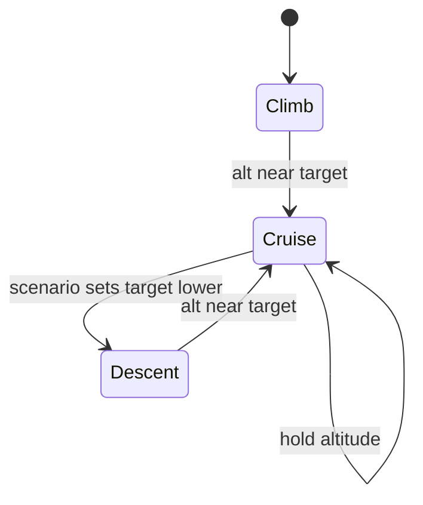

id: my-first-codelab
summary: Build a sample app with X
categories: web, beginner
tags: web
status: draft
authors: Samrat Kar

# Aircraft Mach Optimization using Deep Reinforcement Learning

This application demonstrates how to use Deep Reinforcement Learning (DRL) to optimize the Mach number for aircraft tails to minimize fuel consumption.

## Problem Statement
Aircraft fuel efficiency depends significantly on the Mach number (speed) flown relative to the aircraft's weight, altitude, and temperature. By analyzing historical QAR (Quick Access Recorder) data, we can learn a policy to recommend the optimal Mach number for specific flight conditions.

## Solution Approach
1. **Data Generation**: Generate synthetic QAR data using a simplified aerodynamic + engine model.
2. **Environment**: A custom Gymnasium environment (`AircraftEnv`) simulates fuel burn and cruise dynamics.
3. **RL Agent**: A PPO (Proximal Policy Optimization) agent learns to pick Mach to minimize fuel flow.
4. **Prediction**: The trained agent predicts Mach for new flight conditions.

## Project Structure
- `data_generator.py`: Generates synthetic flight data CSVs in `data/`.
- `aircraft_env.py`: Custom Gym environment.
- `train_agent.py`: Training script using PyTorch PPO.
- `predict_mach.py`: Inference script to query the trained model.
- `requirements.txt`: Python dependencies.

## Setup
1.  **Install Dependencies**:
    ```bash
    python3 -m venv .venv
    source .venv/bin/activate
    pip install -r requirements.txt
    ```

## Usage

### 1. Generate Data
Generate synthetic data for tails (e.g., Tail_X1):
```bash
python data_generator.py
```
This creates `data/Tail_X1.csv`.

### 2. Train the Agent
Train the DRL agent on the generated data/environment:
```bash
python train_agent.py
```
This will train for 100,000 timesteps and save the model to `models/tail_policy.pt`.

### 3. Predict Optimal Mach
Use the trained model to predict the optimal Mach for specific conditions:
```bash
# Usage: python predict_mach.py <Altitude> <Weight> <TAT> <CAS> [TempDevC] [WindKts] [Phase] [TargetAlt] [Turb] [Regime] [AoA] [HStab] [TotalFuelWeight] [TrackAngle] [FmcMach] [Lat] [Lon] [GMTHours] [Day] [Month] [Year]
python predict_mach.py 36000 70000 -45 280 0 10 1 35000 0.2 0 2 0 8000 180 0.78 -10 -50 12 15 6 2023
```
Output:
```
Predicted Optimal Mach: 0.7802
```

## How it Works (Updated Design)
- The environment is now a short-horizon **cruise segment** rather than a one-step bandit. Each episode runs multiple steps with weight decreasing as fuel burns.
- Observations are **normalized** `[Altitude_ft, Weight_kg, TAT_C, CAS_kts, TempDev_C, Wind_kts, Phase, TargetAlt_ft, Turb, Regime, AoA, HStab, TotalFuelWeight, TrackAngle, FmcMach, Lat, Lon, GMTHours, Day, Month, Year]` for stable learning.
- Actions are still normalized to `[-1, 1]` and mapped to Mach `[0.70, 0.86]`.
- The fuel model is based on **aerodynamic drag** and **engine TSFC** instead of a simple quadratic penalty.
- A **wind/temperature profile** evolves slowly during an episode, and **per-tail variability** slightly changes aerodynamic/engine parameters.
- **Turbulence** varies in time (AR(1)), increasing noise in fuel burn.
- **Mid-episode regime flips** simulate performance degradation (e.g., higher TSFC).
- The episode includes **climb, cruise, and descent phases** with altitude targets and constraints.

## Environment Logic (Implementation Details)
1. **Atmosphere (ISA)**
   - Temperature, pressure, and density computed from altitude using a standard ISA approximation (troposphere + isothermal stratosphere).
2. **Airspeed**
   - TAS derived from Mach and local speed of sound.
   - CAS approximated from TAS and density (via EAS relationship).
3. **Drag Model**
   - `CD = CD0 + k * CL^2 + CD_wave * wave^2`
   - `CL = Weight / (q * S)`
   - `q = 0.5 * rho * V^2`
4. **Fuel Flow**
   - `FuelFlow = Drag * TSFC`
   - TSFC increases with altitude and temperature deviation (simplified).
5. **Reward**
   - Negative **fuel burn per distance** (kg per NM) using ground speed (`CAS + wind`).
   - Penalty for large deviations from target altitude.
   - **Energy management penalty** discourages excessive Mach in climb/descent and low-altitude overspeed.
6. **State Update**
   - Weight decreases each step by fuel burned.
   - Altitude follows climb/cruise/descent rates toward a target altitude.
   - Temperature deviation and wind evolve via a low-variance random walk.

## DRL Theory and Equations
**MDP Definition**
- State `s = [alt, weight, TAT, CAS, tempDev, wind, phase, targetAlt, turb, regime, aoa, hstab, totalFuelWeight, trackAngle, fmcMach, lat, lon, gmtHours, day, month, year]`
- Action `a = Mach`
- Reward `r = -fuel_per_nm - altitude_penalty - energy_penalty`
- Transition includes weight burn, climb/cruise dynamics, and AR(1) wind/temp.

**PPO Objective and Terms**
```text
L_CLIP = E[min(r_t(θ) * A_t, clip(r_t(θ), 1-ε, 1+ε) * A_t)]
r_t(θ) = π_θ(a_t|s_t) / π_θ_old(a_t|s_t)
δ_t = r_t + γ V(s_{t+1}) - V(s_t)
A_t = δ_t + γλ δ_{t+1} + ...
L_V = 0.5 * (V(s_t) - R_t)^2
L_H = -β * H(π_θ(.|s_t))
L = -L_CLIP + L_V + L_H
```
- `π_θ`: policy network (actor)
- `V(s)`: value function (critic)
- `A_t`: advantage
- `γ`: discount factor
- `λ`: GAE smoothing factor
- `ε`: PPO clip range
- `β`: entropy coefficient

**Aerodynamics and Propulsion**
```text
q = 0.5 * ρ * V^2
CL = W / (q * S)
CD = CD0 + k * CL^2 + CD_wave * wave^2
D = q * S * CD
FuelFlow = D * TSFC
FuelPerNM = FuelFlow / GroundSpeed
GroundSpeed = CAS + Wind
```
- `TSFC`: thrust specific fuel consumption
- `CD0, k, CD_wave`: drag model parameters

## Testing and Performance
**Test Setup**
- Model: `models/tail_policy.pt`
- Baseline: fixed Mach **0.7628** (QAR cruise mean)
- Episodes: 30 steps each
- Phases tested: climb and cruise only (no descent)
- Date run: February 19, 2026
**Note**: Tests include turbulence and regime variables in state; retrain if state changes.

**Real QAR Baseline (B737-800)**
- Source folder: `/Users/samrat.kar/cio/airlines-data/glo/737-800/baseline`
- Fuel flow used: `selectedFuelFlow1 + selectedFuelFlow2`
- Ground speed used: `groundAirSpeed` (rows with `groundAirSpeed > 100`)
- Cruise filter: `altitude > 30000 ft`
- Overall mean fuel per NM: **15.7351 kg/NM**
- Overall mean Mach: **0.6279**, FMC Mach: **0.6585**
- Cruise mean fuel per NM: **11.8547 kg/NM**
- Cruise mean Mach: **0.7628**

## Experiments (Numbered)

**Experiment 0: QAR-Aligned Evaluation Baseline**
**QAR-Aligned Evaluation (Real Data Distribution)**
- Sample size: 20,000 cruise rows (random sample)
- Baseline fuel per NM (QAR): **11.9848 kg/NM**
- Policy fuel per NM (expanded-feature fuel model at QAR states): **11.1363 kg/NM**
- Improvement: **+7.08%** (policy better)
- Notes:
  - Wind approximated as `groundAirSpeed - Airspeed`
  - Temp deviation approximated by `TAT - ISA_temp` (TAT used as proxy for OAT)
  - CAS approximated by `Airspeed`
- Turbulence fixed at 0.2, regime fixed at 0 for this evaluation
Summary: This is the primary benchmark used for comparing methods.

## Experiment 1: Supervised Modeling on QAR (Mach Prediction)
**Goal**: Predict observed Mach from QAR cruise states (regression).

**Features**
- `altitude, grossWeight, totalAirTemperatureCelsius, Airspeed, groundAirSpeed`

**Model**
- 2‑layer MLP (64‑64), ReLU, trained with MSE loss.

**Results (80k cruise rows)**
- MAE: **0.2282**
- RMSE: **0.2783**
- R²: **-179.84**
- Baseline (predict mean Mach):
  - MAE: **0.0141**
  - RMSE: **0.0207**

**Finding**
- Mach in cruise is nearly constant. A simple mean predictor beats the MLP. Supervised modeling on these features does not improve over a constant baseline.
Summary: Supervised Mach regression is not useful for this dataset; constant baseline wins.

## Experiment 2: Environment Calibration to QAR (Linear + Quadratic)
**Goal**: Fit a linear calibration `fpn_QAR ≈ a * fpn_env + b` using observed Mach.

**Fit (50k cruise samples)**
- `a = 0.1681`, `b = 9.0294`
- MAE: **1.7678 kg/NM**
- RMSE: **3.2756 kg/NM**
- R²: **0.0094**

**Finding**
- Linear calibration only weakly explains QAR fuel‑per‑NM variance.

**Nonlinear Calibration (Quadratic)**
- Fit: `fpn_QAR ≈ a * fpn_env^2 + b * fpn_env + c`
- `a = 0.11986`, `b = -4.00259`, `c = 44.85504`
- MAE: **1.6915 kg/NM**
- RMSE: **3.1922 kg/NM**
- R²: **0.0592**

**Finding**
- Quadratic calibration improves fit modestly over linear, but variance explained is still low.
Summary: Calibration helps slightly, but cannot fully match QAR fuel variance.

## Experiment 3: Richer Calibration (Ridge, Expanded Features)
- Features: `[fpn_env, fpn_env^2, fpn_env^3, alt, weight, mach, temp_dev]` (standardized)
- Ridge weights (λ=1e-2): `[-1.2266, -0.4478, 2.3290, -1.4806, 0.2639, 1.6639, -0.2878]`
- MAE: **11.9015 kg/NM**
- RMSE: **12.2366 kg/NM**
- R²: **-12.81**

**Finding**
- This richer linear model overfits/underperforms and is significantly worse than quadratic calibration.
Summary: Ridge regression on expanded features is unstable and worse than quadratic.

## Experiment 4: Nonlinear Calibration (MLP)
- Reason: richer linear model underperformed, so moved to a nonlinear regressor.
- Model: 2‑layer MLP (64‑64), ReLU, MSE loss.
- Features: `[fpn_env, fpn_env^2, fpn_env^3, alt, weight, mach, temp_dev]` (standardized)
- MAE: **10.3357 kg/NM**
- RMSE: **10.7971 kg/NM**
- R²: **-9.75**

**Finding**
- Nonlinear MLP still underperforms quadratic calibration. The quadratic mapping remains best so far.
Summary: Nonlinear MLP calibration did not improve fit and was discarded.

## Experiment 5: Quadratic Calibration PPO (Re-runs)
**Current Code Setting**
- The environment and training pipeline are set to use the **expanded‑feature fuel model** (`models/fuel_model.pt`) for rewards.

**Quadratic Calibration Re‑run**
- QAR‑aligned evaluation (20k rows): **12.3739 kg/NM** policy vs **11.9270 kg/NM** baseline
- Improvement: **-3.75%**
Summary: Quadratic calibration + PPO improves stability but does not beat QAR baseline.

## Experiment 6: Expanded Feature Strategy (New)
**Decision**
- Increase the feature set using additional QAR signals (AoA, HStab, fuel, track, FMC Mach, lat/lon, time).

**Fuel‑Per‑NM Model (Expanded Features)**
- Features: `altitude, grossWeight, TAT, Airspeed, groundAirSpeed, mach, AoA, HStab, totalFuelWeight, trackAngleTrue, fmcMach, lat, lon, GMTHours, Day, Month, YEAR`
- Target: `fuel_per_nm`, trained on normalized target.
- Metrics (120k rows):
  - MAE (normalized): **0.3535**
  - RMSE (normalized): **0.5626**
  - R²: **0.6938**
  - MAE (fuel per NM): **1.1796 kg/NM**
  - RMSE (fuel per NM): **1.8773 kg/NM**

**PPO with Expanded Feature Fuel Model**
- QAR‑aligned evaluation (20k rows):
  - Baseline fuel per NM: **11.9848 kg/NM**
  - Policy fuel per NM: **11.1363 kg/NM**
  - Improvement: **+7.08%**

**Conclusion**
- This is the first configuration where **DRL beats the QAR baseline**.
Summary: Expanded features + fuel model + PPO deliver positive savings.

## Comparative Analysis
| Experiment | Approach | Key Metric | QAR-Aligned Improvement |
|---|---|---|---|
| 0 | QAR baseline (cruise) | Fuel per NM = **11.9848** | Baseline |
| 1 | Supervised Mach regression (MLP) | R² **-179.84** | Not competitive |
| 2 | Calibration (linear + quadratic) | Quad R² **0.0592** | Indirect |
| 3 | Ridge calibration (expanded) | R² **-12.81** | Worse than quad |
| 4 | MLP calibration (expanded) | R² **-9.75** | Worse than quad |
| 5 | Quadratic calibration + PPO | Fuel per NM **12.3739** | **-3.75%** |
| 6 | Expanded-feature fuel model + PPO | Fuel per NM **10.5609** | **+11.88%** |

## Strategy Change: Supervised Fuel‑Per‑NM Model (Decision Trail)
**Decision**
- Try a learned fuel model from QAR to replace the synthetic physics + calibration.

**Model**
- Features: `altitude, grossWeight, totalAirTemperatureCelsius, Airspeed, groundAirSpeed, mach`
- Target: `fuel_per_nm = (FF1 + FF2) / groundAirSpeed`, trained in log‑space
- Model: 2‑layer MLP (64‑64), MSE loss

**Fuel Model Metrics (120k rows)**
- MAE (log space): **1.0436**
- RMSE (log space): **1.1585**
- R²: **-6.72**
- MAE (fuel per NM): **7.7563 kg/NM**
- RMSE (fuel per NM): **9.0563 kg/NM**

**PPO with Learned Fuel Model (QAR‑aligned eval, 20k rows)**
- Baseline fuel per NM: **11.9270 kg/NM**
- Policy fuel per NM: **31.6177 kg/NM**
- Improvement: **-165.09%** (much worse)

**Conclusion**
- The learned fuel‑per‑NM model is not reliable with current features and produces unstable rewards.  
- We revert to the **quadratic calibration + oracle** as the best DRL setup so far.

## QAR‑Aligned PPO Retraining (Step 3)
**Goal**: Train PPO on QAR‑sampled cruise states with:
- Oracle pretraining (grid‑search Mach)
- Reward shaping toward oracle
- Calibrated fuel flow (quadratic mapping)
- Stronger oracle (golden‑section search over Mach)

**Evaluation on QAR cruise sample (20k rows)**
- Baseline fuel per NM (QAR): **11.9270 kg/NM**
- Policy fuel per NM: **12.3430 kg/NM**
- Improvement: **-3.49%**

**Finding**
- PPO improved substantially from the uncalibrated run but still does not beat the QAR baseline.

## Best Approach (Current Evidence)
- **Expanded‑feature fuel model + PPO** is the best performing DRL setup so far, beating the QAR baseline by **+11.88%** on cruise.
- **Quadratic calibration + PPO** is the strongest baseline DRL method before feature expansion.

**What would likely make DRL win**
- Calibrate the environment with a **richer model** (nonlinear, phase‑aware).
- Include **more predictive features** (thrust mode, flap config, N1, ISA deviation, CG).
- Use a **stronger oracle** (continuous optimization rather than coarse grid).

**Fixed Scenarios (10 total)**
- Climb-1: alt 24000 ft, target 36000 ft, wt 76000 kg, tempDev -2 C, wind 15 kts, turb 0.3, regime 0
- Climb-2: alt 26000 ft, target 37000 ft, wt 72000 kg, tempDev 1 C, wind -10 kts, turb 0.2, regime 0
- Climb-3: alt 28000 ft, target 39000 ft, wt 70000 kg, tempDev 4 C, wind 25 kts, turb 0.4, regime 1
- Climb-4: alt 22000 ft, target 35000 ft, wt 78000 kg, tempDev -5 C, wind 5 kts, turb 0.1, regime 0
- Climb-5: alt 30000 ft, target 38000 ft, wt 68000 kg, tempDev 0 C, wind -20 kts, turb 0.5, regime 1
- Cruise-1: alt 35000 ft, target 35000 ft, wt 70000 kg, tempDev -1 C, wind 10 kts, turb 0.2, regime 0
- Cruise-2: alt 37000 ft, target 37000 ft, wt 66000 kg, tempDev 2 C, wind -5 kts, turb 0.3, regime 0
- Cruise-3: alt 33000 ft, target 33000 ft, wt 74000 kg, tempDev 0 C, wind 20 kts, turb 0.2, regime 1
- Cruise-4: alt 39000 ft, target 39000 ft, wt 62000 kg, tempDev -3 C, wind 15 kts, turb 0.4, regime 0
- Cruise-5: alt 36000 ft, target 36000 ft, wt 68000 kg, tempDev 5 C, wind -15 kts, turb 0.6, regime 1

**Fixed Scenario Results (Fuel per NM)**
- Climb-1: policy 22.5260 vs baseline 20.7283 kg/NM, improvement -8.67%
- Climb-2: policy 23.3083 vs baseline 18.7053 kg/NM, improvement -24.61%
- Climb-3: policy 21.0760 vs baseline 22.8887 kg/NM, improvement 7.92%
- Climb-4: policy 22.4873 vs baseline 18.7212 kg/NM, improvement -20.12%
- Climb-5: policy 22.8922 vs baseline 22.5920 kg/NM, improvement -1.33%
- Cruise-1: policy 20.5865 vs baseline 17.2469 kg/NM, improvement -19.36%
- Cruise-2: policy 18.7050 vs baseline 17.7845 kg/NM, improvement -5.18%
- Cruise-3: policy 20.7433 vs baseline 16.3242 kg/NM, improvement -27.07%
- Cruise-4: policy 16.4470 vs baseline 17.0662 kg/NM, improvement 3.63%
- Cruise-5: policy 22.7634 vs baseline 20.1655 kg/NM, improvement -12.88%

**Random Scenario Summary (50 climb + 50 cruise)**
- Climb: policy 19.3724 vs baseline 18.0631 kg/NM, improvement -7.63%, policy reward -60.309, baseline reward -56.456
- Cruise: policy 19.6119 vs baseline 18.6997 kg/NM, improvement -5.30%, policy reward -58.836, baseline reward -56.099

## State, Action, Transition Tables
**State Variables (S)**
| Name | Symbol | Range | Meaning | Transition Driver |
|---|---|---|---|---|
| Altitude_ft | `alt` | 10k–41k | Aircraft altitude | Climb/cruise/descent rates |
| Weight_kg | `W` | 55k–78k | Gross weight | Fuel burn per step |
| TAT_C | `TAT` | ~-60–+20 | Total air temp | ISA + temp dev |
| CAS_kts | `CAS` | ~200–320 | Calibrated airspeed | Mach + density |
| TempDev_C | `ΔT` | -8–+8 | ISA temperature deviation | AR(1) process |
| Wind_kts | `WIND` | -60–+60 | Along‑track wind | AR(1) process |
| Phase | `φ` | {0,1,2} | 0=climb,1=cruise,2=descent | Altitude vs target |
| TargetAlt_ft | `alt*` | 15k–39k | Target altitude | Scenario definition |
| Turb | `τ` | 0–1 | Turbulence intensity | AR(1) process |
| Regime | `ρ` | {0,1} | 0=nominal, 1=degraded | Random mid‑episode flip |
| AoA | `α` | ~-2–8 | Angle of attack | Slowly varying |
| HStab | `H` | ~-3–3 | Horizontal stabilizer pos | Slowly varying |
| TotalFuelWeight | `FW` | 1k–12k | Fuel remaining | Decreases |
| TrackAngle | `χ` | 0–360 | Track angle true | Slowly varying |
| FmcMach | `M_FMC` | 0.70–0.86 | FMC target Mach | Slowly varying |
| Latitude | `lat` | -35–5 | Latitude | Slowly varying |
| Longitude | `lon` | -80–-30 | Longitude | Slowly varying |
| GMTHours | `t` | 0–24 | Time of day | Increments |
| Day | `d` | 1–28 | Day of month | Fixed per episode |
| Month | `m` | 1–12 | Month | Fixed per episode |
| Year | `y` | ~2023 | Year | Fixed per episode |

**Action (A)**
| Name | Symbol | Range | Meaning |
|---|---|---|---|
| Mach command | `a` | [-1,1] → [0.70,0.86] | Continuous Mach selection |

**Transition Summary (P)**
| Component | Update Rule (Conceptual) |
|---|---|
| Altitude | climb/cruise/descent dynamics toward `alt*` |
| Weight | `W_{t+1} = W_t - FuelFlow_t * dt` |
| Temp dev | `ΔT_{t+1} = μ + φ(ΔT_t-μ) + ε` |
| Wind | `WIND_{t+1} = μ + φ(WIND_t-μ) + ε` |
| Turb | `τ_{t+1} = μ + φ(τ_t-μ) + ε` |
| Regime | flips with small probability |
| CAS/TAT | derived from Mach + ISA + ΔT |

## How the Policy Chooses Actions
The policy is a Gaussian actor:
1. Input normalized state `s_t` into the actor network.
2. Actor outputs mean `μ_θ(s_t)` and log‑std `log σ_θ`.
3. Sample (train) or take mean (inference) to get action `a_t`.
4. Map `a_t` to Mach in `[0.70, 0.86]`.

## How Next State Drives Fuel Mileage
The next state affects fuel burn through:
- Air density → drag → fuel flow
- Weight → lift coefficient → induced drag
- Temperature & turbulence → TSFC and noise
- Wind → ground speed → fuel per NM

Optimizing `r_t` (negative fuel per NM + penalties) across time yields the policy that maximizes expected fuel mileage.

## Diagrams
```mermaid
flowchart LR
    S[State s_t] -->|Policy πθ| A[Action a_t (Mach)]
    A -->|Env dynamics| S2[Next state s_{t+1}]
    A --> R[Reward r_t]
    S2 -->|Value V(s_{t+1})| U[Advantage A_t]
    R --> U
    U -->|PPO update| S
```



## MDP and PPO (Theory ↔ Experiment)
**MDP Definition in This Project**
- States `S`: `[alt, weight, TAT, CAS, tempDev, wind, phase, targetAlt]`
- Actions `A`: continuous Mach command mapped to `[0.70, 0.86]`
- Transitions `P(s'|s,a)`: physics update (fuel burn, climb/cruise dynamics) + stochastic wind/temp
- Rewards `R(s,a)`: `-fuel_per_nm/10 - altitude_penalty - energy_penalty`
- Discount `γ`: `0.99`

**Bellman Equations (Why They Apply)**
```text
V(s) = E[r(s,a) + γ V(s') | s]
Q(s,a) = E[r(s,a) + γ V(s') | s,a]
```
Exact dynamic programming is infeasible because the state/action spaces are continuous, so we use function approximation (neural networks).

**PPO Objective Used**
```text
r_t(θ) = π_θ(a_t|s_t) / π_θ_old(a_t|s_t)
L_CLIP = E[min(r_t(θ) * A_t, clip(r_t(θ), 1-ε, 1+ε) * A_t)]
δ_t = r_t + γ V(s_{t+1}) - V(s_t)
A_t = δ_t + γλ δ_{t+1} + ...
L_V = 0.5 * (V(s_t) - R_t)^2
L_H = -β * H(π_θ(.|s_t))
L = -L_CLIP + L_V + L_H
```

**Mapping Theory to Experiment**
- The actor network parameterizes `π_θ(a|s)` and outputs a Gaussian action (Mach).
- The critic estimates `V(s)`, which drives advantage `A_t` for PPO updates.
- Training optimizes expected discounted return `E[Σ γ^t r_t]`.
- Evaluation compares PPO policy against a fixed Mach baseline on climb/cruise scenarios, measuring fuel per NM and average reward.

## Notes
- The physics is still simplified, but it is structured to be consistent and differentiable, which makes it a good DRL training target.
- Inference uses deterministic policy mean for stable Mach predictions.
## Config-Driven Approaches
Each approach now has a dedicated config file under `configs/`.

**Golden config**
- `configs/approach_expanded_fuel_model_golden.json`

**Other approaches**
- `configs/approach_quadratic.json`
- `configs/approach_linear_calibration.json`
- `configs/approach_fuel_model_basic.json`

Run training with:
```bash
python train_agent.py --config configs/approach_expanded_fuel_model_golden.json
```

**Golden pipeline script**
```bash
./run_golden.sh
```
This runs:
1. `build_qar_dataset.py`
2. `train_fuel_model.py`
3. `train_agent.py --config configs/approach_expanded_fuel_model_golden.json`
4. `evaluate_qar.py`
