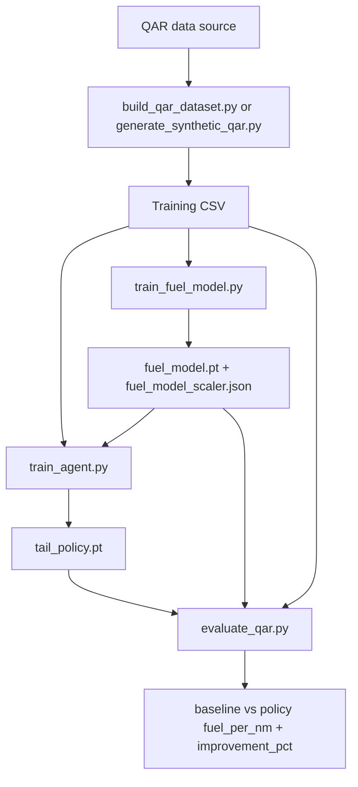
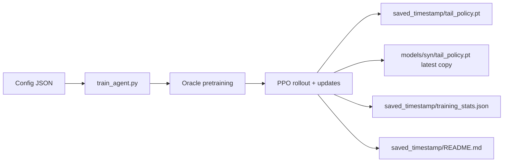

id: mach-predictor-codelab
summary: Mach optimization with DRL + learned fuel model
categories: ml, reinforcement-learning
tags: drl, ppo, aviation, qar
status: draft
authors: Samrat Kar

# Aircraft Mach Optimization using DRL

This project trains a PPO policy to recommend cruise Mach for a B737-800 with the objective of reducing fuel per nautical mile (kg/NM).

The reward model in `AircraftEnv` can use:
- a learned supervised fuel model (`train_fuel_model.py` output), or
- a physics fallback model when fuel model files are missing.

## Big Picture

`train_fuel_model.py` is the bridge between QAR records and PPO reward quality:
- It learns fuel-per-NM from QAR state features.
- It exports model + scaler artifacts.
- `train_agent.py` loads those artifacts to compute fuel burn during RL rollouts.

If these artifacts are not found at config paths, `train_agent.py` falls back to physics-based fuel flow.



## How `train_fuel_model.py` Is Used by the Agent

### 1) Fuel model training
`train_fuel_model.py` uses QAR columns:
- Inputs (17 features): altitude, weight, temperature, speed, mach, controls, geospatial/time fields.
- Target: `fpn = (selectedFuelFlow1 + selectedFuelFlow2) / groundAirSpeed`.

Outputs:
- `fuel_model.pt` (MLP: `17 -> 64 -> 64 -> 1`)
- `fuel_model_scaler.json` (feature mean/std + target normalization)

### 2) Agent training
`train_agent.py` reads config keys:
- `fuel_model_path`
- `fuel_model_scaler_path`
- `qar_data_path`

At runtime:
- If both fuel files exist, env uses `_fuel_flow_from_model(...)`.
- If missing, env uses physics `_fuel_flow_model(...)`.

### 3) Evaluation
`evaluate_qar.py` compares:
- baseline: fuel model at recorded Mach
- policy: fuel model at RL-recommended Mach

## Current Training Flow (Implementation-Synced)



`train_agent.py` now saves model artifacts into a timestamped folder under the configured output parent:
- Example: `models/syn/saved_YYYYMMDD_HHMMSS/`
- It also copies latest policy to the configured `output_model_path`.

## Project Structure

- `aircraft_env.py`: RL environment + fuel modeling paths.
- `build_qar_dataset.py`: builds `data/qar_737800_cruise.csv` from external field QAR folder.
- `generate_synthetic_qar.py`: creates `data/qar_737800_synthetic.csv` with QAR-like schema.
- `train_fuel_model.py`: trains supervised fuel model (`.pt` + scaler JSON).
- `train_agent.py`: trains PPO policy and saves timestamped run artifacts.
- `evaluate_qar.py`: policy-vs-baseline evaluation with optional JSON report.
- `predict_mach.py`: single-condition inference helper.
- `configs/`: training configs (golden and synthetic variants).

## Configs

- Golden: `configs/approach_expanded_fuel_model_golden.json`
- Synthetic: `configs/approach_expanded_fuel_model_syn.json`

Key fields used by `train_agent.py`:
- `qar_data_path`
- `fuel_model_path`
- `fuel_model_scaler_path`
- `output_model_path`
- PPO hyperparameters (`learning_rate`, `gamma`, `eps_clip`, etc.)

## Commands

### A) Build/refresh synthetic QAR
```bash
python generate_synthetic_qar.py --field_csv data/qar_737800_cruise.csv --output_csv data/qar_737800_synthetic.csv
```

### B) Train supervised fuel model (synthetic path)
```bash
python train_fuel_model.py --input_csv data/qar_737800_synthetic.csv --model_path models/syn/fuel_model.pt --scaler_path models/syn/fuel_model_scaler.json --sample_rows 120000 --epochs 30
```

### C) Train PPO agent (uses config paths)
```bash
python train_agent.py --config configs/approach_expanded_fuel_model_syn.json
```

### D) Evaluate policy
```bash
python evaluate_qar.py --input_csv data/qar_737800_synthetic.csv --policy_path models/syn/tail_policy.pt --fuel_model_path models/syn/fuel_model.pt --fuel_scaler_path models/syn/fuel_model_scaler.json --sample_rows 20000 --results_json models/syn/results.json
```

## Notes on Current Behavior

- `train_agent.py` does not run `train_fuel_model.py` automatically. Train fuel model first or ensure config points to existing artifacts.
- If `qar_data_path` does not exist, `train_agent.py` falls back to `data/Tail_X1.csv`, otherwise random initialization.
- `evaluate_qar.py` accepts either:
  - a single CSV (`--input_csv`), or
  - directory scan (`--data_root`) for files containing required raw QAR columns.
- `train_fuel_model.py` and `evaluate_qar.py` now support CLI arguments and are free of merge-conflict markers.

## Example Published Synthetic Result

From `models/syn/saved_20260222_115249/results.json`:
- `qar_rows`: `20000`
- `baseline_fuel_per_nm`: `12.25299747494486`
- `policy_fuel_per_nm`: `11.94069350943155`
- `improvement_pct`: `2.5487964569642076`
