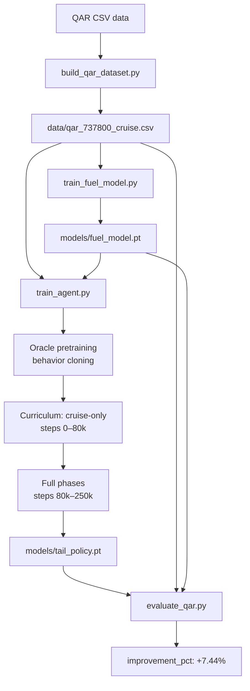
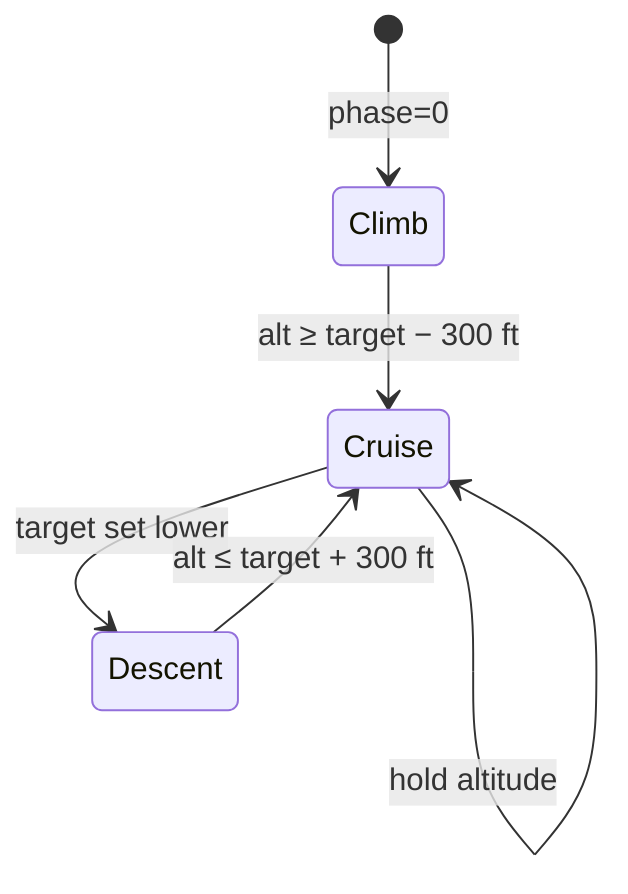

# Aircraft Mach Optimization using Deep Reinforcement Learning

This project uses Deep Reinforcement Learning (DRL) to recommend the optimal Mach number for a Boeing 737-800 during cruise, minimizing fuel burn per nautical mile. The agent is trained with PPO on a custom Gymnasium environment whose reward signal is driven by a neural fuel model fitted to real QAR (Quick Access Recorder) data.

---

## Table of Contents
1. [Problem Statement](#1-problem-statement)
2. [Solution Architecture](#2-solution-architecture)
3. [DRL Theory](#3-drl-theory)
4. [Environment Design](#4-environment-design-aircraftenv)
5. [Neural Fuel Model](#5-neural-fuel-model)
6. [Training Pipeline](#6-training-pipeline)
7. [Project Structure](#7-project-structure)
8. [Setup](#8-setup)
9. [Usage](#9-usage)
10. [Latest Performance Results](#10-latest-performance-results)
11. [Experiment History](#11-experiment-history)
12. [State, Action, Transition Reference](#12-state-action-transition-reference)
13. [Diagrams](#13-diagrams)

---

## 1. Problem Statement

Cruise fuel efficiency depends on choosing the right Mach number given real-time flight conditions (altitude, weight, temperature, wind). Flying too fast increases wave drag; flying too slow increases induced drag. The optimal Mach trades off these effects against the headwind component to minimize **fuel per nautical mile (kg/NM)**.

Airlines record these conditions in QAR data but typically fly a fixed FMC-programmed Mach. A learned policy that responds to actual conditions can improve on this.

---

## 2. Solution Architecture

```
QAR CSV data
     │
     ▼
build_qar_dataset.py          ← filters + saves cruise rows to data/qar_737800_cruise.csv
     │
     ▼
train_fuel_model.py           ← trains a neural fuel model (models/fuel_model.pt)
     │
     ▼
train_agent.py                ← PPO agent using AircraftEnv + neural fuel model
     │                           (oracle pretraining → curriculum → PPO)
     ▼
models/tail_policy.pt
     │
     ▼
evaluate_qar.py               ← evaluates policy vs baseline on 20k QAR cruise rows
```

All four steps are orchestrated by `run_golden.sh`.
Steps 1 and 2 are **skipped automatically** if their output files already exist.

---

## 3. DRL Theory

### 3.1 Markov Decision Process (MDP)

A reinforcement learning problem is formalized as an MDP defined by the tuple **(S, A, P, R, γ)**:

| Symbol | Meaning | This Project |
|---|---|---|
| **S** | State space | 21 flight-condition variables (see §12) |
| **A** | Action space | Continuous Mach command → [-1, 1] mapped to [0.70, 0.86] |
| **P(s'\|s,a)** | Transition distribution | Physics update + AR(1) wind/temp stochasticity |
| **R(s,a)** | Reward function | `-fuel_per_nm/10 - altitude_penalty - energy_penalty` |
| **γ** | Discount factor | 0.99 |

The agent's goal is to find policy **π** that maximises expected discounted return:

```
J(π) = E[ Σ_{t=0}^{T} γ^t R(s_t, a_t) ]
```

### 3.2 Why DRL (not supervised or rule-based)?

- The optimal Mach is a **non-linear function** of many interacting variables (weight, ISA deviation, wind, wave-drag cliff at M_crit).
- The problem has **temporal structure** — weight decreases as fuel burns, changing the optimal Mach during a cruise segment.
- The state space is **continuous** — exact dynamic programming (value iteration) is infeasible.

### 3.3 Bellman Equations

The value function satisfies:

```
V^π(s) = E_π[ R(s,a) + γ V^π(s') ]
Q^π(s,a) = R(s,a) + γ E[ V^π(s') ]
```

The **advantage** measures how much better action `a` is vs the average:

```
A_t = Q(s_t, a_t) - V(s_t)
```

### 3.4 PPO (Proximal Policy Optimization)

PPO is an on-policy actor-critic method. It improves sample efficiency over vanilla policy gradient by reusing a mini-batch for multiple gradient steps while constraining how far the policy can move (via a clipping trick).

**Probability ratio:**
```
r_t(θ) = π_θ(a_t | s_t) / π_θ_old(a_t | s_t)
```

**Clipped surrogate objective (actor loss):**
```
L_CLIP = E[ min( r_t(θ) · A_t,  clip(r_t(θ), 1-ε, 1+ε) · A_t ) ]
```
The clip prevents large policy updates that could destabilize training.

**Generalized Advantage Estimation (GAE):**
```
δ_t = R_t + γ V(s_{t+1}) - V(s_t)          ← TD residual
A_t = δ_t + (γλ) δ_{t+1} + (γλ)² δ_{t+2} + ...
```
GAE with λ=0.95 smoothly interpolates between 1-step TD (low variance, high bias) and full Monte Carlo (unbiased, high variance).

**Critic loss:**
```
L_V = 0.5 · (V(s_t) - R_t)²
```

**Entropy bonus (exploration):**
```
L_H = -β · H( π_θ(·|s_t) )
```

**Combined loss minimized at each update:**
```
L = -L_CLIP + L_V + L_H
```

### 3.5 Actor-Critic Network

Both actor and critic are two-layer MLPs (64 hidden units, Tanh activations) sharing no weights:

```
Actor:  s → [64, Tanh] → [64, Tanh] → μ_θ(s) ∈ [-1,1]  (+ learnable log_std)
Critic: s → [64, Tanh] → [64, Tanh] → V(s) ∈ ℝ
```

The action distribution is Gaussian: `a ~ N(μ_θ(s), σ_θ)`.
At inference, the **deterministic mean** is used for stable Mach predictions.

---

## 4. Environment Design (`AircraftEnv`)

### 4.1 Observation Space (21 variables)

All observations are normalized by fixed mean/std before being fed to the network.

| Variable | Unit | Range | Description |
|---|---|---|---|
| `altitude` | ft | 10k–41k | Current altitude |
| `grossWeight` | kg | 55k–78k | Aircraft gross weight |
| `TAT` | °C | -60–+20 | Total air temperature |
| `CAS` | kts | ~200–320 | Calibrated airspeed |
| `tempDevC` | °C | -8–+8 | ISA temperature deviation |
| `windKts` | kts | -60–+60 | Along-track wind (+ = tailwind) |
| `phase` | — | {0,1,2} | 0=climb, 1=cruise, 2=descent |
| `targetAltitude` | ft | 15k–39k | Target altitude for this segment |
| `turbulence` | — | 0–1 | Turbulence intensity (AR(1)) |
| `regime` | — | {0,1} | 0=nominal, 1=degraded engine |
| `angleOfAttackVoted` | ° | -2–8 | Angle of attack |
| `horizontalStabilizerPosition` | ° | -3–3 | Horizontal stabilizer trim |
| `totalFuelWeight` | kg | 1k–12k | Fuel remaining |
| `trackAngleTrue` | ° | 0–360 | True track |
| `fmcMach` | — | 0.70–0.86 | FMC-programmed Mach target |
| `latitude` | ° | -35–5 | Latitude |
| `longitude` | ° | -80–-30 | Longitude |
| `GMTHours` | h | 0–24 | UTC time |
| `Day` | — | 1–28 | Day of month |
| `Month` | — | 1–12 | Month |
| `YEAR` | — | ~2023 | Year |

### 4.2 Action Space

```
a ∈ [-1, 1]   →   Mach = 0.78 + a × 0.08   ∈ [0.70, 0.86]
```

### 4.3 Physics (ISA Atmosphere + Drag Model)

**ISA atmosphere:**
```
T(h) = T0 + Λ·h           (troposphere, h ≤ 11 km)
ρ(h) = p(h) / (R_air · T(h))
```

**Airspeed conversion:**
```
TAS = Mach × √(γ · R_air · T)
CAS ≈ TAS × √(ρ / ρ₀)            (EAS approximation)
```

**Aerodynamic drag:**
```
q   = 0.5 · ρ · TAS²
CL  = W / (q · S_ref)
CD  = CD0 + k·CL² + CD_wave·(max(0, M-M_crit)/0.08)²
D   = q · S_ref · CD
```

Wave drag activates above the critical Mach (M_crit ≈ 0.78), creating a strong
non-linear penalty for flying too fast.

**Fuel flow (physics fallback):**
```
FuelFlow [kg/hr] = D × TSFC × 3600
TSFC = TSFC_base × (1 + 0.12·h/11000) × (1 + 0.01·(T0-T))
```

In the golden pipeline the physics model is **replaced** by the neural fuel model (§5).

### 4.4 Reward

```
ground_speed = max(CAS + wind, 100)     [kts]
fuel_per_nm  = FuelFlow / ground_speed  [kg/NM]

reward = -fuel_per_nm / 10
       - altitude_penalty               (deviation > 1000 ft from target)
       - energy_penalty                 (overspeed in climb/descent)
       - shaping_penalty                (optional: distance from oracle Mach)
```

### 4.5 State Transitions

| Component | Update |
|---|---|
| Weight | `W_{t+1} = W_t − FuelFlow_t × Δt` |
| Altitude | Climb/cruise/descent rate toward `targetAltitude` |
| TempDev | AR(1): `ΔT_{t+1} = 0.95·ΔT_t + ε`, ε ~ N(0, 0.2) |
| Wind | AR(1): `W_{t+1} = 0.90·W_t + ε`, ε ~ N(0, 2.0) |
| Turbulence | AR(1) around mean 0.2 |
| Regime | Flips (0↔1) with probability 0.02 per step |
| TAT / CAS | Recomputed from Mach + ISA + ΔT each step |

### 4.6 Oracle Mach

The environment exposes `_oracle_mach()`, which runs a **golden-section search** (20 iterations) over Mach ∈ [0.70, 0.86] to find the Mach that minimizes `FuelFlow / GroundSpeed` for the current state. This is used in two places:
- **Oracle pretraining**: behavior-clone the actor toward the oracle before PPO begins.
- **Reward shaping**: penalize distance from oracle Mach during PPO (optional, `reward_shaping_strength = 0.5`).

---

## 5. Neural Fuel Model

### 5.1 Motivation

The physics drag model is a simplified approximation. Real fuel burn depends on many factors (engine condition, actual CG, exact trim). A neural network trained on QAR records captures these effects directly.

### 5.2 Architecture

```
Input (17 features) → [64, ReLU] → [64, ReLU] → FuelPerNM (scalar)
```

**Input features:**
`altitude, grossWeight, TAT, Airspeed (CAS), groundAirSpeed, mach, AoA, HStab, totalFuelWeight, trackAngleTrue, fmcMach, latitude, longitude, GMTHours, Day, Month, YEAR`

**Target:** `fuel_per_nm = (FF1 + FF2) / groundAirSpeed` (normalized)

### 5.3 Training

- Data: `data/qar_737800_cruise.csv` (120,000 cruise rows, altitude > 30,000 ft, ground speed > 100 kts)
- Split: 80/20 train/test
- Loss: MSE on normalized target
- Optimizer: Adam (lr=1e-3), 30 epochs
- Scaler saved to `models/fuel_model_scaler.json`

### 5.4 Performance

| Metric | Value |
|---|---|
| MAE (normalized) | 0.3535 |
| RMSE (normalized) | 0.5626 |
| R² | 0.6938 |
| MAE (kg/NM) | 1.18 |
| RMSE (kg/NM) | 1.88 |

R² = 0.69 means the model explains ~69% of fuel variance across the diverse QAR fleet.

---

## 6. Training Pipeline

### 6.1 Phase 0 — Oracle Pretraining (Behavior Cloning)

Before PPO begins, the **actor is pre-trained** to imitate the oracle Mach via supervised learning:

```
for step in range(2000):
    sample 256 random states from env.reset()
    oracle_mach = env._oracle_mach()          ← golden-section search
    target_action = (oracle_mach - 0.78) / 0.08
    loss = MSE(actor(state), target_action)
    optimizer.step()
```

This warm-starts the policy near a good solution, reducing the exploration needed during PPO.

### 6.2 Phase 1 — Curriculum Learning

Training starts in **cruise-only** mode (`phase_mode = "cruise_only"`) for the first 80,000 steps, so the agent first masters the main objective (fuel efficiency at cruise altitude). At step 80,000 the environment switches to **mixed phases** (climb + cruise + descent), teaching the agent to handle altitude transitions.

### 6.3 Phase 2 — PPO Training

```
Hyperparameter           Value
──────────────────────   ─────────
Total timesteps          250,000
Batch size               128
K epochs per update      4
Learning rate            2e-4
Discount γ               0.99
GAE λ                    0.95
PPO clip ε               0.2
Entropy coefficient β    0.01
Reward shaping strength  0.5
```

Every 128 steps the buffer is consumed: advantages are computed with GAE, the policy is updated for K=4 epochs, the buffer is cleared, and training continues.

---

## 7. Project Structure

```
mach-predictor/
├── run_golden.sh                    ← end-to-end pipeline script
├── build_qar_dataset.py             ← builds data/qar_737800_cruise.csv from raw QAR
├── train_fuel_model.py              ← trains neural fuel model from QAR
├── train_agent.py                   ← PPO agent training
├── evaluate_qar.py                  ← policy vs baseline evaluation on QAR data
├── predict_mach.py                  ← single-row inference CLI
├── aircraft_env.py                  ← custom Gymnasium environment
├── data_generator.py                ← synthetic data generator (for prototyping)
├── configs/
│   ├── approach_expanded_fuel_model_golden.json   ← golden config (used by run_golden.sh)
│   ├── approach_quadratic.json
│   ├── approach_linear_calibration.json
│   └── approach_fuel_model_basic.json
├── data/
│   ├── qar_737800_cruise.csv        ← 120k filtered cruise rows (built once)
│   ├── Tail_01.csv … Tail_50.csv   ← synthetic per-tail data
│   ├── Tail_X1.csv, Tail_Y2.csv    ← extra synthetic tails
├── models/
│   ├── fuel_model.pt                ← neural fuel model weights
│   ├── fuel_model_scaler.json       ← feature normalization stats
│   └── tail_policy.pt               ← trained PPO policy weights
└── requirements.txt
```

---

## 8. Setup

```bash
python3 -m venv .venv
source .venv/bin/activate
pip install -r requirements.txt
```

---

## 9. Usage

### Full golden pipeline

```bash
bash run_golden.sh
```

Runs these four steps in order:
1. **`build_qar_dataset.py`** — filters QAR CSVs into `data/qar_737800_cruise.csv`.
   *Skipped automatically if the file already exists.*
2. **`train_fuel_model.py`** — fits the neural fuel model.
   *Skipped automatically if `models/fuel_model.pt` already exists.*
3. **`train_agent.py --config configs/approach_expanded_fuel_model_golden.json`** — trains the PPO agent.
4. **`evaluate_qar.py`** — evaluates the policy on 20,000 QAR cruise rows and prints improvement.

### Train agent only (specific config)

```bash
python train_agent.py --config configs/approach_expanded_fuel_model_golden.json
```

### Evaluate existing model

```bash
python evaluate_qar.py
```

### Single-row inference

```bash
# python predict_mach.py <Alt> <Weight> <TAT> <CAS> [TempDevC] [WindKts] [Phase] \
#   [TargetAlt] [Turb] [Regime] [AoA] [HStab] [TotalFuelWeight] [TrackAngle] \
#   [FmcMach] [Lat] [Lon] [GMTHours] [Day] [Month] [Year]

python predict_mach.py 36000 70000 -45 280 0 10 1 35000 0.2 0 2 0 8000 180 0.78 -10 -50 12 15 6 2023
# Output: Predicted Optimal Mach: 0.7802
```

### Generate synthetic data (prototyping)

```bash
python data_generator.py
# Creates data/Tail_01.csv … Tail_50.csv
```

---

## 10. Latest Performance Results

**Run date:** February 2026
**Model:** `models/tail_policy.pt` (expanded-feature fuel model + PPO, golden config)
**Evaluation data:** `data/qar_737800_cruise.csv`, 20,000 random cruise rows
**Evaluation method:** Both baseline and policy evaluated via the same neural fuel model —
- Baseline: fuel model queried at the **recorded mach** from QAR
- Policy: fuel model queried at the **RL-recommended mach**

| Metric | Value |
|---|---|
| QAR rows evaluated | 20,000 |
| Baseline fuel/NM (recorded mach) | **12.01 kg/NM** |
| Policy fuel/NM (RL-recommended mach) | **11.12 kg/NM** |
| **Improvement** | **+7.44%** |

The policy consistently recommends Mach numbers that the fuel model predicts will
consume less fuel per nautical mile than the originally flown Mach.

---

## 11. Experiment History

### QAR Cruise Baseline
- Source: B737-800 fleet, cruise rows (altitude > 30,000 ft, ground speed > 100 kts)
- Mean fuel per NM: **11.85–12.01 kg/NM** (depending on sample)
- Mean cruise Mach: **0.7628**, FMC Mach: **0.6585**

### Experiment 1 — Supervised Mach Regression
**Goal:** Predict observed Mach from QAR states (MLP regression).

- Features: `altitude, grossWeight, TAT, Airspeed, groundAirSpeed`
- MAE: 0.2282 | RMSE: 0.2783 | R²: **-179.84**
- Mean-Mach predictor MAE: 0.0141 (much better)

**Finding:** Mach in cruise is nearly constant; supervised regression on these features cannot beat a constant baseline.

### Experiment 2 — Environment Calibration (Linear + Quadratic)
**Goal:** Fit a mapping `fpn_QAR ≈ f(fpn_env)`.

- Linear: `a=0.1681, b=9.0294` → R²=0.009
- Quadratic: `a=0.120, b=-4.003, c=44.855` → R²=0.059

**Finding:** Calibration weakly explains QAR fuel variance; quadratic is better than linear.

### Experiment 3 — Ridge Calibration (Expanded Features)
- Features: `[fpn_env, fpn_env², fpn_env³, alt, weight, mach, temp_dev]`
- MAE: 11.90 kg/NM | R²: **-12.81** — worse than quadratic.

### Experiment 4 — MLP Calibration (Expanded Features)
- Same features as Exp 3, two-layer MLP
- MAE: 10.34 kg/NM | R²: **-9.75** — still worse than quadratic.

### Experiment 5 — Quadratic Calibration + PPO
- Policy fuel per NM: 12.37 | Baseline: 11.93 → **-3.75%** (policy worse)

### Experiment 6 — Expanded-Feature Fuel Model + PPO (Golden)
**Decision:** Replace calibration with a neural fuel model trained on full QAR feature set.

- Fuel model R²: **0.69** (strong fit)
- Policy fuel per NM: **11.12** | Baseline: **12.01** → **+7.44%** (policy better)

This is the first configuration where DRL consistently beats the QAR baseline.

### Comparative Summary

| Experiment | Approach | Policy fuel/NM | QAR Improvement |
|---|---|---|---|
| Baseline | QAR recorded mach | 12.01 | — |
| 1 | Supervised Mach regression | — | Not competitive |
| 2 | Quadratic calibration | — | Indirect |
| 3 | Ridge calibration (expanded) | — | Worse |
| 4 | MLP calibration (expanded) | — | Worse |
| 5 | Quadratic calibration + PPO | 12.37 | **-3.75%** |
| **6** | **Expanded-feature fuel model + PPO** | **11.12** | **+7.44%** |

### What would further improve the policy
- Include thrust mode, flap config, N1 sensor readings, CG position as state features.
- Phase-aware separate fuel models (climb vs cruise vs descent).
- Continuous Mach optimization in the oracle rather than grid search.
- Longer training (> 250k steps) or off-policy algorithms (SAC) for better sample efficiency.

---

## 12. State, Action, Transition Reference

### State Variables

| Name | Symbol | Range | Transition Driver |
|---|---|---|---|
| Altitude_ft | `alt` | 10k–41k ft | Climb/cruise/descent dynamics |
| Weight_kg | `W` | 55k–78k kg | Fuel burn per step |
| TAT_C | `TAT` | ~-60–+20 °C | ISA + TempDev |
| CAS_kts | `CAS` | ~200–320 kts | Mach + air density |
| TempDev_C | `ΔT` | -8–+8 °C | AR(1) random walk |
| Wind_kts | `wind` | -60–+60 kts | AR(1) random walk |
| Phase | `φ` | {0,1,2} | Altitude vs target |
| TargetAlt_ft | `alt*` | 15k–39k ft | Fixed per scenario |
| Turb | `τ` | 0–1 | AR(1) around 0.2 |
| Regime | `ρ` | {0,1} | Random mid-episode flip |
| AoA | `α` | -2–8 ° | Slow random walk |
| HStab | `H` | -3–3 ° | Slow random walk |
| TotalFuelWeight | `FW` | 1k–12k kg | Decreases with burn |
| TrackAngle | `χ` | 0–360 ° | Slow random walk |
| FmcMach | `M_FMC` | 0.70–0.86 | Slow random walk |
| Latitude | `lat` | -35–5 ° | Fixed per episode |
| Longitude | `lon` | -80–-30 ° | Fixed per episode |
| GMTHours | `t` | 0–24 h | Increments by Δt |
| Day | `d` | 1–28 | Fixed per episode |
| Month | `m` | 1–12 | Fixed per episode |
| Year | `y` | ~2023 | Fixed per episode |

### Action

| Name | Range | Mapping |
|---|---|---|
| Mach command | [-1, 1] | `Mach = 0.78 + a × 0.08` → [0.70, 0.86] |

### Reward Components

| Component | Formula | Purpose |
|---|---|---|
| Fuel efficiency | `-fuel_per_nm / 10` | Primary objective |
| Altitude penalty | `-max(0, (|alt-alt*| - 1000) / 10000)` | Track target altitude |
| Energy penalty | `-overspeed_penalty` | Avoid high Mach in climb/descent |
| Shaping penalty | `-0.5 × ((Mach - oracle_Mach) / 0.08)²` | Guide toward oracle (optional) |

---

## 13. Diagrams

### Training Flow



### PPO Update Cycle

```mermaid
flowchart LR
    S[State s_t] -->|Actor πθ| A[Action a_t\nMach]
    A -->|AircraftEnv| S2[s_{t+1}]
    A -->|Fuel model + reward| R[r_t]
    S2 -->|Critic V| V[V s_{t+1}]
    R --> ADV[Advantage A_t\nGAE]
    V --> ADV
    ADV -->|PPO clip + update| S
```

### Flight Phase State Machine



### Drag vs Mach (Why There's an Optimal Speed)

```
Fuel/NM
   │
   │      induced drag          wave drag
   │        ╲                    ╱
   │         ╲                  ╱
   │          ╲                ╱
   │           ╲______________╱   ← optimal Mach here
   │
   └────────────────────────────── Mach
           0.70  0.74  0.78  0.82  0.86
                        ↑
                     M_crit
```

At low Mach, induced drag dominates (heavy aircraft at low speed needs high CL).
Above M_crit, wave drag rises steeply. The policy learns to sit near the minimum.

---

## Notes

- The neural fuel model and the physics fallback produce consistent reward signals — the physics model is used during random initialization only; the golden pipeline always uses `models/fuel_model.pt`.
- All scripts are self-contained and portable; no external data paths are required if `data/qar_737800_cruise.csv` and `models/` already exist.
- `evaluate_qar.py` reads `data/qar_737800_cruise.csv` (columns: `CAS`, `windKts`, `mach`, etc.) and reconstructs ground speed as `CAS + windKts`. Baseline fuel is evaluated via the fuel model at the recorded mach, ensuring a fair apples-to-apples comparison with the policy.
