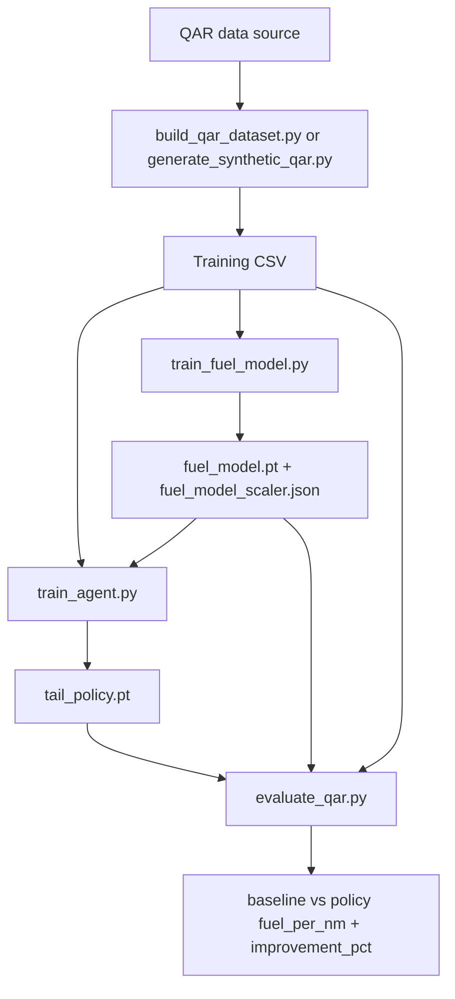
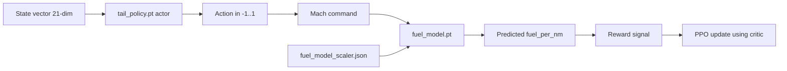
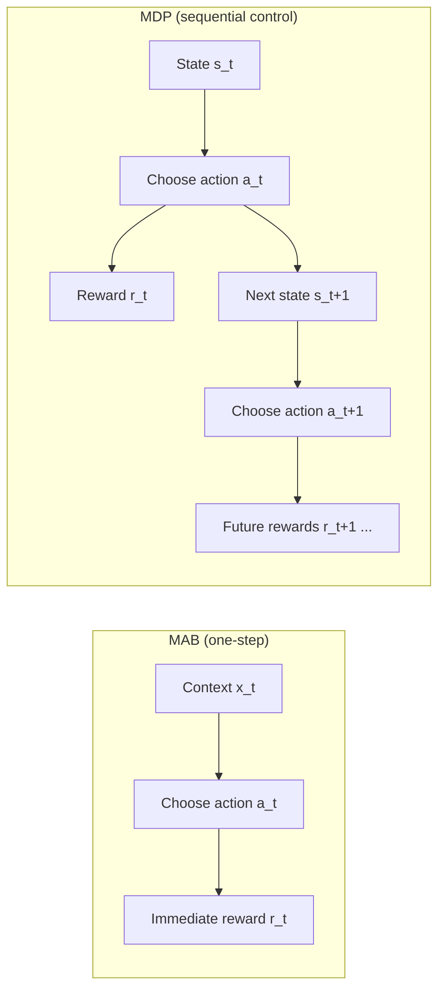
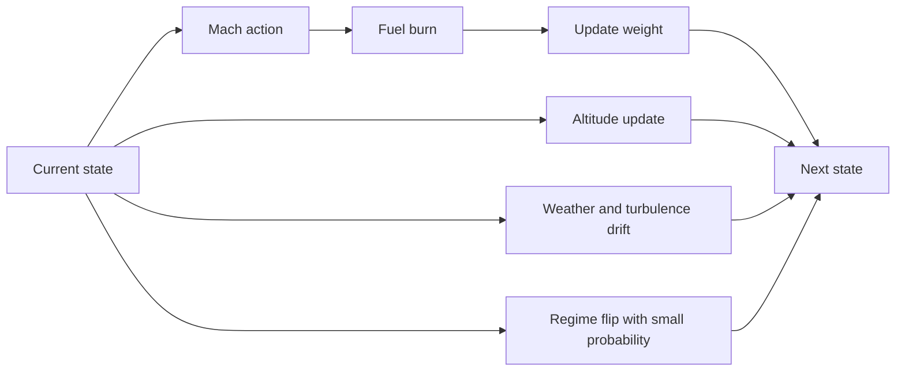
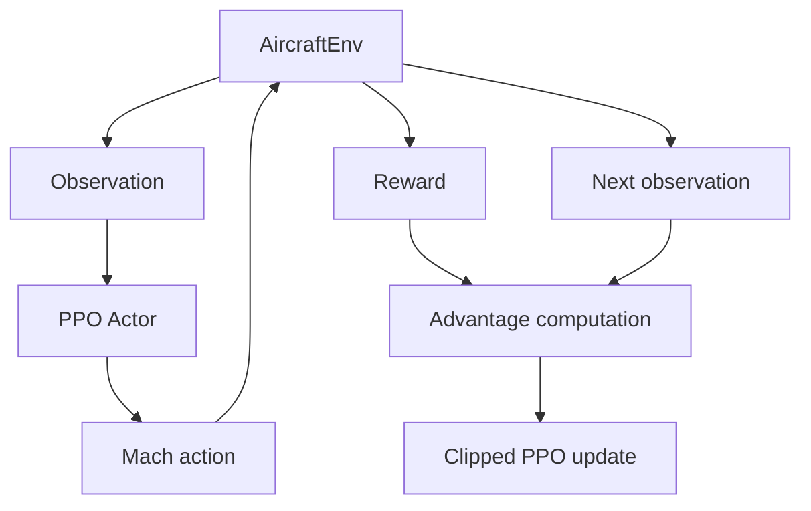
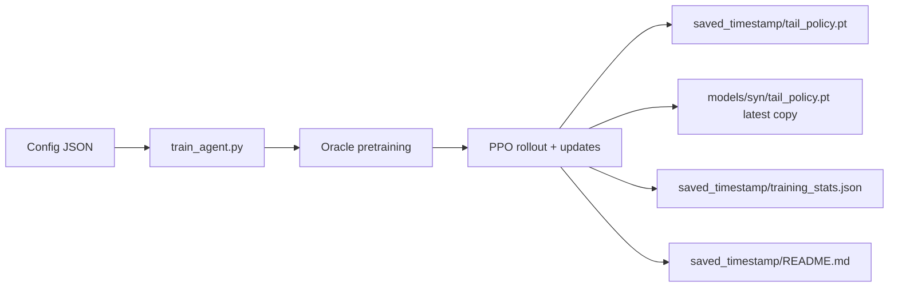

id: mach-predictor-codelab
summary: Mach optimization with DRL + learned fuel model
categories: ml, reinforcement-learning
tags: drl, ppo, aviation, qar
status: draft
authors: Samrat Kar

# Aircraft Mach Optimization using DRL

This project trains a PPO policy to recommend cruise Mach for a B737-800 with the objective of reducing fuel per nautical mile (kg/NM).

The reward model in `AircraftEnv` can use:
- a learned supervised fuel model (`train_fuel_model.py` output), or
- a physics fallback model when fuel model files are missing.

## Big Picture

`train_fuel_model.py` is the bridge between QAR records and PPO reward quality:
- It learns fuel-per-NM from QAR state features.
- It exports model + scaler artifacts.
- `train_agent.py` loads those artifacts to compute fuel burn during RL rollouts.

If these artifacts are not found at config paths, `train_agent.py` falls back to physics-based fuel flow.



## How `train_fuel_model.py` Is Used by the Agent

### 1) Fuel model training
`train_fuel_model.py` uses QAR columns:
- Inputs (17 features): altitude, weight, temperature, speed, mach, controls, geospatial/time fields.
- Target: `fpn = (selectedFuelFlow1 + selectedFuelFlow2) / groundAirSpeed`.

Outputs:
- `fuel_model.pt` (MLP: `17 -> 64 -> 64 -> 1`)
- `fuel_model_scaler.json` (feature mean/std + target normalization)

### 2) Agent training
`train_agent.py` reads config keys:
- `fuel_model_path`
- `fuel_model_scaler_path`
- `qar_data_path`

At runtime:
- If both fuel files exist, env uses `_fuel_flow_from_model(...)`.
- If missing, env uses physics `_fuel_flow_model(...)`.

### 3) Evaluation
`evaluate_qar.py` compares:
- baseline: fuel model at recorded Mach
- policy: fuel model at RL-recommended Mach

## Core Artifacts and How They Connect

### Artifact meanings

| Artifact | Created by | What it contains | Used by | Why it matters |
|---|---|---|---|---|
| `models/syn/fuel_model.pt` | `train_fuel_model.py` | Neural network weights/biases for supervised fuel model (`17 -> 64 -> 64 -> 1`) | `train_agent.py`, `evaluate_qar.py` via `AircraftEnv` | Gives learned fuel prediction from QAR-like state + Mach |
| `models/syn/fuel_model_scaler.json` | `train_fuel_model.py` | Input normalization (`mean/std`) and target de-normalization (`y_mean/y_std`) | `AircraftEnv._fuel_flow_from_model` | Keeps inference numerically consistent with training |
| `models/syn/tail_policy.pt` | `train_agent.py` | PPO `ActorCritic` weights (actor + critic in one state dict) | `predict_mach.py`, `evaluate_qar.py`, further training/eval | Produces Mach action from state |

### Important clarification
- `fuel_model_scaler.json` is **not** NN weights.
- NN weights are in `fuel_model.pt`.
- `tail_policy.pt` stores **two neural networks** in one file:
  - actor (action policy)
  - critic (value estimator for PPO updates)

### Code-level implementation map

| Concept | File | Implementation |
|---|---|---|
| Fuel model architecture | `train_fuel_model.py` | `nn.Sequential(Linear(17,64), ReLU, Linear(64,64), ReLU, Linear(64,1))` |
| Fuel model target | `train_fuel_model.py` | `fpn = (selectedFuelFlow1 + selectedFuelFlow2) / groundAirSpeed` |
| Scaler write | `train_fuel_model.py` | writes JSON keys: `mean`, `std`, `target`, `y_mean`, `y_std` |
| Scaler read/use | `aircraft_env.py` | `_fuel_flow_from_model`: normalize `x`, run model, de-normalize `fpn`, convert to fuel flow |
| Policy architecture | `train_agent.py` | `ActorCritic`: actor MLP + critic MLP |
| Policy output to Mach | `aircraft_env.py` | `mach = 0.78 + action * 0.08`, clipped to `[0.70, 0.86]` |
| Timestamped run outputs | `train_agent.py` | saves to `output_parent/saved_YYYYMMDD_HHMMSS/` + copies latest to `output_model_path` |

### Runtime dataflow inside environment



### Detailed inference steps for fuel model
1. Build raw feature vector `x` (17 fields) in `AircraftEnv._fuel_flow_from_model`.
2. Load scaler stats from `fuel_model_scaler.json`.
3. Normalize: `x_n = (x - mean) / std`.
4. Run `fuel_model.pt` to get normalized prediction.
5. De-normalize: `fpn = pred * y_std + y_mean`.
6. Convert to flow: `fuel_flow_kg_hr = fpn * ground_speed`.

## Oracle, Oracle Pretraining, and PPO

### What is the oracle in this project?

In this repo, the oracle is not a separate ML model.  
It is an optimizer-based teacher implemented in `AircraftEnv._oracle_mach()`.

For the current state, `_oracle_mach()`:
1. Defines an objective `f(mach) = fuel_per_nm` for that state.
2. Evaluates fuel via:
   - learned fuel model path (`_fuel_flow_from_model`) when fuel model artifacts are available, or
   - physics fallback (`_fuel_flow_model`) otherwise.
3. Runs golden-section search on Mach in `[mach_min, mach_max]` to find the minimum.

Output: the Mach value that approximately minimizes fuel-per-NM for that state.

### What is oracle pretraining?

Oracle pretraining is a supervised warm-start step before PPO.

Implemented in `train_agent.py`:
1. Sample states from `env.reset()`.
2. Compute oracle Mach from `env._oracle_mach()`.
3. Convert oracle Mach to normalized action space:
   - `target_action = (oracle_mach - 0.78) / 0.08`
4. Train actor with MSE loss to imitate target action.

Purpose:
- Start policy near a strong baseline.
- Reduce unstable random exploration early in RL.
- Improve sample efficiency and convergence behavior for PPO.

### What is PPO?

PPO (Proximal Policy Optimization) is an on-policy actor-critic algorithm.

In this project:
- Actor network outputs action distribution parameters (Mach command in normalized space).
- Critic network estimates state value.
- Training alternates between:
  1. collecting rollouts from current policy,
  2. computing advantages/returns,
  3. optimizing clipped PPO objective for multiple epochs.

Core PPO idea: limit overly large policy updates with ratio clipping:
- `r_t = pi_theta(a_t|s_t) / pi_theta_old(a_t|s_t)`
- optimize `min(r_t * A_t, clip(r_t, 1-eps, 1+eps) * A_t)`

This keeps updates stable while still improving policy performance.

### Literature

Primary references:
- Schulman et al., *Proximal Policy Optimization Algorithms*, 2017. (`arXiv:1707.06347`)
- Schulman et al., *High-Dimensional Continuous Control Using Generalized Advantage Estimation*, 2015. (`arXiv:1506.02438`)
- Sutton and Barto, *Reinforcement Learning: An Introduction* (2nd ed.), 2018.

Related context:
- Silver et al., *Deterministic Policy Gradient Algorithms*, 2014. (continuous-control policy gradient baseline)
- Lillicrap et al., *Continuous Control with Deep Reinforcement Learning* (DDPG), 2015.

## MDP vs MAB (Why this problem is MDP)

### Definitions
- MAB (Multi-Armed Bandit):
  - You choose an action, get an immediate reward, and there is no state transition that matters for future decisions.
  - Each decision is effectively independent from the next.
- MDP (Markov Decision Process):
  - You choose an action in a state, get reward, and the action influences the next state.
  - Future rewards depend on current actions through state evolution.

### Why this project is not a pure MAB
This task is not just "pick Mach, get one reward, done." In `AircraftEnv`, each action affects later steps:
- Fuel burn changes aircraft weight (`weight_{t+1} = weight_t - burn * dt`), which changes future drag and fuel-optimal Mach.
- Altitude evolves by phase (climb/cruise/descent), and phase can change over time.
- Wind, temperature deviation, and turbulence evolve across steps (AR-like processes).
- Regime can flip mid-episode (nominal/degraded), changing future fuel behavior.

Because these transitions carry information and constraints into future decisions, the agent must optimize a sequence of actions, not isolated one-step choices.

### Concrete example in this codebase
1. At time `t`, agent picks higher Mach to gain short-term benefit.
2. That raises fuel flow now.
3. Higher burn reduces weight for future steps, but also changes subsequent aerodynamics and reward balance.
4. Meanwhile wind/temp/turbulence evolve, so best Mach at `t+1` depends on both environment drift and what happened at `t`.

This coupling across time is exactly MDP structure.

### Why PPO (MDP algorithm) instead of a bandit method
- PPO uses value estimation and advantage over trajectories, which is useful when actions influence future states/rewards.
- A bandit method would ignore transition dynamics and long-horizon tradeoffs, losing important signal in this environment.

### Flow comparison (MAB vs MDP)



## How the environment is modeled

`AircraftEnv` is a handcrafted stochastic MDP. It does not learn a transition model from data. Instead, it combines:

1. A 21-dimensional state vector with aircraft, atmosphere, and operational context.
2. A continuous action: normalized Mach command in `[-1, 1]`.
3. Physics-inspired fuel burn and altitude dynamics.
4. Random perturbations for wind, turbulence, temperature deviation, and regime shifts.

### State space

The environment returns these 21 state variables:

1. `altitude_ft`
2. `grossWeight_kg`
3. `TAT_C`
4. `CAS_kts`
5. `TempDev_C`
6. `Wind_kts`
7. `Phase`
8. `TargetAlt_ft`
9. `Turb`
10. `Regime`
11. `AoA`
12. `HStab`
13. `TotalFuelWeight`
14. `TrackAngle`
15. `FmcMach`
16. `Lat`
17. `Lon`
18. `GMTHours`
19. `Day`
20. `Month`
21. `Year`

The state is normalized before being returned to the agent, so the policy sees a standardized vector rather than raw aircraft units.

### State transition model

The next state is generated by applying the chosen Mach action and then advancing the simulated aircraft one time step:



What changes each step:

1. Mach is clipped into the allowed range.
2. Fuel flow is computed from the physics model or learned fuel model.
3. Weight decreases according to fuel burned over the time step.
4. Altitude evolves differently in climb, cruise, and descent.
5. Wind, temperature deviation, turbulence, and operational variables drift slowly.
6. Regime may flip with small probability.
7. A new normalized observation is returned.

### Reward model

The reward is computed directly in `step()` and is centered on fuel efficiency:

```text
reward = -fuel_per_nm / 10.0 - alt_penalty - energy_penalty - shaping_penalty
```

Where:

1. `fuel_per_nm = fuel_flow_kg_hr / ground_speed`
2. `alt_penalty` penalizes staying too far from the target altitude
3. `energy_penalty` penalizes inefficient or unsafe Mach choices in climb/descent/low-altitude flight
4. `shaping_penalty` is optional and nudges the policy toward the oracle Mach

### How transition probabilities are handled

There is no explicit transition matrix `P(s' | s, a)` in the code. The environment samples transitions from randomized rules:

1. Phase is sampled at reset.
2. Initial altitude, wind, turbulence, weight, and Mach are sampled from realistic ranges or from QAR data.
3. Step-to-step updates add noise and occasional regime flips.

So the transition model is **implicit and stochastic**, not tabular and not learned by dynamic programming.

## Thesis-Style Environment Specification

### Problem statement

The agent must choose a Mach setting that minimizes fuel burn per nautical mile while remaining physically plausible and operationally safe.

At each time step:

1. The environment exposes the current flight condition.
2. The policy chooses a normalized Mach action.
3. The environment advances the aircraft state by one interval.
4. The environment returns the next state, reward, termination flags, and diagnostic info.

This creates a sequential decision problem with delayed consequences. A Mach choice now affects:

1. Immediate fuel flow.
2. Weight after the burn.
3. The reward at the current step.
4. The operating conditions faced in later steps.

### Formal MDP view

You can write the environment as:

$$
\mathcal{M} = (\mathcal{S}, \mathcal{A}, P, R, \gamma)
$$

where:

1. $\mathcal{S}$ is the 21-dimensional continuous state space.
2. $\mathcal{A}$ is the continuous Mach action space, normalized to `[-1, 1]`.
3. $P(s' \mid s, a)$ is the stochastic transition rule implemented by `step()`.
4. $R(s, a, s')$ is the reward function.
5. $\gamma$ is the discount factor used by PPO during training.

The code does not enumerate $\mathcal{S}$ or estimate a full $P(s' \mid s, a)$ table. Instead, it synthesizes transitions from deterministic formulas and random perturbations.

### State semantics

The 21 inputs are not just raw features. They represent four conceptual groups:

| Group | Variables | Meaning |
|---|---|---|
| Flight condition | `altitude_ft`, `grossWeight_kg`, `TAT_C`, `CAS_kts`, `TempDev_C`, `Wind_kts` | Defines the aircraft and atmospheric state seen by the policy |
| Control context | `Phase`, `TargetAlt_ft`, `FmcMach` | Describes mission phase and guidance information |
| Stability / variability | `Turb`, `Regime`, `AoA`, `HStab` | Injects operational variability and off-nominal behavior |
| Flight record context | `TotalFuelWeight`, `TrackAngle`, `Lat`, `Lon`, `GMTHours`, `Day`, `Month`, `Year` | Captures where and when the aircraft is in the mission |

This matters because PPO is not optimizing Mach in isolation. It is learning a policy conditioned on the full operational context.

### Action semantics

The policy outputs a scalar in `[-1, 1]`, which is mapped back to Mach:

$$
\text{Mach} = 0.78 + 0.08 \cdot a
$$

then clipped to the allowable interval `[0.70, 0.86]`.

So:

1. `a = -1` maps toward the low end of the Mach band.
2. `a = 0` maps to nominal cruise Mach around `0.78`.
3. `a = 1` maps toward the high end of the Mach band.

This normalization is useful because PPO typically works better when actions live in a compact symmetric range.

### Transition mechanics in detail

The environment transition is built in layers:

1. **Action decoding**
   - The agent proposes normalized action `a`.
   - The environment converts it to a physical Mach command.

2. **Fuel burn computation**
   - If a learned fuel model is available, the environment uses it.
   - Otherwise, it falls back to a simplified aerodynamic/engine model.
   - Small noise is added to reflect uncertainty.

3. **Mass update**
   - Aircraft weight decreases by the fuel burned over the time step.
   - Fuel reserve also decreases.

4. **Flight phase dynamics**
   - In climb, altitude increases.
   - In descent, altitude decreases.
   - In cruise, altitude jitters around the current level.

5. **Atmospheric drift**
   - Wind and temperature deviation follow slow stochastic drift.
   - Turbulence follows a mean-reverting process.

6. **Operational perturbations**
   - Track angle, AoA, hstab, FMC Mach, and time fields evolve slightly.
   - Regime may flip from nominal to degraded or back.

7. **Observation construction**
   - The new state is assembled and normalized.

This is a classic example of an engineered simulator: the state transition law is not exact physics, but it is structured enough to support learning.

### Reward decomposition

The reward is intentionally shaped to track fuel efficiency while discouraging unrealistic or unsafe behavior.

#### Base fuel term

$$
R_{\text{fuel}} = - \frac{\text{fuel\_flow\_kg\_hr}}{\text{ground\_speed}} \cdot \frac{1}{10}
$$

This is the dominant term.

Interpretation:

1. Higher fuel flow reduces reward.
2. Higher ground speed reduces fuel-per-distance and improves reward.
3. The `1/10` factor scales the reward into a numerically convenient range.

#### Altitude penalty

$$
R_{\text{alt}} = - \max\left(0, \frac{|h - h^*| - 1000}{10000}\right)
$$

where:

1. `h` is current altitude.
2. `h*` is target altitude.

This creates a tolerance band:

1. Small deviations near target altitude are tolerated.
2. Large deviations are penalized.

#### Energy management penalty

The environment adds a phase-sensitive penalty when Mach is too aggressive:

1. Too fast in climb.
2. Too fast in descent.
3. Too fast at low altitude.

This encodes operational safety and energy management heuristics directly into the reward.

#### Oracle shaping penalty

If reward shaping is enabled, the environment computes an oracle Mach by searching for the minimum fuel-per-NM action in the current state.

Then it adds:

$$
R_{\text{shape}} = - \lambda \left(\frac{\text{Mach} - \text{Mach}_{oracle}}{0.08}\right)^2
$$

This term makes the policy more sample-efficient by nudging it toward a strong local optimum.

### Termination condition

An episode ends when either:

1. The fixed episode length is reached, or
2. A hard constraint is violated, such as altitude moving outside bounds.

So termination is mostly a simulation boundary, not a success/failure terminal state in the classical game sense.

### What is stochastic and what is deterministic

The environment is mixed:

Deterministic structure:

1. Mach-to-fuel relationship.
2. Weight decreases with fuel burn.
3. Reward formula.
4. Normalization rules.

Stochastic structure:

1. Initial state sampling.
2. Wind perturbations.
3. Temperature deviation drift.
4. Turbulence drift.
5. Regime flips.
6. Random climb/descent rates.
7. Fuel noise.

This balance is intentional. A completely deterministic model would be too brittle, while a fully random one would be useless for control.

### How PPO sees this environment

PPO does not need to know the explicit equations inside `AircraftEnv`. It only needs:

1. the current observation,
2. the reward returned after acting,
3. and the next observation.

From those rollouts, PPO estimates:

1. the advantage of the chosen Mach command,
2. the value of the state,
3. and how to update the policy without making a destructive jump.



### Why this design is appropriate for the project

This environment is a good fit for PPO because:

1. The action is continuous.
2. The state is continuous and high dimensional.
3. The objective is sequential and long-horizon.
4. The reward is smooth but noisy.
5. The simulator can inject realistic uncertainty.

### Limitations of the model

This environment is useful, but it is still an approximation:

1. It does not model the full physics of flight.
2. It does not explicitly estimate transition probabilities from data.
3. It assumes that the chosen state variables are sufficient for control.
4. It compresses many real-world effects into simplified penalties and drift terms.

So the model is best understood as a **decision environment for policy learning**, not as a certified aircraft performance simulator.

## Current Training Flow (Implementation-Synced)



`train_agent.py` now saves model artifacts into a timestamped folder under the configured output parent:
- Example: `models/syn/saved_YYYYMMDD_HHMMSS/`
- It also copies latest policy to the configured `output_model_path`.

## Project Structure

- `aircraft_env.py`: RL environment + fuel modeling paths.
- `build_qar_dataset.py`: builds `data/qar_737800_cruise.csv` from external field QAR folder.
- `generate_synthetic_qar.py`: creates `data/qar_737800_synthetic.csv` with QAR-like schema.
- `train_fuel_model.py`: trains supervised fuel model (`.pt` + scaler JSON).
- `train_agent.py`: trains PPO policy and saves timestamped run artifacts.
- `evaluate_qar.py`: policy-vs-baseline evaluation with optional JSON report.
- `predict_mach.py`: single-condition inference helper.
- `configs/`: training configs (golden and synthetic variants).

## Configs

- Golden: `configs/approach_expanded_fuel_model_golden.json`
- Synthetic: `configs/approach_expanded_fuel_model_syn.json`

Key fields used by `train_agent.py`:
- `qar_data_path`
- `fuel_model_path`
- `fuel_model_scaler_path`
- `output_model_path`
- PPO hyperparameters (`learning_rate`, `gamma`, `eps_clip`, etc.)

## Commands

### A) Build/refresh synthetic QAR
```bash
python generate_synthetic_qar.py --field_csv data/qar_737800_cruise.csv --output_csv data/qar_737800_synthetic.csv
```

### B) Train supervised fuel model (synthetic path)
```bash
python train_fuel_model.py --input_csv data/qar_737800_synthetic.csv --model_path models/syn/fuel_model.pt --scaler_path models/syn/fuel_model_scaler.json --sample_rows 120000 --epochs 30
```

### C) Train PPO agent (uses config paths)
```bash
python train_agent.py --config configs/approach_expanded_fuel_model_syn.json
```

### D) Evaluate policy
```bash
python evaluate_qar.py --input_csv data/qar_737800_synthetic.csv --policy_path models/syn/tail_policy.pt --fuel_model_path models/syn/fuel_model.pt --fuel_scaler_path models/syn/fuel_model_scaler.json --sample_rows 20000 --results_json models/syn/results.json
```

## Notes on Current Behavior

- `train_agent.py` does not run `train_fuel_model.py` automatically. Train fuel model first or ensure config points to existing artifacts.
- If `qar_data_path` does not exist, `train_agent.py` falls back to `data/Tail_X1.csv`, otherwise random initialization.
- `evaluate_qar.py` accepts either:
  - a single CSV (`--input_csv`), or
  - directory scan (`--data_root`) for files containing required raw QAR columns.
- `train_fuel_model.py` and `evaluate_qar.py` now support CLI arguments and are free of merge-conflict markers.

## Example Published Synthetic Result

From `models/syn/saved_20260222_115249/results.json`:
- `qar_rows`: `20000`
- `baseline_fuel_per_nm`: `12.25299747494486`
- `policy_fuel_per_nm`: `11.94069350943155`
- `improvement_pct`: `2.5487964569642076`
