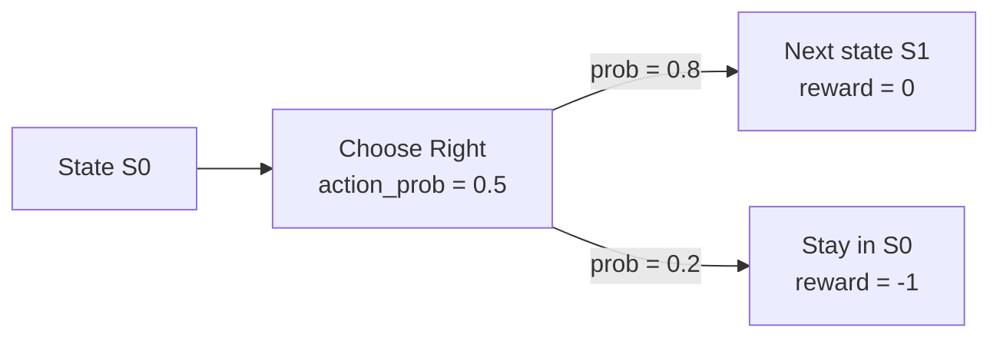
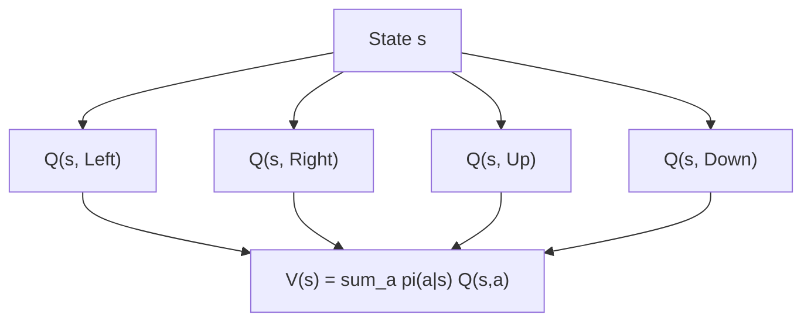
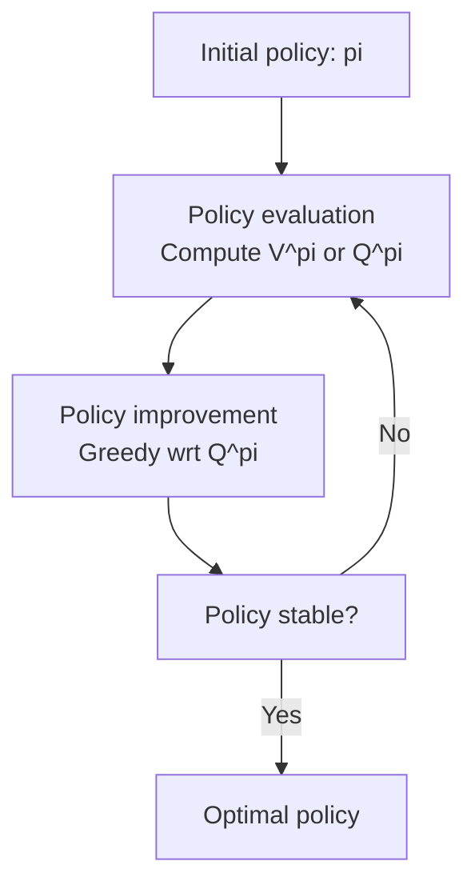
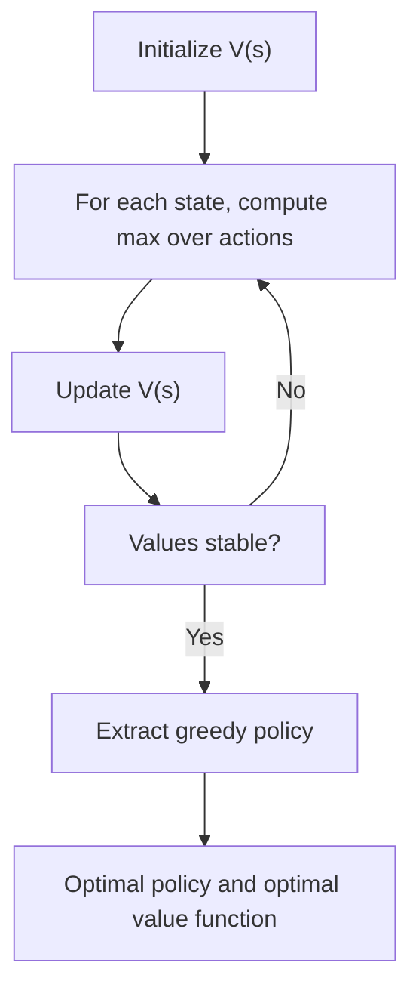
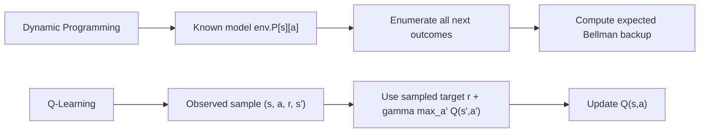
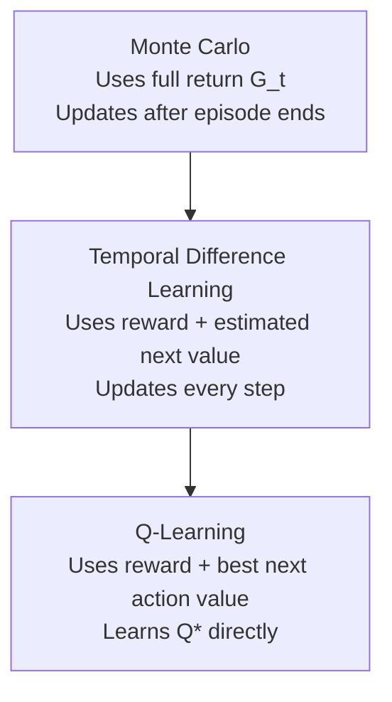
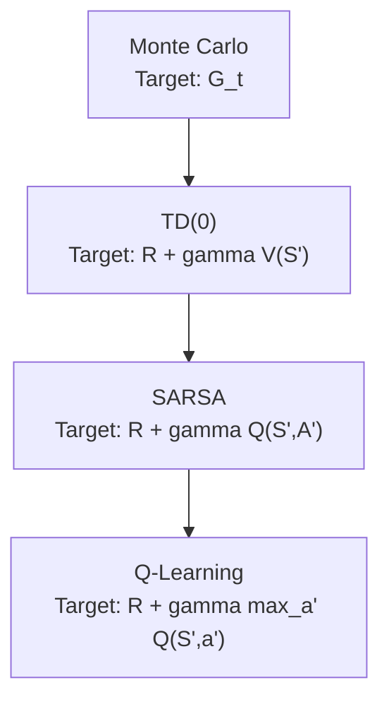

1. **MDP - Markov Decision Process** is used to model environment in reinforcement learning. It is a mathematical framework for modeling decision-making problems where an agent interacts with an environment to achieve a goal. 
An MDP consists of the following components - 
- states - some states are terminal states where episode ends,
- actions - each action is specified by a particular index in the q-value array, for that state. *action always leads to a state transition*. 
- transition probabilities, - which specify the probability of transitioning from one state to another given a particular action.
- rewards - which specify the immediate reward received by the agent after taking a particular action in a particular state.

2. At heart of MDP is the **markov property**, which states that the future state of the environment depends only on the **current state and action** taken by the agent, and not on the past states or actions. This property allows us to model the environment as a Markov process, which simplifies the analysis and solution of reinforcement learning problems.

3. **Markov property vs Bellman equation (How both are consistent)**

- It can feel like a contradiction:
  - Markov property says: **future depends on present**.
  - Bellman equation writes value of present state using next-state values.
- There is no contradiction because these two statements are about different things.

- **Forward-time causality (environment dynamics):**
  - Environment transitions are causal in time:
    - \(S_t, A_t \rightarrow S_{t+1}\)
  - Markov assumption:
    - \(P(S_{t+1} \mid S_t, A_t, S_{t-1}, \dots) = P(S_{t+1} \mid S_t, A_t)\)
  - So the future state distribution depends only on current state-action, not full history.

- **Bellman equation (value recursion, not physical causality):**
  - For a policy \(\pi\):
    - \(V^\pi(s) = \sum_a \pi(a \mid s)\sum_{s'} P(s' \mid s,a)\big[R(s,a,s') + \gamma V^\pi(s')\big]\)
  - This is a recursive definition for expected return.
  - It does **not** mean future state causes current state.
  - It means: to evaluate how good state \(s\) is, we account for immediate reward and expected value of next states.

- **Key reconciliation:**
  - Causality in the MDP is still forward in time.
  - Bellman relation is backward-looking only in computation/indexing.
  - So: forward causal process + recursive value equation can coexist without conflict.

4. There are three class of methods to solve finite Markov Decision Processes (MDPs) - 
  - Dynamic Programming (DP) - requires a complete and accurate model of the environment's dynamics (transition probabilities and rewards). It uses this model to compute optimal policies through methods like value iteration and policy iteration.
  - Monte Carlo (MC) methods - do not require a model of the environment. They learn from experience by sampling episodes of interaction with the environment and using the observed rewards to estimate value functions
  - Temporal Difference (TD) learning - also do not require a model of the environment. They learn from experience by updating value estimates based on the observed rewards and the estimated value of the next state, without waiting for the end of an episode.
5. **Policy** is a mapping from states to actions. It defines the behavior of the agent in the environment. A policy can be deterministic, where a specific action is chosen for each state, or stochastic, where a probability distribution over actions is defined for each state.

6. **State Value Function** - V(s) - to evaluate a policy we utilize state value function. These functions asses the worth of a state by calculating the discounted return an agent accumulates, starting from that state and adhering to a policy. This involves discounting rewards by a factor $\gamma$ over time, and summing these discounted rewards. 
$$
V^\pi(s) = \mathbb{E}_\pi \left[ \sum_{t=0}^\infty \gamma^t R_{t+1} \mid S_0 = s \right]
$$

Using the Sutton and Barto convention, the one-step interaction is written as:
$$
S_t, A_t \rightarrow R_{t+1}, S_{t+1}
$$
This means that when the agent is in state \(S_t\) and takes action \(A_t\), the reward is observed **after** that transition, so it is indexed as \(R_{t+1}\), not \(R_t\). That is why if we start from \(S_0=s\), the first reward in the return is \(R_1\):
$$
G_0 = R_1 + \gamma R_2 + \gamma^2 R_3 + \dots
$$
So the state-value function starts summing from \(R_{t+1}\) because rewards are attached to the transition out of the current state.

Example using Sutton convention:
- Start in \(S_0=s\)
- Take action \(A_0\), receive \(R_1=5\), move to \(S_1\)
- Take action \(A_1\), receive \(R_2=-1\), move to \(S_2\)
- Take action \(A_2\), receive \(R_3=2\), move to \(S_3\)

Then:
$$
G_0 = R_1 + \gamma R_2 + \gamma^2 R_3
$$
If \(\gamma = 0.9\), then:
$$
G_0 = 5 + 0.9(-1) + 0.9^2(2) = 5.72
$$

If the environment is deterministic, meaning the next state and reward are fixed for each state-action pair under the policy, then the expected return reduces to an ordinary discounted sum:
$$
V^\pi(s) = \sum_{t=0}^\infty \gamma^t R_{t+1}
$$

**Code implementation of state value function:**
```python
def compute_state_value_function(env, policy, gamma=0.9, theta=1e-6):
    V = np.zeros(env.observation_space.n)  # Initialize state value function
    while True:
        delta = 0
        for s in range(env.observation_space.n):
            v = V[s]  # Current value of state s
            new_v = 0
            for a, action_prob in enumerate(policy[s]):
                for prob, next_state, reward, done in env.P[s][a]:  
                    new_v += action_prob * prob * (reward + gamma * V[next_state])          
            V[s] = new_v  # Update value of state s
            delta = max(delta, abs(v - V[s]))  # Track maximum change in value
        if delta < theta:  # Check for convergence
            break
    return V  
```

Here `policy` is a 2D array-like object with shape:
$$
[\text{num\_states}, \text{num\_actions}]
$$
where `policy[s][a]` represents the probability of taking action \(a\) in state \(s\), that is:
$$
\pi(a \mid s)
$$

So in the loop:
```python
for a, action_prob in enumerate(policy[s]):
```
- `a` is the action index
- `action_prob` is the policy probability of selecting action \(a\) in state \(s\)

By contrast, in:
```python
for prob, next_state, reward, done in env.P[s][a]:
```
- `prob` is the environment transition probability for a specific outcome after taking action \(a\) in state \(s\)

So:
- `action_prob` comes from the **policy**
- `prob` comes from the **environment dynamics**

Example policy:
```python
policy = np.array([
    [0.5, 0.5],   # state 0
    [1.0, 0.0],   # state 1
    [0.2, 0.8],   # state 2
])
```
This means:
- in state `0`, choose action `0` with probability `0.5` and action `1` with probability `0.5`
- in state `1`, always choose action `0`
- in state `2`, choose action `0` with probability `0.2` and action `1` with probability `0.8`

Text diagram for the same policy, assuming:
- action `0 = Left`
- action `1 = Right`

```text
+-------------------+-------------------+-------------------+
| S0                | S1                | S2                |
| Left : 0.5        | Left : 1.0        | Left : 0.2        |
| Right: 0.5        | Right: 0.0        | Right: 0.8        |
+-------------------+-------------------+-------------------+
```

This text diagram is useful for quickly seeing the policy stored in each state.

Mermaid flowchart for separating policy probability from transition probability:



Interpretation:
- `action_prob = 0.5` comes from the policy, meaning the agent chooses action `Right` in `S0` with probability `0.5`
- `prob = 0.8` and `prob = 0.2` come from the environment dynamics, meaning after choosing that action, the environment can still produce different outcomes

Another example using a `3 x 3` grid world:

Assume four actions:
- `0 = Up`
- `1 = Right`
- `2 = Down`
- `3 = Left`

Example policy for selected states:
```python
policy = np.array([
    [0.0, 1.0, 0.0, 0.0],  # S0: always go Right
    [0.0, 1.0, 0.0, 0.0],  # S1: always go Right
    [0.0, 0.0, 1.0, 0.0],  # S2: always go Down
    [0.0, 0.0, 0.0, 1.0],  # S3: always go Left
    [0.25, 0.25, 0.25, 0.25],  # S4: random policy
    [0.0, 0.0, 1.0, 0.0],  # S5: always go Down
    [0.0, 1.0, 0.0, 0.0],  # S6: always go Right
    [0.0, 1.0, 0.0, 0.0],  # S7: always go Right
    [0.0, 0.0, 0.0, 1.0],  # S8: always go Left
])
```

Possible `3 x 3` layout:

```text
+-------------------+-------------------+-------------------+
| S0                | S1                | S2                |
| U:0 R:1 D:0 L:0   | U:0 R:1 D:0 L:0   | U:0 R:0 D:1 L:0   |
+-------------------+-------------------+-------------------+
| S3                | S4                | S5                |
| U:0 R:0 D:0 L:1   | U:.25 R:.25       | U:0 R:0 D:1 L:0   |
|                   | D:.25 L:.25       |                   |
+-------------------+-------------------+-------------------+
| S6                | S7                | S8                |
| U:0 R:1 D:0 L:0   | U:0 R:1 D:0 L:0   | U:0 R:0 D:0 L:1   |
+-------------------+-------------------+-------------------+
```

This shows how the policy is still stored as a matrix of shape:
$$
[\text{num\_states}, \text{num\_actions}]
$$
but we can visualize it as a spatial grid when the states correspond to cells in a grid world.

7. **Action Value Function** - Q(s, a) - while the state-value function tells us how good it is to be in a state, the action-value function tells us how good it is to take a particular action in that state and then continue following the policy.

For a policy \(\pi\), the action-value function is:
$$
Q^\pi(s, a) = \mathbb{E}_\pi \left[ \sum_{k=0}^\infty \gamma^k R_{t+k+1} \mid S_t = s, A_t = a \right]
$$

Using Sutton convention:
- \(V^\pi(s)\) means: start in state \(s\), then follow policy \(\pi\)
- \(Q^\pi(s,a)\) means: start in state \(s\), first take action \(a\), then follow policy \(\pi\)

So:
- \(V^\pi(s)\) evaluates a **state**
- \(Q^\pi(s,a)\) evaluates a **state-action pair**

The Bellman expectation equation for action values is:
$$
Q^\pi(s,a) = \sum_{s',r} p(s',r \mid s,a)\Big[r + \gamma \sum_{a'} \pi(a' \mid s') Q^\pi(s',a')\Big]
$$

If the environment model is written using transition probabilities over next states, this is often written as:
$$
Q^\pi(s,a) = \sum_{s'} P(s' \mid s,a)\Big[R(s,a,s') + \gamma V^\pi(s')\Big]
$$

**Relationship between state value and action value**

The state-value function is the expected action-value under the policy:
$$
V^\pi(s) = \sum_a \pi(a \mid s) Q^\pi(s,a)
$$

This means:
- first look at the value of each possible action in state \(s\)
- then average those action values using the policy probabilities

For a deterministic policy, where the policy always chooses one action \(a^*\) in state \(s\), this simplifies to:
$$
V^\pi(s) = Q^\pi(s, a^*)
$$

Example:

Suppose in state \(s\):
- \(\pi(\text{Left} \mid s) = 0.3\)
- \(\pi(\text{Right} \mid s) = 0.7\)

and:
- \(Q^\pi(s,\text{Left}) = 2\)
- \(Q^\pi(s,\text{Right}) = 5\)

Then:
$$
V^\pi(s) = 0.3 \cdot 2 + 0.7 \cdot 5 = 4.1
$$

So the state value is the weighted average of the action values under the policy.

**Code implementation of q-value update using a model**

```python
def compute_action_value_function(env, policy, gamma=0.9, theta=1e-6):
    Q = np.zeros((env.observation_space.n, env.action_space.n))
    while True:
        delta = 0
        for s in range(env.observation_space.n):
            for a in range(env.action_space.n):
                old_q = Q[s, a]
                new_q = 0
                for prob, next_state, reward, done in env.P[s][a]:
                    next_v = np.dot(policy[next_state], Q[next_state])
                    new_q += prob * (reward + gamma * next_v)
                Q[s, a] = new_q
                delta = max(delta, abs(old_q - Q[s, a]))
        if delta < theta:
            break
    return Q
```

Here:
- `Q[s, a]` stores the value of taking action `a` in state `s`
- `np.dot(policy[next_state], Q[next_state])` computes:
$$
V^\pi(s') = \sum_{a'} \pi(a' \mid s') Q^\pi(s',a')
$$

So this code directly uses the relationship between \(V^\pi\) and \(Q^\pi\).

Standalone code to compute \(Q^\pi(s,a)\) from a fixed policy:

```python
def compute_q_value_function(env, policy, gamma=0.9, theta=1e-8):
    num_states = env.observation_space.n
    num_actions = env.action_space.n
    Q = np.zeros((num_states, num_actions))

    while True:
        delta = 0.0

        for s in range(num_states):
            for a in range(num_actions):
                old_q = Q[s, a]
                new_q = 0.0

                for prob, next_state, reward, done in env.P[s][a]:
                    next_v = np.dot(policy[next_state], Q[next_state])
                    new_q += prob * (
                        reward + gamma * (1 - done) * next_v
                    )

                Q[s, a] = new_q
                delta = max(delta, abs(old_q - new_q))

        if delta < theta:
            break

    return Q
```

Usage:

```python
Q_pi = compute_q_value_function(env, policy, gamma=0.9)
print("Q^pi:")
print(Q_pi)
```

This computes the action-value table for the current policy, where each entry `Q[s, a]` is:
- the expected return if the agent starts in state `s`
- takes action `a` first
- and then follows the policy afterward

Small diagram showing the relationship:

```text
State s
  |
  +-- action Left   -> Q(s, Left)
  |
  +-- action Right  -> Q(s, Right)
  |
  +-- action Up     -> Q(s, Up)
  |
  +-- action Down   -> Q(s, Down)

V(s) = policy-weighted average of all these Q-values
```

Mermaid view:



8. **Policy Improvement using Q-Values**

Once we know the action-value function \(Q^\pi(s,a)\), we can improve the policy because \(Q^\pi\) tells us which action is better in each state.

The key idea is:
- \(V^\pi(s)\) tells us how good the state is on average under the current policy
- \(Q^\pi(s,a)\) tells us how good each specific action is in that state
- so \(Q^\pi\) gives the information needed to choose better actions

The standard greedy policy improvement rule is:
$$
\pi'(s) = \arg\max_a Q^\pi(s,a)
$$

This means:
- first evaluate the current policy \(\pi\)
- compute \(Q^\pi(s,a)\)
- then build a new policy \(\pi'\) that chooses the action with the highest Q-value in each state

This works because:
$$
V^\pi(s) = \sum_a \pi(a \mid s) Q^\pi(s,a)
$$
So if the current policy gives some probability to poor actions, the state value is reduced. By shifting probability toward higher-value actions, the policy improves.

Example:

Suppose in some state \(s\):
- \(Q^\pi(s,\text{Left}) = 2\)
- \(Q^\pi(s,\text{Right}) = 5\)

Old policy:
- \(\pi(\text{Left} \mid s) = 0.5\)
- \(\pi(\text{Right} \mid s) = 0.5\)

Then:
$$
V^\pi(s) = 0.5 \cdot 2 + 0.5 \cdot 5 = 3.5
$$

If we improve the policy greedily, we get:
- \(\pi'(\text{Left} \mid s) = 0\)
- \(\pi'(\text{Right} \mid s) = 1\)

Then the improved policy chooses the better action, so the value increases.

In a deterministic greedy policy:
$$
\pi'(a \mid s) =
\begin{cases}
1, & \text{if } a = \arg\max_{a'} Q^\pi(s,a') \\
0, & \text{otherwise}
\end{cases}
$$

In practice, we may also use a soft improvement rule such as epsilon-greedy:
- assign most of the probability to the best action
- keep a small probability on other actions for exploration

Simple code for greedy policy improvement:

```python
def improve_policy_from_q(Q):
    num_states, num_actions = Q.shape
    policy = np.zeros((num_states, num_actions))
    for s in range(num_states):
        best_action = np.argmax(Q[s])
        policy[s, best_action] = 1.0
    return policy
```

This function:
- takes a Q-table as input
- finds the best action in each state
- returns a deterministic greedy policy

So the overall loop becomes:
1. Policy evaluation: compute \(V^\pi\) or \(Q^\pi\)
2. Policy improvement: update the policy using \(Q^\pi\)
3. Repeat until the policy no longer changes

This is the basic idea behind **policy iteration**.

9. **Policy Evaluation vs Policy Improvement vs Policy Iteration**

These three terms are closely related but they refer to different steps.

**Policy evaluation**

Policy evaluation means:
- keep the policy fixed
- compute how good that policy is

In other words, for a given policy \(\pi\), we calculate:
$$
V^\pi(s) \quad \text{or} \quad Q^\pi(s,a)
$$

So policy evaluation answers:
- "If I continue following this policy, how much return should I expect?"

**Policy improvement**

Policy improvement means:
- use the evaluated values to construct a better policy

Typically, this is done using the action-value function:
$$
\pi'(s) = \arg\max_a Q^\pi(s,a)
$$

So policy improvement answers:
- "Now that I know how good each action is, how should I change my behavior?"

**Policy iteration**

Policy iteration is the repeated alternation of these two steps:
1. Evaluate the current policy
2. Improve the policy
3. Repeat until the policy stops changing

So:
- policy evaluation = measure the current policy
- policy improvement = update the current policy
- policy iteration = keep alternating both until convergence

Simple workflow:

```text
Start with an initial policy pi
        |
        v
Evaluate pi  -> compute V^pi or Q^pi
        |
        v
Improve pi   -> build a better policy pi'
        |
        v
Repeat until pi' = pi
```

Mermaid version:



This is the classical dynamic programming view of solving an MDP when the full environment model is known.

Complete tabular example for a `3 x 3` grid world policy:

Assume the states are arranged as:

```text
S0 S1 S2
S3 S4 S5
S6 S7 S8
```

and the action mapping is:
- `0 = Up`
- `1 = Right`
- `2 = Down`
- `3 = Left`

Example initial policy for all states:

```python
import numpy as np

policy = np.array([
    [0.0, 1.0, 0.0, 0.0],  # S0 -> Right
    [0.0, 1.0, 0.0, 0.0],  # S1 -> Right
    [0.0, 0.0, 1.0, 0.0],  # S2 -> Down
    [0.0, 1.0, 0.0, 0.0],  # S3 -> Right
    [0.25, 0.25, 0.25, 0.25],  # S4 -> random
    [0.0, 0.0, 1.0, 0.0],  # S5 -> Down
    [0.0, 1.0, 0.0, 0.0],  # S6 -> Right
    [0.0, 1.0, 0.0, 0.0],  # S7 -> Right
    [0.0, 0.0, 0.0, 1.0],  # S8 -> Left / placeholder if terminal
])
```

Policy evaluation code:

```python
def policy_evaluation(env, policy, gamma=0.9, theta=1e-8):
    num_states = env.observation_space.n
    V = np.zeros(num_states)

    while True:
        delta = 0.0
        for s in range(num_states):
            old_v = V[s]
            new_v = 0.0

            for a, action_prob in enumerate(policy[s]):
                if action_prob == 0:
                    continue

                for prob, next_state, reward, done in env.P[s][a]:
                    new_v += action_prob * prob * (
                        reward + gamma * (1 - done) * V[next_state]
                    )

            V[s] = new_v
            delta = max(delta, abs(old_v - new_v))

        if delta < theta:
            break

    return V
```

Convert state values to action values:

```python
def compute_q_from_v(env, V, gamma=0.9):
    num_states = env.observation_space.n
    num_actions = env.action_space.n
    Q = np.zeros((num_states, num_actions))

    for s in range(num_states):
        for a in range(num_actions):
            q = 0.0
            for prob, next_state, reward, done in env.P[s][a]:
                q += prob * (reward + gamma * (1 - done) * V[next_state])
            Q[s, a] = q

    return Q
```

Policy improvement code:

```python
def policy_improvement(env, V, gamma=0.9):
    num_states = env.observation_space.n
    num_actions = env.action_space.n

    Q = compute_q_from_v(env, V, gamma)
    new_policy = np.zeros((num_states, num_actions))

    for s in range(num_states):
        best_action = np.argmax(Q[s])
        new_policy[s, best_action] = 1.0

    return new_policy, Q
```

Full policy iteration until stabilization:

```python
def policy_iteration(env, gamma=0.9, theta=1e-8):
    num_states = env.observation_space.n
    num_actions = env.action_space.n

    # Start with a uniform random policy
    policy = np.ones((num_states, num_actions)) / num_actions

    while True:
        # 1. Policy evaluation
        V = policy_evaluation(env, policy, gamma=gamma, theta=theta)

        # 2. Policy improvement
        new_policy, Q = policy_improvement(env, V, gamma=gamma)

        # 3. Check stabilization
        if np.array_equal(new_policy, policy):
            break

        policy = new_policy

    return policy, V, Q
```

Usage:

```python
optimal_policy, optimal_V, optimal_Q = policy_iteration(env, gamma=0.9)
print("Optimal policy:")
print(optimal_policy)
print("Optimal V:")
print(optimal_V)
print("Optimal Q:")
print(optimal_Q)
```

What stabilization means:
- after policy improvement, if the new policy is exactly the same as the old policy
- then no action in any state can be improved further
- at that point the policy is stable, and under standard dynamic programming assumptions, it is optimal

10. **Value Iteration**

Value iteration is another dynamic programming method for solving an MDP when the environment model is known.

Unlike policy iteration:
- policy iteration alternates between policy evaluation and policy improvement
- value iteration directly updates the value function toward optimality

The Bellman optimality equation for the state-value function is:
$$
V^*(s) = \max_a \sum_{s',r} p(s',r \mid s,a)\Big[r + \gamma V^*(s')\Big]
$$

In tabular environments, this means:
- for each state, consider all possible actions
- compute the expected return of each action
- keep only the maximum

So instead of evaluating a fixed policy, value iteration updates the state values using the best available action at each step.

Value iteration update:
$$
V_{k+1}(s) = \max_a \sum_{s',r} p(s',r \mid s,a)\Big[r + \gamma V_k(s')\Big]
$$

After the values converge, the optimal policy is extracted by choosing the best action in each state:
$$
\pi^*(s) = \arg\max_a \sum_{s',r} p(s',r \mid s,a)\Big[r + \gamma V^*(s')\Big]
$$

**Difference between policy iteration and value iteration**

- policy iteration:
  - evaluate current policy
  - improve current policy
  - repeat

- value iteration:
  - directly update values using the Bellman optimality backup
  - extract the policy after convergence

So value iteration merges improvement into the value update itself.

Code for value iteration:

```python
def value_iteration(env, gamma=0.9, theta=1e-8):
    num_states = env.observation_space.n
    num_actions = env.action_space.n
    V = np.zeros(num_states)

    while True:
        delta = 0.0

        for s in range(num_states):
            old_v = V[s]
            action_values = np.zeros(num_actions)

            for a in range(num_actions):
                for prob, next_state, reward, done in env.P[s][a]:
                    action_values[a] += prob * (
                        reward + gamma * (1 - done) * V[next_state]
                    )

            V[s] = np.max(action_values)
            delta = max(delta, abs(old_v - V[s]))

        if delta < theta:
            break

    return V
```

Extract the optimal policy from the optimal value function:

```python
def extract_policy_from_value(env, V, gamma=0.9):
    num_states = env.observation_space.n
    num_actions = env.action_space.n
    policy = np.zeros((num_states, num_actions))
    Q = np.zeros((num_states, num_actions))

    for s in range(num_states):
        for a in range(num_actions):
            for prob, next_state, reward, done in env.P[s][a]:
                Q[s, a] += prob * (
                    reward + gamma * (1 - done) * V[next_state]
                )

        best_action = np.argmax(Q[s])
        policy[s, best_action] = 1.0

    return policy, Q
```

Full usage:

```python
optimal_V = value_iteration(env, gamma=0.9)
optimal_policy, optimal_Q = extract_policy_from_value(env, optimal_V, gamma=0.9)

print("Optimal V from value iteration:")
print(optimal_V)
print("Optimal policy from value iteration:")
print(optimal_policy)
print("Optimal Q from value iteration:")
print(optimal_Q)
```

**Interpretation**

In policy iteration:
- we first ask, "How good is the current policy?"
- then ask, "Can I improve it?"

In value iteration:
- we directly ask, "What is the best possible value of this state?"

That is why value iteration often converges with fewer conceptual steps, even though each update uses a maximization over actions.

Small workflow:

```text
Initialize V(s) arbitrarily
        |
        v
Apply Bellman optimality backup to every state
        |
        v
Repeat until V stabilizes
        |
        v
Extract greedy policy from final V
```

Mermaid version:




11. **Dynamic Programming in Reinforcement Learning**

Dynamic programming (DP) in reinforcement learning is a family of methods used to solve an MDP when the full environment model is known.

That means we know:
- the set of states
- the set of actions
- transition probabilities
- rewards

In the tabular examples discussed so far, this known model appears in code as:
```python
env.P[s][a]
```
which stores the possible transitions, rewards, and probabilities for taking action `a` in state `s`.

So the methods we have discussed till now:
- policy evaluation
- policy improvement
- policy iteration
- value iteration

are all examples of **dynamic programming methods**.

Why is it called dynamic programming?

Because it solves a large sequential decision problem by breaking it into smaller recursive subproblems.

In RL, the large problem is:
- "What is the long-term return from this state?"
- "What is the best action to take in this state?"

The Bellman equations let us decompose this into one-step recursive relationships.

For example:
$$
V^\pi(s) = \sum_a \pi(a \mid s)\sum_{s'} P(s' \mid s,a)\big[R(s,a,s') + \gamma V^\pi(s')\big]
$$

This says:
- the value of the current state depends on
- immediate reward plus discounted value of the next state

So instead of solving the entire future at once, DP repeatedly applies these local updates until the values converge.

**How DP is related to what we discussed so far**

**Policy evaluation**

In policy evaluation:
- the policy is fixed
- we repeatedly apply the Bellman expectation equation
- this computes \(V^\pi\) or \(Q^\pi\)

So policy evaluation is a dynamic programming procedure.

**Policy improvement**

Once \(Q^\pi(s,a)\) is known, we can improve the policy by choosing the better action:
$$
\pi'(s) = \arg\max_a Q^\pi(s,a)
$$

So DP first helps us compute values, and then those values help us improve the policy.

**Policy iteration**

Policy iteration combines:
1. policy evaluation
2. policy improvement
3. repeating both until the policy no longer changes

So policy iteration is one of the main dynamic programming algorithms.

**Value iteration**

Value iteration is also a dynamic programming method, but instead of fully evaluating a policy first, it directly applies the Bellman optimality update:
$$
V_{k+1}(s) = \max_a \sum_{s',r} p(s',r \mid s,a)\Big[r + \gamma V_k(s')\Big]
$$

So value iteration moves directly toward the optimal value function and then extracts the optimal policy.

**Why DP works**

Dynamic programming works because of the **Markov property**.

The Markov property says:
- the next state depends only on the current state and action
- not on the full past history

Because of this, the future can be summarized by the value of the next state, which makes Bellman recursion valid.

So the connection is:
- Markov property gives the modeling foundation
- Bellman equations give recursive value relationships
- dynamic programming uses those recursions to compute values and policies

**Limitation of dynamic programming**

Dynamic programming requires the full environment model.

That means:
- we need transition probabilities
- we need rewards
- we need access to the tabular model such as `env.P[s][a]`

If the model is not known, then classical dynamic programming cannot be directly applied.

That is why in reinforcement learning we also study:
- Monte Carlo methods
- Temporal Difference learning
- SARSA
- Q-learning

These methods learn from experience without requiring the full model.

Small summary:

```text
Markov property
      ->
Bellman equations
      ->
Dynamic programming methods
      ->
Policy evaluation / Policy improvement / Policy iteration / Value iteration
```

**Do we need action probability in dynamic programming formulations?**

It depends on the equation we are using.

If we are evaluating a stochastic policy, then yes, we must include the action probability:
$$
V^\pi(s) = \sum_a \pi(a \mid s)\sum_{s',r} p(s',r \mid s,a)\left[r + \gamma V^\pi(s')\right]
$$

Here:
- \(\pi(a \mid s)\) is the **action probability** from the policy
- \(p(s',r \mid s,a)\) is the **transition probability** from the environment

So two different sources of randomness are present:
- the agent may choose different actions according to the policy
- the environment may produce different outcomes for the chosen action

If the policy is deterministic, then action probability is implicit.

For example, if the policy always chooses action \(a^*\) in state \(s\), then:
- \(\pi(a^* \mid s) = 1\)
- all other actions have probability \(0\)

So the value equation becomes:
$$
V^\pi(s) = \sum_{s',r} p(s',r \mid s,a^*)\left[r + \gamma V^\pi(s')\right]
$$

In this case, we do not need to explicitly write the action probability because the chosen action is already fixed.

For action-value functions:
$$
Q^\pi(s,a) = \sum_{s',r} p(s',r \mid s,a)\left[r + \gamma \sum_{a'} \pi(a' \mid s') Q^\pi(s',a')\right]
$$

Here:
- the first action \(a\) is fixed, so no action probability is used for that first choice
- but after reaching the next state \(s'\), the future policy is still stochastic, so \(\pi(a' \mid s')\) appears

For optimality equations, we usually do **not** include action probabilities in the main choice step, because averaging over actions is replaced by maximization:
$$
V^*(s) = \max_a \sum_{s',r} p(s',r \mid s,a)\left[r + \gamma V^*(s')\right]
$$

So:
- policy evaluation of a stochastic policy: include action probability
- policy evaluation of a deterministic policy: action probability is implicit
- action-value \(Q^\pi(s,a)\): first action is fixed, future policy may still include action probabilities
- optimal control equations: action probabilities are replaced by `max`

12. **Q-Learning**

Q-learning is a **model-free** reinforcement learning algorithm that learns the **optimal action-value function** directly from experience.

Its goal is to learn:
$$
Q^*(s,a)
$$
which means:
- how good it is to take action \(a\) in state \(s\)
- and then behave optimally afterward

Unlike dynamic programming, Q-learning does **not** require the full environment model.

So it does not need:
- transition probabilities
- reward tables
- access to `env.P[s][a]`

Instead, it learns from actual sampled experience tuples of the form:
$$
(S_t, A_t, R_{t+1}, S_{t+1})
$$

**Core idea**

Q-learning is based on the Bellman optimality equation for action values:
$$
Q^*(s,a) = \mathbb{E}\left[R_{t+1} + \gamma \max_{a'} Q^*(S_{t+1}, a') \mid S_t=s, A_t=a\right]
$$

This says:
- take action \(a\) in state \(s\)
- observe the immediate reward
- then assume the best possible action will be taken in the next state

**Q-learning update rule**

The tabular Q-learning update is:
$$
Q(S_t,A_t) \leftarrow Q(S_t,A_t) + \alpha \left[R_{t+1} + \gamma \max_{a'} Q(S_{t+1},a') - Q(S_t,A_t)\right]
$$

where:
- \(\alpha\) is the learning rate
- \(\gamma\) is the discount factor

The term inside brackets is the **TD error**:
$$
\delta_t = R_{t+1} + \gamma \max_{a'} Q(S_{t+1},a') - Q(S_t,A_t)
$$

So Q-learning updates the current estimate toward:
$$
\text{target} = R_{t+1} + \gamma \max_{a'} Q(S_{t+1},a')
$$

**Intuition**

Q-learning repeatedly asks:
- "I took action \(a\) in state \(s\)."
- "I got reward \(r\)."
- "From the next state \(s'\), what is the best future value I currently believe is possible?"

Then it adjusts `Q(s,a)` toward that target.

So Q-learning learns by:
- taking one transition sample at a time
- using reward plus estimated future value
- gradually refining the Q-table

**Why Q-learning is different from dynamic programming**

Dynamic programming and Q-learning are related because both rely on Bellman-style recursive updates.

But they differ in a critical way.

Dynamic programming:
- assumes the full model is known
- computes expected updates using all possible next states and rewards

For example, an optimal DP backup for action values is:
$$
Q^*(s,a) = \sum_{s',r} p(s',r \mid s,a)\left[r + \gamma \max_{a'} Q^*(s',a')\right]
$$

Q-learning:
- does not know \(p(s',r \mid s,a)\)
- uses one sampled transition instead of the full expectation

So:
- dynamic programming uses a **full expected backup**
- Q-learning uses a **sampled backup**

This is the main connection:
- value iteration is a model-based Bellman optimality update
- Q-learning is a sample-based Bellman optimality update

**Side-by-side comparison**

Dynamic programming:
- model-based
- needs `env.P[s][a]`
- updates using all possible next outcomes
- best suited for known tabular environments

Q-learning:
- model-free
- learns from experience
- updates from one observed transition at a time
- works even when transition probabilities are unknown

**Small diagram**

Dynamic programming backup:

```text
State s, action a
   |
   +-- all possible next outcomes considered
   |
   +-- weighted by transition probabilities
   |
   +-- expected backup is computed exactly
```

Q-learning backup:

```text
Observed one transition:
(s, a, r, s')
   |
   +-- use sampled reward r
   |
   +-- use max_a' Q(s', a')
   |
   +-- update Q(s, a)
```

Mermaid comparison:



**Q-learning algorithm**

Typical tabular Q-learning procedure:
1. initialize Q-table with zeros
2. start in some state
3. choose an action using an exploration policy such as epsilon-greedy
4. take the action and observe reward and next state
5. update the Q-table
6. repeat until episode ends
7. repeat over many episodes

**Tabular Q-learning code**

```python
import numpy as np
import random

def epsilon_greedy_action(Q, state, epsilon):
    if random.random() < epsilon:
        return random.randrange(Q.shape[1])
    return np.argmax(Q[state])


def q_learning(env, num_episodes=5000, alpha=0.1, gamma=0.9, epsilon=1.0,
               epsilon_decay=0.995, epsilon_min=0.01):
    num_states = env.observation_space.n
    num_actions = env.action_space.n
    Q = np.zeros((num_states, num_actions))

    for episode in range(num_episodes):
        state, _ = env.reset()
        done = False

        while not done:
            action = epsilon_greedy_action(Q, state, epsilon)
            next_state, reward, terminated, truncated, _ = env.step(action)
            done = terminated or truncated

            best_next_action_value = np.max(Q[next_state])
            target = reward + gamma * (1 - done) * best_next_action_value

            Q[state, action] = Q[state, action] + alpha * (
                target - Q[state, action]
            )

            state = next_state

        epsilon = max(epsilon_min, epsilon * epsilon_decay)

    return Q
```

Extract a greedy policy from the learned Q-table:

```python
def greedy_policy_from_q(Q):
    num_states, num_actions = Q.shape
    policy = np.zeros((num_states, num_actions))

    for s in range(num_states):
        best_action = np.argmax(Q[s])
        policy[s, best_action] = 1.0

    return policy
```

Usage:

```python
Q = q_learning(env, num_episodes=5000, alpha=0.1, gamma=0.9)
policy = greedy_policy_from_q(Q)

print("Learned Q-table:")
print(Q)
print("Greedy policy:")
print(policy)
```

**How exploration is handled**

Q-learning needs exploration because if the agent always picks the current best-looking action, it may never discover better actions.

That is why epsilon-greedy is commonly used:
- with probability `epsilon`, choose a random action
- with probability `1 - epsilon`, choose the greedy action

Over time, `epsilon` is reduced so that:
- early training explores more
- later training exploits learned knowledge more

**How Q-learning relates to value iteration**

Value iteration:
$$
V_{k+1}(s) = \max_a \sum_{s',r} p(s',r \mid s,a)\Big[r + \gamma V_k(s')\Big]
$$

Q-learning:
$$
Q(S_t,A_t) \leftarrow Q(S_t,A_t) + \alpha \left[R_{t+1} + \gamma \max_{a'} Q(S_{t+1},a') - Q(S_t,A_t)\right]
$$

Both use the idea of:
- immediate reward
- plus discounted best future value

But:
- value iteration uses the known model and computes exact expected backups
- Q-learning uses sampled experience and approximates the same idea over time

So Q-learning can be viewed as a **sample-based counterpart** of Bellman optimality updates.

**Off-policy nature of Q-learning**

Q-learning is called **off-policy** because:
- the agent may behave using an exploratory policy such as epsilon-greedy
- but it learns the value of the greedy optimal policy through the `max` term

So:
- behavior policy = how actions are actually selected during learning
- target policy = greedy policy implied by the learned Q-values

This is different from methods like SARSA, which learn the value of the policy actually being followed.

**Summary**

```text
Dynamic Programming:
  known model
  exact expected Bellman backups

Q-Learning:
  unknown model
  sampled Bellman optimality backups
  learns Q* directly from experience
```

13. **From Monte Carlo to Temporal Difference Learning to Q-Learning**

It is useful to understand these methods as a progression.

The progression is:
1. Monte Carlo methods
2. Temporal Difference (TD) learning
3. Q-learning

Each step addresses a limitation of the previous one.

## Monte Carlo Methods

Monte Carlo (MC) methods learn from **complete episodes**.

The main idea is:
- start in some state
- follow a policy until the episode ends
- compute the actual return from that episode
- update the value estimate toward that observed return

Using Sutton convention, the return is:
$$
G_t = R_{t+1} + \gamma R_{t+2} + \gamma^2 R_{t+3} + \dots
$$

For state-value prediction, a Monte Carlo update is:
$$
V(S_t) \leftarrow V(S_t) + \alpha \left[G_t - V(S_t)\right]
$$

For action-value prediction:
$$
Q(S_t, A_t) \leftarrow Q(S_t, A_t) + \alpha \left[G_t - Q(S_t, A_t)\right]
$$

**Key property of Monte Carlo**

Monte Carlo does **not** bootstrap.

That means:
- it does not use an estimated value like \(V(S_{t+1})\) or \(Q(S_{t+1}, A_{t+1})\)
- it waits until the full actual return is observed

So MC uses:
- full sampled return
- but only after episode termination

**Advantage of Monte Carlo**

- conceptually simple
- no environment model required
- no bootstrapping bias from imperfect value estimates

**Limitation of Monte Carlo**

- must wait until the episode ends
- cannot update in the middle of a long episode
- not naturally suited for continuing tasks without episode termination
- return estimates can have high variance

So the main question becomes:
- can we update earlier, without waiting until the end?

## Temporal Difference Learning

Temporal Difference learning, usually written as **TD learning**, improves on Monte Carlo by updating **after each step**, instead of waiting for the full episode to end.

The full form is:
- **Temporal Difference learning**

The name comes from the fact that the update uses the difference between:
- the current estimate
- and a one-step-ahead target formed from the next time step

The simplest TD method is **TD(0)** for state values:
$$
V(S_t) \leftarrow V(S_t) + \alpha \left[R_{t+1} + \gamma V(S_{t+1}) - V(S_t)\right]
$$

The term
$$
R_{t+1} + \gamma V(S_{t+1}) - V(S_t)
$$
is called the **TD error**.

This update is an improvement over Monte Carlo because:
- it updates immediately after one transition
- it does not wait for the episode to finish

**Why TD is called bootstrapping**

TD uses its own current estimate of the future:
$$
V(S_{t+1})
$$

So it is not using the full actual return.
Instead, it uses:
- observed immediate reward
- plus estimated future value

This is called **bootstrapping**.

So:
- Monte Carlo uses full return
- TD uses one-step reward plus estimated future return

**Monte Carlo vs TD target**

Monte Carlo target:
$$
G_t
$$

TD target:
$$
R_{t+1} + \gamma V(S_{t+1})
$$

**Why TD is an improvement over Monte Carlo**

TD improves practicality because:
- updates happen sooner
- learning can happen online
- it can work in continuing tasks
- it usually has lower variance than Monte Carlo

But the tradeoff is:
- TD introduces bias because the target uses current estimates

So:
- Monte Carlo: unbiased but high variance
- TD: more biased but usually lower variance and more efficient

## From TD State Values to Action Values

TD(0) learns state values:
$$
V(S_t)
$$

But in control problems, we want to know:
- not only how good a state is
- but which action is best in that state

So we move from learning:
$$
V^\pi(s)
$$
to learning:
$$
Q^\pi(s,a)
$$

This leads to action-value methods.

One TD-style action-value update is SARSA:
$$
Q(S_t,A_t) \leftarrow Q(S_t,A_t) + \alpha \left[R_{t+1} + \gamma Q(S_{t+1},A_{t+1}) - Q(S_t,A_t)\right]
$$

This still follows the same TD principle:
- observed reward now
- estimated future value next

But it is still learning the value of the policy being followed.

Then we ask:
- instead of learning the value of the current policy, can we directly learn the optimal action-value function?

That leads to Q-learning.

## Q-Learning

Q-learning is a TD control algorithm that directly learns the optimal action-value function:
$$
Q^*(s,a)
$$

Its update is:
$$
Q(S_t,A_t) \leftarrow Q(S_t,A_t) + \alpha \left[R_{t+1} + \gamma \max_{a'} Q(S_{t+1},a') - Q(S_t,A_t)\right]
$$

Compare this with the TD state-value update:
$$
V(S_t) \leftarrow V(S_t) + \alpha \left[R_{t+1} + \gamma V(S_{t+1}) - V(S_t)\right]
$$

The key difference is:
- TD(0) for prediction uses the next state's estimated value
- Q-learning uses the best possible next action value

So Q-learning says:
- "I observed reward \(R_{t+1}\)"
- "Now I look at the next state \(S_{t+1}\)"
- "What is the best action value I currently believe is available there?"
- "Use that as the target"

This is why Q-learning is:
- a TD method
- an action-value method
- a control method
- an off-policy method

**Why Q-learning is a natural next step after TD**

The progression is:
- Monte Carlo learns from full episode returns
- TD learns sooner by bootstrapping
- Q-learning uses TD bootstrapping to directly learn optimal action values

So Q-learning can be seen as:
- TD learning extended to control
- with a greedy optimality target

## Comparison

### 1. What target is used?

Monte Carlo:
$$
G_t
$$

TD(0):
$$
R_{t+1} + \gamma V(S_{t+1})
$$

Q-learning:
$$
R_{t+1} + \gamma \max_{a'} Q(S_{t+1},a')
$$

### 2. When does the update happen?

Monte Carlo:
- after the episode ends

TD learning:
- after every step

Q-learning:
- after every step

### 3. Does it bootstrap?

Monte Carlo:
- no

TD learning:
- yes

Q-learning:
- yes

### 4. What does it learn?

Monte Carlo:
- state values or action values for a policy

TD learning:
- typically state values, or action values in TD control methods

Q-learning:
- optimal action values

### 5. Does it need a model?

Monte Carlo:
- no

TD learning:
- no

Q-learning:
- no

### 6. Policy type

Monte Carlo:
- can be on-policy or off-policy depending on the variant

TD learning:
- family of methods, can include both prediction and control

Q-learning:
- off-policy

## Visual summary

```text
Monte Carlo:
  wait until episode ends
  use full return G_t

Temporal Difference learning:
  update every step
  use reward + estimated next value

Q-Learning:
  update every step
  use reward + best estimated next action value
```

Mermaid progression:



## Final intuition

Monte Carlo says:
- "Wait until the whole story finishes, then learn from the actual return."

Temporal Difference learning says:
- "Do not wait. Learn now using reward plus your current guess of the future."

Q-learning says:
- "Do not wait. Learn now, and use the best future action value as the target so that you move toward optimal behavior."

14. **SARSA**

SARSA is a Temporal Difference control algorithm for learning action values.

The name SARSA comes from the sequence:
$$
S_t, A_t, R_{t+1}, S_{t+1}, A_{t+1}
$$

So the update depends on:
- current state \(S_t\)
- current action \(A_t\)
- reward \(R_{t+1}\)
- next state \(S_{t+1}\)
- next action \(A_{t+1}\)

That is why the method is called **SARSA**.

## SARSA update rule

The tabular SARSA update is:
$$
Q(S_t,A_t) \leftarrow Q(S_t,A_t) + \alpha \left[R_{t+1} + \gamma Q(S_{t+1},A_{t+1}) - Q(S_t,A_t)\right]
$$

The TD error is:
$$
\delta_t = R_{t+1} + \gamma Q(S_{t+1},A_{t+1}) - Q(S_t,A_t)
$$

So SARSA:
- updates after every step
- bootstraps from the next action value
- learns action values directly

## Why SARSA comes before Q-learning conceptually

The progression is:
- TD(0) learns state values
- SARSA extends TD ideas to action values
- Q-learning then changes the target to learn optimal action values directly

TD(0) update:
$$
V(S_t) \leftarrow V(S_t) + \alpha \left[R_{t+1} + \gamma V(S_{t+1}) - V(S_t)\right]
$$

SARSA update:
$$
Q(S_t,A_t) \leftarrow Q(S_t,A_t) + \alpha \left[R_{t+1} + \gamma Q(S_{t+1},A_{t+1}) - Q(S_t,A_t)\right]
$$

So SARSA is the action-value analogue of one-step TD learning.

## Intuition

SARSA learns:
- "What happens if I continue behaving the way I am currently behaving?"

That means SARSA evaluates and improves the policy that is actually being followed during learning.

If the policy is epsilon-greedy, then SARSA learns the value of that epsilon-greedy policy.

This makes SARSA an **on-policy** method.

## How SARSA differs from Q-learning

Q-learning update:
$$
Q(S_t,A_t) \leftarrow Q(S_t,A_t) + \alpha \left[R_{t+1} + \gamma \max_{a'} Q(S_{t+1},a') - Q(S_t,A_t)\right]
$$

SARSA update:
$$
Q(S_t,A_t) \leftarrow Q(S_t,A_t) + \alpha \left[R_{t+1} + \gamma Q(S_{t+1},A_{t+1}) - Q(S_t,A_t)\right]
$$

The difference is in the target:

- SARSA uses the value of the **actual next action taken**
- Q-learning uses the value of the **best next action according to the current Q-table**

So:
- SARSA learns the value of the behavior policy
- Q-learning learns toward the greedy optimal policy

This is why:
- SARSA is **on-policy**
- Q-learning is **off-policy**

## Practical intuition

Suppose the agent is using epsilon-greedy exploration.

With SARSA:
- the update target includes the effect of exploratory next actions
- so the learned values account for the fact that the agent may still take risky exploratory moves

With Q-learning:
- the update target assumes the next step will use the best action
- even if the actual behavior is exploratory

So in some risky environments:
- SARSA may learn safer behavior
- Q-learning may learn more aggressive optimal behavior

## SARSA code

```python
import numpy as np
import random

def epsilon_greedy_action(Q, state, epsilon):
    if random.random() < epsilon:
        return random.randrange(Q.shape[1])
    return np.argmax(Q[state])


def sarsa(env, num_episodes=5000, alpha=0.1, gamma=0.9, epsilon=1.0,
          epsilon_decay=0.995, epsilon_min=0.01):
    num_states = env.observation_space.n
    num_actions = env.action_space.n
    Q = np.zeros((num_states, num_actions))

    for episode in range(num_episodes):
        state, _ = env.reset()
        action = epsilon_greedy_action(Q, state, epsilon)
        done = False

        while not done:
            next_state, reward, terminated, truncated, _ = env.step(action)
            done = terminated or truncated

            if done:
                target = reward
                Q[state, action] = Q[state, action] + alpha * (
                    target - Q[state, action]
                )
            else:
                next_action = epsilon_greedy_action(Q, next_state, epsilon)
                target = reward + gamma * Q[next_state, next_action]
                Q[state, action] = Q[state, action] + alpha * (
                    target - Q[state, action]
                )

                state = next_state
                action = next_action

        epsilon = max(epsilon_min, epsilon * epsilon_decay)

    return Q
```

Extract policy:

```python
def greedy_policy_from_q(Q):
    num_states, num_actions = Q.shape
    policy = np.zeros((num_states, num_actions))

    for s in range(num_states):
        best_action = np.argmax(Q[s])
        policy[s, best_action] = 1.0

    return policy
```

Usage:

```python
Q_sarsa = sarsa(env, num_episodes=5000, alpha=0.1, gamma=0.9)
policy_sarsa = greedy_policy_from_q(Q_sarsa)

print("SARSA Q-table:")
print(Q_sarsa)
print("SARSA greedy policy:")
print(policy_sarsa)
```

## Comparison: Monte Carlo vs TD vs SARSA vs Q-learning

### Monte Carlo
- learns from full returns
- updates after episode end
- no bootstrapping

### TD(0)
- learns state values
- updates every step
- bootstraps from next state value

### SARSA
- learns action values
- updates every step
- bootstraps from the next action actually taken
- on-policy

### Q-learning
- learns optimal action values
- updates every step
- bootstraps from the maximum next action value
- off-policy

Mermaid comparison:



## Final intuition

Monte Carlo:
- learn from the full story after it ends

TD(0):
- learn one step at a time using the next state's value

SARSA:
- learn one step at a time using the next action actually taken

Q-learning:
- learn one step at a time using the best possible next action value
