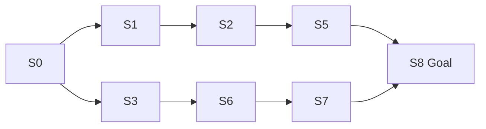
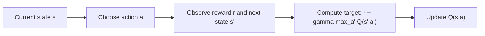
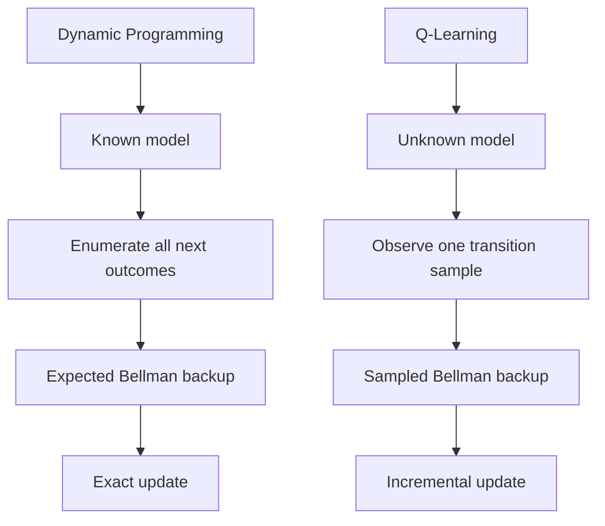

# Case Study: Dynamic Programming vs Q-Learning

This note presents two small case studies:

1. Dynamic Programming on a known grid world
2. Q-Learning on the same grid world without using the model

The goal is to show:
- how both methods try to solve the same decision problem
- why their update mechanisms are different
- when one is more appropriate than the other

## Common Environment

Consider a `3 x 3` grid world:

```text
+-----+-----+-----+
| S0  | S1  | S2  |
+-----+-----+-----+
| S3  | S4  | S5  |
+-----+-----+-----+
| S6  | S7  | S8  |
+-----+-----+-----+
```

Assumptions:
- start state: `S0`
- goal state: `S8`
- actions: `Up`, `Right`, `Down`, `Left`
- reward `+10` for reaching `S8`
- reward `-1` for every non-terminal move
- episode ends at `S8`

State layout:

```text
S0 S1 S2
S3 S4 S5
S6 S7 S8
```

Action mapping:

```python
UP = 0
RIGHT = 1
DOWN = 2
LEFT = 3
```

---

## State Value vs Action Value

Before comparing DP and Q-learning, it helps to separate two closely related ideas:

- state value
- action value

They are not immediate reward.
They are both about expected long-term return.

### State value

The state-value function `V_pi(s)` means:

- if the agent is currently in state `s`
- and then follows policy `pi`
- what total future reward is expected from that point onward?

So state value is a state-level summary.
It tells us how promising it is to be in a state under a policy.

It does **not** directly tell us which action is best unless we also know how actions change the state.

### Action value

The action-value function `Q_pi(s,a)` means:

- if the agent is currently in state `s`
- takes action `a` now
- and then follows policy `pi`
- what total future reward is expected from that point onward?

So action value is more specific than state value.
It scores an individual action inside a state.

### What they are not

Two common misunderstandings are:

- state value is not just "how quickly I can reach reward"
- action value is not just the immediate reward from the action

Why?

- an action may give a small reward now but lead to a much better future
- another action may give a large reward now but lead to poor states later

So both `V` and `Q` include:

- immediate reward
- plus discounted future rewards

### Small intuition example

Suppose in state `S4`:

- `Right` gives immediate reward `0`, but reaches a path to the goal
- `Left` gives immediate reward `+2`, but leads into a poor region

Then it is possible that:

- immediate reward of `Left` > immediate reward of `Right`
- but `Q(S4, Right) > Q(S4, Left)`

because `Q` measures total future return, not just the reward from the next step.

### Relationship between `V` and `Q`

State value and action value are related, but they are not added together.

It is **not** true that:

```text
total value = V(s) + Q(s,a)
```

Instead:

- `V_pi(s)` is the policy-weighted average of action values in that state
- `Q_pi(s,a)` is the value of one specific action choice in that state

Mathematically:

```math
V_{\pi}(s) = \sum_a \pi(a \mid s) Q_{\pi}(s,a)
```

For the optimal case:

```math
V^*(s) = \max_a Q^*(s,a)
```

So:

- if we know all action values, we can recover the state value
- but if we only know the state value, we usually cannot recover all action values unless we also know the model

### Why use state value at all?

A natural question is:

- if `Q(s,a)` is more detailed, why do we need `V(s)`?

State value is useful because it is a compact summary of how good a state is.

It is useful when we want to:

- evaluate how good a policy is
- compare states overall
- estimate how promising a state is
- do model-based policy improvement in DP

If the environment model is known, `V(s)` can be enough for control, because we can look one step ahead and ask:

- if I take action `a`, which next state might I reach?
- how valuable is that next state?

Then we can improve the policy using the state values.

### When is `Q` more useful?

If the model is unknown, `Q(s,a)` is often more useful for direct control because it already answers:

- in this state, which action is best?

That is why Q-learning learns action values directly.
Once `Q(s,a)` is learned, the agent can act by choosing:

```math
\arg\max_a Q(s,a)
```

So in practice:

- `V(s)` is a state-level evaluation tool
- `Q(s,a)` is an action-level decision tool

### Final intuition

You can think of them like this:

- `V(s)` asks: how good is this situation overall?
- `Q(s,a)` asks: how good is this move from this situation?

Or:

```text
V(s): value of being there
Q(s,a): value of doing that from there
```

This distinction is important for the rest of the note:

- Dynamic Programming often works comfortably with `V` because the model is known
- Q-learning focuses on `Q` because the agent must compare actions directly from sampled experience

### Why DP often uses `V` instead of `Q`

A common question is:

- if `Q(s,a)` is more detailed, why does dynamic programming so often use `V(s)`?

The answer is that policy evaluation in DP can be written using either one:

- evaluate the policy through `V_pi(s)`
- or evaluate the policy through `Q_pi(s,a)`

Both describe the same policy from two different levels of detail.

However, in a known-model setting, `V` is often enough for control.
That is because once we know the value of each next state, we can compare actions by using the transition model:

```math
\sum_{s',r} p(s',r \mid s,a)\left[r + \gamma V(s')\right]
```

This quantity tells us how good action `a` is by looking one step ahead and then using the state values.

So in DP:

- `V` is often used as the compact object being updated
- the model supplies the action consequences
- policy improvement uses those consequences to choose better actions

This means:

- if the model is known, `V` is often sufficient for policy improvement
- if the model is unknown, `V` alone is usually not enough to compare actions directly
- in that unknown-model case, learning `Q` is more practical

So your intuition is largely correct:

- `Q` is more detailed than `V`
- `Q` is often more directly useful for choosing actions
- but `V` is not redundant in DP, because the known model lets DP turn state values into action comparisons

That is why:

- DP often uses `V`
- Q-learning learns `Q`

---

## Case Study 1: Dynamic Programming

### What DP is solving

Dynamic programming is not itself "Q-learning".

Dynamic programming is a planning framework for solving an MDP when the full model is known.
It can be used to compute:

- `V_pi(s)`: the value of state `s` under a specific policy `pi`
- `Q_pi(s,a)`: the value of taking action `a` in state `s` under a specific policy `pi`
- `V*(s)`: the optimal state value
- `Q*(s,a)`: the optimal action value

So `Q` and `Q*` are not the same:

- `Q_pi(s,a)` means the expected return if you take action `a` in state `s` and then continue following policy `pi`
- `Q*(s,a)` means the best possible expected return if you take action `a` in state `s` and act optimally afterward

In short:

```text
Q_pi: action value under a particular policy
Q*:   optimal action value over all policies
```

This is why we should not call dynamic programming "Q* learning".

- DP is the broader method class
- `Q*` is one particular object that DP can compute
- Q-learning is a separate model-free algorithm whose goal is to learn `Q*` from sampled experience

DP is relevant here because it gives the exact Bellman target that Q-learning is trying to approximate.
If the model is known, DP can compute `Q*` directly by repeatedly applying Bellman optimality updates over all state-action pairs.
If the model is unknown, Q-learning uses sampled transitions to move its estimates toward that same `Q*`.

So the connection is:

```text
DP with known model        -> computes Q* by full expected backups
Q-learning without model  -> learns Q* by sampled backups
```

### Settings

In dynamic programming, we assume the finite MDP is fully known:

```math
\mathcal{M} = \left(\mathcal{S}, \mathcal{A}, p(s', r \mid s, a), \gamma\right)
```

In plain English, this means:

- the environment is modeled as an MDP $\mathcal{M}$
- $\mathcal{S}$ is the set of all states
- $\mathcal{A}$ is the set of all actions
- $p(s', r \mid s, a)$ is the conditional probability of getting next state $s'$ and reward $r$, given current state $s$ and action $a$
- $\gamma \in [0,1)$ is the discount factor used to discount future rewards

So in DP, the full model is known: for any current state $s$ and action $a$, we know the distribution over all possible next outcomes $(s', r)$, and we also know the fixed discount factor $\gamma$.

So for every state-action pair $(s, a)$, DP assumes the model gives:

- all possible next states $s'$
- all possible rewards $r$
- the full transition-reward distribution $p(s', r \mid s, a)$

Once the MDP model $\left(\mathcal{S}, \mathcal{A}, p(s', r \mid s, a), \gamma\right)$ is known, dynamic programming uses it to compute long-term return estimates under a policy $\pi(a \mid s)$. These are the state-value function $v_\pi(s)$ and the action-value function $q_\pi(s,a)$. They are defined in terms of the same transition-reward model $p(s', r \mid s, a)$ and the same discount factor $\gamma$.

For policy evaluation, the state-value function is:

```math
v_{\pi}(s) = \sum_a \pi(a \mid s)\sum_{s',r} p(s', r \mid s, a)\left[r + \gamma v_{\pi}(s')\right]
```

For action values:

```math
q_{\pi}(s,a) = \sum_{s',r} p(s', r \mid s, a)\left[r + \gamma \sum_{a'} \pi(a' \mid s') q_{\pi}(s', a')\right]
```

In many tabular Gymnasium toy-text environments, this model is exposed as:

```python
env.P[s][a]
```

Conceptually, the probability distribution is:

```python
p[(s, a)] = [
    (prob_1, next_state_1, reward_1),
    (prob_2, next_state_2, reward_2),
    ...
]
```

where the probabilities for a fixed $(s, a)$ sum to `1`.

In a tabular Gymnasium toy-text implementation, this is usually stored as:

```python
env.P: dict[int, dict[int, list[tuple[float, int, float, bool]]]]
```

Meaning:

- `env.P[s]` returns all actions available from state `s`
- `env.P[s][a]` returns a list of transitions for action `a` in state `s`
- each transition is `(prob, next_state, reward, done)`

So the implementation form of the transition-reward probability distribution is:

```python
env.P[s][a] = [
    (prob_1, next_state_1, reward_1, done_1),
    (prob_2, next_state_2, reward_2, done_2),
    ...
]
```

Here:

- `prob_i` corresponds to the probability mass from `p(s', r \mid s, a)`
- `next_state_i` is one possible `s'`
- `reward_i` is the reward paired with that `s'`
- `done_i` indicates whether that transition ends the episode

Example:

```python
env.P[7][1]
# [(1.0, 8, 10.0, True)]
```

This means:

- with probability `1.0`
- the next state is `8`
- the reward is `10.0`
- and the transition ends the episode

Note:
- this tabular `P` structure is common in Gymnasium toy-text style environments, but it is not part of the generic Gymnasium `Env` API for all environments
- some codebases may write `env.p[s][a]`, but the common attribute name in these environments is uppercase `env.P`

### Intuition

Dynamic programming computes values by applying Bellman updates repeatedly.

In this grid world:
- if moving `Right` from `S7` reaches `S8`, that action should become highly valued
- then states that can reach `S7` should also gain value
- eventually value information propagates backward through the whole grid

### Diagram



Dynamic programming uses the full model to evaluate all possible actions and transitions at every state.

### Example Policy Iteration Code

```python
import numpy as np


def policy_evaluation(env, policy, gamma=0.9, theta=1e-8):
    num_states = env.observation_space.n
    V = np.zeros(num_states)

    while True:
        delta = 0.0
        for s in range(num_states):
            old_v = V[s]
            new_v = 0.0

            for a, action_prob in enumerate(policy[s]):
                if action_prob == 0:
                    continue

                for prob, next_state, reward, done in env.P[s][a]:
                    new_v += action_prob * prob * (
                        reward + gamma * (1 - done) * V[next_state]
                    )

            V[s] = new_v
            delta = max(delta, abs(old_v - new_v))

        if delta < theta:
            break

    return V


def compute_q_from_v(env, V, gamma=0.9):
    num_states = env.observation_space.n
    num_actions = env.action_space.n
    Q = np.zeros((num_states, num_actions))

    for s in range(num_states):
        for a in range(num_actions):
            for prob, next_state, reward, done in env.P[s][a]:
                Q[s, a] += prob * (
                    reward + gamma * (1 - done) * V[next_state]
                )

    return Q


def policy_improvement(env, V, gamma=0.9):
    Q = compute_q_from_v(env, V, gamma)
    num_states, num_actions = Q.shape
    policy = np.zeros((num_states, num_actions))

    for s in range(num_states):
        best_action = np.argmax(Q[s])
        policy[s, best_action] = 1.0

    return policy, Q


def policy_iteration(env, gamma=0.9, theta=1e-8):
    num_states = env.observation_space.n
    num_actions = env.action_space.n
    policy = np.ones((num_states, num_actions)) / num_actions

    while True:
        V = policy_evaluation(env, policy, gamma=gamma, theta=theta)
        new_policy, Q = policy_improvement(env, V, gamma=gamma)

        if np.array_equal(new_policy, policy):
            break

        policy = new_policy

    return policy, V, Q
```

### Example Outcome

A likely optimal policy for the grid might look like:

```text
+---------+---------+---------+
| S0  ->  | S1  ->  | S2  v   |
+---------+---------+---------+
| S3  ->  | S4  ->  | S5  v   |
+---------+---------+---------+
| S6  ->  | S7  ->  | S8 Goal |
+---------+---------+---------+
```

This means:
- from the top row, move right until the last column
- then move down toward the goal

### What DP is doing

Dynamic programming is effectively asking:

- if I know the exact transition probabilities and rewards,
- what is the exact best value of each state,
- and therefore what is the exact best action at each state?

So DP performs **full expected backups**.

---

## Case Study 2: Q-Learning

### Setting

Now assume we do **not** know the model.

So we do not know:
- `env.P[s][a]`
- transition probabilities
- exact reward structure in table form

Instead, the agent only interacts with the environment and observes:

```text
(state, action, reward, next_state)
```

### Intuition

Q-learning starts with a zero Q-table and improves it from experience.

At first:
- the agent explores
- values are mostly guesses

Over many episodes:
- transitions leading toward the goal receive better value
- bad actions get lower value
- the Q-table gradually approximates the optimal action-value function

### Q-Learning Update

```math
Q(S_t,A_t) \leftarrow Q(S_t,A_t) + \alpha \left[R_{t+1} + \gamma \max_{a'} Q(S_{t+1},a') - Q(S_t,A_t)\right]
```

### Diagram



### Q-Learning Code

```python
import numpy as np
import random


def epsilon_greedy_action(Q, state, epsilon):
    if random.random() < epsilon:
        return random.randrange(Q.shape[1])
    return np.argmax(Q[state])


def q_learning(env, num_episodes=5000, alpha=0.1, gamma=0.9, epsilon=1.0,
               epsilon_decay=0.995, epsilon_min=0.01):
    num_states = env.observation_space.n
    num_actions = env.action_space.n
    Q = np.zeros((num_states, num_actions))

    for episode in range(num_episodes):
        state, _ = env.reset()
        done = False

        while not done:
            action = epsilon_greedy_action(Q, state, epsilon)
            next_state, reward, terminated, truncated, _ = env.step(action)
            done = terminated or truncated

            target = reward + gamma * (1 - done) * np.max(Q[next_state])
            Q[state, action] += alpha * (target - Q[state, action])

            state = next_state

        epsilon = max(epsilon_min, epsilon * epsilon_decay)

    return Q


def greedy_policy_from_q(Q):
    num_states, num_actions = Q.shape
    policy = np.zeros((num_states, num_actions))

    for s in range(num_states):
        best_action = np.argmax(Q[s])
        policy[s, best_action] = 1.0

    return policy
```

### Example Learning Story

Suppose the agent is in `S7` and takes `Right`.

If that reaches the goal `S8` with reward `+10`, then:

```text
Q(S7, Right) becomes large
```

Then later, if the agent is in `S6` and moving `Right` often leads to `S7`, then:

```text
Q(S6, Right) also increases
```

So just like DP, value information propagates backward, but here it happens from sampled experience instead of from the known model.

### Example Learned Policy

After enough episodes, the learned greedy policy may become:

```text
+---------+---------+---------+
| S0  ->  | S1  ->  | S2  v   |
+---------+---------+---------+
| S3  ->  | S4  ->  | S5  v   |
+---------+---------+---------+
| S6  ->  | S7  ->  | S8 Goal |
+---------+---------+---------+
```

So the final policy may match the dynamic programming solution, even though the learning process is completely different.

---

## Side-by-Side Comparison

### Core Difference

Dynamic Programming:
- knows the model
- computes exact expected updates

Q-Learning:
- does not know the model
- learns from sampled experience

### Backup Comparison

Dynamic programming backup:

```math
Q^*(s,a) = \sum_{s',r} p(s',r \mid s,a)\left[r + \gamma \max_{a'} Q^*(s',a')\right]
```

Q-learning backup:

```math
Q(s,a) \leftarrow Q(s,a) + \alpha \left[r + \gamma \max_{a'} Q(s',a') - Q(s,a)\right]
```

Interpretation:
- DP averages over **all possible next outcomes**
- Q-learning uses **one observed sample**

### Diagram



### Comparison Table

| Aspect | Dynamic Programming | Q-Learning |
|---|---|---|
| Model needed? | Yes | No |
| Uses `env.P[s][a]`? | Yes | No |
| Update type | Expected backup | Sampled backup |
| Learns from | Full model | Experience |
| Requires episodes? | Not necessarily | Usually trained over episodes |
| Exploration needed? | No | Yes |
| Typical setting | Known tabular MDP | Unknown environment |
| Converges to optimal? | Yes, under standard assumptions | Yes, under standard assumptions and sufficient exploration |

---

## Why Both Matter

State value and action value answer two different questions.

The state-value function `V(s)` asks:
- how good is it to be in state `s`?

The action-value function `Q(s,a)` asks:
- how good is it to take action `a` in state `s`?

So their roles are different:

- `V(s)` gives a summary of the long-term usefulness of a state under a policy
- `Q(s,a)` gives a decision-level score for each available action

Why do we need both?

- if we only know `V(s)`, we know whether a state is good or bad, but we do not directly know which action caused that goodness unless we also use the model
- if we know `Q(s,a)`, we can act immediately by choosing the action with the highest value
- in model-based methods like DP, `V(s)` is often convenient for policy evaluation because it summarizes each state compactly
- in control methods like Q-learning, `Q(s,a)` is especially useful because the agent must compare actions without knowing the model

Another way to say it:

```text
V(s): state-level evaluation
Q(s,a): action-level evaluation
```

Their practical purpose is:

- `V(s)` helps us understand how promising each state is
- `Q(s,a)` helps us choose what to do next

Their conceptual relationship is:

- `V(s)` is useful for evaluating states
- `Q(s,a)` is useful for improving decisions
- when a model is known, we can move between them
- when a model is unknown, learning `Q(s,a)` directly is often the most practical route to control

Dynamic programming is important because:
- it gives the clean mathematical foundation
- it shows what the exact Bellman solution looks like
- it explains policy evaluation, policy improvement, policy iteration, and value iteration

Q-learning is important because:
- in real problems the model is often unknown
- we still want to learn optimal behavior
- Q-learning shows how Bellman optimality can be learned from data

So the relationship is:

```text
Dynamic Programming:
  exact Bellman updates with known model

Q-Learning:
  sample-based Bellman updates without known model
```

---

## Final Takeaway

Both methods try to answer the same question:

- what is the best action to take in each state?

But they solve it differently:

- Dynamic Programming solves it from the model
- Q-Learning solves it from experience

So if the model is known, dynamic programming is the cleanest exact method.
If the model is unknown, Q-learning is a practical model-free alternative.

---

## Key Insights in Sutton-Style Framing

The following ideas are closely aligned with the way Sutton and Barto motivate these methods.

### Key insights behind Dynamic Programming

1. **Dynamic programming assumes a complete model of the environment**

DP requires knowledge of:
- state transitions
- rewards

This is why DP is mainly a planning method rather than a pure learning method.

2. **DP is built directly on the Bellman equations**

The Bellman expectation and Bellman optimality equations provide recursive definitions of value.
DP turns those recursive equations into iterative algorithms.

3. **Policy evaluation and policy improvement are the central decomposition**

A major insight is that control can be broken into two alternating steps:
- evaluate the current policy
- improve the policy using the current values

This leads naturally to policy iteration.

4. **Value iteration compresses evaluation and improvement together**

Instead of fully evaluating a policy before improving it, value iteration performs partial evaluation and greedy improvement in the same update.

5. **DP establishes the conceptual foundation for later RL methods**

Even when a model is not available, the structure of DP remains important because later methods such as TD learning and Q-learning can be understood as approximations to DP-style Bellman backups.

### Key insights behind Q-Learning

1. **Q-learning learns action values directly from experience**

Rather than learning a model first, Q-learning directly estimates:
$$
Q^*(s,a)
$$

This is a major shift from planning with a model to learning from interaction.

2. **Q-learning is a sample-based version of Bellman optimality updates**

Instead of averaging over all possible next outcomes, Q-learning updates from one sampled transition at a time.

So it can be seen as replacing:
- full expected backup

with:
- sampled backup

3. **Q-learning is off-policy**

This is one of the most important conceptual insights.

The agent may behave using an exploratory policy, such as epsilon-greedy, but the update target still uses:
$$
\max_{a'} Q(s',a')
$$

So it learns about the greedy policy while behaving differently during learning.

4. **The learned Q-values are enough for control**

Once the Q-table is learned, there is no need to separately learn a model or a state-value function.
The policy can be obtained directly by choosing:
$$
\arg\max_a Q(s,a)
$$

5. **Q-learning brings optimal control into the model-free setting**

This is the core reason it is so influential.
It keeps the optimality idea from dynamic programming, but removes the need for a known transition model.

### Shared insight across both methods

Both dynamic programming and Q-learning are driven by the same high-level idea:

- good decisions today depend on reward today plus good decisions tomorrow

In Sutton-style RL, this is the unifying role of Bellman recursion.

So:
- DP uses Bellman recursion with a known model
- Q-learning uses Bellman recursion with sampled experience

### Short summary

```text
Dynamic Programming:
  planning with a known model
  exact Bellman backups
  policy evaluation + policy improvement

Q-Learning:
  learning without a model
  sampled Bellman optimality backups
  direct estimation of optimal action values
```
