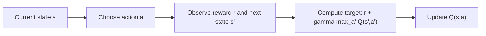
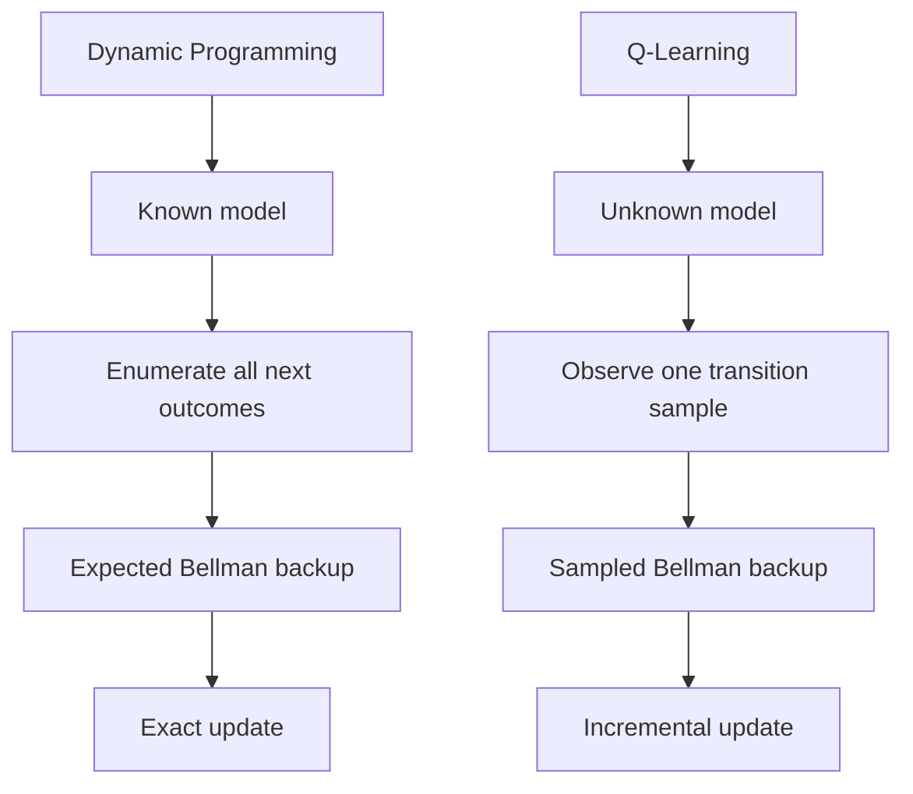

# Case Study: Dynamic Programming vs Q-Learning

This note presents two small case studies:

1. Dynamic Programming on a known grid world
2. Q-Learning on the same grid world without using the model

The goal is to show:
- how both methods try to solve the same decision problem
- why their update mechanisms are different
- when one is more appropriate than the other

## Common Environment

Consider a `3 x 3` grid world:

```text
+-----+-----+-----+
| S0  | S1  | S2  |
+-----+-----+-----+
| S3  | S4  | S5  |
+-----+-----+-----+
| S6  | S7  | S8  |
+-----+-----+-----+
```

Model details: Transition Probabilities and Rewards : $p(s', r \mid s, a)$
- start state: `S0`
- goal state: `S8`
- reward `+10` for reaching `S8`
- episode ends at `S8`
- reward `-1` for every non-terminal move

Agent details: Policy : $\pi(a \mid s)$
- actions: `Up`, `Right`, `Down`, `Left`

Action mapping:

```python
UP = 0
RIGHT = 1
DOWN = 2
LEFT = 3
```
## Case Study 1: Dynamic Programming

### What DP is solving

Dynamic programming is a planning framework for solving an MDP when the full model is known. i.e. we know the transition-reward distribution $p(s', r \mid s, a)$ for every state-action pair.

It can be used to compute:

>- $V_\pi(s)$: the value of state $s$ under a ***specific policy $\pi$***
>- $Q_\pi(s,a)$: the value of taking action $a$ in state $s$ under a ***specific policy $\pi$***
>- $V^⋆(s)$: the optimal state value - ***over all policies***
>- $Q^⋆(s,a)$: the optimal action value - ***over all policies***


>DP gives the exact Bellman target that Q-learning is trying to approximate.
>If the model is known, DP can compute `Q*` directly by repeatedly applying Bellman optimality updates over all state-action pairs.
>If the model is unknown, Q-learning uses sampled transitions to move its estimates toward that same `Q*`.

So the connection is:

```text
DP with known model        -> computes Q* by full expected backups
Q-learning without model   -> learns Q* by sampled backups
```

### Settings

In dynamic programming, we assume the finite MDP is fully known:

$$
\mathcal{M} = \left(\mathcal{S}, \mathcal{A}, \pi(a \mid s), p(s', r \mid s, a), \gamma\right)
$$

In plain English, this means:

- the environment is modeled as an MDP $\mathcal{M}$
- $\mathcal{S}$ is the set of all states
- $\mathcal{A}$ is the set of all actions
- $\pi(a \mid s)$ is the policy that maps states to actions
- $p(s', r \mid s, a)$ is the conditional probability of getting next state $s'$ and reward $r$, given current state $s$ and action $a$
- $\gamma \in [0,1)$ is the discount factor used to discount future rewards


Once the MDP model $\mathcal{M}$ is known, dynamic programming uses it to compute long-term return estimates. These are the state-value function $v_\pi(s)$ and the action-value function $q_\pi(s,a)$. 

For policy evaluation, the state-value function is:

$$
v_{\pi}(s) = \sum_a \pi(a \mid s)\sum_{s',r} p(s', r \mid s, a)\left[r + \gamma v_{\pi}(s')\right]
$$

For action values:

$$
q_{\pi}(s,a) = \sum_{s',r} p(s', r \mid s, a)\left[r + \gamma \sum_{a'} \pi(a' \mid s') q_{\pi}(s', a')\right]
$$

### Source Code 

<iframe
src="/assets/drl/webinars/dp-qlearning/src/dynamic_programming_case_study.html"
width="100%"
height="900"
style="border: 1px solid #ddd;">
</iframe>


## Case Study 2: Q-Learning

### Setting

Now assume we do **not** know the model.

So we do not know:
- `env.P[s][a]`
- transition probabilities
- exact reward structure in table form

Instead, the agent only interacts with the environment and observes:

```text
(state, action, reward, next_state)
```

### Intuition

Q-learning starts with a zero Q-table and improves it from experience.

At first:
- the agent explores
- values are mostly guesses

Over many episodes:
- transitions leading toward the goal receive better value
- bad actions get lower value
- the Q-table gradually approximates the optimal action-value function

### Q-Learning Update

```math
Q(S_t,A_t) \leftarrow Q(S_t,A_t) + \alpha \left[R_{t+1} + \gamma \max_{a'} Q(S_{t+1},a') - Q(S_t,A_t)\right]
```

### Diagram



### Q-Learning Code

```python
import numpy as np
import random


def epsilon_greedy_action(Q, state, epsilon):
    if random.random() < epsilon:
        return random.randrange(Q.shape[1])
    return np.argmax(Q[state])


def q_learning(env, num_episodes=5000, alpha=0.1, gamma=0.9, epsilon=1.0,
               epsilon_decay=0.995, epsilon_min=0.01):
    num_states = env.observation_space.n
    num_actions = env.action_space.n
    Q = np.zeros((num_states, num_actions))

    for episode in range(num_episodes):
        state, _ = env.reset()
        done = False

        while not done:
            action = epsilon_greedy_action(Q, state, epsilon)
            next_state, reward, terminated, truncated, _ = env.step(action)
            done = terminated or truncated

            target = reward + gamma * (1 - done) * np.max(Q[next_state])
            Q[state, action] += alpha * (target - Q[state, action])

            state = next_state

        epsilon = max(epsilon_min, epsilon * epsilon_decay)

    return Q


def greedy_policy_from_q(Q):
    num_states, num_actions = Q.shape
    policy = np.zeros((num_states, num_actions))

    for s in range(num_states):
        best_action = np.argmax(Q[s])
        policy[s, best_action] = 1.0

    return policy
```

### Example Learning Story

Suppose the agent is in `S7` and takes `Right`.

If that reaches the goal `S8` with reward `+10`, then:

```text
Q(S7, Right) becomes large
```

Then later, if the agent is in `S6` and moving `Right` often leads to `S7`, then:

```text
Q(S6, Right) also increases
```

So just like DP, value information propagates backward, but here it happens from sampled experience instead of from the known model.

### Example Learned Policy

After enough episodes, the learned greedy policy may become:

```text
+---------+---------+---------+
| S0  ->  | S1  ->  | S2  v   |
+---------+---------+---------+
| S3  ->  | S4  ->  | S5  v   |
+---------+---------+---------+
| S6  ->  | S7  ->  | S8 Goal |
+---------+---------+---------+
```

So the final policy may match the dynamic programming solution, even though the learning process is completely different.

---

## Side-by-Side Comparison

### Core Difference

Dynamic Programming:
- knows the model
- computes exact expected updates

Q-Learning:
- does not know the model
- learns from sampled experience

### Backup Comparison

Dynamic programming backup:

```math
Q^*(s,a) = \sum_{s',r} p(s',r \mid s,a)\left[r + \gamma \max_{a'} Q^*(s',a')\right]
```

Q-learning backup:

```math
Q(s,a) \leftarrow Q(s,a) + \alpha \left[r + \gamma \max_{a'} Q(s',a') - Q(s,a)\right]
```

Interpretation:
- DP averages over **all possible next outcomes**
- Q-learning uses **one observed sample**

### Diagram



### Comparison Table

| Aspect | Dynamic Programming | Q-Learning |
|---|---|---|
| Model needed? | Yes | No |
| Uses `env.P[s][a]`? | Yes | No |
| Update type | Expected backup | Sampled backup |
| Learns from | Full model | Experience |
| Requires episodes? | Not necessarily | Usually trained over episodes |
| Exploration needed? | No | Yes |
| Typical setting | Known tabular MDP | Unknown environment |
| Converges to optimal? | Yes, under standard assumptions | Yes, under standard assumptions and sufficient exploration |

---

## Why Both Matter

State value and action value answer two different questions.

The state-value function `V(s)` asks:
- how good is it to be in state `s`?

The action-value function `Q(s,a)` asks:
- how good is it to take action `a` in state `s`?

So their roles are different:

- `V(s)` gives a summary of the long-term usefulness of a state under a policy
- `Q(s,a)` gives a decision-level score for each available action

Why do we need both?

- if we only know `V(s)`, we know whether a state is good or bad, but we do not directly know which action caused that goodness unless we also use the model
- if we know `Q(s,a)`, we can act immediately by choosing the action with the highest value
- in model-based methods like DP, `V(s)` is often convenient for policy evaluation because it summarizes each state compactly
- in control methods like Q-learning, `Q(s,a)` is especially useful because the agent must compare actions without knowing the model

Another way to say it:

```text
V(s): state-level evaluation
Q(s,a): action-level evaluation
```

Their practical purpose is:

- `V(s)` helps us understand how promising each state is
- `Q(s,a)` helps us choose what to do next

Their conceptual relationship is:

- `V(s)` is useful for evaluating states
- `Q(s,a)` is useful for improving decisions
- when a model is known, we can move between them
- when a model is unknown, learning `Q(s,a)` directly is often the most practical route to control

Dynamic programming is important because:
- it gives the clean mathematical foundation
- it shows what the exact Bellman solution looks like
- it explains policy evaluation, policy improvement, policy iteration, and value iteration

Q-learning is important because:
- in real problems the model is often unknown
- we still want to learn optimal behavior
- Q-learning shows how Bellman optimality can be learned from data

So the relationship is:

```text
Dynamic Programming:
  exact Bellman updates with known model

Q-Learning:
  sample-based Bellman updates without known model
```

---

## Final Takeaway

Both methods try to answer the same question:

- what is the best action to take in each state?

But they solve it differently:

- Dynamic Programming solves it from the model
- Q-Learning solves it from experience

So if the model is known, dynamic programming is the cleanest exact method.
If the model is unknown, Q-learning is a practical model-free alternative.

---

## Key Insights in Sutton-Style Framing

The following ideas are closely aligned with the way Sutton and Barto motivate these methods.

### Key insights behind Dynamic Programming

1. **Dynamic programming assumes a complete model of the environment**

DP requires knowledge of:
- state transitions
- rewards

This is why DP is mainly a planning method rather than a pure learning method.

2. **DP is built directly on the Bellman equations**

The Bellman expectation and Bellman optimality equations provide recursive definitions of value.
DP turns those recursive equations into iterative algorithms.

3. **Policy evaluation and policy improvement are the central decomposition**

A major insight is that control can be broken into two alternating steps:
- evaluate the current policy
- improve the policy using the current values

This leads naturally to policy iteration.

4. **Value iteration compresses evaluation and improvement together**

Instead of fully evaluating a policy before improving it, value iteration performs partial evaluation and greedy improvement in the same update.

5. **DP establishes the conceptual foundation for later RL methods**

Even when a model is not available, the structure of DP remains important because later methods such as TD learning and Q-learning can be understood as approximations to DP-style Bellman backups.

### Key insights behind Q-Learning

1. **Q-learning learns action values directly from experience**

Rather than learning a model first, Q-learning directly estimates:
$$
Q^*(s,a)
$$

This is a major shift from planning with a model to learning from interaction.

2. **Q-learning is a sample-based version of Bellman optimality updates**

Instead of averaging over all possible next outcomes, Q-learning updates from one sampled transition at a time.

So it can be seen as replacing:
- full expected backup

with:
- sampled backup

3. **Q-learning is off-policy**

This is one of the most important conceptual insights.

The agent may behave using an exploratory policy, such as epsilon-greedy, but the update target still uses:
$$
\max_{a'} Q(s',a')
$$

So it learns about the greedy policy while behaving differently during learning.

4. **The learned Q-values are enough for control**

Once the Q-table is learned, there is no need to separately learn a model or a state-value function.
The policy can be obtained directly by choosing:
$$
\arg\max_a Q(s,a)
$$

5. **Q-learning brings optimal control into the model-free setting**

This is the core reason it is so influential.
It keeps the optimality idea from dynamic programming, but removes the need for a known transition model.

### Shared insight across both methods

Both dynamic programming and Q-learning are driven by the same high-level idea:

- good decisions today depend on reward today plus good decisions tomorrow

In Sutton-style RL, this is the unifying role of Bellman recursion.

So:
- DP uses Bellman recursion with a known model
- Q-learning uses Bellman recursion with sampled experience

### Short summary

```text
Dynamic Programming:
  planning with a known model
  exact Bellman backups
  policy evaluation + policy improvement

Q-Learning:
  learning without a model
  sampled Bellman optimality backups
  direct estimation of optimal action values
```
