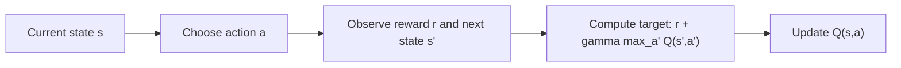
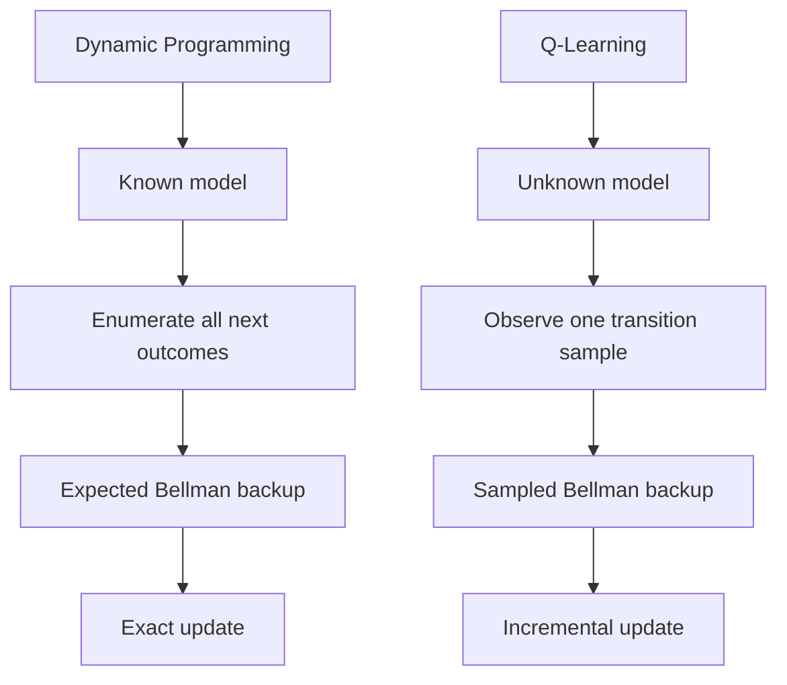

# Case Study: Dynamic Programming vs Q-Learning

This note presents two small case studies:

1. Dynamic Programming on a known grid world
2. Q-Learning on the same grid world without using the model

The goal is to show:
- how both methods try to solve the same decision problem
- why their update mechanisms are different
- when one is more appropriate than the other

## Common Environment

Consider a `3 x 3` grid world:

```text
+-----+-----+-----+
| S0  | S1  | S2  |
+-----+-----+-----+
| S3  | S4  | S5  |
+-----+-----+-----+
| S6  | S7  | S8  |
+-----+-----+-----+
```

Model details: Transition Probabilities and Rewards : $p(s', r \mid s, a)$
- start state: `S0`
- goal state: `S8`
- reward `+10` for reaching `S8`
- episode ends at `S8`
- reward `-1` for every non-terminal move

Agent details: Policy : $\pi(a \mid s)$
- actions: `Up`, `Right`, `Down`, `Left`

Action mapping:

```python
UP = 0
RIGHT = 1
DOWN = 2
LEFT = 3
```
## Case Study 1: Dynamic Programming

### What DP is solving

Dynamic programming is a planning framework for solving an MDP when the full model is known. i.e. we know the transition-reward distribution $p(s', r \mid s, a)$ for every state-action pair.

It can be used to compute:

>- $V_\pi(s)$: the value of state $s$ under a ***specific policy $\pi$***
>- $Q_\pi(s,a)$: the value of taking action $a$ in state $s$ under a ***specific policy $\pi$***
>- $V^⋆(s)$: the optimal state value - ***over all policies***
>- $Q^⋆(s,a)$: the optimal action value - ***over all policies***


>DP gives the exact Bellman target that Q-learning is trying to approximate.
>If the model is known, DP can compute `Q*` directly by repeatedly applying Bellman optimality updates over all state-action pairs.
>If the model is unknown, Q-learning uses sampled transitions to move its estimates toward that same `Q*`.

So the connection is:

```text
DP with known model        -> computes Q* by full expected backups
Q-learning without model   -> learns Q* by sampled backups
```

### Settings

In dynamic programming, we assume the finite MDP is fully known:

$$
\mathcal{M} = \left(\mathcal{S}, \mathcal{A}, \pi(a \mid s), p(s', r \mid s, a), \gamma\right)
$$

In plain English, this means:

- the environment is modeled as an MDP $\mathcal{M}$
- $\mathcal{S}$ is the set of all states
- $\mathcal{A}$ is the set of all actions
- $\pi(a \mid s)$ is the policy that maps states to actions
- $p(s', r \mid s, a)$ is the conditional probability of getting next state $s'$ and reward $r$, given current state $s$ and action $a$
- $\gamma \in [0,1)$ is the discount factor used to discount future rewards


Once the MDP model $\mathcal{M}$ is known, dynamic programming uses it to compute long-term return estimates. These are the state-value function $V_\pi(s)$ and the action-value function $Q_\pi(s,a)$. 

For policy evaluation, the state-value function is:

$$
V^{\pi}(s) = \sum_a \pi(a \mid s)\sum_{s',r} p(s', r \mid s, a)\left[r + \gamma V^{\pi}(s')\right]
$$

For action values:

$$
Q^{\pi}(s,a) = \sum_{s',r} P(s', r \mid s, a)\left[r + \gamma \sum_{a'} \pi(a' \mid s') Q^{\pi}(s', a')\right]
$$

$$Q^{\pi}(s,a) = \sum_{s',r} P(s',r \mid s,a)\left[r + \gamma V^{\pi}(s')\right]$$

### The Big Picture
- **Dynamic Programming**: definition/analytic level with a **known model**.
- **Monte Carlo + TD (SARSA, Q-learning)**: **sample level**, learning from experience without knowing the model.
  - MC: sample-based, no bootstrapping.
  - TD (SARSA, Q-learning): sample-based **with** bootstrapping.

<div class="mermaid">
flowchart TB
  A["Bellman Equations (Theory)<br/>Definition level"]
  A --> B{"Do we know the full MDP?<br/>(transitions & rewards)"}

  B -->|Yes| C["Dynamic Programming (DP)<br/>Model-based"]
  B -->|No| D["Model-free RL<br/>Sample level"]

    C --> C1[Policy Evaluation]
    C --> C2[Policy Iteration]
    C --> C3[Value Iteration]

    D --> E["Monte Carlo (MC)"]
    D --> F["Temporal-Difference (TD)"]

    E:::mc
    F:::td

    F --> G["SARSA<br/>(on-policy TD control)"]
    F --> H["Q-learning<br/>(off-policy TD control)"]

    classDef mc fill:#e0f7fa,stroke:#00838f,stroke-width:1px;
    classDef td fill:#fff3e0,stroke:#ef6c00,stroke-width:1px;
</div>


### Source Code Dynamic Programming


<a href="https://github.com/samratkar/samratkar.github.io/blob/main/assets/drl/webinars/dp-qlearning/src/dynamic_programming_case_study.ipynb" target="_blank" rel="noopener noreferrer">
    Open for source code for Dynamic Programming case study
</a> 

### The gridboard game 

<a href="/assets/drl/webinars/dp-qlearning/src/dynamic_programming_game.html" target="_blank" rel="noopener noreferrer">
    Open the game in the a new tab full screen mode
</a> 


### Key Points - 
1. DP is a planning method that computes exact value functions from a known model.
2. DP uses the Bellman equations to iteratively compute values.
3. DP can compute both state values and action values, which are useful for different purposes.
4. DP is not a learning method in the sense of learning from experience, but it provides
the theoretical foundation for later learning methods that do learn from experience.
5. In DP, the $P(s', r \mid s, a)$ is constant, and it does not change. that is known as the model. In Q-learning, we do not have access to this model, and we learn from samples instead.
6. However, in DP we do learn and optimize on the $\pi (a \mid s)$, which is the policy. So, environment model is constant. But the action plicies change. However it is started with a static arbitrary policy which is then improved. That process is known as bootstrapping. 
7. In Q-learning, we also learn and optimize on the policy, but we do it indirectly by learning $Q(s,a)$ values that guide the policy. 
8. DP is : 
- model-based
- expectation-based
- sweep over all states and actions
- policy is udpated between interactions.

## Case Study 2: Q-Learning

### Q Learning - what it does?

1. Initialize Q = 0
2. for each episode : 
    - reset environment
    - choose actios with epsilon-greedy policy from current Q
    - call env.step(action)
    - update Q using tempral difference, i.e difference between current Q and target Q

    $$
    Q(S_t,A_t) \leftarrow Q(S_t,A_t) + \alpha \left[R_{t+1} + \gamma \max_{a'} Q(S_{t+1},a') - Q(S_t,A_t)\right]
    $$
3. it is a model free in the learning rule.
4. sample based
5. online / incremental 
6. directly learning Q, not first computing V.
7. environment model ($P(s', r \mid s, a)$) is unknown and not used in the learning rule. But it does use other information such as the reward and the next state observed from the environment. It uses the following - 
- env.reset()
- env.step(action)
- env.observation_space.n
- env.action_space.n
8. there is no policy evaluation step. It directly learns the optimal action values, and the policy is implicitly defined as the ϵ - greedy policy with respect to the learned Q values.
9. DP is "evaluate current policy, then improve it.". Q learnign is "use current Q to act, then update Q from samples".
10. Q learning will have several episodes of interaction with the environment, and it will learn from the experience of those interactions. DP does not require episodes of interaction because it has the full model.


### Setting

Now assume we do **not** know the model.

So we do not know:
- `env.P[s][a]`
- transition probabilities
- exact reward structure in table form

Instead, the agent only interacts with the environment and observes:

```text
(state, action, reward, next_state)
```

### Intuition

Q-learning starts with a zero Q-table and improves it from experience.

At first:
- the agent explores
- values are mostly guesses

Over many episodes:
- transitions leading toward the goal receive better value
- bad actions get lower value
- the Q-table gradually approximates the optimal action-value function

### Q-Learning Update

```math
Q(S_t,A_t) \leftarrow Q(S_t,A_t) + \alpha \left[R_{t+1} + \gamma \max_{a'} Q(S_{t+1},a') - Q(S_t,A_t)\right]
```

### Diagram




### Example Learning Story

Suppose the agent is in `S7` and takes `Right`.

If that reaches the goal `S8` with reward `+10`, then:

```text
Q(S7, Right) becomes large
```

Then later, if the agent is in `S6` and moving `Right` often leads to `S7`, then:

```text
Q(S6, Right) also increases
```

So just like DP, value information propagates backward, but here it happens from sampled experience instead of from the known model.

### Example Learned Policy

After enough episodes, the learned greedy policy may become:

```text
+---------+---------+---------+
| S0  ->  | S1  ->  | S2  v   |
+---------+---------+---------+
| S3  ->  | S4  ->  | S5  v   |
+---------+---------+---------+
| S6  ->  | S7  ->  | S8 Goal |
+---------+---------+---------+
```

So the final policy may match the dynamic programming solution, even though the learning process is completely different.

---


### Core Difference

Dynamic Programming:
- knows the model
- computes exact expected updates

Q-Learning:
- does not know the model
- learns from sampled experience

### Backup Comparison

Dynamic programming backup:

```math
Q^*(s,a) = \sum_{s',r} p(s',r \mid s,a)\left[r + \gamma \max_{a'} Q^*(s',a')\right]
```

Q-learning backup:

```math
Q(s,a) \leftarrow Q(s,a) + \alpha \left[r + \gamma \max_{a'} Q(s',a') - Q(s,a)\right]
```

Interpretation:
- DP averages over **all possible next outcomes**
- Q-learning uses **one observed sample**

### Diagram



### Comparison Table

| Aspect | Dynamic Programming | Q-Learning |
|---|---|---|
| Model needed? | Yes | No |
| Uses `env.P[s][a]`? | Yes | No |
| Update type | Expected backup | Sampled backup |
| Learns from | Full model | Experience |
| Requires episodes? | Not necessarily | Usually trained over episodes |
| Exploration needed? | No | Yes |
| Typical setting | Known tabular MDP | Unknown environment |
| Converges to optimal? | Yes, under standard assumptions | Yes, under standard assumptions and sufficient exploration |

---

### Why Both Matter

State value and action value answer two different questions.

The state-value function `V(s)` asks:
- how good is it to be in state `s`?

The action-value function `Q(s,a)` asks:
- how good is it to take action `a` in state `s`?

So their roles are different:

- `V(s)` gives a summary of the long-term usefulness of a state under a policy
- `Q(s,a)` gives a decision-level score for each available action

Why do we need both?

- if we only know `V(s)`, we know whether a state is good or bad, but we do not directly know which action caused that goodness unless we also use the model
- if we know `Q(s,a)`, we can act immediately by choosing the action with the highest value
- in model-based methods like DP, `V(s)` is often convenient for policy evaluation because it summarizes each state compactly
- in control methods like Q-learning, `Q(s,a)` is especially useful because the agent must compare actions without knowing the model

Another way to say it:

```text
V(s): state-level evaluation
Q(s,a): action-level evaluation
```

Their practical purpose is:

- `V(s)` helps us understand how promising each state is
- `Q(s,a)` helps us choose what to do next

Their conceptual relationship is:

- `V(s)` is useful for evaluating states
- `Q(s,a)` is useful for improving decisions
- when a model is known, we can move between them
- when a model is unknown, learning `Q(s,a)` directly is often the most practical route to control

Dynamic programming is important because:
- it gives the clean mathematical foundation
- it shows what the exact Bellman solution looks like
- it explains policy evaluation, policy improvement, policy iteration, and value iteration

Q-learning is important because:
- in real problems the model is often unknown
- we still want to learn optimal behavior
- Q-learning shows how Bellman optimality can be learned from data

So the relationship is:

```text
Dynamic Programming:
  exact Bellman updates with known model

Q-Learning:
  sample-based Bellman updates without known model
```

---

### Final Takeaway

Both methods try to answer the same question:

- what is the best action to take in each state?

But they solve it differently:

- Dynamic Programming solves it from the model
- Q-Learning solves it from experience

So if the model is known, dynamic programming is the cleanest exact method.
If the model is unknown, Q-learning is a practical model-free alternative.

### Source Code Q Learning


<a href="https://github.com/samratkar/samratkar.github.io/blob/main/assets/drl/webinars/dp-qlearning/src/q_learning_case_study.ipynb" target="_blank" rel="noopener noreferrer">
    Source code for Q-Learning case study
</a> 


### The gridboard game 

<a href="/assets/drl/webinars/dp-qlearning/src/q_learning_game.html" target="_blank" rel="noopener noreferrer">
    Open the game in the a new tab full screen mode
</a> 


