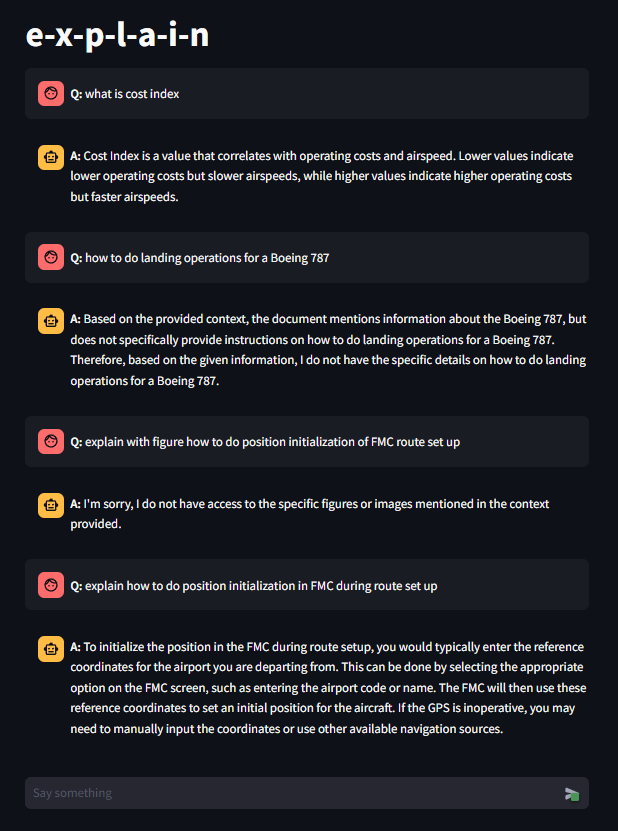
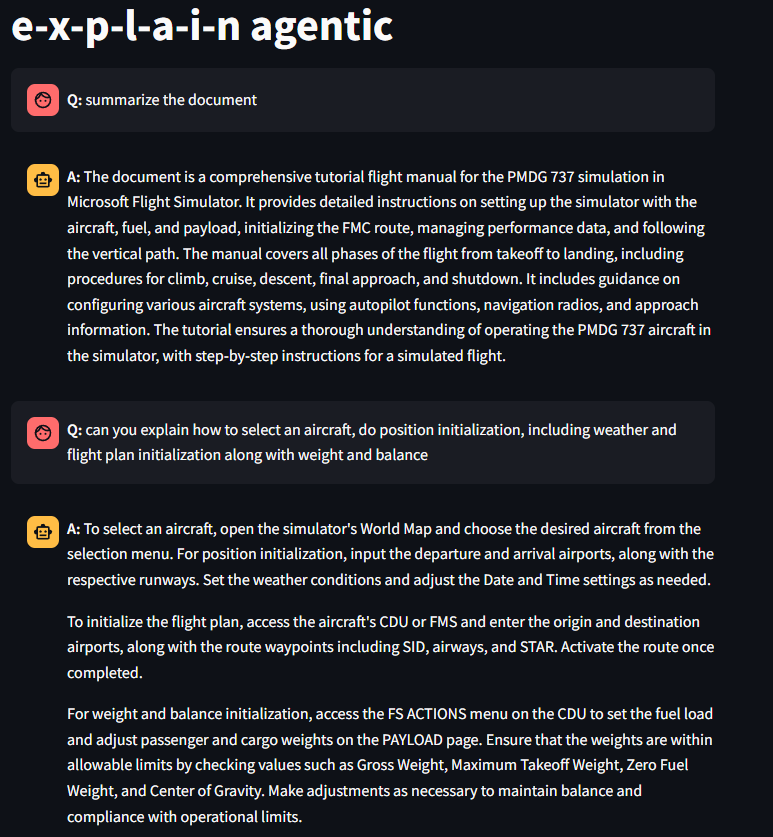
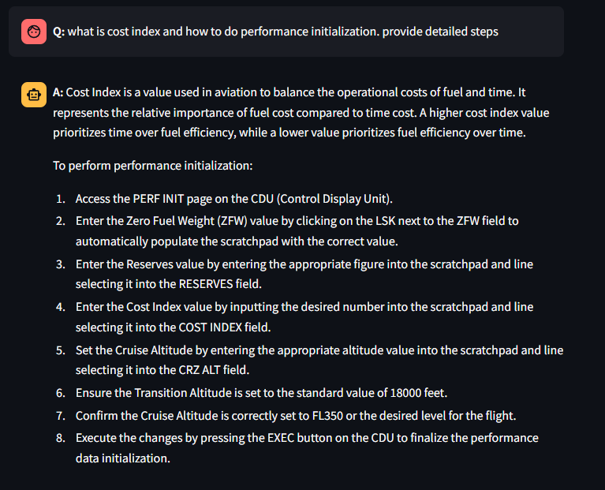
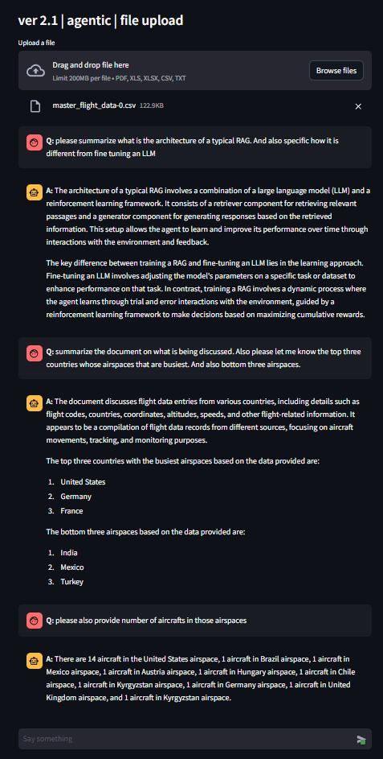
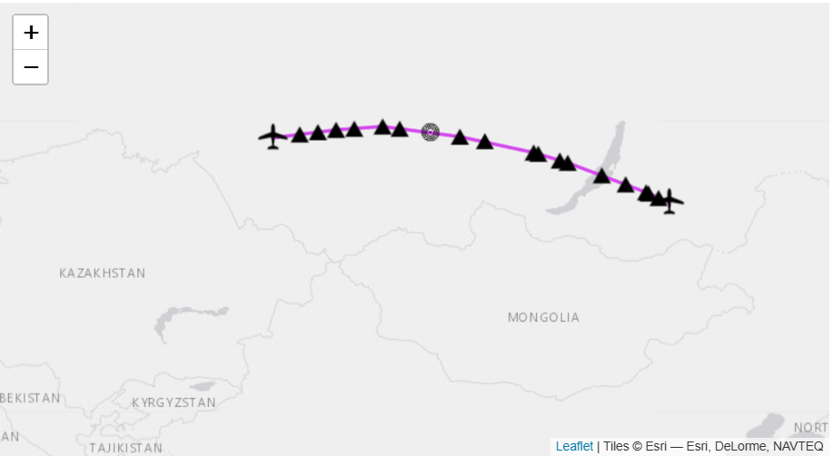
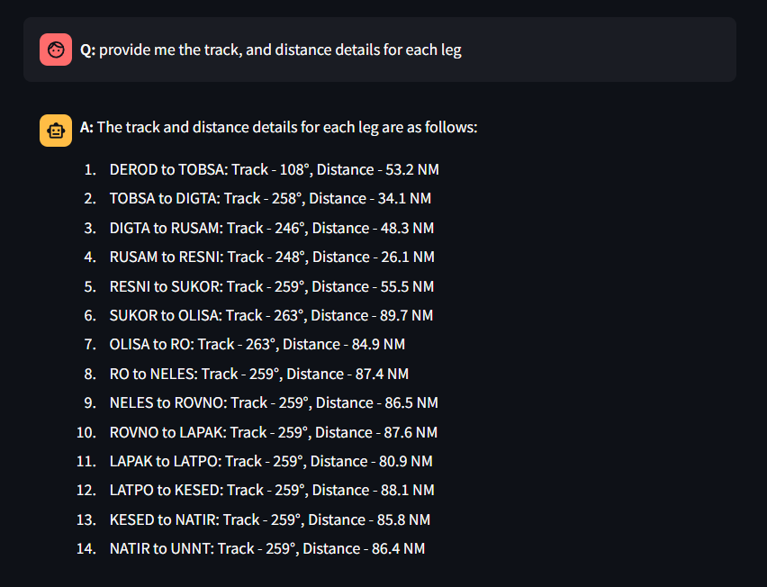
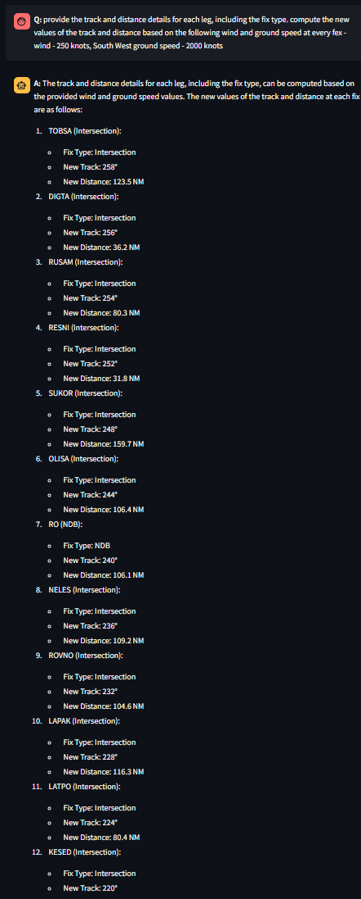
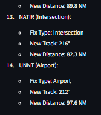

# e-x-p-l-a-i-n

**"e-x-p-l-a-i-n"** This is an AI assistant that can be used by any user

# e-x-p-l-a-i-n agentic

# e-x-p-l-a-i-n non agentic

# e-x-p-l-a-i-n agentic pilot manual

# e-x-p-l-a-i-n agentic with file upload

**with change in file, the RAG happens in runtime on the different file**

## Flight Plan modification with wind data

### Input

1. flight plan - [http://onlineflightplanner.org/](http://onlineflightplanner.org/)
2. Departure: Chita-Kadala Airport, Russia (UIAA)
3. Destination: Tolmachevo Airport, Russia (UNNT)
4. Aircraft - A319
5. Altitude range - FL080 - FL290
6. Fuel usage - 6927 Kgs
7. Reserved fuel - 2824 Kgs
8. Fuel on board - 9759 Kgs

### Original flight plan 

### Modified flight plan with the wind data 

