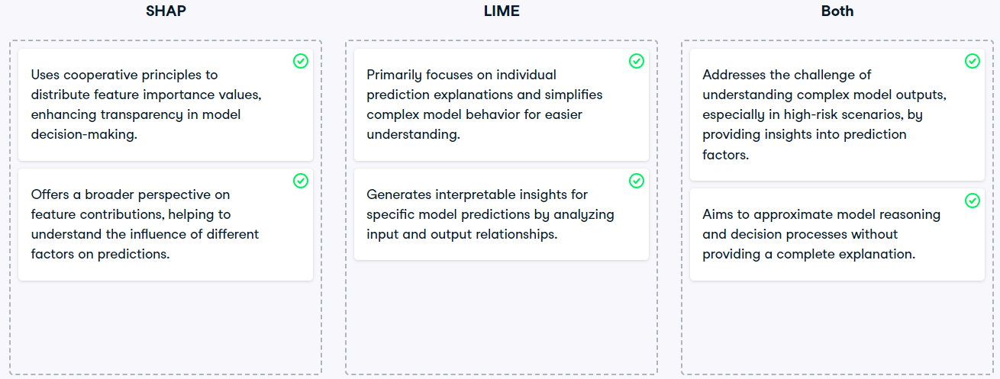

# xai

1. **transparency** is about when the ai system is open about its data sources and it's processing. the entire flow of the data processing is traceable.
2. **interpretability** is when an ai system is able to explain and justify the cause of its decision in a human comprehendible form.
   examples of interpretable ai

- a recommendation system is able to outline the key features of a recommended product. and highlights why these features led to its recommendations
- a facial recognition system outlines the facial features it uses to identify the individual

3. **objectives of xai** -
   1. transparency and
   2. accountability of the ai system.
4. **communication of xai**
   1. should be based on the customer segmentation. based on the audience there should be a fair mix of technical and non technical details.
5. **xai explanations** - Choosing the right type of explanation depends upon the specific needs and contexts.
   1. **local explanations** - explain the model's decision for a single instance. explains why the model made a particular decision for a single instance.
   2. **global explanations** - explain the model's decision for the entire dataset. this explains the model's decision for the entire dataset, across wide range of scenarios.
   3. **model specific explanations** - explain the model's decision based on the model's architecture. eg. decision trees.
      1. regression - Regression is about determining relationship between two variables. Like the relationship between outside temperature and ice cream sales.
      2. classification - Classification is about predicting the category (or label) of a given data point. Like predicting whether an email is spam or not.
      3. blackbox models - The models that are difficult to interpret. Like deep learning models.They have ability to handle vast datasets and uncover intricate patterns, but their inner workings are difficult to understand.
   4. **model agnostic explanations** - explain the model's decision without considering the model's architecture. these explanations do not need to know the inner workings of the model. They try to provide explanations based on the model's input and output. This explanation works well typically when dealing with multiple models.
6. **techniques in xai** -  provide estimations of the model's reasoning, without altering the model itself. Especially useful for *blackbox models*. - both these techniques see the impact of a feature on the model's decision. LIME is local. SHAP is global. Both are experimental explanations.
   1. **LIME** - local interpretable model-agnostic explanations. Why a car made a specific turn in a specific situation. It sees impact of a feature for a specific decision.
   2. **SHAP** - shapley additive explanations - this is a global explanation model agnostic technique. works as a detective. looks into each feature, and identifies how much one contributes to the final decision. In game theory there is something known as "shapley values" which is used to determine the contribution of each player in a game. SHAP uses the same concept to determine the contribution of each feature in the final decision.shapley is like feature engineering. it is about finding which feature matters the most for the outcome. While SHAP does involve a broad analysis, it's more about the contribution of individual elements to a specific outcome rather than a general statistical overview.
      
7. **Complexity of LLMs** - primary challenge of LLMs are their blackbox nature.
   1. LLMs are huge neural networks with vast amount of layers. Given their complexity and the sheer scale of data they're trained on, it's often not clear why a model generates a specific piece of text.
   2. The complexities of these models, combined with their ability to learn and replicate biases present in their training data, make it imperative to develop methods to peer into these black boxes, ensuring they operate fairly, ethically, and transparently.
8. **Explainability of LLMs** -
   1. Creators of LLMs -
      1. Documentation of data used to train the LLMs - This can help to understand the potential biases and limitations of the model.
      2. Creation of a simpler and more understandable proxy model can help approximate the behavior of the models, giving a window to the decision making process of the original model.
      3. Creators can incorporate human feedback and oversight into the model's training and deployment process. This will enable LLM to be aligned with the societal values and ethical standards.
   2. Users of LLMs -
      1. users can provide prompt to the LLM to provide evidences to substantiate the produced statements.
      2. Input prompts can be tweaked and the change of output can be measured to drive the understanding of the model's decision making process.
