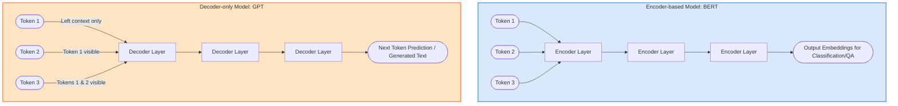
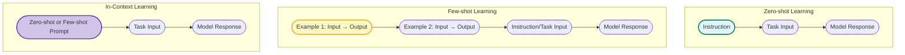
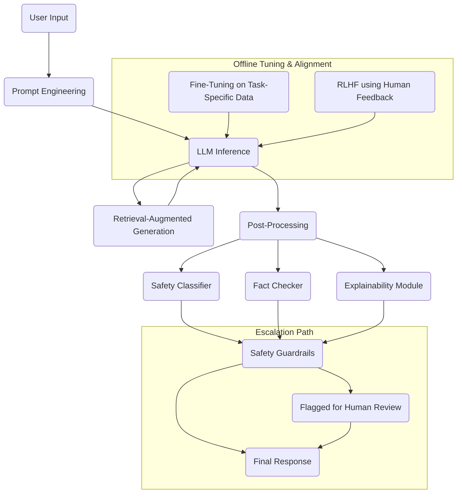
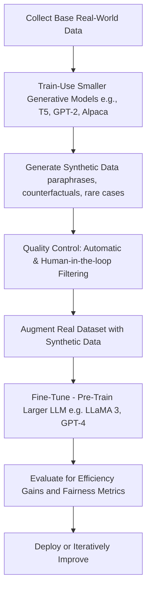

## What is a Large Language Model (LLM)? 
**Describe how transformer architecture enables LLMs to handle long-range dependencies in text.**

Large Language Models (LLMs) are advanced AI systems designed to understand and generate human-like text. They leverage the transformer architecture, which uses attention mechanisms to process and relate different parts of the input text, enabling them to handle long-range dependencies effectively. This allows LLMs to maintain context over longer passages, making them capable of generating coherent and contextually relevant responses.


---

## 📖 What is a Large Language Model (LLM)?

A **Large Language Model (LLM)** is an artificial intelligence system trained on vast amounts of text data to understand, generate, and interact with human language. It’s based on deep learning architectures — most notably the **transformer architecture** — and is capable of tasks like:

* Text generation
* Translation
* Summarization
* Question answering
* Code generation, etc.

LLMs are “large” because they contain billions (or even trillions) of parameters — these parameters are tuned during training to capture patterns, meanings, grammar, facts, and reasoning within human language.

**Examples**: GPT-4, LLaMA 3, PaLM 2, Claude 3.

---

## ⚙️ How Transformer Architecture Enables LLMs to Handle Long-Range Dependencies

A key challenge in natural language processing (NLP) is capturing **long-range dependencies** — relationships between words or phrases that are far apart in the text. Traditional architectures like RNNs and LSTMs struggled with this due to sequential processing and vanishing gradients.

The **Transformer architecture**, introduced in *Vaswani et al., 2017 ("Attention is All You Need")*, overcomes this using a mechanism called **self-attention**.

---

### 📌 Key Components of the Transformer:

1. **Self-Attention Mechanism**

   * Every word (token) in a sentence can attend to every other word at once.
   * Computes a **weighted representation of all other tokens** for each token.
   * This enables the model to directly capture relationships between distant words without passing information step-by-step.

2. **Positional Encoding**

   * Since transformers process tokens in parallel (unlike sequential RNNs), positional encodings inject information about token positions, so the model knows the order of words.

3. **Multi-Head Attention**

   * Allows the model to capture different types of relationships in parallel — for example, syntactic vs. semantic dependencies — by using multiple attention "heads."

4. **Feedforward Layers**

   * Apply nonlinear transformations to enrich token representations after attention.

5. **Layer Normalization and Residual Connections**

   * Help stabilize training and preserve information flow across layers.

---

### 📊 How This Handles Long-Range Dependencies:

* **Direct Access**: In self-attention, each token computes relationships with every other token directly through dot-product attention — no information bottleneck as in RNNs.

* **Parallelism**: Unlike RNNs that process tokens sequentially, transformers process entire sequences in parallel, enabling efficient learning of global context.

* **Attention Weights**: The attention matrix explicitly shows which tokens focus on which others, making it easy to model dependencies no matter how far apart.

---

### 📐 Attention Formula (Scaled Dot-Product Attention):

$$
\text{Attention}(Q, K, V) = \text{softmax}\left(\frac{QK^T}{\sqrt{d_k}}\right) V
$$

Where:

* $Q$ = Query matrix
* $K$ = Key matrix
* $V$ = Value matrix
* $d_k$ = dimension of keys

This computes a weighted sum of the values based on the similarity between the queries and keys.

---

## 📌 Summary

| Traditional Models               | Transformer (LLMs)                                     |
| :------------------------------- | :----------------------------------------------------- |
| Sequential processing (RNN/LSTM) | Parallel processing (transformers)                     |
| Limited long-range dependencies  | Direct, global attention to all tokens                 |
| Vanishing gradients              | Stable training via attention and residual connections |
| Difficult to scale to long texts | Scalable via self-attention and positional encoding    |

---

## ✅ Conclusion:

**LLMs powered by transformer architectures revolutionized NLP** by enabling models to efficiently capture both local and long-range dependencies in text through the self-attention mechanism. This parallel, non-sequential approach made it possible to scale models to billions of parameters and deliver state-of-the-art performance in diverse language tasks.

---

## Compare the encoder-based models (like BERT) with decoder-only models (like GPT). 
**What are their respective strengths and weaknesses?**

Excellent question — it gets to the core of how different transformer architectures are tailored for different kinds of NLP tasks. Let’s compare **encoder-based models (like BERT)** and **decoder-only models (like GPT)** in terms of their architecture, strengths, weaknesses, and typical use cases.

---

## 📊 Encoder-based Models (e.g., **BERT**)

### 🔧 Architecture:

* Uses the **Transformer encoder stack** only.
* Takes in the **entire input sequence at once** and builds contextualized embeddings for each token based on both **left and right context** (bidirectional).
* Typically trained with **masked language modeling (MLM)**: randomly masks some tokens and predicts them.

### ✅ Strengths:

| Aspect                                 | Benefit                                                                                                  |
| :------------------------------------- | :------------------------------------------------------------------------------------------------------- |
| **Bidirectional context**              | Considers both left and right context, better for understanding sentence meaning, syntax, and semantics. |
| **Excellent for classification tasks** | Highly effective at tasks like sentiment analysis, NER, sentence similarity, etc.                        |
| **Fine-tuning friendly**               | Pretrained on general corpora, then fine-tuned on specific tasks with relatively little data.            |

### ❌ Weaknesses:

| Aspect                        | Limitation                                                                   |
| :---------------------------- | :--------------------------------------------------------------------------- |
| **Not generative**            | Can't naturally generate text or complete sequences.                         |
| **Inefficient for long text** | High memory and compute cost due to full self-attention over long sequences. |

### 🎯 Typical Use Cases:

* Text classification
* Named entity recognition
* Question answering (extractive)
* Text entailment
* Embedding generation for similarity/search

---

## 📊 Decoder-only Models (e.g., **GPT**)

### 🔧 Architecture:

* Uses the **Transformer decoder stack** only.
* **Autoregressive**: Predicts the next token based on left context (causal masking ensures it doesn’t look ahead).
* Trained with **causal language modeling (CLM)**: predicts the next token in a sequence.

### ✅ Strengths:

| Aspect                                   | Benefit                                                                       |
| :--------------------------------------- | :---------------------------------------------------------------------------- |
| **Natural text generation**              | Excellent at generating coherent, creative, and contextually rich text.       |
| **Flexible zero-shot/few-shot learning** | Can perform a variety of tasks by framing them as text generation problems.   |
| **Handles open-ended tasks**             | Better suited for summarization, translation, story generation, and dialogue. |

### ❌ Weaknesses:

| Aspect                                   | Limitation                                                                                                         |
| :--------------------------------------- | :----------------------------------------------------------------------------------------------------------------- |
| **Unidirectional context**               | Only considers left context, limiting deep understanding of entire input sequences.                                |
| **Weaker at classification-style tasks** | Requires task reformulation as generation (e.g., “The sentiment is \[positive/negative]”).                         |
| **Scaling inefficiencies**               | Like BERT, can be memory-heavy on long sequences, though solutions like GPT-NeoX and GPT-4 optimize this somewhat. |

### 🎯 Typical Use Cases:

* Text generation
* Summarization
* Code generation
* Conversational agents
* Zero/few-shot task execution

---

## 📌 Summary Table:

| Feature                  | Encoder-based (BERT)              | Decoder-only (GPT)                        |
| :----------------------- | :-------------------------------- | :---------------------------------------- |
| **Architecture**         | Transformer encoder               | Transformer decoder                       |
| **Context modeling**     | Bidirectional                     | Unidirectional (left-to-right)            |
| **Pretraining task**     | Masked Language Modeling (MLM)    | Causal Language Modeling (CLM)            |
| **Strength**             | Understanding, classification     | Natural language generation               |
| **Weakness**             | Not generative, poor at long text | Limited context for input comprehension   |
| **Typical applications** | NER, sentiment analysis, QA       | Chatbots, story generation, summarization |

---

## 📌 Visual Aid: Transformer Architecture Positioning

```
         ┌──────────────┐
         │  Input Text  │
         └────┬─────┬───┘
              │     │
        ┌─────▼──┐ ┌▼─────┐
        │Encoder │ │Decoder│
        └────────┘ └───────┘
```

* **BERT**: only uses the left side (Encoder stack)
* **GPT**: only uses the right side (Decoder stack)

---

## 📖 Final Thought:

* Use **BERT-like models** for tasks where understanding of the entire input context is crucial (classification, QA, embeddings).
* Use **GPT-like models** for tasks requiring fluent, contextually-aware text generation or where framing the problem as text prediction makes sense.

---
## BERT Vs GPT Architecture Overview



## Explain the concepts of:
•	Zero-shot learning
•	Few-shot learning
•	In-context learning
How are they enabled by LLMs like GPT-3/4?

Excellent — this is a foundational topic in how modern LLMs like GPT-3/4 achieve remarkable generalization without traditional fine-tuning. Let’s carefully unpack these concepts and see how models like GPT enable them.

---

## 📖 Concepts Explained:

### 📌 **Zero-shot Learning**

> 🔍 The model performs a task **without having seen any labeled examples of that task during training or inference**.

**How it works:**

* You provide the model with a **clear, natural-language instruction** describing what you want it to do.
* The model relies solely on its pretrained knowledge from vast corpora.

**Example (GPT-4):**

```
Q: Translate the sentence 'Bonjour' to English.
A: Hello.
```

👉 No examples of translations are provided — just a prompt and a response.

---

### 📌 **Few-shot Learning**

> 🔍 The model is shown **a few labeled examples** of the task in the prompt itself before making a prediction.

**How it works:**

* A few input-output pairs are provided in the prompt.
* The model uses those examples to infer the pattern and generate the next output.

**Example (GPT-4):**

```
Translate French to English:
French: Bonjour | English: Hello
French: Merci | English: Thank you
French: Au revoir | English: 
```

👉 Model predicts **"Goodbye"** based on those few examples.

---

### 📌 **In-Context Learning**

> 🔍 A broader term covering both zero-shot and few-shot setups, where the model learns **from the prompt context alone** during inference, **without updating model weights**.

**How it works:**

* LLMs like GPT-3/4 treat the prompt as a temporary context or memory.
* It conditions its response based on patterns within the prompt rather than relying on parameter updates (as in fine-tuning).

**Key idea:**

> The model "learns" in the moment by inferring patterns from the prompt.

---

## 📊 How LLMs like GPT-3/4 Enable This:

| Technique               | Enabled by                                          | Why it Works in LLMs                                                                                   |
| :---------------------- | :-------------------------------------------------- | :----------------------------------------------------------------------------------------------------- |
| **Zero-shot**           | Large-scale pretrained knowledge                    | Massive exposure to varied tasks, making it possible to generalize from instructions.                  |
| **Few-shot**            | Inference-time prompt conditioning                  | Autoregressive models like GPT can track patterns within a single prompt window.                       |
| **In-context learning** | Transformer architecture with large context windows | Self-attention mechanism allows relating new prompt content to pretrained representations dynamically. |

---

## 📌 Visualizing It:

### **Prompt Window in GPT**

```
[Instruction/Examples] → [Task Input] → [Model Response]
```

* All happens within one forward pass.
* No model weights are updated.
* The "learning" happens by **contextualizing information within the prompt**.

---

## 📖 Why It Matters:

Before GPT-style LLMs, NLP models typically required:

* **Task-specific fine-tuning** on labeled data.
* **Parameter updates** for each new task.

Now, with in-context learning:

* Models like GPT-3/4 can handle **unseen tasks at inference time**.
* Zero/few-shot setups dramatically reduce the need for labeled data.
* Rapid prototyping and dynamic task execution without retraining.

---

## ✅ Final Thought:

This capability — in-context learning — is arguably the **most disruptive innovation introduced by large autoregressive LLMs**. It transformed them from static, narrow models into highly flexible generalists.

---



## You are given a chatbot powered by an LLM. What techniques can improve the relevance, safety, and factual accuracy of its responses?

Excellent question — this gets to the heart of deploying responsible, useful, and reliable AI systems. Let’s carefully break down proven techniques that can improve **relevance**, **safety**, and **factual accuracy** of chatbot/LLM responses:

---

## ✅ Techniques to Improve Relevance, Safety, and Factual Accuracy

### 📌 1️⃣ Prompt Engineering

Crafting better prompts or using prompt templates can guide the model toward more relevant and safer answers.

* **Few-shot / zero-shot / chain-of-thought prompting**
* Including **instructions for safety** or constraints (e.g. "answer factually and avoid speculation")

---

### 📌 2️⃣ Retrieval-Augmented Generation (RAG)

Combine the LLM’s generative abilities with **external knowledge retrieval systems** (e.g., databases, APIs, or search engines).

* Fetch **up-to-date factual information** at runtime
* Prevent reliance on potentially outdated LLM training data

---

### 📌 3️⃣ Fine-Tuning / Instruction Tuning

Retraining or further adjusting the model on **task-specific data** and safety-verified instructions to:

* Improve **domain relevance**
* Reduce unsafe outputs through exposure to **filtered, aligned data**

---

### 📌 4️⃣ Reinforcement Learning from Human Feedback (RLHF)

Train the model’s output preferences using **human-annotated response rankings**:

* Encourage helpful, harmless, and honest completions
* Disincentivize unsafe or irrelevant outputs

---

### 📌 5️⃣ Output Filtering & Post-Processing

Apply **post-generation filters** using:

* **Safety classifiers** (e.g., NSFW, toxicity, misinformation detection models)
* **Factual consistency checkers**
  Before displaying the final output

---

### 📌 6️⃣ External Fact-Checking APIs & Grounding

Use **fact-checking tools/APIs** (like Google Fact Check API, or custom domain databases) to cross-validate the chatbot’s claims

* Flag potentially inaccurate responses
* Ground critical facts in authoritative sources

---

### 📌 7️⃣ Guardrails and Safety Layers

Implement **policy enforcement modules** to prevent:

* Personally identifiable information (PII) leakage
* Dangerous instructions (e.g. self-harm, illegal activities)
  Examples: **Microsoft Azure AI Content Safety**, **Anthropic’s Constitutional AI techniques**

---

### 📌 8️⃣ Explainability & Uncertainty Calibration

Allow the model to:

* Express uncertainty where appropriate (e.g., “I’m not sure” or “This might not be accurate.”)
* Offer **source references or reasoning traces**

---

### 📌 9️⃣ Human-in-the-Loop (HITL) Oversight

For high-risk or sensitive applications:

* Have humans review and approve responses
* Continuously collect user feedback to retrain or adjust guardrails

---

## ✅ Summary Table

| Technique                            | Improves Relevance | Enhances Safety | Boosts Factual Accuracy |
| :----------------------------------- | :----------------- | :-------------- | :---------------------- |
| Prompt Engineering                   | ✅                  | ✅               | ✅                       |
| Retrieval-Augmented Generation (RAG) | ✅                  | ✅               | ✅                       |
| Fine-Tuning / Instruction Tuning     | ✅                  | ✅               | ✅                       |
| RLHF                                 | ✅                  | ✅               | ✅                       |
| Output Filtering & Post-Processing   | ✅                  | ✅               | ✅                       |
| External Fact-Checking & Grounding   | ✅                  | ✅               | ✅                       |
| Guardrails / Safety Layers           | ✅                  | ✅               | 🔶 (Indirectly)         |
| Explainability & Uncertainty         | ✅                  | ✅               | ✅                       |
| Human-in-the-Loop Oversight          | ✅                  | ✅               | ✅                       |

---

Would you like a **diagram**, a **real-world implementation workflow**, or example code snippets for any of these? I’d be happy to help.


| Step   | Component               | Purpose                                                     |
| :----- | :---------------------- | :---------------------------------------------------------- |
| **A**  | User Input              | User sends a message                                        |
| **B**  | Prompt Engineering      | Enhance prompt clarity, constraints, and structure          |
| **C**  | LLM Inference           | Generate initial response based on prompt and model weights |
| **D1** | RAG                     | Fetch external, real-time info for grounding                |
| **E**  | Post-Processing         | Process LLM output before finalizing                        |
| **F1** | Safety Classifier       | Detect unsafe content                                       |
| **F2** | Fact Checker            | Validate factual accuracy against external data             |
| **F3** | Explainability Module   | Add reasoning, citations, or uncertainty expressions        |
| **G**  | Safety Guardrails       | Enforce safety policies and remove unsafe replies           |
| **H**  | Final Response          | Deliver response to the user                                |
| **I1** | Fine-Tuning             | Offline training on specialized or safety-focused data      |
| **I2** | RLHF                    | Model tuning using ranked human preference feedback         |
| **J**  | Human Review (Optional) | Escalation if flagged                                       |


## How reliable are hallucination detection and prevention techniques in LLMs during open-domain generation?

**hallucination detection and prevention techniques are improving, but they remain an open research challenge in open-domain generation**.


* 📌 Why hallucinations happen
* 📌 What current techniques exist
* 📌 How reliable they are
* 📌 What the limitations and future directions are

---

## 📌 Why Do LLMs Hallucinate?

LLMs are **probabilistic next-token predictors**, trained to maximize likelihood over vast, sometimes noisy, text corpora.
In open-domain, unconstrained generation:

* There’s no explicit grounding to factual or verified information
* The model may "fill in" plausible-sounding but incorrect content, especially for rare, unseen, or ambiguous queries
* The training data might contain conflicting, outdated, or fabricated information

---

## 📌 Current Hallucination Detection & Prevention Techniques

| Technique                                       | How It Works                                                                                  | Reliability (1–5) | Notes                                                           |
| :---------------------------------------------- | :-------------------------------------------------------------------------------------------- | :---------------- | :-------------------------------------------------------------- |
| **Retrieval-Augmented Generation (RAG)**        | Augment generation with live, authoritative retrieved knowledge                               | ⭐⭐⭐⭐              | High factuality, but dependent on retriever quality             |
| **Fact Consistency Classifiers**                | Use a trained classifier to flag inconsistencies between claim and retrieved/documented facts | ⭐⭐⭐               | Promising but can misclassify subtle errors                     |
| **Self-Consistency Sampling**                   | Compare multiple generations to detect outliers or unstable outputs                           | ⭐⭐⭐               | Reliable for confidence estimation, less so for deep factuality |
| **Chain-of-Thought & Self-Reflection Prompts**  | Ask the model to explain or validate its answer step-by-step                                  | ⭐⭐⭐               | Reduces hallucination but not foolproof                         |
| **Human-in-the-loop Oversight**                 | Human reviews outputs in high-stakes cases                                                    | ⭐⭐⭐⭐⭐             | Gold standard but not scalable for all use cases                |
| **Constitutional AI / Rule-based Filtering**    | Impose ethical and factual constraints via post-generation rules                              | ⭐⭐⭐               | Good for safety/ethics, limited for fine-grained factuality     |
| **Uncertainty Calibration / Confidence Scores** | Encourage the model to flag uncertain answers                                                 | ⭐⭐                | Current models are poorly calibrated for open-domain facts      |
| **External Fact-Checking APIs**                 | Validate generated claims against third-party APIs/databases                                  | ⭐⭐⭐⭐              | Highly reliable for verifiable claims                           |

---

## 📌 How Reliable Are They?

* **For narrow or closed-domain tasks (e.g. legal documents, medical advice)** — hallucination rates can be reduced dramatically using **RAG, fine-tuning, and fact-checking**
* **For open-domain creative or knowledge generation** (e.g. summarizing history, answering rare trivia) — hallucination rates remain significant, often between **10–30% even with detection layers**

👉 Example:
**GPT-4**’s own hallucination rate in open-domain factual QA was around **20%** in recent benchmarks like **TruthfulQA** and **OpenFact** — though retrieval-augmented models like **ChatGPT browsing or Bing Chat** improved accuracy by 20–40%

---

## 📌 Limitations

* **High compute cost** for multi-sample self-consistency
* **Fact-checking coverage gaps** for non-structured or emerging facts
* **Classifier brittleness** when phrasing is nuanced
* **Over-reliance on retrieval quality** in RAG setups
* **Poor uncertainty calibration** in current large models

---

## 📌 Future Directions

* **Multi-agent self-consistency and debate models** (e.g. Anthropic’s Claude debate experiments)
* **Better fact-grounded pretraining datasets**
* **Dynamic fact-checking modules embedded within LLM pipelines**
* **Improved uncertainty estimation techniques**
* **Semantic verifiers and factuality-focused reward models in RLHF**

---

## ✅ Summary:

**Current hallucination detection/prevention techniques significantly reduce risk but are not yet universally reliable for open-domain generation.**
**For critical applications (medical, legal, financial, etc.) — RAG, fact-checkers, and human oversight remain essential.**

---

## Can synthetic data augmentation (e.g., bootstrapping with smaller models) enhance LLM training efficiency or fairness?

Excellent question — and yes, **synthetic data augmentation**, including techniques like **bootstrapping with smaller models**, can meaningfully enhance **LLM training efficiency, generalization, and fairness** when carefully designed and applied. Let’s unpack this in detail:

---

## 📌 How Synthetic Data Augmentation Helps in LLM Training

### 1️⃣ **Efficiency**

* **Bootstrapping smaller models** (or using smaller LLMs or task-specific models) to generate synthetic training data allows you to:

  * **Pre-train or fine-tune larger models on richer, more diverse corpora** without the expensive cost of collecting and cleaning real-world data.
  * **Amplify low-resource domains or languages**, or rare task-specific examples.
  * Reduce the need for costly human annotation by generating pseudo-labeled datasets.

**Example**:
Use a smaller GPT-2 or instruction-tuned T5 model to generate paraphrases or augment underrepresented classes in a classification task before training a larger model like GPT-4.

---

### 2️⃣ **Fairness**

* **Biases in training data are a core problem for LLMs**. If certain groups, dialects, or perspectives are underrepresented in the training corpus, the model inherits those disparities.
* Synthetic data can:

  * **Balance representation** for marginalized dialects, demographic groups, or viewpoints by explicitly generating diverse synthetic content.
  * **Create counterfactual data**: e.g., generate the same sentence with swapped gender, ethnicity, or socio-cultural attributes to measure and mitigate bias.

**Example**:
Generate balanced QA pairs or dialogue turns where both male and female pronouns are used equally in professional contexts to mitigate occupational gender bias.

---

## 📌 Challenges and Trade-offs

| Benefit                                                                               | Challenge                                                                                            |
| :------------------------------------------------------------------------------------ | :--------------------------------------------------------------------------------------------------- |
| Data augmentation improves data diversity and mitigates sparsity.                     | **Synthetic data might inherit or amplify biases from the generating model**.                        |
| Bootstrapping allows fast generation of training samples for niche or emerging tasks. | Synthetic data quality control is non-trivial — poor-quality samples can mislead model learning.     |
| Efficient for low-resource domains without large annotated corpora.                   | Potential for overfitting on model-generated artifacts instead of real-world language distributions. |

**Fairness improvement** via synthetic augmentation requires careful auditing of the synthetic dataset for unintended biases.

---

## 📌 Recent Research Trends Supporting This

1. **Self-Training with LLM-generated Labels**

   * Recent papers like *Self-Instruct* (Wang et al. 2022) use LLMs to generate instruction-following data for themselves, achieving efficiency improvements.

2. **Counterfactual Data Augmentation**

   * Studies in NLP fairness (e.g., Zhao et al. 2018’s work on gender bias) show how counterfactual data improves equitable treatment by models.

3. **Knowledge Distillation & Model Bootstrapping**

   * Smaller models trained on both human and LLM-generated synthetic data have been shown to approximate LLM behavior efficiently, useful for edge or specialized applications.

---

## 📌 Good Practices

✔️ Use **human-in-the-loop validation** for synthetic data to catch biases or incoherencies.
✔️ Mix **real and synthetic data carefully** to avoid model overfitting on synthetic artifacts.
✔️ Regularly audit both **model outputs and synthetic datasets** for fairness metrics.

---

## ✅ Conclusion

**Yes — when thoughtfully designed, synthetic data augmentation via bootstrapping with smaller models can enhance both the training efficiency and fairness of LLMs.** It offers a practical way to expand and diversify data corpora, especially in low-resource or bias-sensitive applications.

Perfect — let’s outline both a **conceptual pipeline** and a couple of **recent case studies** where synthetic data augmentation via smaller models improved LLM training efficiency and fairness.

---

## 📊 Conceptual Pipeline: Synthetic Data Bootstrapping for LLM Training



---

## 📚 Notable Case Studies

### 📌 **1️⃣ Self-Instruct: Bootstrapping Instruction-Tuning Data**

* **Authors**: Wang et al., 2022
* **What they did**:

  * Used GPT-3 to generate thousands of synthetic instruction-following examples.
  * Curated the outputs, filtered for quality and diversity.
  * Fine-tuned smaller LMs on this synthetic dataset.
* **Results**:

  * Models achieved competitive performance on downstream instruction-tuning tasks at a fraction of the data collection cost.

**Key takeaway**: Self-generated synthetic data can bootstrap instruction-following abilities efficiently.

---

### 📌 **2️⃣ Counterfactual Data Augmentation for Bias Mitigation**

* **Authors**: Zhao et al., 2018 (Gender Bias in Coreference Resolution)
* **What they did**:

  * Created **counterfactual examples** by swapping gender terms (e.g., “doctor” with “he” vs. “she”).
  * Trained and evaluated models on both original and counterfactual data.
* **Results**:

  * Significant reduction in gender bias in NLP models.

**Key takeaway**: Counterfactual augmentation improves fairness by balancing demographic representations.

---

### 📌 **3️⃣ Alpaca: Instruction-Tuning on LLaMA with Synthetic Data**

* **Authors**: Stanford CRFM, 2023
* **What they did**:

  * Used OpenAI’s GPT-3 to generate synthetic instruction-following data.
  * Fine-tuned a smaller LLaMA-7B model (called Alpaca) on this synthetic dataset.
* **Results**:

  * Alpaca achieved comparable instruction-following performance to larger proprietary models.
  * Open-sourced for the community to replicate.

**Key takeaway**: Smaller, bootstrapped synthetic datasets can produce lightweight, performant instruction-tuned LLMs.

---

## 📌 Fairness and Efficiency Metrics to Track

| Efficiency Metric                   | Fairness Metric                            |
| :---------------------------------- | :----------------------------------------- |
| Reduction in annotation time        | Demographic parity in generated outputs    |
| Reduction in compute cost           | Equalized odds for different groups        |
| Improvement in few-shot performance | Counterfactual consistency                 |
| Data size vs. performance trade-off | Bias score delta before/after augmentation |

---

## ✅ Final Thought

Synthetic data bootstrapping — when paired with rigorous filtering and fairness auditing — offers a scalable, efficient, and ethically sound way to enhance LLM training pipelines.

Would you like me to prototype a sample synthetic data augmentation script (say using GPT-2 or T5) or a fairness bias test framework as well? I’d be happy to.


## The main idea of attention
The evolution of NLP has been as follows -
 

|**Date** | **Model** | **Description** |
|---------|-----------|------------------|
1966 | Eliza | First chatbot |
1980s | RNN | last hidden state would have the compressed past context |
1997 | LSTM | The long term cell state will give equal importance to all the past hidden states|
2014 | Bahdanau Attention | **Attention** + RNN (RNN was used for both encoder and decoder) |
2017 | **Attention** + **Transformer** | **RNN was removed** and Transformer was introduced. But it had again both **encoder and decoder.** **BERT** is an example for encoder + decoder architecture. [BERT paper](https://arxiv.org/abs/1810.04805) |
2018 | **Attention** + **General Purpose Transformer** | **No Encoder. Only decoder**. Encoder as a separate block was removed from original transformer|

### RNN - Recurrent Neural Networks
**RNNs**: [Recurrent Neural Networks (RNNs)](https://samratkar.github.io/2025/02/01/RNN-theo.html) were the first to be used for sequence-to-sequence tasks, but they struggled with long-range dependencies.

<details>
  <summary>Click to expand</summary>
  
</details>

### LSTM - Long Short-Term Memory

**LSTM**: [Long Short-Term Memory (LSTM)](https://samratkar.github.io/2025/02/15/LSTM-theory.html) networks improved upon RNNs by introducing memory cells and gates, allowing them to capture long-range dependencies more effectively. But still the problem was that all the previous hidden states were used to generate the next hidden state, which made it difficult to focus on specific parts of the input sequence.
<details>
   <summary>Click to expand</summary>
      <video width="640" height="360" controls>
         <source src="/images/genai/lstm-visualization.mp4" type="video/mp4">
         Your browser does not support the video tag.
      </video>
</details>

### Attention Mechanism
#### Bhadanau Attention 



### Self attention with trainable weights




## Multi-head attention



## Layer normalization



## Feed-forward Neural Network

  


## All the illustrations and mindmaps referenced in this article : 


## References

1. [What is the big deal about attention - vizuara substack](https://substack.com/inbox/post/158574020)
2. [Attention is all you need - arxiv](https://arxiv.org/abs/1706.03762)
3. Attention mechanism 1 hour video 
<iframe width="560" height="315" src="https://www.youtube.com/embed/K45ze9Yd5UE?si=FAJ3YPArq9Wu-uQ3" title="YouTube video player" frameborder="0" allow="accelerometer; autoplay; clipboard-write; encrypted-media; gyroscope; picture-in-picture; web-share" referrerpolicy="strict-origin-when-cross-origin" allowfullscreen></iframe>


