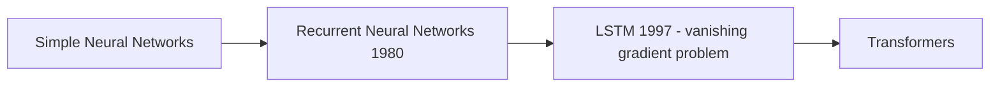

# Vizuara GenAI

1. [Eliza Chatbot](https://www.masswerk.at/eliza/)
2. simple neural networks were not enough because it does not have inbuilt memory. 
3. Recurrent Neural Networks (RNN) were introduced to solve this problem.
4. Long Short Term Memory (LSTM) networks were introduced to solve the vanishing gradient problem in RNNs.
5. Transformers were introduced to solve the problem of long-range dependencies in RNNs.

5. LSTM - long short term memory
   1. long term memory path 
   2. short term memory path 

6. Transformers - Attention is what you need. The ability of process the entire input sequence in parallel. 
   1. Multi-head attention
   2. Position-wise feed-forward networks
   3. Layer normalization
   4. Residual connection 

7. Scaling law of language models - number of parameters increase results in better performance. 
   1. GPT-3 - 175 billion parameters
   2. Turing-NLG - 17 billion parameters
   3. BERT - 340 million parameters

8. open vs close models - open models are trained on a large corpus of data and can be fine-tuned for specific tasks. 
   1. GPT-3 - open model
   2. Turing-NLG - close model

