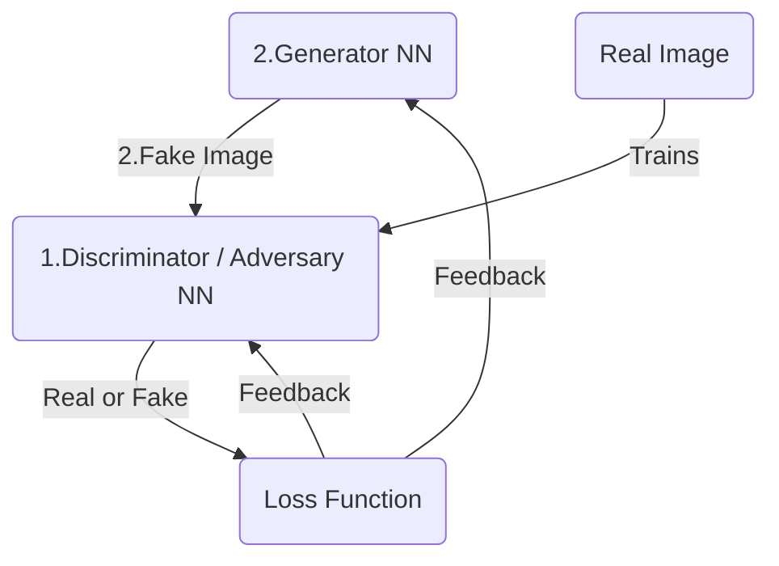

## Introduction
Generative Adversarial Networks (GANs) are a class of machine learning frameworks designed for unsupervised learning. They consist of two neural networks, the **generator** and the **discriminator**, which are trained simultaneously through **adversarial processes**. The generator creates fake data, while the discriminator evaluates the authenticity of the data, leading to improved performance in generating realistic samples.
[GAN generated images](https://thispersondoesnotexist.com/)

The real innovation is in the **generator** which is a neural network that takes random noise as inputs and generates data that resembles the training data. The generator is trained to produce data that is indistinguishable from real data, while the discriminator is trained to differentiate between real and fake data.

This idea was proposed by Ian Goodfellow and his colleagues in 2014. The GAN framework has since gained popularity due to its ability to generate high-quality images, videos, and other types of data.

## Architecture

## Training Process
### Initialization 
Randomly initialize the weights of both the generator and discriminator networks.
### Train the Discriminator as a CNN (Convolutional Neural Network)
#### Step 1 : Load sample real image from the training set.
Loading the CIFAR-10 dataset, which contains 60,000 32x32 color images in 10 classes, with 6,000 images per class. The dataset is divided into 50,000 training images and 10,000 test images. The CIFAR-10 dataset is commonly used for training machine learning models and is a standard benchmark in the field of computer vision.

```python
# example of loading and plotting the cifar10 dataset
from keras.datasets.cifar10 import load_data
from matplotlib import pyplot
# load the images into memory
(trainX, trainy), (testX, testy) = load_data()
# plot images from the training dataset
for i in range(49):
	# define subplot
	pyplot.subplot(7, 7, 1 + i)
	# turn off axis
	pyplot.axis('off')
	# plot raw pixel data
	pyplot.imshow(trainX[i])
pyplot.show()

```


```python

```

   - **Step 2 :** Generate **fake** image from random noise
   - **Step 3 :** Train the CNN discriminator on real and fake images to classify them as real or fake, through backpropagation.
   - The discriminator is a binary classifier that takes an image as input and outputs a probability score indicating whether the image is real or fake.
   - **Step 4 :** Compute the discriminator's loss based on its ability to distinguish between real and fake data. The loss function is to minimize the difference between the predicted and actual labels.

## 
## References
1. [Lecture Video - Vizuara](https://youtu.be/pYEAJzEZtg4)
2. [Code - Vizuara - google colab]( https://colab.research.google.com/drive/1CaiPqCpuNEvQXAJyDLDhwKN4z3Ztr8ea?usp=sharing)
