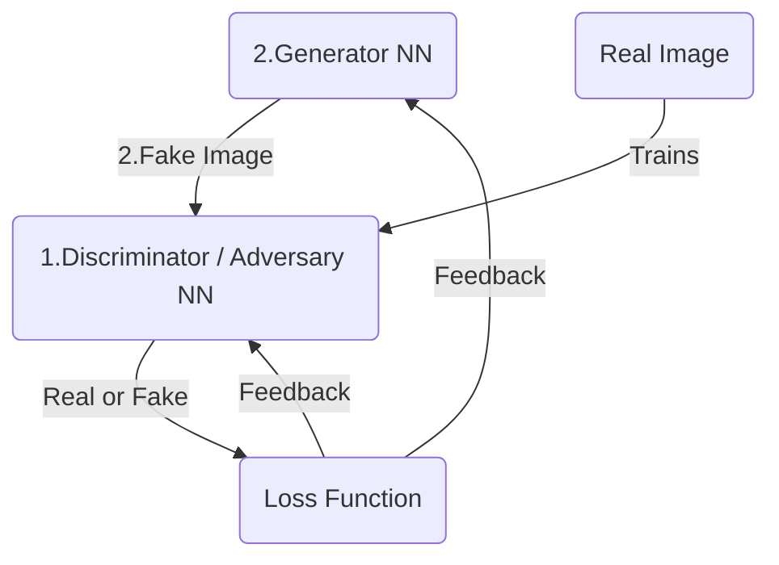

## Introduction
Generative Adversarial Networks (GANs) are a class of machine learning frameworks designed for unsupervised learning. They consist of two neural networks, the **generator** and the **discriminator**, which are trained simultaneously through **adversarial processes**. The generator creates fake data, while the discriminator evaluates the authenticity of the data, leading to improved performance in generating realistic samples.
[GAN generated images](https://thispersondoesnotexist.com/)

The real innovation is in the **generator** which is a neural network that takes random noise as inputs and generates data that resembles the training data. The generator is trained to produce data that is indistinguishable from real data, while the discriminator is trained to differentiate between real and fake data.

This idea was proposed by Ian Goodfellow and his colleagues in 2014. The GAN framework has since gained popularity due to its ability to generate high-quality images, videos, and other types of data.

## Architecture

## Design and workflow 


### Step 1 : Initialization 
Randomly initialize the weights of both the generator and discriminator networks.

#### Step 2 : Load sample real image from the training set.
Loading the CIFAR-10 dataset, which contains 60,000 32x32 color images in 10 classes, with 6,000 images per class. The dataset is divided into 50,000 training images and 10,000 test images. The CIFAR-10 dataset is commonly used for training machine learning models and is a standard benchmark in the field of computer vision.

```python
# example of loading and plotting the cifar10 dataset
from keras.datasets.cifar10 import load_data
from matplotlib import pyplot
# load the images into memory
(trainX, trainy), (testX, testy) = load_data()
# plot images from the training dataset
for i in range(49):
	# define subplot
	pyplot.subplot(7, 7, 1 + i)
	# turn off axis
	pyplot.axis('off')
	# plot raw pixel data
	pyplot.imshow(trainX[i])
pyplot.show()

```


```python
print (trainX.shape)
Output >>
(50000, 32, 32, 3)
```
#### Step 3 : Wiring a new CNN for Discriminator
```python
from tensorflow.keras.models import Sequential
from tensorflow.keras.optimizers import Adam
from tensorflow.keras.layers import Dense, Conv2D, Flatten, Dropout, LeakyReLU
from tensorflow.keras.utils import plot_model
import numpy as np

# Define the discriminator model
def define_discriminator(in_shape=(32,32,3)):
    model = Sequential()

    # First convolutional block
    model.add(Conv2D(64, (3,3), padding='same', input_shape=in_shape))
    model.add(LeakyReLU(alpha=0.2))

    # Second convolutional block (downsample)
    model.add(Conv2D(128, (3,3), strides=(2,2), padding='same'))
    model.add(LeakyReLU(alpha=0.2))

    # Third convolutional block (downsample)
    model.add(Conv2D(128, (3,3), strides=(2,2), padding='same'))
    model.add(LeakyReLU(alpha=0.2))

    # Fourth convolutional block (downsample)
    model.add(Conv2D(256, (3,3), strides=(2,2), padding='same'))
    model.add(LeakyReLU(alpha=0.2))

    # Classifier block
    model.add(Flatten())
    model.add(Dropout(0.4))
    model.add(Dense(1, activation='sigmoid'))

    # Compile the model using the correct parameter: learning_rate
    opt = Adam(learning_rate=0.0002, beta_1=0.5)
    model.compile(loss='binary_crossentropy', optimizer=opt, metrics=['accuracy'])

    return model
```
##### Step 3.1 : instantiate a discriminator model
```python
# Create the discriminator
model = define_discriminator()

# Display model summary
model.summary()
```


#### Step 4 : Load and prepare cifar training set for real images
##### Step 4.1 : normalize the data from [0,255] to [-1,1]
```python
# load and prepare cifar10 training images
def load_real_samples():
	# load cifar10 dataset
	(trainX, _), (_, _) = load_data()
	# convert from unsigned ints to floats
	X = trainX.astype('float32')
	# scale from [0,255] to [-1,1]
	X = (X - 127.5) / 127.5
	return X
```
```python
Xcheck = load_real_samples()
print(Xcheck.shape)

Output >>
(50000,32,32,3)
```
##### Step 4.2 : load the training data set for real images, for both x and y, for 64 images.
```python
from numpy.random import randint
from numpy import ones

# select real samples (we select 64 real images from the dataset)
def generate_real_samples(dataset, n_samples):
    # choose random instances
    ix = randint(0, dataset.shape[0], n_samples)
    # retrieve selected images
    X = dataset[ix]
    # generate 'real' class labels (1)
    y = ones((n_samples, 1))
    return X, y

Xcheck,ycheck = generate_real_samples(Xcheck, 64)
print(Xcheck.shape)
print(ycheck.shape)

Output >>
(64, 32, 32, 3)
(64, 1)
```
#### Step 5 : Generate the fake training data


#### Step 2 : Train the Discriminator CNN with the real data
```python

```
#### Step 3 : Train the Discriminator with fake data
##### Step 3.1 : Generate **fake** image from random noise
In the final architecture, the fake image from the generator will be fed into the discriminator as the source of fake images. But now fake images will be created independently to be able to train the CNN.

   - **Step 3 :** Train the CNN discriminator on real and fake images to classify them as real or fake, through backpropagation.
   - The discriminator is a binary classifier that takes an image as input and outputs a probability score indicating whether the image is real or fake.
   - **Step 4 :** Compute the discriminator's loss based on its ability to distinguish between real and fake data. The loss function is to minimize the difference between the predicted and actual labels.

## 
## References
1. [Lecture Video - Vizuara](https://youtu.be/pYEAJzEZtg4)
2. [Code - Vizuara - google colab]( https://colab.research.google.com/drive/1CaiPqCpuNEvQXAJyDLDhwKN4z3Ztr8ea?usp=sharing)
