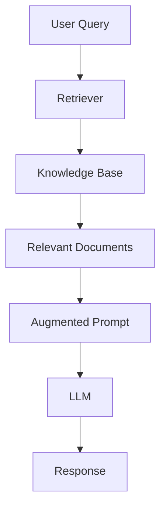

### Key concepts 

1. RAG pairs an LLM with a knowledge base 
2. Data is private, recent, or highly specific and so missing from the LLM's training data
3. Retriever finds **relevant documents based on the query** from the knowledge base and adds them to an augmented prompt 
4. LLMs grounds their response in the retrieved information. 

### Retrievers 

#### Two types of searches (Hybrid Search)
1. Keyword search - looks in the documents containing **exact words** found in the prompts.
2. Semantic search - looks for the documents with **similar meaning** to the prompt.
3. Metadata filtering - narrow down the search results based on metadata attributes (e.g., date, author, category).

3. Sparse vector search (traditional search) 
   - TF-IDF
   - BM25
4. Dense vector search (modern search)
   - Embeddings + vector DB (FAISS, Pinecone, Weaviate, etc.)
5. Hybrid search (combination of both)
   - Combines the strengths of sparse and dense vector searches for improved retrieval performance.
  
#### TF-IDF (Term Frequency-Inverse Document Frequency) search 

