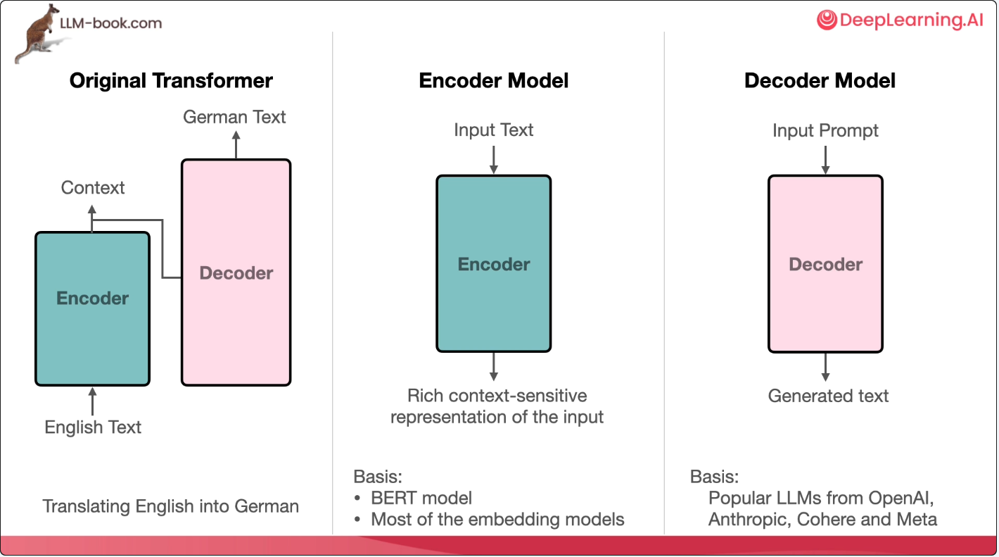

## Language Models - what is the need of language model

1. Language models are the mathematical models that can do one or more of the following -
   1. **text output** - generative modelling.
      1. It predicts the next word that will come after the words in a given sentence. It can also predict the next sentence.
      2. each word is assigned a probability. 
      3. each sentence is a conditional probability of the next sentence based on all words.
      4. Obective - compute the probability of a sentence or sequence of words. $P(W) = P(w1,w2,w3,...,wn)$
      5. Related task - computing the probability of the upcoming word. $P(w4|w1,w2,w3)$
   2. **embeddings** - numeric values representation of text
   3. **classification** - identify targets - key entity identification.
2. A recent history of Language Models:

3. Language Models are trained using **self regression training**. This is also known as **Autoregressive training**. The training set is not lablelled. But the labelling is autoregressive as the training set in corpus itself is used to determine the probability of the new text generation. **Language Modelling** is at the core of such pre-training which is self recursive.

## Applications of language models

- spell check. which word has the highest probability.
- speech recognition - audio to transcription. 

## What are the different types of language models and how they work

1. **Encoder** - Language models that convert text to numbers. Eg : BERT, RoBERTA, DistilBERT. 
2. **Decoders** - Language models that are generative in nature. They generate texts - GPT, GPT-2, GPT-3, ChatGPT.
3. **Encoders and Decoders** - The language models that can do both - encoding and decoding. Eg - T5, Switch, Flan-T5.
4. All the above models are models based on [transformer architecture](./2025-02-7-transformer-arch.md).
5. Schematic diagram of encoders and decoders - 

6. Following models are legacy non-transformer based language models -
   - **Bag of words** - an algorithm that represents words as large sparse vectors or arrays of numbers. it simply records the presence of the words.
   - **Word2Vec** - its numeric representation constitutes the meaning of the words and the contexts of few neighboring words.
7. **Transformer** based language model - numerically represent dense vectors of numbers which captured the meaning of words in the context of a sentence or a paragraph.

