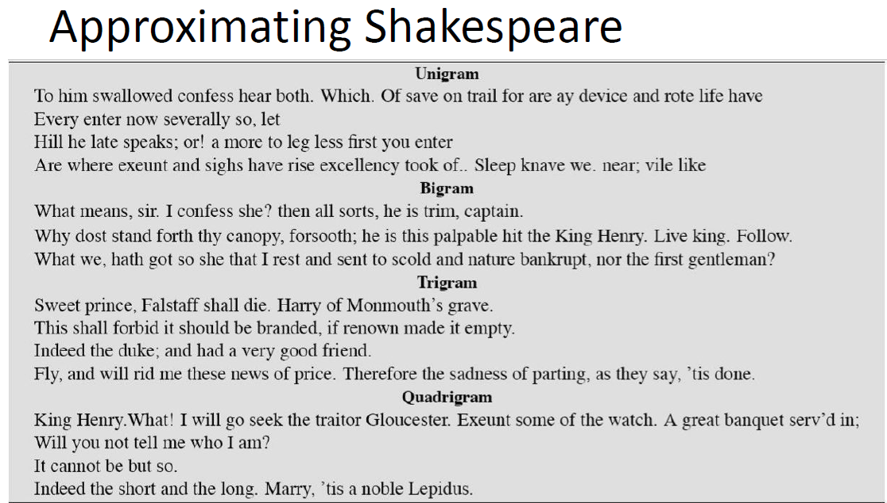

### How to compute the probability of the next word?

Language Models are defined by the following objective : 

   1. **Objective** - compute the probability of a sentence or sequence of words.
        $P(W) = P(w1,w2,w3,...,wn)$
   2. **Related task** - computing the probability of the upcoming word. And from this derive the objective.
        $P(w4|w1,w2,w3)$

**Probability of the entire sentence : $P(W) = P(w1,w2,w3...wn)$** = Probability when all the words are happening together in sequence.

P(The, water, of, Walden, Pond, is, so, beautifully, blue) : The probability of when the sentence "The water of Walden Pond is so beautifully blue" will occur in a corpus.

There is a difference between the following - 

1. **Conditional Probability $P(B/A)$** : Probability of B given A : Event B has happened in past. A is happening now. This is known as Conditional Probability.
2. **Joint Probability $P(A,B)$** : Joint probability of A and B. Or probability when both the events A and B are happening simultaneously.

$P(B/A) = P(A \bigcap B) / P(A)$ 
or, $P(B/A) = P(A,B) / P(A)$
or, $P(A,B) = P(B/A) \times P(A)$
>or, $P(A,B) = P(A) \times P(B/A)$

>ie. probability of two events A and B happening together (joint probability) is probability of A multiplied by probability of B when A has already happened.

3. **Extending it to multiple events we can write**

>$P(A, B, C, D)  = P(A) \times P(B/A) \times P(C/A,B) \times P(D/A,B,C)$

To get the intuition, following is the chain of thought -

- first the event A happened. So, the probability is P(A) as nothing else has happened now.
- second the event B happened. Event A has already happened in the last step. so the probability of B, we need to compute $P(B/A)$, i.e., probability of B when A has already happened.
- now, the third event C happened. A and B has already happened. So, probability of C would be, $P(C/A,B)$, because A and B has already happened. So,  
- now, the fourth event D happened. A, B and C has already happened by now. So, porbability of D when A, B and C has already happened is $P(D/A,B,C)$
- Hence the probability of all the events happening together is $P(A, B, C, D)  = P(A) \times P(B/A) \times P(C/A,B) \times P(D/A,B,C)$

>**Generalizing the above : The objective of a language model is to find -**
$
P(w_{1:n}) = P(w1) \times P(w2|w1) \times P(w3|w_{1:2}). . . P(w_n|w{1..n-1})  \\ 
= \prod_{k=1}^n(P(w_k|w_{1:k-1})) ............(1)
$

Eg : 
*P("The  water of walden pond is so beautifully  blue") = P(The) $\times$ P(water|The) $\times$ P(of|The water) $\times$ P(walden|The water of) $\times$ P(pond|The water of walden) $\times$ P(is|The water of walden pond) $\times$ P(so|The water of walden pond is) $\times$ P(beautifully|The water of walden pond is so) $\times$ P(blue|The water of walden pond is so beautifully)*

We will never see enough data for estimating all these probabilities for sure in the corpus. Hence **Markov assumption** is used to simplify the matter. It states the following - 

>**Markov Assumption of conditional probability**
P(blue | The water of Walden Pond is so beautifully) ≈ P(blue | beautifully)
$P(w_n|w_{1:n-1}) ≈ P(w_n|w_{n-1})$
The approximation is known as *bi-gram assumption or 1st order markov assumption*. It is considering the probability of *$(n-1)^{th}$ word*, instead of probability of *n-1 words*, to determine the Probability of $n^{th}$ word.
This is also known as **bi-gram assumption or 1st order markov model.**

**Hence Simplifying the objective function as follows -**
$P(w_{1:n}) = \prod_{k=1}^n(P(w_k/w_{1:k-1})) ..........(1)$
>$P(w_{1:n}) = \prod_{k=1}^n(P(w_k/w_{k-1})) ............(2)$ 

Generalizing the product term (1) by using "n" instead of "k". n being nth term, and N being total number of terms. In this case, instead of starting from $1^{st}$ term, we are starting from the $(N)^{th}$ term; the sequence in which the actual probability computations do happen in the language model.

>$P(w_{1:n}) = \prod_{k=1}^n(P(w_k|w_{1:k-1})) = \prod_{k=1}^n(P(w_k|w_{k-1})) = \prod_{n=N}^1(P(w_n|w_{(n-(N-1))})) ............(3)$
**Here we are using N-1 previous words. (From n to n-(N-1). This is known as n-gram language model.)**
number of previous words = n = 1 => Unigram model => $∏(P(w_i))$
number of previous words = n = 2 => Bigram model => $∏(P(w_i/w_{n-1}))$

Hence the probability values would give more accurate results when we use more number of previous words. An example of increasing number of previous words - 

