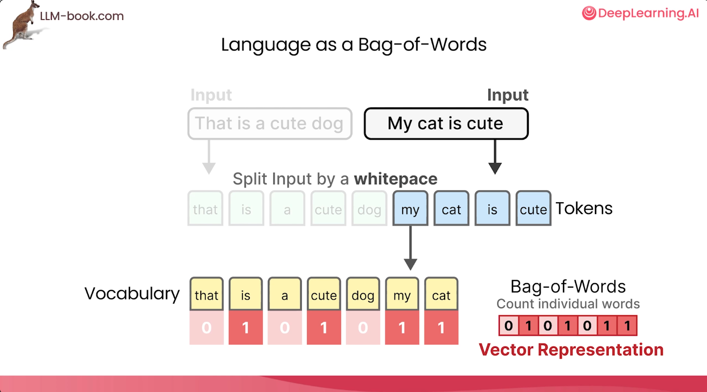

### Bag of words

Bag of words is a non-transformer based encoder. It is an algorithm that represents words as large sparse vectors or arrays of numbers. It simply records the presence of the words. It **does not capture the semantic nature** or meaning of the texts.

#### Steps

1. Inputs are tokenized. Typically white space tokenization is done.
2. From the tokenized inputs the unique tokens are accumulated to form a vocabulary.
3. The numerical vector representation is formed which shows the count of number of times a word in the vocabulary appears in the input text. If it is not found, zero is placed.
4. no meaning or semantic is captured
5. no training of any model is done.
