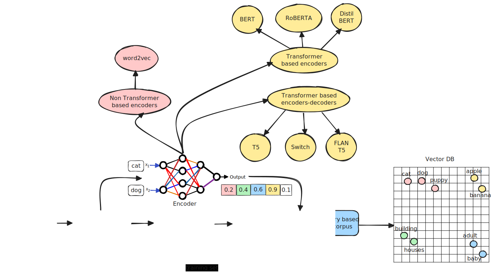

#### The journey of training corpus to vector db

### Word2Vec

Released in 2013 word2vec was one of the first successful attempts to capture the meaning of the words in **vector embeddings through neural network**.

The vector embeddings of word2vec learns semantic representation of words by training a classifier to predict the context of a word given its neighboring words. the classifier is trained on a large corpus of text data. 

#### Representation of word embeddings in word2vec

The words are mapped in a multi-dimensional space. Each dimension represents a feature of the word. These features are not anything that has any meaning or semantic. Rather these are just vectors. When a target word is received, the model predicts the context words.These are the words that are likely to appear in the context of the target word most number of times in the corpus.

##### Steps 

1. **Step 1 : Identify the training corpus -** Identify the training data. That makes the "corpus". The corpus is the collection of text data.
2. **Step 2 : Tokenize the training data -** The corpus is tokenized. The tokenization is the process of converting the text data into words/sub-words.
3. **Step3 : Create vocabulary -** These tokens are then converted into a vocabulary. The vocabulary is a collection of all unique words in the corpus.
4. **Step4 : Create numerical vector for each token in vocabulary -** The unique tokens in this vocabulary are then converted into embeddings. These are vectors created for each token. Following is the step to create these embeddings. Note that the entire corpus is not encoded - 
   1. Each token is assigned a random vector of numerical values from -1 to +1. Number of elements of the vector is the number of feature being used to encode the vocabulary.
   2. In skip-gram method, The neural network will take a target word as input (say - king), and predict nearby words (say - wore, golden, crown). It does so by taking the vector of the target word and multiplying it with the weights of the neural network. The output of the neural network is the probability of the nearby words. The weights of the neural network are updated using back propagation. The weights are updated in such a way that the probability of the nearby words is maximized.
   3. The vector of the target word and the nearby words are updated so that they are closer to each other.
   4. This process is repeated for all the words in the vocabulary. Finally the vectors of the words are learned in such a way that the words that appear in similar context are closer to each other in the vector space. i.e. their vectors are similar.
   5. There are different methods to achieve the goal of step iv. The two most popular methods are - 
      1. **Skip-gram** - The neural network takes a target word and predicts the nearby words.
      2. **Continuous Bag of Words (CBOW)** - The neural network takes the nearby words and predicts the target word.
   6. So, basically two tokens are taken, and their embeddings updated to reflect how far or near they are repeated in the training corpus. i.e. they are within the context or outside the context. 
   7. Note that only vocabulary is updated with embeddings. Not the corpus. But this embeddings are updated based on the proximity of the corresponding tokens in the training set.
   8. So, basically the idea is to build a vocabulary with tokens and vector representations, to showcase their commonalities in proximity in their usage.
   9. Note that stochastic proximity of the usage of a word in the context of the corpus, is assumed here as semantic similarity of the words. Word2Vec learns word representations using co-occurrence patterns—words that appear in similar contexts tend to have similar meanings. This is based on the **distributional hypothesis**:
    >"You shall know a word by the company it keeps." — J.R. Firth (1957)`
