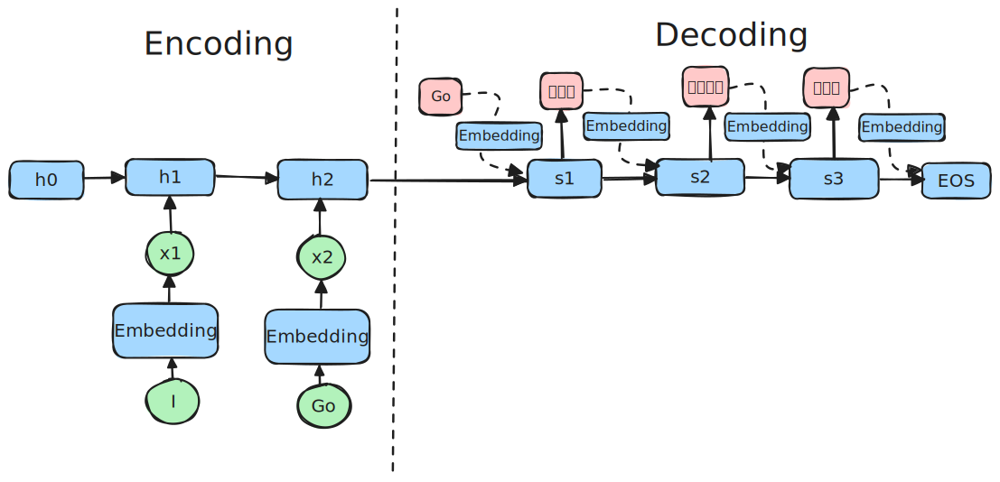

## RNN - Recurrent neural network

English to Hindi translation using RNN

### Block diagram for RNN

#### Mathematical relationships for RNN

1. Equation for the hidden state at time t -
$h_t = \tanh(Wh_{t-1} + Ux_{t} + b)$  : function of the hidden state at time t-1, the input at time t and the bias term.
2. Equation for the output at time t -
$y_t = softmax(Vh_t + c)$

#### Few observations 

1. The hidden state at time t is a function of the hidden state at time t-1, the input at time t and the bias term.
2. W and U are the weight matrices or parameters. That are trained using the training set. In the beginning, they are randomly initialized. And then they are trained, using the corpus so that the loss is minimized.
3. b is the bias term. It is also randomly initialized and then trained.
4. $x_t$ is the input at time t. It is the embedding of the token at time t.
5. $h_t$ is the hidden state at time t. It is the memory of the network at time t.

#### Steps to calculate the hidden state [Encoding]

    graph TD;
    A(Step 1. Convert input words into embeddings) --> B(Step 2. Decide hidden state size)
    B --> C(Step 3. Initialize the first hidden state of encoder h0 based on hidden size)
    C --> D(Step 4. Initialize the weight matrices and bias term randomly for encoder)
    D --> E[Step 5. Calculate the hidden states h1, h2 using RNN matrix equation]
    E --> F[Step 6. Output the last hidden state to decoder]

#### Steps to translate the hidden state to the output [Decoding]

    graph TD;
    A(Step 1. Convert vocabulary of Hindi words into embeddings) --> B(Step 2. Initialize the hidden size of decoder same as that of the encoder)
    B --> C(Step 3. Initialize the 1st hidden state of decoder to teh final state of the encoder s0 = h0)
    C --> D(Step 4. Initialize the weight matrices and bias term randomly for decoder)
    D --> E[Step 5. Calculate the 1st hidden states s1 using RNN matrix equation using weight and biases]
    E --> F[Step 6. Compute the logits matrix]

1. **Step1-** The matrix W, U and b are initialized randomly.

$$
    W = \begin{bmatrix}
    0.3 & -0.1 \\
    0 & 0.2
    \end{bmatrix}_{2*2}
$$

$$
    U = \begin{bmatrix}
    0.5 \\
    0.7
    \end{bmatrix}_{2*1}
$$

$$
    b = \begin{bmatrix}
    0 \\
    0
    \end{bmatrix}_{2*1}
$$

Hence the 1st and 2nd hidden states are calculated as follows - 

$h_1 = \tanh(Wh_{0} + Ux_{1} + b)$  
$h_2 = \tanh(Wh_{1} + Ux_{2} + b)$

1. Step 1 - Convert input words into embeddings. $x_1 = 1$ and $x_2 = 2$  
2. Step 2 - Initialize the hidden state. $h_0 = 0$
3. Step 3 - Calculate the hidden state. $h_1 = \tanh(Wh_{0} + Ux_{1}x + b)$
4. Parameter matrices seeding randomly - 

$$
A = \begin{bmatrix} 
1 & 2 & 3 \\ 
4 & 5 & 6 \\ 
7 & 8 & 9 
\end{bmatrix}
$$

