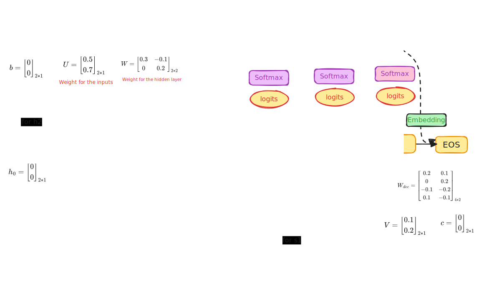

## Why RNN - Recurrent neural network - is needed

A traditional neural network works if we would like to convert an input data in the present to some sort of a prediction. It is like thinking from scratch when a set of given data is provided, trying to predict based on the same.

However, typically humans don't always think from scratch. They remember the past and use that information to predict the future. This is where RNN comes into play. RNN is a type of neural network that remembers the past and uses that information to predict the future.

Imagine you want to classify what kind of event is happening at every point in a movie, or for that matter you want to build a weather forecasting model that continuously updates predictions based on new temperature readings. A traditional neural network does not have any source of information from past as it does not have memory. This is where RNN comes into play.

Recurrent neural networks have loops in them, allowing information to persist. When we unroll the states, it appears that a RNN is a multiple copies of the same state, each relaying a message to a successor.


This chain like nature reveals that RNN are intimately related to sequences and lists, such as speech recognition, translation of texts, image captioning, etc. The amazing feats of RNN are beautifully explained in the Andrej Karpathy's excellent blog post, [The Unreasonable Effectiveness of Recurrent Neural Networks](http://karpathy.github.io/2015/05/21/rnn-effectiveness/). 


### Block diagram for RNN for text translation





#### Mathematical relationships for RNN

1. Equation for the hidden state at time t -
$h_t = \tanh(Wh_{t-1} + Ux_{t} + b)$  : function of the hidden state at time t-1, the input at time t and the bias term.
2. Equation for the output at time t -
$y_t = softmax(Vh_t + c)$


#### Steps in RNN

Step#| Description for Encoder                                | Description for Decoder
-----|------------------------------------------------------  |------------------------
1    |Embed inputs                                            |Create embeddings for vocabulary
2    |Decide number of hidden layers and states               |Decide number of hidden layers and states
3    |Initialize the 1st hidden state h0                      |Initialize 1st hidden state
4    |Activation function $h_t = \tanh(Wh_{t-1} + Ux_t + b)$  |Activation function $$s_t = \tanh(W_{dec} s_{t-1} + Vy_t + c)$$
5    |initialize the weights and bias for hidden states       |Initialize the weights and bias for hidden states
6    |Calculate all the hidden states of encoder using step 4 |Calculate the 1st output state             |
7    |Encoder work is done. pass on to decoder last state     |Calculate logits matrix for 1st output state
8    |N/A                                                     |Calculate probability distribution of output using softmax()
9    |N/A                                                     |Determine the word corresponding to the highest probability
10   |N/A                                                     |Compute all the output states repeating steps 6 to 9 for all states


[RNN step details](https://github.com/samratkar/samratkar.github.io/blob/main/_posts/concepts/genai/notes/code/RNN-imp.ipynb)

### Points to ponder on RNN

1. The data of previous hidden states like $h_0$, $h_1$, are encoded and are passed into the last hidden state, in this case $h_2$. This encoded state of $h_2$ is passed to the output layer $s_1$. Although a compressed encoded matrix information is passed, the original content is not passed. This reduces the accuracey of RNN, due to this limited context information it has.
2. The input text (query) needs to be converted into numeric embeddings in their entirety. All the words need to be embedded first and then passed to the RNN encoder layer to compute the hidden states of the encoder. 
3. The encoder encodes like a relay race the embeddings via a matrix multiplication from one state to another and passes the matrics on and on. 
4. the decoder has an extra state known as logits matrics that converts the out of each of the decoder state to the actual output language using a softmax function. 
5. Softamx converts the matrics into the matrics of probabilities of all the possible output words in the vocabulary.
6. All these transformations are being done by the activation function and the weights and bias matrices that are initialized at the start of the RNN model, and then eventually trained to see which numbers are resulting in the expected outputs. It is a supervised learning technique that is employed.

#### Encoding algorithm

```python
def forward(self, src_tokens):
    # h0 - the initial hidden state
    h = torch.zeros(self.hidden_size)
    # hidden size = 2. Since we have 2 input tokens - "I" and "Go"
    # embed size = 1. This is typically number of dimensions in which each word is embedded. In this case we are embedding the inputs in one dimension.
    # when hidden layers are more than 1, this entire thing replicates. Like W = 2x2 matrix. it becomes 2 x 2 x 2 matrix. And so on. All the hidden states replicate as another layer, behind each other.
    self.W_h = nn.Parameter(torch.randn(hidden_size, hidden_size)*0.1)
    self.W_x = nn.Parameter(torch.randn(hidden_size, embed_size)*0.1)
    self.b   = nn.Parameter(torch.zeros(hidden_size))
    # number of hidden state in the encoder is equal to the number of input tokens.
    for t in range(src_tokens.shape[0]):
        token_id = src_tokens[t]
        x_t = self.embedding(token_id)
        h = torch.tanh(
            torch.mv(self.W_h, h) +
            torch.mv(self.W_x, x_t) +
            self.b
    )
    return h
```

#### Decoding algorithm

```python
def forward(self, dec_tokens, init_hidden):
        # s0 = hn - the final hidden layer of the encoder.
        h = init_hidden
        logits_list = []
        # number of hidden states of decoder is equal to the number of output tokens.
        for t in range(dec_tokens.shape[0]):
            token_id = dec_tokens[t]
            x_t = self.embedding(token_id)

            h = torch.tanh(
                torch.mv(self.W_h, h) +
                torch.mv(self.W_x, x_t) +
                self.b
            )
            # logits matrix acts as a bridge between the hidden state after each iteration to the output state intermediate matrix. This intermediate logits matrix is then passed to the softmax function to get the probability distribution of the output words. In this case it is 2x1 (hidden state of 2 hidden states and 1 hidden layer.) to 4x1 matrix (4 outputs) transformation.
            logits_t = torch.mv(self.W_out, h) + self.b_out
            # stores the logits of each of the hidden states of the decoder. Softmax is not implemented here, and is taken care in the training module.
            logits_list.append(logits_t.unsqueeze(0))

        return torch.cat(logits_list, dim=0)
```

### Advantages of RNN

+ Captures dependencies within short range
+ Takes less RAM than other n-gram models

### Disadvantages of RNN

- Struggles with longer sequences
- Prone to vanishing gradient