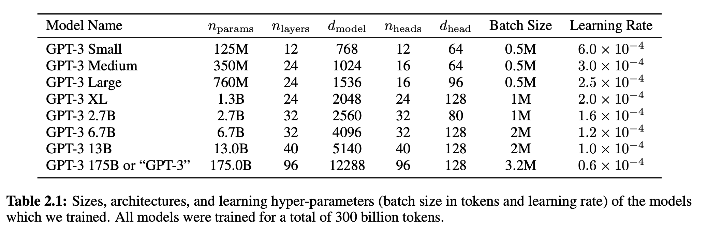

**Courtesy and Thanks** to sessions from [Vizuara.ai](https://vizuara.ai) that has helped me to understand the concepts discussed here below. 

## Next token prediction task NLP Vs LLM

NLP was created to predict the next token given the previous tokens. This is the task that LLMs are trained on as well. But NLPs are designed for specific tasks like language translations. They are specific.

LLM - they can perform wide range of tasks with the same model.
## Language models explained briefly - 

<iframe width="560" height="315" src="https://www.youtube.com/embed/LPZh9BOjkQs?si=1nv5yyXB7Qc2Esv6" title="YouTube video player" frameborder="0" allow="accelerometer; autoplay; clipboard-write; encrypted-media; gyroscope; picture-in-picture; web-share" referrerpolicy="strict-origin-when-cross-origin" allowfullscreen></iframe>

## Size scaling law

since 1950s what has happened consistently is that size of language model has increased a lot. Size scaling law says, as we increase the parameters of the model, the performance of the model increases. Open AI broke the barrier.

| Model | Parameters | Data |
|-------|------------|------|
| GPT 2 | 1.5 Billion | 2018|
| GPT 3 | 175 Billion | 2020|
| GPT 4o | 1 Trillion | 2024|

## Emergent properties

when the size of LLMs becomes greater than a certain number, there is a takeoff point, the language model starts to show something new altogether. Who knows what new learning it will do!

Emergent property is something that is on **task level only**! 

We do not know where semantic property came up. There is a step where we create semantic explicitly when we do [embeddings](https://causewriter.ai/courses/ai-explainers/lessons/vector-embedding/) in RAGs.

But, as a part of training, and fine tuning this happens by itself.

## Andrej Karpathy - why so many parameters? Explainability

We need large parameters, as we are learning a language. Although it is a big thing, there is only a small portion that is being used. Also the parameters and neurons and the layers that are used depend on the tasks that are being done by the LLMs.

The following research paper explains the same - [causal mediation analysis](https://arxiv.org/abs/2004.12265)
Here is the [Notebooklm podcast](https://notebooklm.google.com/notebook/f5539387-3565-4201-99e0-47a993dee1c5/audio) explaining the paper.

## Stages in Building SLM from scratch - 5-6 year old kids specific learning

graph TD
    A0(Stage 1 - Data Preparation) --> A
    A(Stage 2 - Pre-training) --> B(Stage 3 - Fine-tuning)
    B --> B1(Classification)
    B --> B2(summarization)
    B --> B3(translation)
    B --> B4(personal assistant)
    B1 --> C(Stage 4 - Testing)
    B2 --> C
    B3 --> C
    B4 --> C
    C --> D(Stage 5 - Feedback)
    D --> B
    D --> E(Stage 6 - Deployment)
    E --> F(Stage 7 - Inference)

### Fewshot learning - learning from scratch.

[GPT3 paper](chrome-extension://efaidnbmnnnibpcajpcglclefindmkaj/https://arxiv.org/pdf/2005.14165) showed that with just pre-training and not fine tuning, and instead using few prompts of questions and answers during the inference stage, one can achieve fairly decent results.

Fewshot learning is a way of training the model once it is already deployed and released for inference. While duing inference, few shots are given to the model in the form of questions and answers, that the model has not seen before. This is a way of training the model on fly. Note that there are no changes in the parameters. It is just making the LLM learn on the fly by itself, without changing any architecture or parameters.

### Oneshot learning -

Oneshot learning is where the model is already trained from beginning, before inferencing stage. It might be during pre-training, fine tuning or for that matter using an additional embedding in the form of RAG.

### Stage 1 - Data preparation and sampling

[A sample code for data generation process from Stanford Alpaca Labs](https://github.com/tatsu-lab/stanford_alpaca?tab=readme-ov-file#data-generation-process)

#### Tiny stories 

With only 10M parameters, [Tiny Stories Research paper](https://arxiv.org/abs/2305.07759) shows that it can help language speaking for small children.
   
#### Stage 1.1 - Tokenization

[Tokenization](https://samratkar.github.io/2024/01/26/blfs-1-2.html)

#### Attention mechanism

[Attention is what you need paper](https://arxiv.org/abs/1706.03762) explains 

### Stage 2 - Pre-training

#### Auto-regressive learning or Self Learning

GPUs allocation. 5 days.
comes under the category of self-supervised learning. It is in-between supervised and unsupervised learning. 

Say dataset is = "Every effort moves you forward. Today I am learning about AI"

1st token = Every. 

| Batch No | Input | Output |
|----------|-------|--------|
| 1        | Every | effort |
| 2        | Every effort | moves |
| 3        | Every effort moves | you |
| 4        | Every effort moves you | forward |
| 5        | Every effort moves you forward | . |

In supervised learning, we provide the input and output pairs. But in LLMs, both input and output pairs are in the same data. In a sense you are exploiting the structure of the paragraph itself to generate the input-output pairs. These pairs are created by the LLM itself. It is also known as *Auto-regressive learning*.

Labels are created by the models directly which is hardcoded - n-gram token at a time.

#### Embeddings

    graph LR
        A(corpus) --> B(Tokenization) --> C(Embedding)
        C --> D(Vector DB)

### Stage 3 - Fine-tuning

[A sample code to fine tune from Stanford Alpaca Labs](https://github.com/tatsu-lab/stanford_alpaca?tab=readme-ov-file#fine-tuning)

In the fine tuning stage labels of inputs and outputs are explicitly provided to the model. The architecture remains the same.

#### Stage 4 - Testing

[A sample code to get the parameters from the model trained and tuned - Stanford Alpaca](https://github.com/tatsu-lab/stanford_alpaca?tab=readme-ov-file#recovering-alpaca-weights)

1. **Human as a judge** - Focused user group
2. **LLM as a judge** - Test using an LLM itself. Use a matured LLM as a judge. Evaluate the responses using prompts. Create metrics.
3. **Metrics**
   1. age appropriateness
   2. grammar
   3. choice of stories
   4. creativity
4. **Human testers / annotaters**
   [Lex Friedman podcast of Anthropic CEO]()
5. Pass the question and answers in the papeline to Fine tuning again. And continue. 

### Nature of LLMs

LLMs actually understands the meaning. Not only form. This semantic understanding is caused due to self learning that happens with fine tuning, training, and also few shot prompting.

graph LR
A(Language) --> B(Form)
A --> C(Meaning)

### Distillation

We start with a small model. Then we bring in a bigger LLM. We take the learnings from the bigger LLM, and use that to fine tune the small model. We distill the knowledge from the bigger model to the smaller model.
This is what **Deepseek** did. They trained on 673B parameters. Then they distilled this with smaller models. 

### Mixture of expert (MOE)

It is related to architecture. Transformer is a feed forward neural network. It is a stack of layers. We create different neural networks, each specialized in specific tasks. They are selected turned on and off.
We can have MOE multi-agents as well.

### Deepseek

It uses RL and not much of the supervised leanring is used.
RL is highly compute intensive. Here are few low cost examples of training an LLM.

1. [minr1 deep skeek implementation](https://www.philschmid.de/mini-deepseek-r1)
2. [NovaSky Sky-T1](https://novasky-ai.github.io/posts/sky-t1/)

[Stanford Alpaca](https://github.com/tatsu-lab/stanford_alpaca) has the code base for fine tuning and training.

## The art of tokenization

[Code base](https://colab.research.google.com/drive/1YT817lJ75HFrmwvDGhFHbypl2EQm6ifc?usp=sharing)

