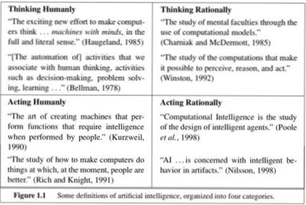

# Introduction

### What is Artificial intelligence?

[#AI]() - The concept of programming a computer to react to data in a similar way to a thinking being. AI currently encompasses a huge variety of subfields, ranging from - 

   1. general - learning and perception - strong AI
   2. specific - playing chess, proving mathematical theroems, writing poetry, driving a car on a crowded street, and diagnosing diseases.

#### AI Quadrant
1. left - fidelity to human thinking.
2. right - measure against ideal performance measures.
3. top - the discipline of thought and mental faculties
4. bottom - behavior and performance.

