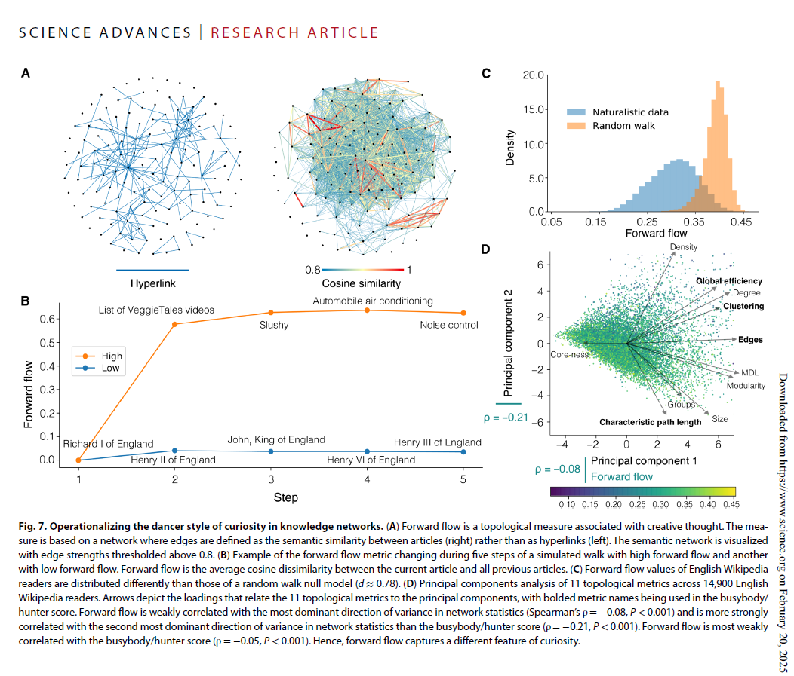

## The 3 styles of curiosity  

According to the work of Perry Zurn, there are three styles of curiosity - 
- the **busybody** - Picks up bits of information about a wide range of topics. There is no particular goal or focus in mind.
- the **hunter** - Seeks out specific answers. Follows a targeted path and tries to avoid distractions.
- the **dancer** - Leaps to new ideas building upon the older ones, in new and unexpected ways. They don't follow the traditional path.
These three styles are not mutually exclusive.

Building on these ideas, Perry Zurn and his colleagues have recently sought to examine how different styles of curiosity might influence our lives in their paper [Architectural styles of curiosity in global Wikipedia mobile app readership](https://www.science.org/doi/10.1126/sciadv.adn3268).

### Audio summary

The audio summary of the paper is available below

<audio controls>
  <source src="/assets/humanism/arch-styles-curiosity.mp3" type="audio/mpeg">
  Your browser does not support the audio element.
</audio>

### The key findings are - 

→ People whose wikipedia browsing patterns were loose and more diverse, more akin to busybodies and dancers than hunters, people tend to feel more positive and less negative emotions. The population is better educated, and there is less gender and educational inequality.
In this case the correlation can be interpreted both the ways - 
- broader curiosity might support more equality 
- equality may also free up more wide-ranging inquisitiveness.

→ The findings obviously directs to the inherent correlation among #bridging-up #wide-interest #curiosity and #equality. More gender and educational equality causes more minds to huddle up, engaging more ideas and building up more complex knowledge. Equality can bring freedom to move, not just physical and social worlds, but also freedom to move minds. 

→ The paper provides quantitative evidence for **"dancer"** style characterized by creative knowledge production. **Forward Flow** a topological measure associated with creative thought, operationalizes the dancer style of curiosity, as depicted in the illustration below - 

As an illustration, the paper examines a reader’s knowledge network and redefine edges as the semantic distance between articles (Fig. 7A and Materials and Methods). Consider two simulated walks weaving a temporal thread through five pages where one walk seeks information with high forward flow and the other with low forward flow; each follows qualitatively different trajectories and visits differ-ent types of pages (Fig. 7B).
The paper then analyzes the forward flow of Wikipedia readers. Because dancers must explore diverse topics to connect them, the paper later examines the relation between forward flow and information diversity. It is found that the two were significantly positively correlated (ρ = 0.79, P < 0.001). Also the distribution of forward flow in readers’ knowledge networks from English Wikipedia is different from that of null model knowledge networks generated from random walks (d ≈ 0.78) (Fig. 7C), suggesting that empirical forward flow cannot simply be explained by random chance. Specifically, forward flow for readers is lower than for random walks, indicating that Wikipedia readers connect disparate topics in a more con-strained way.

→ The study finds associations between knowledge network structures and population-level indicators such as **spatial navigation, education, mood, well-being, and inequality**.  For example, building broad and diverse networks is—on a population level—predictive of spatial navigation, well- being, and both gender and education equality

→ The research indicates that looser knowledge networks are associated with **higher spatial navigation performance, less negative affect, more positive affect, greater Human Development Indices,** more education, lower gender inequality, and lower education inequality. More diverse networks also correlate with less negative affect, more positive affect, greater Human Development Indices, more education, lower gender inequality, and lower education inequality

#### Metrics used

The research assesses individual differences in knowledge network building by measuring topological indicators of the three architectural styles of curiosity: hunter, busybody, and dancer. To do this, the study uses several metrics to characterize and compare knowledge networks. These metrics include:

- **Network size:** The number of nodes in the network.
- **Number of edges:** How connected articles are via hyperlinks.
- **Network density:** The fraction of existing edges out of all possible edges.
- **Degree:** The number of hyperlink connections of a given node to all other nodes.
- **Clustering coefficient:** The fraction of existing edges out of all possible edges in node triplets.
•
Characteristic path length: The mean shortest path length between all pairs of nodes.
•
Global efficiency: The harmonic mean of the path distances.
•
Core-periphery structure (coreness): Detects core nodes and periphery nodes based on their connections.
•
Modularity: Estimated by fitting a hierarchical degree-corrected stochastic block model.
•
Number of groups (modules): The fitted model’s partitioning of the nodes into modules.
•
Minimum description length: The amount of information required to describe the data using the fitted stochastic block model.
•
Busybody/Hunter score: An aggregate score derived from several network measures (number of edges, clustering coefficient, global efficiency, and characteristic path length) that indicates whether a knowledge network is more clustered (hunter-like) or more dispersed (busybody-like).
•
Forward flow: A measure associated with creative thought, calculated by the average distance between the current thought and all previous thoughts. In this study, it is the average cosine dissimilarity between the current article and all previous articles.
•
Information diversity: Measures the diversity of topics within a reader's knowledge network, calculated using the Shannon diversity index based on the proportion of page visits classified into different topics (culture, geography, history and society, and STEM) 

