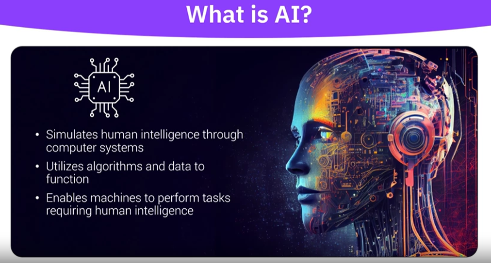
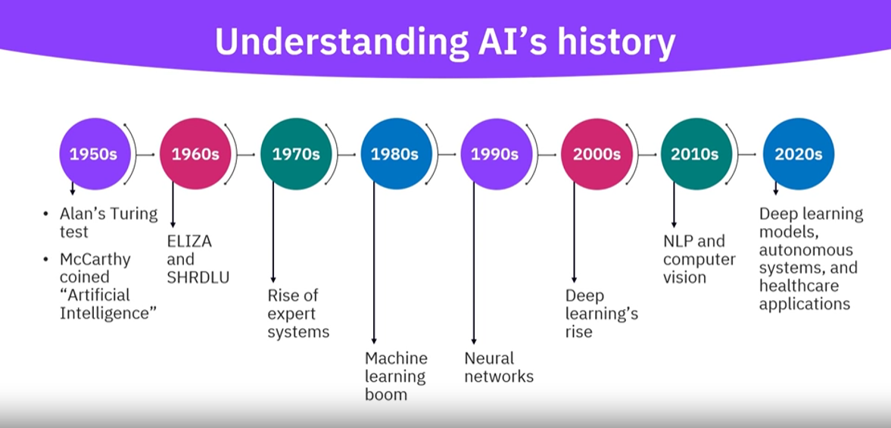

# Introduction to Artificial Intelligence (AI)

## Introducing AI

1. AI : Augmented intelligence extending human capabilities, completing tasks beyond human and computer abilities.
2. Methods to develop machine learning models -
   1. Supervised learning
   2. Unsupervised learning
   3. Reinforcement learning
3. Types of AI
   1. Narrow AI - Specific domain - eg : language translators, virtual assistants, AI powered web searches, recommendation engines, intelligent spam filters.
   2. General AI - strong ai - diverse set of capabilities across unrelated tasks, acquires new skills to face new challenges, amalgamation of various AI strategies. eg : finance, human resources, IT, R&D, Supply chain.
   3. Super AI - conscious AI - human level consciousness, self aware, advainced congitive abilities, self learning, self improving, self replicating, self programming, self evolving. eg - health care, robotics, autonomous vehicles, natural language understanding, evnironmental conservation.

### Artificial intelligence vs augmented intelligence

1. Artificial - only computers
2. Human - only humans
3. Augmented - humans and computers together.

| machines                   | human                    |
| -------------------------- | ------------------------ |
| ingest huge amount of data | generalizing information |
| repetitive tasks           | creativity               |
| accuracy                   | emotional intelligence   |

### Generative AI

1. Traditional AI - focusses on analyzing data and making decisions, like recommending songs you want to listen, or translating a language.
2. Generative AI - creates new content from scratch. it does not rely on predefined rules or patterns. Instead, it uses deep learning techniques and relies on vast data sets to generate new ideas. Generative AI can use LLMs, for processing and generative human like text.
3. Capabilities of generative AI
   1. offers diverse content creation capabilities.
   2. enables human like conversations
   3. generates training data through data augmentation
4. use cases
   1. Marketing - personalized advertizements, email campaigns, social media posts.
   2. Creative - digital art, music, video
   3. Product development - Trend analaysis, product idea generation, product design optimization.
5. Industry
   1. Healthcare - tailored treatments, simulate surgeries, produce medical images
   2. Gaming - create game worlds, generate levels, characters, objects
   3. Fashion - virtual try-on experiences,
   4. Education - interactive environment

### Different types of AI

### Introduction

Artificial intelligence (AI) encompasses a range of systems designed to mimic, enhance, or exceed human capabilities. AI can be categorized based on its capabilities and functionalities. Understanding these types and their capabilities highlights the diverse applications and potential of AI technologies.

### Objectives

After completing this reading, you will be able to:

* Explain the types of artificial intelligence based on their functionalities.
* Explore the capabilities of each type of artificial intelligence.

### AI types

1. **Diagnostic/descriptive AI**
   Diagnostic or descriptive AI focuses on assessing the correctness of behavior by analyzing historical data to understand what happened and why. This type of AI is instrumental in identifying patterns and trends, performing comparative analyses, and conducting root cause analyses.
   **Capabilities:**
   **Scenario planning:** Helps in creating different future scenarios based on historical data.
   **Pattern/trends recognition:** Identifies recurring patterns and trends within data sets.
   **Comparative analysis:** Compares various data points to find correlations and insights.
   **Root cause analysis:** Determines the underlying reasons behind specific outcomes.
2. **Predictive AI**
   Predictive AI is concerned with forecasting future outcomes based on historical and current data. This type of AI is used extensively in predicting customer behavior, market trends, and other forward-looking insights.
   **Capabilities:**
   **Forecasting:** Predicts future trends and events.
   **Clustering and classification:** Groups similar data points and classifies them into predefined categories.
   **Propensity model:** Assesses the likelihood of specific outcomes based on current data.
   **Decision trees:** Utilize a tree-like model of decisions to predict outcomes.
3. **Prescriptive AI**
   Prescriptive AI focuses on determining the optimal course of action by providing recommendations based on data analysis. It goes beyond prediction by suggesting actions that can help achieve desired outcomes.
   **Capabilities:**
   **Personalization:** Tailors recommendations and experiences to individual needs.
   **Optimization:** Identifies the most efficient ways to achieve goals.
   **Fraud prevention:** Detects and prevents fraudulent activities through analysis.
   **Next best action recommendation:** Provides actionable insights on the next steps to take.
4. **Generative/cognitive AI**
   Generative or cognitive AI is involved in producing various types of content, such as code, articles, images, and more. This type of AI mimics human creativity and cognitive processes to automate and assist in content creation.
   **Capabilities:**
   **Advises:** Offers expert advice and recommendations.
   **Creates:** Produces new content, such as text, images, and code.
   **Protects:** Enhances security measures through intelligent analysis.
   **Assists:** Provides assistance in various tasks, improving efficiency.
   **Automates:** Automates repetitive tasks to save time and resources.
5. **Reactive AI**
   Reactive AI systems are designed to respond to specific inputs with predetermined responses. They do not have memory or the ability to learn from past experiences, making them suitable for tasks that require immediate reactions.
   **Capabilities:**
   **Rule-based actions:** Executes specific actions based on predefined rules.
   **Instant responses:** Provides immediate responses to inputs.
   **Static data analysis:** Analyzes current data without considering past interactions.
6. **Limited memory AI:**
   Limited memory AI systems have the ability to use past experiences to inform current decisions. They can learn from historical data to improve their performance over time. This type of AI is commonly used in autonomous vehicles and recommendation systems.
   **Capabilities:**
   **Learning from data:** Uses historical data to make informed decisions.
   **Pattern recognition:** Identifies patterns over time to improve accuracy.
   **Adaptive responses:** Adapts responses based on previous interactions.
7. **Theory of Mind AI:**
   Theory of Mind AI is an advanced type of AI that aims to understand human emotions, beliefs, and intentions. It is still in the research stage and seeks to interact more naturally with humans by comprehending their mental states.
   **Capabilities:**
   **Emotion recognition:** Identifies and responds to human emotions.
   **Social interaction:** Engages in more natural and human-like interactions.
   **Intent prediction:** Predicts human intentions based on context and behavior.
8. **Self-aware AI:**
   Self-aware AI represents the most advanced form of AI, which has its own consciousness and self-awareness. This type of AI can understand and react to its own emotions and states. It remains a theoretical concept and has not yet been realized.
   **Capabilities:**
   **Self-diagnosis:** Evaluates its own performance and health.
   **Autonomous learning:** Learns independently without human intervention.
   **Adaptive behavior:** Adjusts behavior based on self-awareness.
9. **Narrow AI (Weak AI):**
   Narrow AI is designed to perform a specific task or a limited range of tasks. It excels in a single area but lacks generalization capabilities. Most current AI applications fall under this category.
   **Capabilities:**
   **Task specialization:** Excels in performing specific tasks.
   **High accuracy:** Achieves high performance in its designated area.
   **Efficiency:** Operates efficiently within its scope of specialization.
10. **General AI (Strong AI):**
    General AI, like human intelligence, can understand, learn, and apply knowledge across a wide range of tasks. It can also transfer knowledge from one domain to another and adapt to new situations autonomously.
    **Capabilities:**
    **Cross-domain learning:** Applies knowledge across various domains.
    **Autonomous decision making:** Makes decisions independently in diverse scenarios.
    **Human-like understanding:** Understands and processes information similar to humans.

### Summary:

In this reading, you learned about the following:

* The different types of AI include:
  * **Diagnostic/descriptive AI:** Focuses on assessing the correctness of behavior by analyzing historical data to understand what happened and why.
  * **Predictive AI:** Concerned with forecasting future outcomes based on historical and current data.
  * **Prescriptive AI:** Focuses on determining the optimal course of action by providing recommendations based on data analysis.
  * **Generative/cognitive AI:** Involved in producing various types of content, such as code, articles, images, and more.
  * **Reactive AI:** Designed to respond to specific inputs with predetermined responses.
  * **Limited memory AI:** Have the ability to use past experiences to inform current decisions.
  * **Theory of Mind AI:** Advanced type of AI that aims to understand human emotions, beliefs, and intentions.
  * **Self-aware AI:** Represents the most advanced form of AI, which has its own consciousness and self-awareness.
  * **Narrow AI (Weak AI):** Designed to perform a specific task or a limited range of tasks.
  * **General AI (Strong AI):** Can understand, learn, and apply knowledge across a wide range of tasks like human intelligence.

### Traditional vs Generative AI

#### Traditional AI

1. Repository - has the raw data from say customers.
2. Analytics platform - like say Watson studio that has models and you apply those models on the data to drive insights. Say customers who are about to churn.
3. Application layer - Here you take corrective actions based on the predictions and insights of the model. say you do something to avoid customers churn.
4. Feedback loop - allows you to automate the process. This is used to make the models better, based on the accuracy and precision metrics that we get of the model from the analytics platform. This is the MLOPs, where you continue to fine tune the model with this feedback loop.

#### Generative AI schema

### Are we there yet! 

1. AGI -  Artifical General Intelligence - is the ultimate goal of AI, where the machine can perform any intellectual task that a human can do. It is the holy grail of AI.

### Practice Quiz 

1. Which of the following categories of AI engages and performs a diverse array of distinct and unrelated tasks?
   1. [ ] narrow AI
   2. [ ] machine learning AI
   3. [x] Strong AI
   4. [ ] Super AI
2. AI encompasses applying logical thinking, ____, interpreting sensory data, and comprehending language.
   1. [x] problem solving
   2. [ ] searching for data
   3. [ ] algorithmic development
   4. [ ] knowledge representation
3. Generative AI is an AI technique capable of creating new and novel data. How does generative AI generate new data?
   1. [ ] by mimicking actions of human experts directly
   2. [x] by using deep learning techniques on huge data sets
   3. [ ] by using shallow learning techniques on small data sets
   4. [ ] by following pre-defined rules and patterns

## Impact and application of AI

1. 