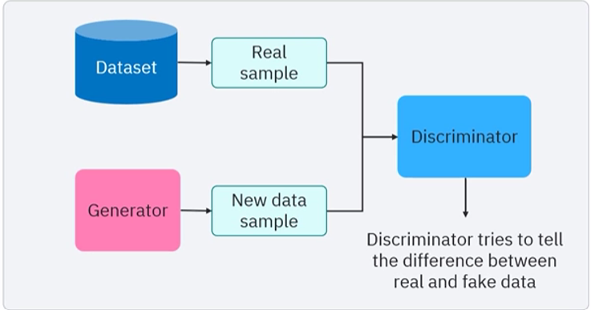
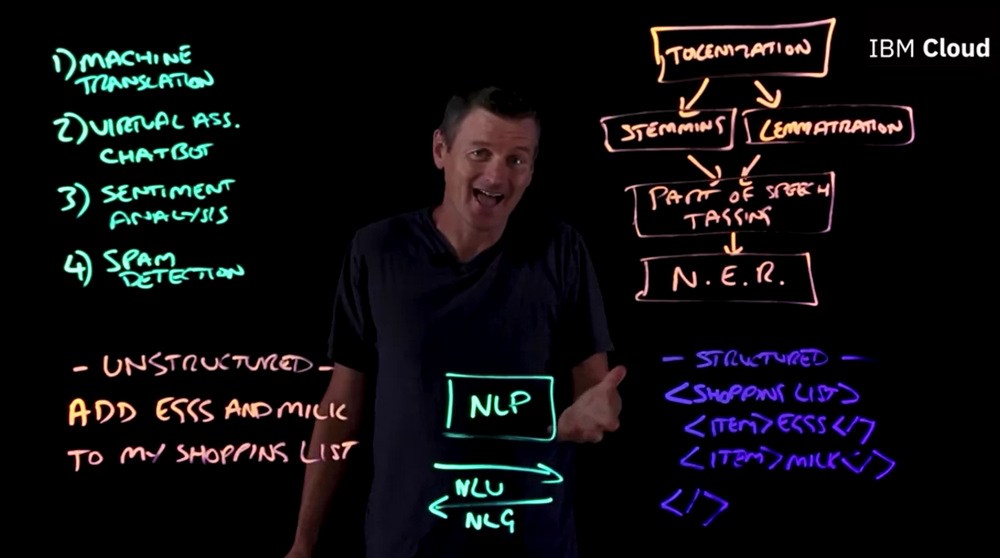
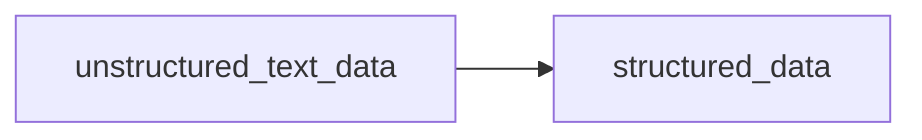
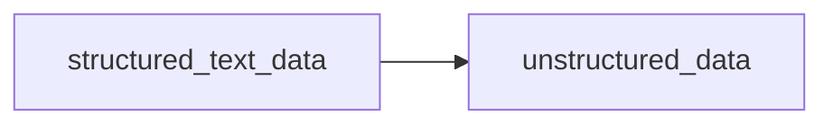

## Cognitive computing

1. Cognitive computing - it is a branch within AI that mimics human thought processes to create intelligence machine. Cognitive computing makes machines active partners, not just tools. These advanced systems do more than execute commands. They grasp your needs, anticipate your questions, and proactively deliver valuable insights.
2. steps to human understanding or cognitive computing:
    - observe
    - interpret
    - evaluate
    - decide
    - act
3. core elements of cognitive computing 
   1. perception - interpret the environment. Gather data. structured and unstructured. 
   2. learning - analyze patterns and trends in the data using machine learning algorithms to extract meaningful insights. 
   3. reasoning - provides insights into complex relationships. predictions. prescriptions. 

## Types of MLs

There are three main types of machine learning - 

1. supervised learning, which is trained on **labels** to classify new data. The more samples you provide a supervised learning algorithm, the more precise it becomes in classifying new data, 
   1. regression - predicting actual output - y = f(x)
   2. classification - discrete class labels signifying different categories.
      1. decision tree
      2. random forest
      3. support vector machine
      4. logistic regression
   3. neural network 
2. unsupervised learning that finds patterns in **unlabeled** data. It is useful for clustering similar data points and detecting anomalies, and reinforcement learning that learns to achieve goals within a set of rules and constraints by maximizing rewards. It is applicable in tasks like playing chess or navigating obstacle courses.
   1. clustering - grouping similar data points together
   2. association - finding patterns in data
   3. dimensionality reduction - reducing the number of features in the data
   4. anomaly detection - identifying outliers in the data
   5. neural network
3. reinforcement learning - it is a type of machine learning that enables an agent to learn in an interactive environment by trial and error using feedback from its own actions and experiences. The agent learns without explicit supervision, gathering knowledge from the environment and taking actions to maximize rewards. 
   1. Q-learning
   2. deep Q-networks
   3. policy gradients
   4. actor-critic
4. Data sets - 
   1. training set - used to train the model
   2. validation set - used to tune the model
   3. test set - used to evaluate the model
   4. cross-validation - used to validate the model
5. Evaluation metrics - 
   1. accuracy - the proportion of correctly classified instances
   2. precision - the proportion of correctly classified positive instances
   3. recall - the proportion of actual positive instances that were correctly classified
   4. F1 score - the harmonic mean of precision and recall
   5. ROC curve - a graphical representation of the true positive rate against the false positive rate
   6. AUC - the area under the ROC curve
6. Neural Network - input is passed into the different layers of the neural network and produces an output. the error or loss of the output is determined, and in the backward propagation the error is again sent to the neural network. weights and biases are adjusted. 
   1. perceptron neural network - 1 input and output layer.
   2. feedforward neural network - one direction.
   3. deep feedforward neural network - more than one hidden layer.
   4. modular neural networks - uses two or more neural networks to arrive at the output.
   5. convolutional neural network - well suited for analysing visual data. - a function is applied to another function. resulting in mixture of two functions.
   6. recurrent neural network - each internal layers gets external inputs with a delay in time. used to determine the next word in the sentence. this is useful when you need previous information to process the current information.
7. Generative AI models - text, art, music, video
   1. Variational auto-encoders (VAE) - image recognition (fashion mnist vae), anamoly detection.
      1. encoder network
      2. latent space representation
      3. decoder
   2. Autoregressive models - generates data sequentially, based on the previous data. Can generate text or music. Ex - Wavenet. 
      1. RNN
      2. LSTM
      3. GRU
   3. Generative adversarial networks (GANs) - has two neural networks - NVDIA styleGAN
      1. Generator - generates new data instances
      2. Discriminator - evaluates the generated data instances
      3. Can be used for image generation, style transfer, data augmentation 
      
   4. Transformers - NLP - generates text, translations. GPT - Generative Pre-trained Transformer
      1. encoders - input data
      2. decoders - output data
      3. modality - single or multi modal. gpt4, meta's imagebind
8. Large language models 
   1. Foundational models. This is a new paradigm. one "earth model" is trained. 
      1. And even though these models are trained to perform, at its core, a generation task, predicting the next word in the sentence, we actually can take these models. And if you introduce a small amount of labeled data to the equation, you can tune them to perform traditional NLP tasks. Things like classification or named entity recognition, things that you don't normally associate as being a generative based model or capability. And this process is called tuning, where you can tune your foundation model by introducing a small amount of data. You update the parameters of your model, and now it can perform a very specific natural language task. If you don't have data or have only very few data points, you can still take these foundation models, and they actually work very well in low label data domains.
   2. Advantages - 
      1. Performance - These models have seen so many data, and by the time when they are given small tasks, they easily outperform ohter models which are trained in small data. 
      2. Productive gains - through prompting or tuning, you need far less labeled data to get to a task specific model than if you had to start from scratch. Because your model is taking advantage of all the unlabeled data that it saw in its pre-training when we created this generative task. 
   3. Disadvantages - 
      1. compute cost - they are very expensive to train. Also for inference you need high end computing to run these models. 
      2. trust worthiness - you dont know on what data sets these LLM models are trained on. Especially in the domain like language, a lot of these models are trained, basically, off of language data that's been scraped from the Internet. And there's so much data that these models have been trained on. Even if you had a whole team of human annotators, you wouldn't be able to go through and actually vet every single data point to make sure that it wasn't biased and contained hate speech or other toxic information. And that's just assuming you actually know what the data is. Often, we don't even know for a lot of these open source models that have been posted, what the exact data sets are that these models have been trained on, leading to trustworthiness issues.
   4. Types of large models - 
      1. language models
      2. vision models - dalle.2
      3. code models - copilot
      4. chemistry - MoLFormer. 
      5. earthscience - climate change.
9. Applications of Ai -
   1. smart assistant
   2. recommendation system
   3. smart theromostats
   4. facial recognition
   5. chatgpt
   
## Domains of AI 
1. NLP 
2. Speech technology - STT, TTS
3. facial recognition
4. computer vision
   1. interprets and comprehends the visual data
   2. image classification
   3. image segmentation - dividing the image into segments. detailed labelling of each pixel.
   4. object detection - YOLO, R-CNN, fast R-CNN 

### NLP - natural language processing.

1. NLP is all about processing unstructured text data and converting it to structured data.

### NLG - natural language generation.

1. it is all about conversion of structured data to unstructured text data.

