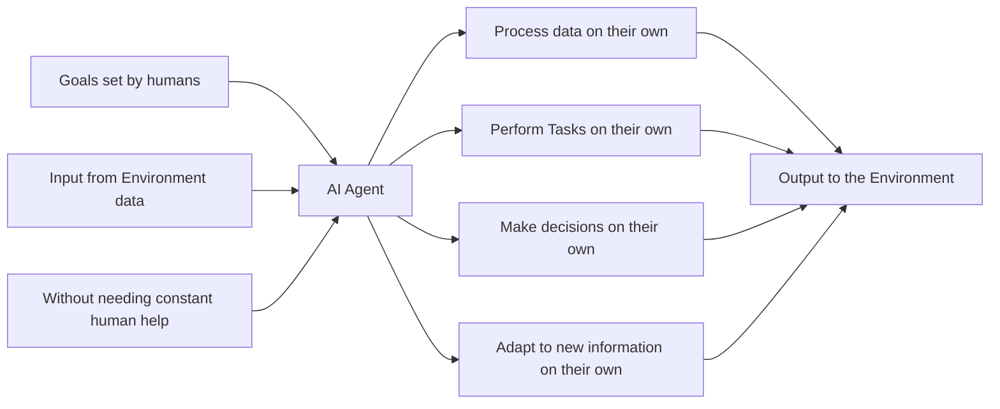
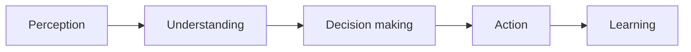

## AI Agents

### Definition

AI agents are software programs that `interact` with their environment, `collect and process data`, and `perform tasks on their own` to achieve `goals set by humans`. They can make decisions, solve problems and adapt to a new information without needing constant human help. 

### Working of an AI agent

