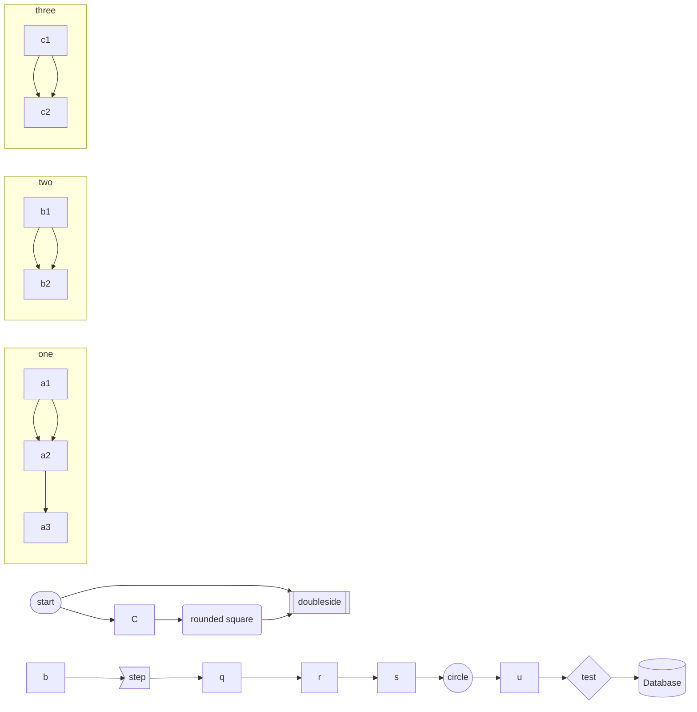
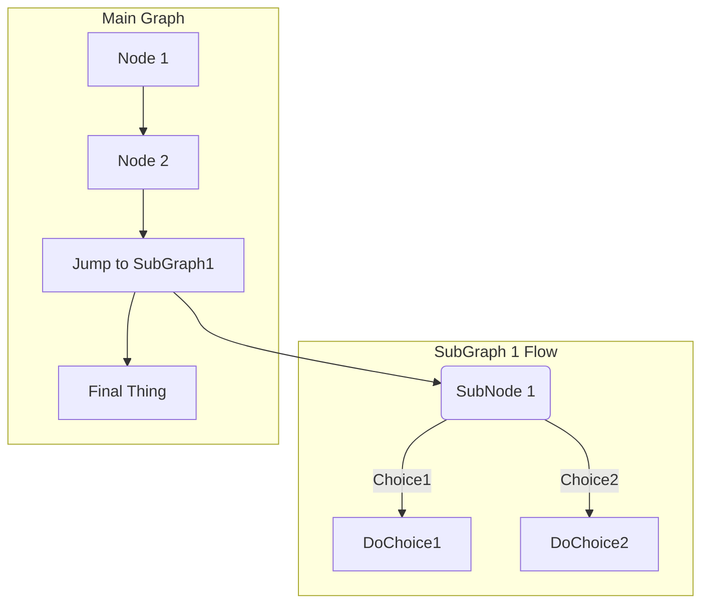
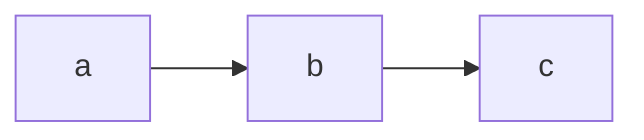
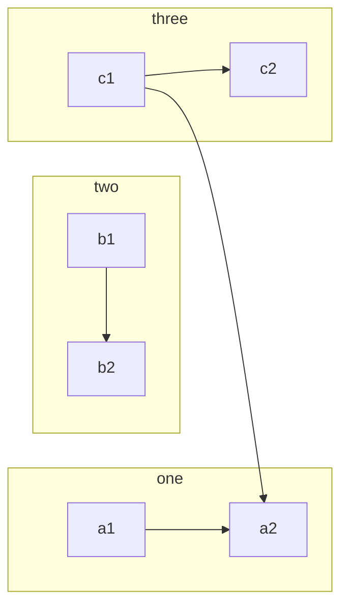

```mermaid
graph LR;
  A([start])-->B
  b-->p
  A-->C
  C-->D(rounded square)
  D-->B[[doubleside]]
  p>step]-->q-->r
  r-->s-->t((circle))
  t-->u-->v{test}
  v-->w[(Database)]
  subgraph one
    a1-->a2
    a2-->a3
    end
    subgraph two
    b1-->b2
    end
    subgraph three
    c1-->c2
    end
 subgraph one
    a1-->a2
    end
    subgraph two
    b1-->b2
    end
    subgraph three
    c1-->c2
    end
```

```mermaid
graph TB

  SubGraph1 --> SubGraph1Flow
  subgraph "SubGraph 1 Flow"
  SubGraph1Flow(SubNode 1)
  SubGraph1Flow -- Choice1 --> DoChoice1
  SubGraph1Flow -- Choice2 --> DoChoice2
  end

  subgraph "Main Graph"
  Node1[Node 1] --> Node2[Node 2]
  Node2 --> SubGraph1[Jump to SubGraph1]
  SubGraph1 --> FinalThing[Final Thing]
end
```

```mermaid
graph LR;
	a-->b
	b-->c
	
```

```mermaid
graph LR
    subgraph one
    a1-->a2
    end
    subgraph two
    b1-->b2
    end
    subgraph three
    c1-->c2
    end
    c1-->a2
```
