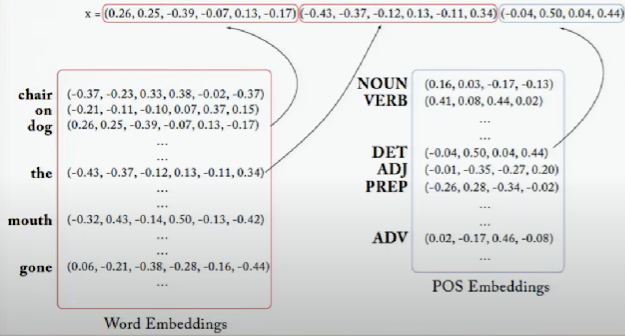
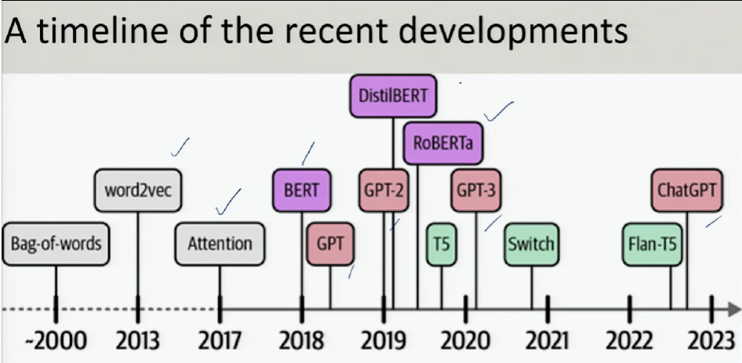
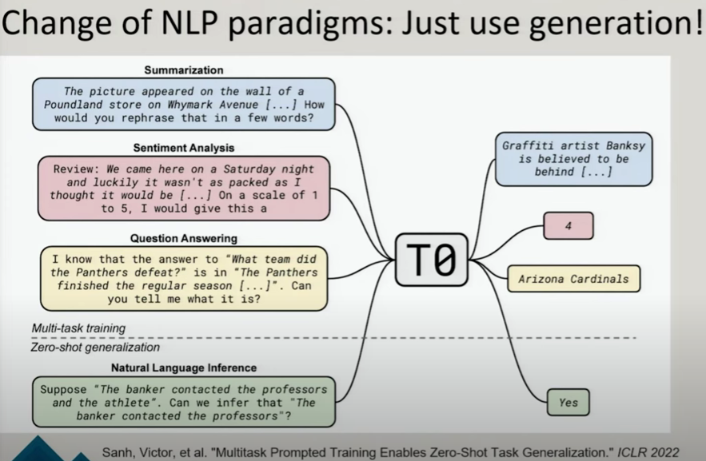

## Applications of NLP

### Generic Applications

1. Classification of spam and non spam
2. sentiment analysis.
3. Named entity recognition - tagging of entities like person, location, organization, etc.
4. Question answering
5. Chatbots
6. Autocompletion
7. Machine translation
8. Text summarization
9. Speech recognition
10. Information retrieval
11. Text generation

### Domain specific applications

1. Customer support domain : question answering based on e-manuals.
2. Financial domain : named entity recognition for extracting financial entities.
3. legal domain : clause span extraction from legal contracts
4. biomedical domain : named entity recognition, relation extraction - several sentence and token level tasks.

### Ambiguities in natural languages

1. Lexical ambiguity : words with multiple meanings. Eg - "I saw a monkey with a banana". different meaning, where "saw" is used as cutting instead of seeing.
2. Syntactic ambiguity : multiple interpretations of a sentence. Eg - "I saw a monkey with banana" - seeing monkey through banana or monkey holding banana.

### Levels of linguistic structure

1. Characters
2. Morphology - study of word formation
3. Words
4. Syntax - study of sentence formation - parts of speech, phrases, clauses, etc.
5. Semantics - study of meaning of words and sentences.
6. Discourse - study of text and conversation.

### NLP paradigms

1. Text classification - sentiment analysis, news articles grouping, etc
2. Sequence labeling - named entity recognition, part of speech tagging, etc.
3. Text generation - machine translation, summarization, chatbots, etc

### Why deep learning

#### Sparse vs dense feature representation

Previous to deep learning, NLP models used sparse feature representation like bag of words, tf-idf, etc. These models were not able to capture the semantic meaning of words. Deep learning models like RNN, LSTM, transformers, etc. use dense feature representation which can capture the semantic meaning of words. 
In sparse representation, each word is represented as a one-hot vector, where only one element is 1 and rest are 0. This representation is not able to capture the similarity between words. In dense representation, each word is represented as a dense vector of real numbers, where each element represents a feature of the word. This representation can capture the similarity between words.

in a task for say, named entity recognition, current word is "dog", previous word is "the", previous part of speech tag (POS tag) is "determiner". simple and compound tags were used. 

in a dense representation, the same task can be represented as:
each word has a unique vector representation known as word embeddings. These embeddings are learned during the training of the model. The model learns to predict the next word in a sequence given the previous words. The embeddings are learned in such a way that similar words have similar embeddings. Now, the feature vector is created using these embeddings. So, for the above case, for the feature current word, previous word, and previous POS tag, the feature vector would be as follows - 

### Changes in NLP paradigm

All is now a generation! 

