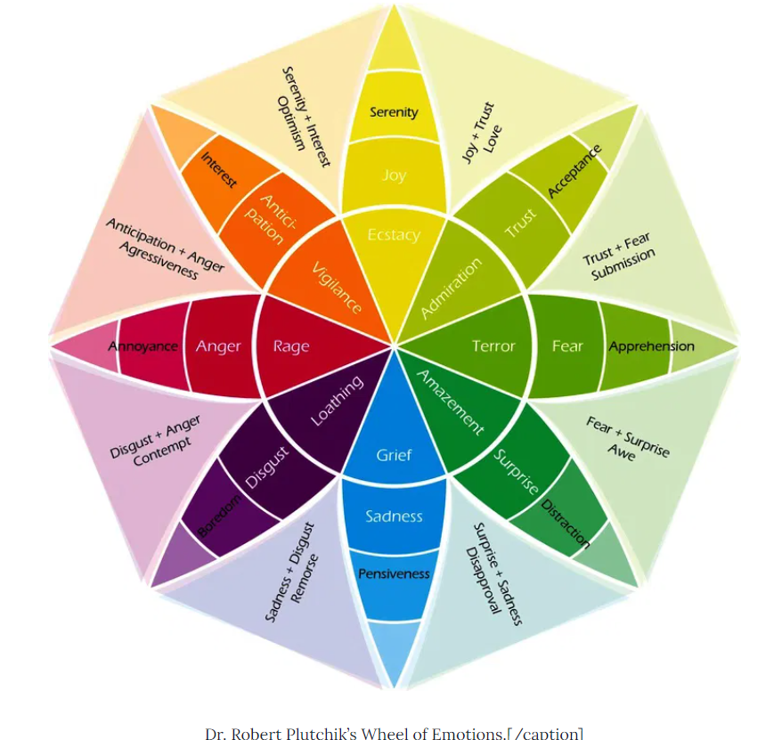

# Non violent communicaiton - An introduction

Nonviolent Communication (NVC) is a communication process developed by Marshall Rosenberg beginning in the 1960s. It focuses on three aspects of communication: self-empathy (defined as a deep and compassionate awareness of one's own inner experience), empathy (defined as listening to another with deep compassion), and honest self-expression (defined as expressing oneself authentically in a way that is likely to inspire compassion in others).

Human beings have an innate capacity of compassion. But it is easy to get detached from that capacity when we are in a state of anger, fear, or depression. We also tend to get disconnected from that capacity in the pursuit to get our own way. NVC helps us to reconnect with our compassionate nature by helping us to express ourselves in a way that inspires compassion in others. It is a process through which we can learn to express ourselves clearly and honestly while listening to our needs and others.

what is my need?
wheel of emotions? - articulate the emotion. that makes us more self aware. sub emotion. frustration, nuances.
reduces conflict. instead of getting overflowed with emotion.

zone of control -
zone of influence -
zone out of influence -

powerful question - i feel like this. i have this need. what can we do to meet this need? open up question. open ended question.

design sprints - shaking up the day to day - cognitive disonance. freshness.

# Wheel of emotions

