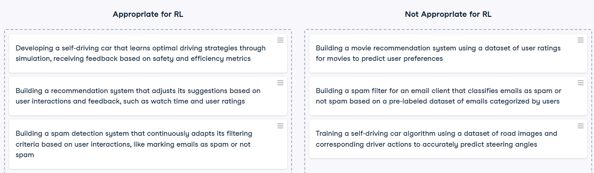
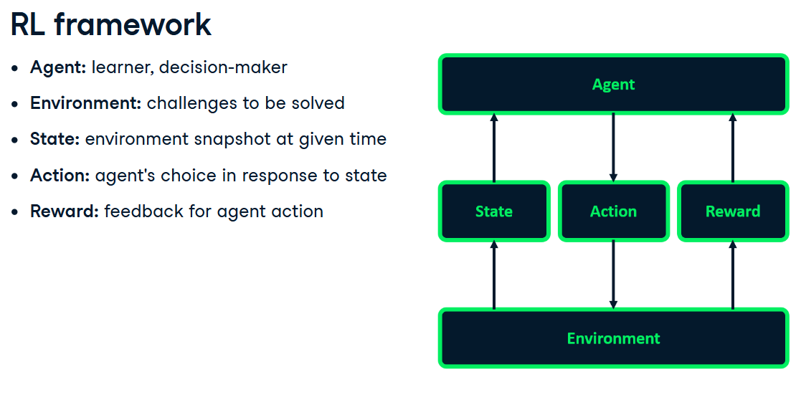

```python
env = create_environment()
state = env.get_initial_state()
for i in range (n_iterations):
   action = choose_action(state)
   state, reward = env.execute (action)
   update_knowledge(state, action, reward)
```
Tasks - 
1. episodic - tasks segmented into episodes. episode has a beginning and an end. 
2. continuous 

# Key points
1. RL is based on reward for desirable behaviors and punishments for undesirable ones.
2. RL is based on interaction **between an agent and an environment**, to achieve a s**pecific goal.**
3. 