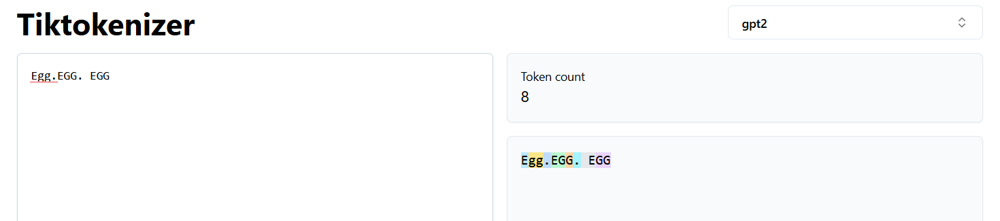
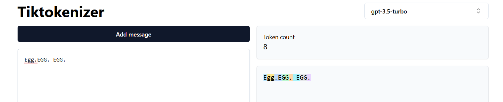
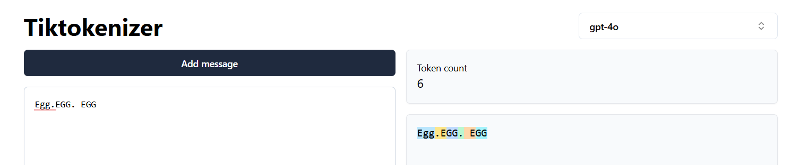
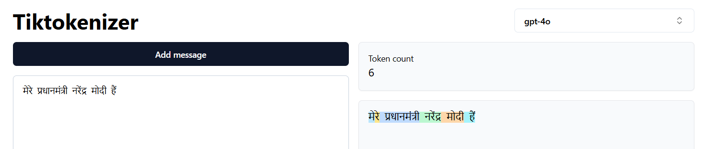
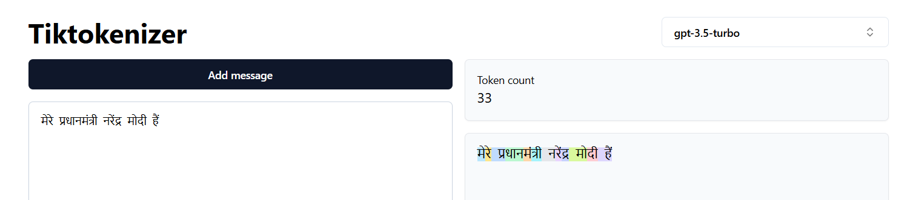
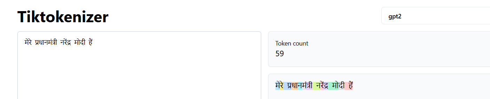
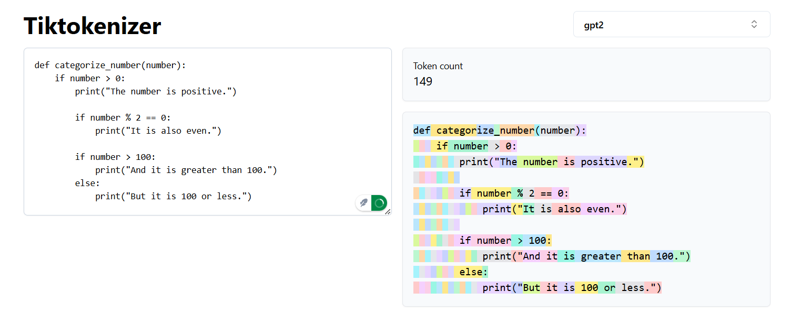
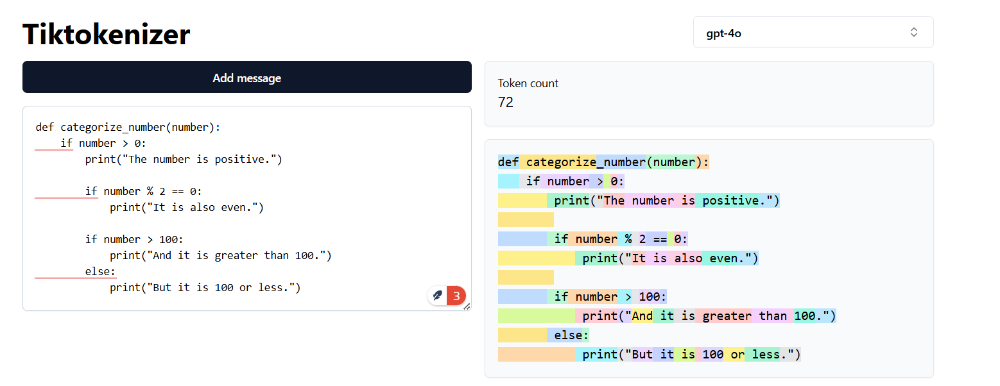

# The art of tokenization

Tokenization is the process of breaking down a text into smaller units called tokens. These tokens are the basic building blocks of language models. The tokens are then converted into embeddings, which are vectors that represent the tokens in a high-dimensional space. The embeddings capture the semantic and syntactic properties of the tokens, allowing the language model to learn the relationships between them.

Text can be brokend down into the following units - 

<div class=mermaid>
    graph LR;
    A(tokenization) --> B(character based);
    A --> C(sub-word based);
    A --> D(word based);
</div>

## Disadvantage of character based tokenization

1. This will make the number of tokens very large. The big paragraphs cannot fit into context length.
2. This way we we would be destroying the structure of language.

## Disadvantage of word based tokenization

1. learn, learning, learned, learnt - all are different tokens. But they are similar in meaning. Having them as separate tokens does not help.
2. Also, the word based tokenization will not be able to identify the tokens if there are grammatical errors, spelling errors. And that will lead to **out of vocabulary** error.

## Sub-word based tokenization

1. Solves all the above issues. Eg : BPE - Byte pair encoding.
2. Used in GPT-2, GPT-4, Llama2, BERT, etc.

## Differences in tokenizations across 4o and 3.5

## Tokenization in gpt2



## Tokenization in gpt3.5



## Tokenization in gpt4o



## Tokenization in gpt4o - multi-lingual

`मेरे प्रधानमंत्री नरेंद्र मोदी हैं।`

When language is not trained, then every characters are taken as a separate tokens. so gpt2 has more tokens. gpt4o has less tokens because it was trained in different languages. multi-lingual data were used for training gpt4o. Hence number of tokens in gpt4o is lesser than gpt3.5 or gpt2.

While tokenizing the text in say, BPE, the higher the training data, the more the possibility of merging common tokens, leading to fewer overall tokens for a given text. This is because BPE iteratively merges the most frequent sub-word pairs, and with more data, frequently occurring sub-words (such as root words) tend to be retained as single tokens rather than being broken down further into smaller units or even characters.

Although BPE does not capture semantics, a larger and more diverse training corpus indirectly optimizes tokenization by ensuring that meaningful sub-words and root words remain intact as larger token units; instead of being broken down further. This leads to lower overall tokens.

So, the learning corpus is important to ensure that the lesser tokens are formed, and more meaningful tokens are retained.

**Lesser numbers of tokens are identified, more accurate would be the model.**

## GPT4o tokenization of Hindi - 6 tokens



## GPT3.5 tokenization of Hindi - 33 tokens



## GPT2 tokenization of Hindi - 59 tokens



## Python code for tokenization

Similarly models that are trained in programming languages would show lesser tokens than the ones that are not trained in them, when the text presented is a programming language.
Considering the following programing snippet, and comparing the tokenizations across the different models - 

```python

def categorize_number(number):
    if number > 0:
        print("The number is positive.")
        if number % 2 == 0:
            print("It is also even.")
        if number > 100:
            print("And it is greater than 100.")
        else:
            print("But it is 100 or less.")
```

### GPT2 tokenization of the above code - 149 tokens



### GPT4o tokenization of the above code - 72 tokens



#### Maths tokenization

1. There should be a separate block in LLMs for mathematical problems. Even graph related problems. 

2. microsoft auto-agent framework


#### Stage 1.2 - Token embeddings

The tokens when identified are converted into embeddings. The embeddings are vectors. The embeddings are created in such a way that the vectors are close to each other if the tokens are similar.

#### Stage 1.3 - Position embeddings

Position embeddings encode the positions of the tokens in the input text. This is because transformers lack built-in order awareness, as they process input tokens in parallel instead of sequentially.

[Code base](https://colab.research.google.com/drive/1YT817lJ75HFrmwvDGhFHbypl2EQm6ifc?usp=sharing)


