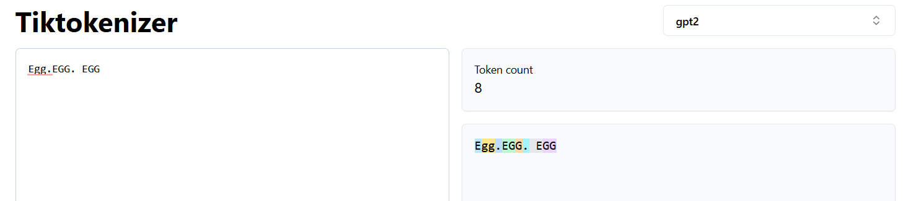
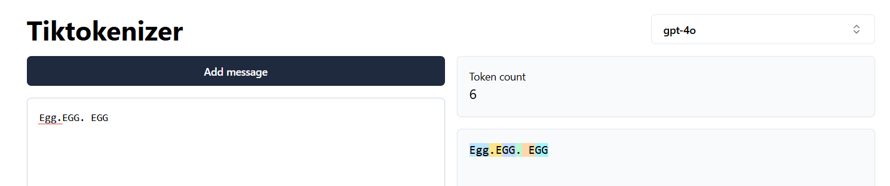
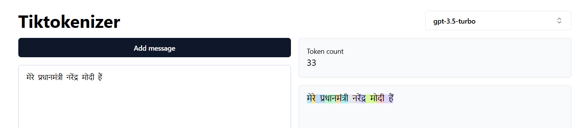
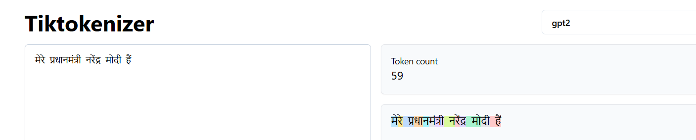
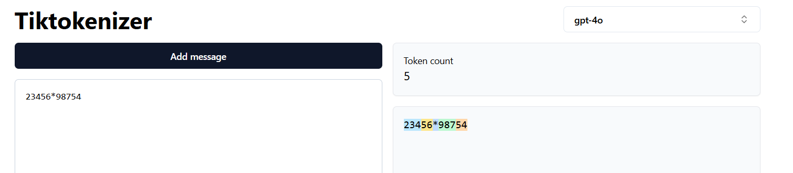

# The art of tokenization

Tokenization is the process of breaking down a text into smaller units called tokens. These tokens are the basic building blocks of language models. The tokens are then converted into embeddings, which are vectors that represent the tokens in a high-dimensional space. The embeddings capture the semantic and syntactic properties of the tokens, allowing the language model to learn the relationships between them.

Tokens are fundamental building blocks of LLMs. The way we do tokenization can have a huge effect on the LLM output.

Text can be broken down into the following units -

<div class=mermaid>
    graph LR;
    A(tokenization) --> B(character based);
    A --> C(sub-word based);
    A --> D(word based);
</div>

## Disadvantage of character based tokenization

1. This will make the number of tokens very large. The big paragraphs cannot fit into context length.
2. This way we we would be destroying the structure of language.

## Disadvantage of word based tokenization

1. learn, learning, learned, learnt - all are different tokens. But they are similar in meaning. Having them as separate tokens does not help.
2. Also, the word based tokenization will not be able to identify the tokens if there are grammatical errors, spelling errors. And that will lead to **out of vocabulary** error.

## Sub-word based tokenization

1. Solves all the above issues. Eg : BPE - Byte pair encoding.
2. Used in GPT-2, GPT-4, Llama2, BERT, etc.

## Differences in tokenizations across 4o and 3.5

## Tokenization in gpt2



## Tokenization in gpt3.5


## Tokenization in gpt4o



## Tokenization in gpt4o - multi-lingual

`मेरे प्रधानमंत्री नरेंद्र मोदी हैं।`

When language is not trained, then every characters are taken as a separate tokens. so gpt2 has more tokens. gpt4o has less tokens because it was trained in different languages. multi-lingual data were used for training gpt4o. Hence number of tokens in gpt4o is lesser than gpt3.5 or gpt2.

While tokenizing the text in say, BPE, the higher the training data, the more the possibility of merging common tokens, leading to fewer overall tokens for a given text. This is because BPE iteratively merges the most frequent sub-word pairs, and with more data, frequently occurring sub-words (such as root words) tend to be retained as single tokens rather than being broken down further into smaller units or even characters.

Although BPE does not capture semantics, a larger and more diverse training corpus indirectly optimizes tokenization by ensuring that meaningful sub-words and root words remain intact as larger token units; instead of being broken down further. This leads to lower overall tokens.

So, the learning corpus is important to ensure that the lesser tokens are formed, and more meaningful tokens are retained.

**Lesser numbers of tokens are identified, more accurate would be the model.**

## GPT4o tokenization of Hindi - 6 tokens


## GPT3.5 tokenization of Hindi - 33 tokens



## GPT2 tokenization of Hindi - 59 tokens



## Python code for tokenization

Similarly models that are trained in programming languages would show lesser tokens than the ones that are not trained in them, when the text presented is a programming language.
Considering the following programing snippet, and comparing the tokenizations across the different models - 

```python

def categorize_number(number):
    if number > 0:
        print("The number is positive.")
        if number % 2 == 0:
            print("It is also even.")
        if number > 100:
            print("And it is greater than 100.")
        else:
            print("But it is 100 or less.")
```

### GPT2 tokenization of the above code - 149 tokens


### GPT4o tokenization of the above code - 72 tokens


#### Maths tokenization

1. There should be a separate block in LLMs for mathematical problems. Even graph related problems. This is because the textual tokenization does not fit in for mathematical problems.
2. We can go the agentic way to do functional calls to do mathematical operations using LLMs. But that is parting ways from text based tokenization or utilization of Transformer architecture in actually deriving the mathematical solutions.

Note below how numbers are broken randomly in between as if they are texts.



## Word based tokenization

[Code base for building a word based tokenizer](https://colab.research.google.com/drive/1YT817lJ75HFrmwvDGhFHbypl2EQm6ifc?usp=sharing)


```python
import re

text = "Hello, world. This, is a test."
result = re.split(r'(\s)', text)

print(result)

Output : ['Hello,', ' ', 'world.', ' ', 'This,', ' ', 'is', ' ', 'a', ' ', 'test.']

```

```python
result = re.split(r'([,.]|\s)', text)

print(result)

Output : ['Hello', ',', '', ' ', 'world', '.', '', ' ', 'This', ',', '', ' ', 'is', ' ', 'a', ' ', 'test', '.', '']
```

```python
# item.strip() removes any leading and trailing whitespace from a string.
# The condition if item.strip() ensures that only non-empty strings remain in the list.

result = [item for item in result if item.strip()]
print(result)

Output : ['Hello,', 'world.', 'This,', 'is', 'a', 'test.']
```

```python

text = "Hello, world. Is this-- a test?"
result = re.split(r'([,.:;?_!"()\']|--|\s)', text)
result = [item.strip() for item in result if item.strip()]
print(result)

Output : ['Hello', ',', 'world', '.', 'Is', 'this', '--', 'a', 'test', '?']
```

```python
# Strip whitespace from each item and then filter out any empty strings.
result = [item for item in result if item.strip()]
print(result)

Output : ['Hello', ',', 'world', '.', 'Is', 'this', '--', 'a', 'test', '?']
```

### Loading the entire corpus

```python
with open("the-verdict.txt", "r", encoding="utf-8") as f:
    raw_text = f.read()

print("Total number of character:", len(raw_text))
print(raw_text[:99])

Output : 
Total number of character: 20479
I HAD always thought Jack Gisburn rather a cheap genius--though a good fellow enough--so it was no 
```

```python
preprocessed = re.split(r'([,.:;?_!"()\']|--|\s)', raw_text)
preprocessed = [item.strip() for item in preprocessed if item.strip()]
print(preprocessed[:30])
print(len(preprocessed))

Output : 
['I', 'HAD', 'always', 'thought', 'Jack', 'Gisburn', 'rather', 'a', 'cheap', 'genius', '--', 'though', 'a', 'good', 'fellow', 'enough', '--', 'so', 'it', 'was', 'no', 'great', 'surprise', 'to', 'me', 'to', 'hear', 'that', ',', 'in']
4690
```

```python
all_words = sorted(set(preprocessed))
vocab_size = len(all_words)

print(vocab_size)

Output : 1130
```

```python
vocab = {token:integer for integer,token in enumerate(all_words)}
for i, item in enumerate(vocab.items()):
    print(item)
    if i >= 50:
        break
```

### Modularizing the code

```
Step 1: Store the vocabulary as a class attribute for access in the encode and decode methods
Step 2: Create an inverse vocabulary that maps token IDs back to the original text tokens
Step 3: Process input text into token IDs
Step 4: Convert token IDs back into text
Step 5: Replace spaces before the specified punctuation
```

```python
class SimpleTokenizerV1:
    def __init__(self, vocab):
        self.str_to_int = vocab
        self.int_to_str = {i:s for s,i in vocab.items()}

    def encode(self, text):
        preprocessed = re.split(r'([,.:;?_!"()\']|--|\s)', text)

        preprocessed = [
            item.strip() for item in preprocessed if item.strip()
        ]
        ids = [self.str_to_int[s] for s in preprocessed]
        return ids

#Converts a list of integers (ids) into corresponding strings using the int_to_str dictionary (presumably mapping integers to strings).
# These strings are then joined together with a space between them to form a single string.
    def decode(self, ids):
        text = " ".join([self.int_to_str[i] for i in ids])
        # Replace spaces before the specified punctuations
        text = re.sub(r'\s+([,.?!"()\'])', r'\1', text)
        return text
```

#### using the tokenizer class

```python
tokenizer = SimpleTokenizerV1(vocab)

text = """"In the dimmest corner of her boudoir"""
ids = tokenizer.encode(text)
print(ids)

Output : [1, 55, 988, 339, 290, 722, 539, 225]
```

```python
tokenizer.decode(ids)
Output :
" In the dimmest corner of her boudoir"
```

### Adding special context tokens

vocabulary and tokenizer implemented in the previous section, SimpleTokenizerV2, to support two new tokens, "<|unk|>" and "<|endoftext|>"

"<|unk|>" : token if a word is encountered that is not part of the vocabulary.
"<|endoftext|>" : token to indicate the end of a text sequence - a book or a document.

```python
class SimpleTokenizerV2:
    def __init__(self, vocab):
        self.str_to_int = vocab
        self.int_to_str = { i:s for s,i in vocab.items()}

    def encode(self, text):
        preprocessed = re.split(r'([,.:;?_!"()\']|--|\s)', text)
        preprocessed = [item.strip() for item in preprocessed if item.strip()]
        preprocessed = [
            item if item in self.str_to_int
            else "<|unk|>" for item in preprocessed
        ]

        ids = [self.str_to_int[s] for s in preprocessed]
        return ids

    def decode(self, ids):
        text = " ".join([self.int_to_str[i] for i in ids])
        # Replace spaces before the specified punctuations
        text = re.sub(r'\s+([,.:;?!"()\'])', r'\1', text)
        return text
```

```python
tokenizer = SimpleTokenizerV2(vocab)

text1 = "Hello, do you like tea?"
text2 = "In the sunlit terraces of the palace."

text = " <|endoftext|> ".join((text1, text2))

print(text)

Output : 
Hello, do you like tea? <|endoftext|> In the sunlit terraces of the palace
```

```python
tokenizer.encode(text)

Output:
[1131, 5, 355, 1126, 628, 975, 10, 1130, 55, 988, 956, 984, 722, 988, 1131, 7]
```

```python
tokenizer.decode(tokenizer.encode(text))

Output :
<|unk|>, do you like tea? <|endoftext|> In the sunlit terraces of the <|unk|>.
```

# Language Models - what is the need of language model
- it predicts the next word that will come after the words in a given sentence. It can also predict the next sentence.
- each word is assigned a probability. 
- each sentence is a conditonal probability of the next sentence based on all words.

# application
- spell check. which word has the highest probability.
- speech recognition - audio to transcription. 

# LLMs
- LLMs are trained using **self regression training**. This is also known as **Autoregressive training**. The training set is not lablelled. But the labelling is autoregressive as the training set in corpus itself is used to determine the probability of the new text generation. **Language Modelling** is at the core of such pre-training which is self recursive.
- keeps predicting next word over and over again.


## Language modelling 

1. Language models are the mathematical models that can do one or more of the following -
   - text output - generative modelling
   - embeddings - numeric values representation of text.
   - classification - identify targets - key entity identification.  
3. Language models are trained by auto-regression training to predict the next word, or next sentence per se.
4. Language modelling is the core of the pre-training process of all LLMs.
5. A model that computers either of the ones below, are known as language models.
   1. Obective - compute the probability of a sentence or sequence of words.
        $P(W) = P(w1,w2,w3,...,wn)$
   2. Related task - computing the probability of the upcoming word.
        $P(w4|w1,w2,w3)$

## How to compute the two probabilities?

###### Probaility of the entire sentence : $P(W) = P(w1,w2,w3...wn)$

P(The, water, of, Walden, Pond, is, so, beautiful, blue)

There is a difference between the following - 
1. $P(B|A)$ : Probability of B given A : Event B has happened in past. A is happening now.
2. $P(A,B)$ : Joint probability of A and B. Or probability when both the events A and B are happening simultaneously.
 

$P(B|A) = P(A \bigcap B) / P(A)$ 
or, $P(B|A) = P(A,B) / P(A)$
or, $P(A,B) = P(B/A) \times P(A)$


or, $P(A,B) = P(A) \times P(B|A)$
ie. probability of two events A and B happening together (joint probability) is probability of A multiplied by probability of B when A has already happened.

3. extending it to multiple events we can write

$P(A, B, C, D)  = P(A) \times P(B|A) \times P(C|A,B) \times P(D|A,B,C)$
TO get the intuition, following is the chain of thought - 
- first the event A happened. So, the probability is P(A) as nothing else has happened now.
- second the event B happened. Event A has already happened in the last step. so the probability of B, we need to compute $P(B|A)$, i.e., probability of B when A has already happened.
- now, the third event C happened. A and B has already happened. So, probability of C would be, $P(C|A,B)$, because A and B has already happened. So,  
- now, the fourth event D happened. A, B and C has already happened by now. So, porbability of D when A, B and C has already happened is $P(D|A,B,C)$

4. P(blue|the water of walden pond is so beautifully) = C(the water of walden pond is so beautifully blue)/C(the water of walden pond is so beautifully)

5. Generalizing the above 
$P(w_{1:n}) = P(w1) \times P(w2|w1) \times P(w3|w_{1:2} \times \prod()$
5. We will never see enough data for estimating all these!!

# How Language model works
## Goal 1 : Representing language numerically : Embedding
1. <put the pic of encoder and decoder>
2. Non transformer language model -
   - **Bag of words** - an algorithm that represents words as large sparse vectors or arrays of numbers. it simply records the presence of the words.
   - **Word2Vec** - its numeric representation constitutes the meaning of the words and the contexts of few neighbouring words. 
   - **Attention**
3. Transformer based language model - numerically represent dense vectors of numbers which captured the meaning of words in the context of a sentence or a paragraph
   - Encoder only models - BERT, RoBERTA, DistilBERT - great encoding text to numbers
   - Decoder only models - generative in nature. generate text - GPT, GPT-2, GPT-3, ChatGPT,
   - Encoder-Decoder models - T5, Switch, Flan-T5
### Bag of words
1. inputs are tokenized.
2. vocabulary is formed.
3. the numerical vector representation which shows the count of number of times a word in the vocabulary appears in the input text.
4. this ignores the semantic nature or meaning of the texts.

### Vector embeddings - word2vec
1. this captures meaning of words in vector embeddings through neural networks. 


