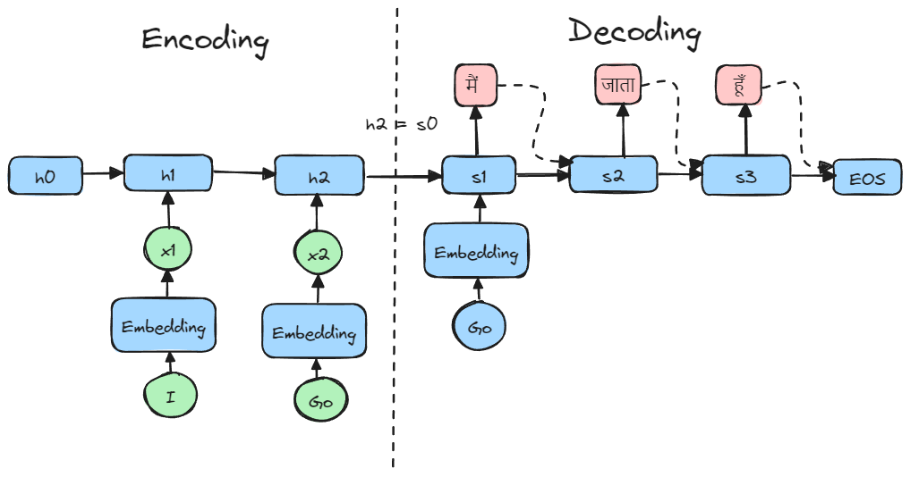

**Courtesy and Thanks** to sessions from [Vizuara.ai](https://vizuara.ai) that has helped me to understand the concepts discussed here below. 

## RNN

1. The memory is retained from the hidden layer. Previous state is passed to the current state.
2. Intestellar RNN 
3. RNN can be used as a language translator.
4. All burden of compression is in the last hidden state.
5. Video of Jay Allamar - what is passed to the decoder is the last hidden state.
6. This is a disadvantage of RNN. They have context limitation.

## Build an RNN from scratch

English to Hindi translation using RNN

### Block diagram for RNN

$h_t = \tanh(Wh_{t-1} + Ux_{t}x + b)$  
$h_1 = \tanh(Wh_{0} + Ux_{1}x + b)$  
$h_2 = \tanh(Wh_{1} + Ux_{2}x + b)$

1. Step 1 - Convert input words into embeddings. $x_1 = 1$ and $x_2 = 2$  
2. Step 2 - Initialize the hidden state. $h_0 = 0$  