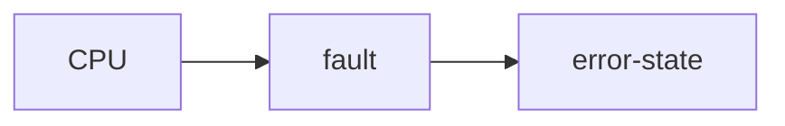
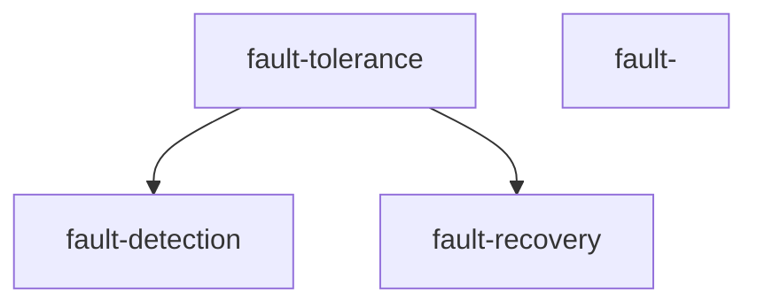

## Major challenges 

## Fault - Error - Failure model 

## Fault tolerance motivation 
1. clost of downtime 
2. HA & R
3. Future of computing - Quantum and AI
4. dependence of cloud
5. iot & edge computing 
6. complex cloud infrastructure 
7. cybersecurity threats and data integrity
8. sustainability and energy efficiency

## Rising cloud outages trend 

## fault tolerance approaches 

## need for the system 
what
why
when
how 

## failure causes 
1. task delays
2. resubmissions
3. repetitions
4. system overload
5. SLA violations 

## overcome issues 
1. scheduling 
2. load balancing
3. machine learning algo 

## Literature survey on fault tolerance 

table columns - 
1. title of paper
2. technique uesed
3. key outcomes
4. limitations 

## Research Gaps 
1. high overhead in fault recovery 
2. lack of predictive fault handling 
3. limitations of existing scheduling algorithm
4. scalability and adaptability issues 
5. lack of topology - aware fault prediction. 

## Problems associated with the work
1. realtime scheduling issues 
2. 2. resource allocation 
3. energy efficiency
4. xx
5. xx

## Research objective 
solving the above 5 problems. 

## framework 

## objective 1

## objective 2 

## fault tolerating scheduling algorithms 
1. static
2. 2. dynamic
3. 3. heuristic
4. ML
5. cloud based fault tolerace system

## framework 

## task categorization 

## scheduling process 

## double deep q learning (DDQL)

## significance of ddql 
1. dynamic decision making
2. improved dependability 

## arch of double deep q network based training 

## simluation configuration settings 

## DDQL based scheduling process 

## dynamic fault tolerant realtime scheduling algorithm.

## algorithm flowchart 

## simulation tools and data 

## throughput analysis for the method 
1. throughput 
2. energy consumption 
3. network life time analysiss
4. end to end delay analysis 
5. guaranteed ratio analysis 
6. ratio of task accepted analysis 

## outcome of the object - all the objectives one by one. 

## do this for all objectives in details. 

## performance metrics 
1. mttr 
2. mtbf
3. deadline miss ratio
4. throughput

## Graph neural network (GNN)
1. How GNNs work

## dynamic mluti queue optimization scheduling (DMQOS) 

## framework workflow 

## Adaptability analysis 

